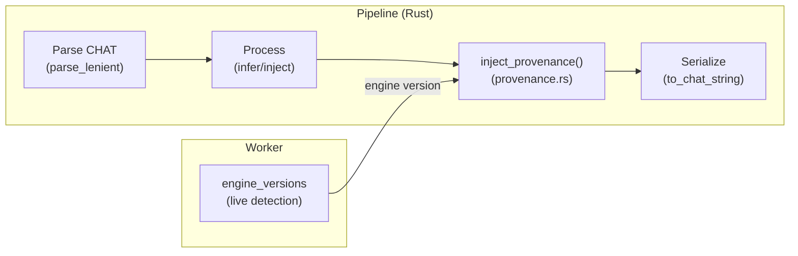

# Processing Provenance System

**Status:** Current
**Last updated:** 2026-05-01 05:19 EDT

## Overview

The provenance system injects structured `@Comment` headers into CHAT
files recording what batchalign3 did, when, and with what engines. This
enables reproducibility, auditing, and UI display of processing history.

## Architecture



### Source: `crates/batchalign/src/provenance.rs`

The module provides:

- **`ProvenanceComment`** — typed builder for provenance metadata
- **`inject_provenance(&mut ChatFile, &ProvenanceComment)`** — AST-level
  injection that adds/replaces `@Comment` headers
- **`inject_provenance_into_text(&str, &ProvenanceComment) -> String`** —
  convenience wrapper for pipelines working with serialized text
- **Per-command builders** — `morphotag_provenance()`,
  `align_provenance()`, `transcribe_provenance()`, etc.

### Comment Format

```
[ba3 <command> | key=val ; key=val | ISO-8601-timestamp]
```

The `[ba3 ` prefix is the machine-parseable discriminator. The
bracketed format is visually distinct from user-authored comments and
greppable with `grep '\[ba3 '`.

### AST Manipulation (not string hacking)

Provenance is injected into the CHAT AST, not the serialized text:

1. Existing `@Comment` with matching `[ba3 <command> |` prefix is removed
   from `ChatFile.lines`
2. A new `Line::Header { Header::Comment { BulletContent } }` is inserted
   after the last `@ID` header
3. The file is then serialized normally via `to_chat_string()`

This ensures provenance comments participate in proper CHAT serialization
(bullet handling, line wrapping, encoding).

### Re-export chain

The provenance module needs `Header`, `BulletContent`, and `Span` from
`talkbank-model`. Since `batchalign` doesn't depend on
`talkbank-model` directly, these types are re-exported through
`batchalign`:

```
talkbank-model::header::Header      →  batchalign::Header
talkbank-model::model::BulletContent →  batchalign::BulletContent
talkbank-model::Span                →  batchalign::Span
```

## Injection Points

Each pipeline injects provenance right before serialization:

| Command | File | Injection site |
|---------|------|---------------|
| morphotag | `pipeline/morphosyntax.rs` | `stage_serialize()` — injects into `&mut ChatFile` before `to_chat_string()` |
| utseg | `pipeline/text_infer.rs` | `run_cached_text_pipeline()` — after `apply()`, before `to_chat_string()` |
| translate | `pipeline/text_infer.rs` | Same as utseg (shared generic pipeline) |
| coref | `coref.rs` | `run_coref_impl()` — after injection, before serialize |
| align | `runner/dispatch/fa_pipeline.rs` | `process_one_fa_file()` — after FA result, uses `inject_provenance_into_text()` |
| transcribe | `pipeline/transcribe.rs` | `run_transcribe_pipeline()` — replaces legacy `insert_transcribe_comment()` |

## Engine Version Source

Engine versions come from `WorkerCapabilities.engine_versions` — a
`BTreeMap<String, String>` reported by each Python worker at spawn time.
This is live detection, not hardcoded constants.

The map is surfaced through:
- `PipelineServices.engine_version` (for morphotag/utseg/translate)
- `EngineVersion` newtype in the FA dispatch plan
- Direct backend enum matching for transcribe

Example live values:
```json
{
  "morphosyntax": "1.11.1",
  "fa": "whisper-fa-large-v2",
  "asr": "rev",
  "utseg": "1.11.1",
  "coref": "stanza",
  "translate": "googletrans-v1"
}
```

## Replacement Semantics

When the same command is run again on the same file:

1. `inject_provenance()` scans all `Line::Header` entries
2. Any `Header::Comment` whose `BulletContent` text starts with
   `[ba3 <command> |` is removed
3. The new comment is inserted after the last `@ID`

This means re-running morphotag replaces the morphotag comment but
preserves any align or transcribe comments. The processing history
accumulates across different commands but doesn't duplicate within
one command.

## Tests

`provenance.rs` includes 5 unit tests:

| Test | What it verifies |
|------|-----------------|
| `format_morphotag_provenance` | Builder output matches `[ba3 morphotag \| ...]` format |
| `format_empty_fields` | No-field comments format correctly |
| `inject_replaces_existing_comment_for_same_command` | Re-run replaces, doesn't duplicate |
| `inject_preserves_comments_from_other_commands` | Different-command comments survive |
| `field_if_omits_false_values` | Boolean fields only appear when `true` |

## Legacy

The old transcribe comment format:
```
@Comment:	Batchalign 0.1.0, ASR Engine rev. Unchecked output of ASR model.
```

is replaced by the structured `[ba3 transcribe | ...]` format. The old
`insert_transcribe_comment()` function in `transcribe/asr_output.rs`
still exists but is no longer called from the main pipeline path. It
will be removed in a future cleanup.
