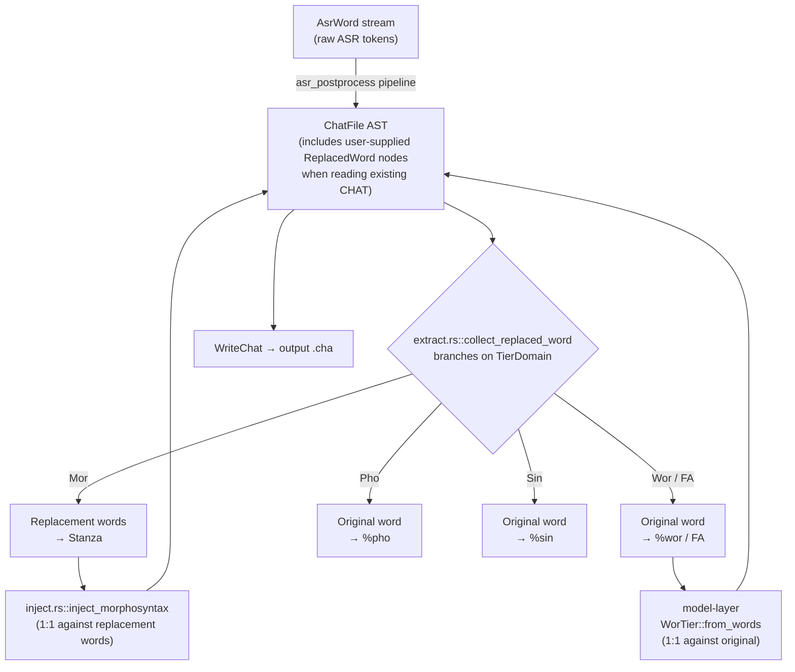

# Replacements in the batchalign3 Pipeline

**Status:** Current
**Last updated:** 2026-05-19 20:22 EDT

This page documents how `batchalign3` handles CHAT replacement
annotations (`[: ...]`) end-to-end. For the canonical CHAT-format
definition of what a replacement *is* (syntax, scope, AST shape,
per-domain alignment rule), see
[`talkbank-tools/book/src/chat-format/replacements.md`](https://github.com/TalkBank/talkbank-tools/blob/main/book/src/chat-format/replacements.md).
That doc is the source of truth; this doc is the pipeline-specific
companion.

## TL;DR

> `batchalign3` **never emits** `[: ...]` annotations. It **preserves
> and consumes** replacements that the user's existing corpus contains.
> Domain-aware extraction routes the replacement form to `%mor` /
> `%gra`, and the original form to `%wor` / `%pho` / `%sin` / FA — per
> the CHAT-format rule. Four-site invariants in FA enforce that the
> two sides stay in sync; an analogous (currently undocumented) three-
> site invariant exists for `%mor`.

## What batchalign3 Does and Doesn't Do

| Operation | Status | Where |
|-----------|--------|-------|
| **Parse** an existing replacement from input CHAT | ✅ Yes | `talkbank-parser` (delegated; this repo doesn't reimplement) |
| **Preserve** a replacement through extract→modify→inject round trips | ✅ Yes | `batchalign` content walkers |
| **Route** the right side to `%mor`/`%gra` extraction | ✅ Yes | `extract.rs::collect_replaced_word` |
| **Route** the left side to `%wor` / FA / `%pho` / `%sin` | ✅ Yes | `fa/extraction.rs`, `extract.rs` (per-domain branches) |
| **Re-serialize** to valid CHAT including the replacement | ✅ Yes | model-layer `WriteChat` |
| **Emit** a new `[: ...]` annotation programmatically | ❌ **No** | Nothing in this codebase constructs a `ReplacedWord` |
| **Sanitize** an ASR token by wrapping it in `[: ...]` | ❌ **No** (and would not work — replacement words are validated; see `talkbank-tools` doc §"Each Replacement Word Is Validated") |
| **Normalize** a token via direct text mutation | ✅ Yes — separate mechanism | `asr_postprocess::cleanup` (e.g. `um` → `&-um` is a text edit, not a replacement annotation) |

This distinction is the most common source of confusion: **the
batchalign3 pipeline produces "cleaned" word text by mutating
`AsrWord.text` in place during ASR post-processing, NOT by emitting
replacement annotations.** A reader skimming the pipeline for
"replacement" will find consume-side code only.

## Per-Domain Extraction Policy

Domain-aware word extraction in
`crates/talkbank-transform/src/extract.rs::collect_replaced_word`
(line 129) is the central seam. When the
walker encounters a `ReplacedWord` leaf, it picks one side of the pair
based on the requested `TierDomain`:

| Domain (caller) | Side extracted | Use |
|-----------------|----------------|-----|
| `TierDomain::Mor` | replacement words (`replaced.replacement.words`) | Stanza receives the corrected/intended form for UD analysis |
| `TierDomain::Wor` | original word (`replaced.word`) | `%wor` (timing) sees what was actually spoken |
| `TierDomain::Pho` | original word | `%pho` describes phonology of what was spoken |
| `TierDomain::Sin` | original word | `%sin` records spelling-in-actual |
| `None` | both, recursing into all leaves | for transforms that traverse all content |



This flow is the read-and-respect direction. The write-and-emit
direction (a hypothetical "produce a new replacement from ASR output")
is **not implemented** anywhere in the pipeline.

## The Four-Site Invariant (Forced Alignment)

For forced alignment specifically, the policy "a `ReplacedWord`
contributes exactly one word to FA — the original spoken word, not the
replacement words" is enforced at four code sites that **must stay in
sync**. If any one site uses the wrong side, alignment desyncs by the
delta in word count, and every subsequent timing in the same FA group
shifts.

| Site | File:line | What it does |
|------|-----------|--------------|
| Extraction | `crates/batchalign/src/chat_ops/fa/extraction.rs` | Sends the *original* word to the FA worker |
| Count | `crates/batchalign/src/chat_ops/fa/mod.rs` | Counts 1 for the `ReplacedWord` (regardless of replacement word count) |
| Injection | `crates/batchalign/src/chat_ops/fa/injection.rs` | Consumes 1 cursor slot, sets `replaced.word.inline_bullet` |
| Preservation | `crates/batchalign/src/chat_ops/fa/mod.rs` (`collect_existing_fa_word_timings`) | Reads `replaced.word.inline_bullet` |

### The 2026-04-08 Bug This Invariant Prevents

Before this invariant was codified, an extraction site sent the
*replacement* words while the count site still counted 1 for the
`ReplacedWord`. For `dis [: this]`, FA received 1 token (`this`) but
the count expected 1 (`dis`) — the symptom was correct *for that
word*. But for `<dis [: this] is>` style content, the count and
extraction disagreed, and every subsequent word in the FA group got
the wrong timing. The invariant was named after that incident.

### The Read-Only Test That Validates It

`crates/batchalign/src/chat_ops/fa/tests/grouping_and_wor.rs::test_wor_policy_replacements_use_original_surface()`
constructs a fixture with `what's is dis [: this] ?` and asserts the
extracted FA word list is `["what's", "is", "dis"]` — note `this` is
absent. If extraction drifts to using the replacement, the test fails
loudly.

## The Three-Site Invariant (`%mor`)

By symmetry with FA, an analogous invariant exists for `%mor` —
extract, count, inject — that has historically been *implicit*. Naming
it here so future readers can find it:

| Site | File:line | What it does |
|------|-----------|--------------|
| Extraction | `crates/talkbank-transform/src/extract.rs:129` (`collect_replaced_word`) | Sends the *replacement* words to Stanza |
| Count | `model.utterance.mor_alignable_word_count()` (delegated to talkbank-model) | Counts replacement-word count, not 1 |
| Injection | `crates/talkbank-transform/src/morphosyntax/injection.rs::inject_results` | Asserts injected `%mor` item count == count, then injects |

The reason this invariant has stayed implicit: extract/count/inject
all delegate to `talkbank-model`'s domain-aware rules
(`TierDomain::Mor`), so as long as the model's per-domain rule is
correct, the three sites stay synchronized for free. They are not
*independently* coded against each other the way FA's four sites are.

### Test Coverage Gap

**No test in this repo currently exercises `%mor` injection where the
main-tier word is a `ReplacedWord`.** The `%mor` injection code is
correct by construction (it reuses `TierDomain::Mor` extraction), but
a regression test would catch any future drift. Recommended fixture:

```chat
*CHI:	wanna [: want to] go .
%mor:	v|want inf|to v|go .
%gra:	1|3|AUX 2|3|MARK 3|0|ROOT 4|3|PUNCT
```

The test would assert:
- Extraction under `TierDomain::Mor` yields `["want", "to", "go"]`
  (not `["wanna", "go"]`).
- `mor_alignable_word_count()` returns 3 (not 2).
- Injection succeeds when given a 3-item `%mor` line.

This is logged as an action item for follow-up; the analysis lives in
the maintainers' working notes.

## What the Pipeline Does NOT Do

These are operations the pipeline **deliberately does not perform**.
Listing them here so a contributor doesn't reach for the wrong tool.

- **Emit replacements from ASR normalization.** ASR cleanup mutates
  `AsrWord.text` directly (e.g. `um` → `&-um`, `'cause` → `(be)cause`).
  The result is a single token whose surface form is CHAT-legal —
  there is no `[: ...]` wrapper.
- **Use replacements to carry CHAT-illegal text.** Each replacement
  word goes through the standard `Word` validator. `[: C-3PO]` fails
  E220 the same way `C-3PO` on the main tier does. (See
  `talkbank-tools/book/src/chat-format/replacements.md` §
  "Each Replacement Word Is Validated".)
- **Generate replacements during retokenization.** When Stanza
  re-tokenizes a word, the retokenize module rebuilds the AST in place
  (`crates/talkbank-transform/src/retokenize/rebuild.rs`). It
  preserves existing `ReplacedWord` nodes during reconstruction but
  does not create new ones.
- **Generate replacements during ASR retrace detection.** Detected
  retraces produce `WordKind::Retrace` plus structural retrace nodes
  (`Retrace`, `<...> [/]`), which are a different mechanism. See
  `crates/talkbank-transform/src/build_chat/utterances.rs::build_word_utterance`
  for how retraces are emitted; `WordKind::Replacement` does not exist.

## When to Reach for `[%]`, `[=]`, or `[*]` Instead

A common failure mode in this codebase has been reaching for `[: ...]`
when what's actually wanted is a **free-form annotation that does not
participate in word validation**. The talkbank-model offers four such
forms via `ContentAnnotation` (in
`talkbank-model/src/model/annotation/scoped/types.rs`):

| Form | When to use |
|------|-------------|
| `[% text]` | General comment about the word/utterance. Carries `SmolStr` (no word grammar applied). Right home for "ASR-original was X". |
| `[= text]` | Explanation of unclear speech. Idiomatic alongside `xxx`/`yyy` placeholders. |
| `[+ text]` | Researcher note / context addition. |
| `[* code]` | Error coding (with optional code). |

These all attach as `scoped_annotations` and do not require their
contents to satisfy CHAT word grammar. For ASR-introduced preservation
use cases, `[%]` is the working candidate, not `[:]`.

## Source Citations

| Concern | File:line |
|---------|-----------|
| Replacement extraction (per-domain branch) | `crates/talkbank-transform/src/extract.rs:129` (`collect_replaced_word`) |
| FA extraction (uses original) | `crates/batchalign/src/chat_ops/fa/extraction.rs` |
| FA count | `crates/batchalign/src/chat_ops/fa/mod.rs` |
| FA injection | `crates/batchalign/src/chat_ops/fa/injection.rs` |
| FA preservation | `crates/batchalign/src/chat_ops/fa/mod.rs` |
| `%mor` injection (count check) | `crates/talkbank-transform/src/morphosyntax/injection.rs::inject_results` |
| Retokenize preserves `ReplacedWord` | `crates/talkbank-transform/src/retokenize/rebuild.rs` |
| Read-only consumption test | `crates/batchalign/src/chat_ops/fa/tests/grouping_and_wor.rs::test_wor_policy_replacements_use_original_surface` |
| CHAT-format canonical reference | [`talkbank-tools/book/src/chat-format/replacements.md`](https://github.com/TalkBank/talkbank-tools/blob/main/book/src/chat-format/replacements.md) |

## See Also

- [CHAT Data Model](../../architecture/chat-model/chat-model.md) —
  how `UtteranceContent` variants (including `ReplacedWord`) flow
  through the pipeline; `walk_words`, `WordItem`, and per-domain
  extraction primitives.
- [ASR Token Pipeline](./asr-token-pipeline.md) — the disfluency /
  normalization rules that mutate `AsrWord.text` (a different
  mechanism from replacements).
- [The %mor Tier](https://github.com/TalkBank/talkbank-tools/blob/main/book/src/chat-format/mor-tier.md)
  in talkbank-tools — for what `%mor` represents and how it aligns.
