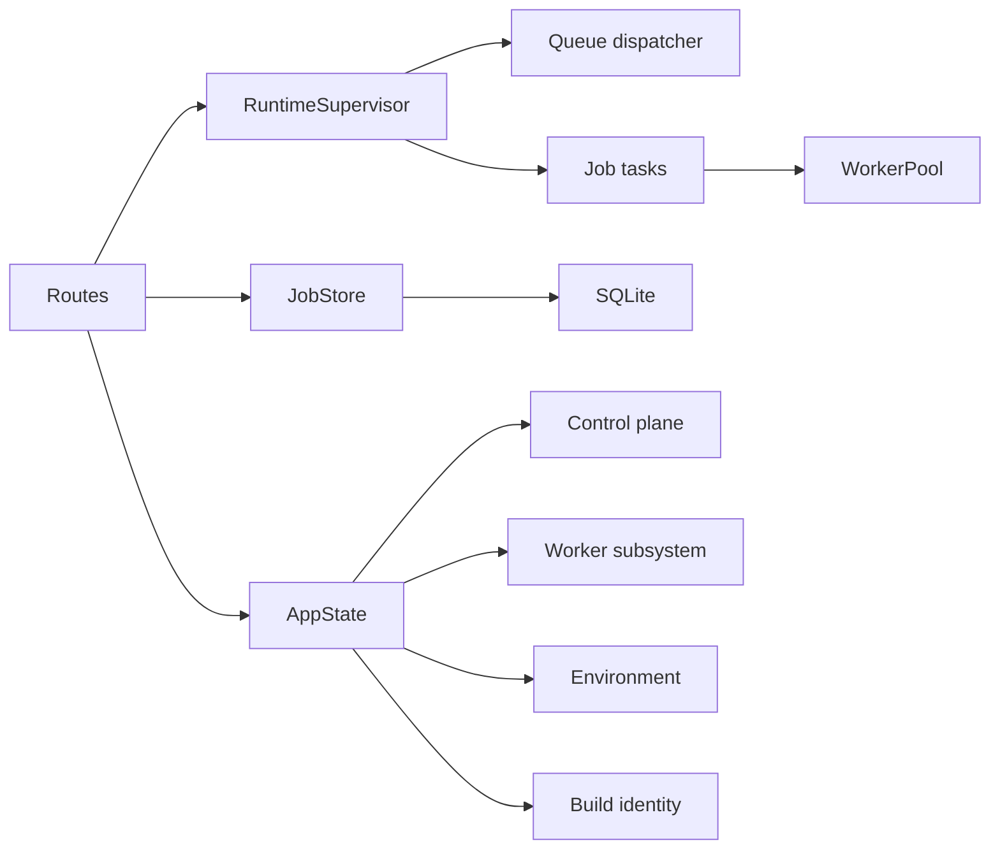
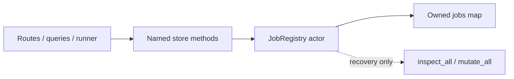
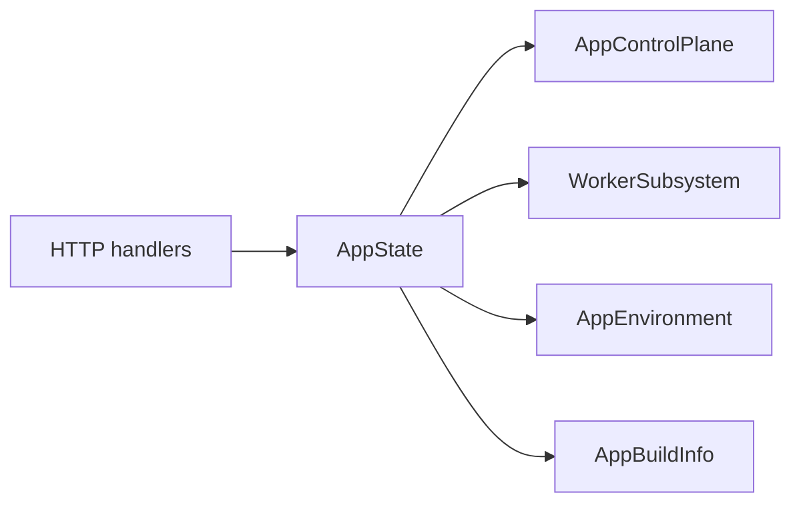
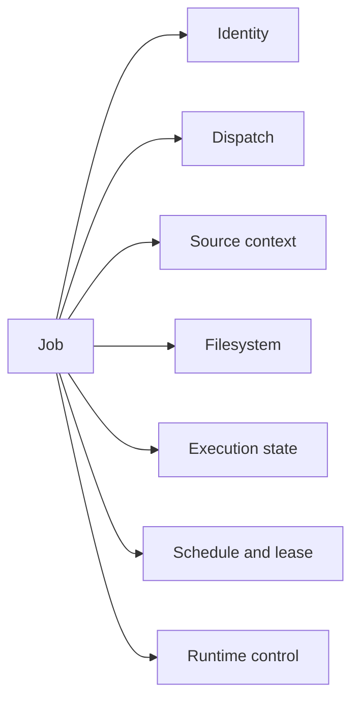
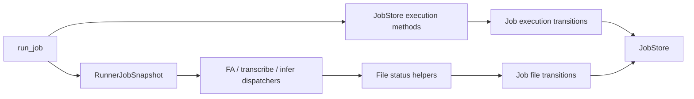
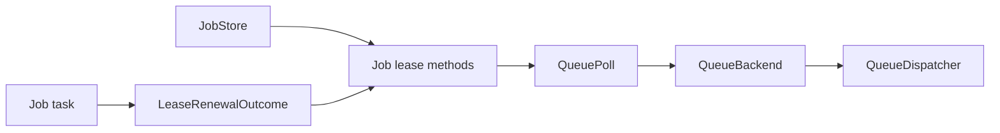
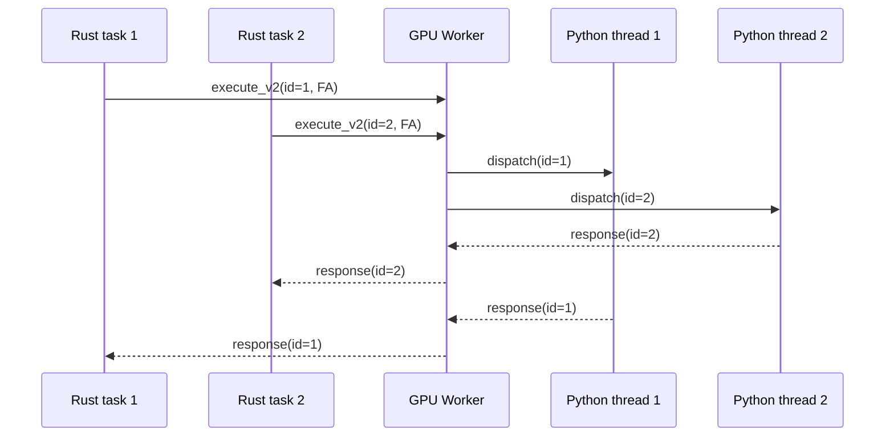
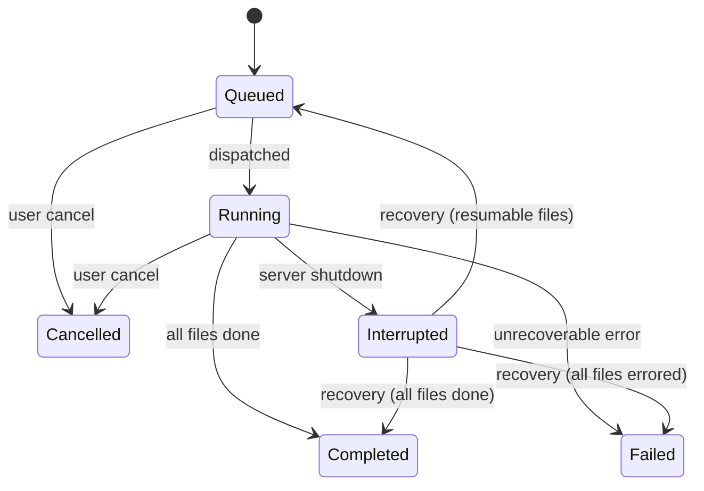

# Server Dispatch Architecture

**Status:** Current
**Last updated:** 2026-05-02 08:50 EDT

This page describes the implemented `batchalign3` runtime:

- `batchalign` handles CLI parsing, file discovery, dispatch, daemon
  lifecycle, and local output writing.
- `batchalign` provides the HTTP server, job store, worker pool, OpenAPI,
  and server-side CHAT orchestration.
- Python workers in `batchalign/worker/` load ML dependencies and execute
  inference over stdio JSON-lines IPC.

The Rust control plane never loads ML models directly.

## Design rationale

The current split exists to keep the control plane separate from the ML runtime:

1. The CLI and server share one Rust workspace and one typed contract surface.
2. Remote-only clients can use the CLI without local ML dependencies.
3. Local processing still relies on Python workers, but model loading is pushed
   out of the Rust process and managed through the worker pool.
4. Rust owns CHAT parsing, validation, cache lookup, injection, and
   serialization for the server-side command paths.

## Locked de-Pythonization boundary

The current repository finish line is **not** "remove Python completely." The
boundary is intentionally narrower and should be treated as the target for
future cleanup work:

- keep the worker subprocess model;
- keep Python only at direct model/SDK boundaries plus the thinnest bootstrap
  and dispatch code needed to host those calls;
- move everything practical that is provider-independent — config ownership,
  payload preparation, cache policy, post-processing, validation, CHAT
  mutation, and orchestration — into Rust;
- keep already-landed BA2 compatibility shims out of scope for this wave.

| Bucket | Current surfaces | Direction |
|---|---|---|
| Stays Python (for now) | `batchalign/worker/`, `batchalign/inference/`, `batchalign/models/` | host for ML model calls until Rust gains the equivalent coverage |
| Thin worker-side glue | `batchalign/providers/` (re-exports worker IPC types), schema mirrors at the worker boundary | keep minimal; Rust owns all document semantics |
| Already moved to Rust | config/runtime policy, payload preparation, post-processing, CHAT mutation, validation, orchestration, WER scoring | done; no backsliding |
| Already removed | `batchalign.compat`, `batchalign.pipeline_api`, `batchalign.inference.benchmark`, `ParsedChat` | gone — no Python public API exists |

The detailed module inventory lives in
[Python–Rust Boundary](../../architecture/python-rust-boundary/python-rust-boundary.md#what-stays-python).

## Runtime layout

```text
+------------------+     HTTP      +------------------+   stdio JSON   +----------------------+
|   Rust CLI       | ----------->  |   Rust Server    | -------------> | Python worker        |
| (batchalign) |   /jobs       | (batchalign) |   IPC          | (batchalign/worker)  |
+------------------+               +------------------+                +----------------------+
                                           |                                     |
                                           v                                     v
                                      +----------+                         +-------------+
                                      | jobs.db  |                         | ML models   |
                                      | SQLite   |                         | Stanza/ASR  |
                                      +----------+                         +-------------+
```

## Runtime ownership boundaries

The server runtime is organized around three owned subsystems plus one shallow
route-state aggregate:

- `JobStore` owns in-memory job state plus SQLite write-through
- `RuntimeSupervisor` owns the queue-dispatch loop and tracked per-job tasks
- `WorkerPool` owns Python worker process lifecycle and serializes per-key
  bootstrap so bursty demand does not launch multiple heavy workers for the
  same bucket at once
- `AppState` groups route-visible handles as control plane, worker subsystem,
  environment, and build identity



## Shared-state ownership rule

The control-plane rule is:

- state that coordinates multiple routes, jobs, or background tasks gets an
  owned task or actor boundary
- mutexes stay private to a subsystem when they only protect tiny local cells

`JobRegistry` actorization completed that rule for the main in-memory jobs map.
Routes, query modules, and runner code now call named `JobStore`/`JobRegistry`
methods instead of borrowing a shared lock.



`inspect_all()` / `mutate_all()` remain deliberate escape hatches for crash
recovery and other rare collection-wide reconciliation. New feature work should
prefer per-job projections and transitions. Local mutexes still exist inside
subsystems such as `OperationalCounterStore` and `WorkerPool`, but those are
owner-private implementation details rather than architectural coordination
seams.

## Route state boundary

HTTP handlers share one `Arc<AppState>`, but the root state is intentionally
shallow:

- `AppControlPlane` for job store, queue wakeups, runtime supervision, and WS
  broadcast
- `WorkerSubsystem` for worker-pool access and command capability data
- `AppEnvironment` for config, media resolution, and filesystem roots
- `AppBuildInfo` for version/build identity reported to clients



That keeps route code from depending on a flat catch-all server struct and
keeps runner-only dependencies such as cache and infer metadata out of shared
handler state entirely.

## Job shape

`JobStore` still owns a shared jobs registry, but it now does so through an
explicit `JobRegistry` component with named operations for submission,
listing, cancellation, queue claiming, and runner snapshots, plus narrower
per-job helpers for the remaining local transitions. `OperationalCounters`
also live in their own `OperationalCounterStore` component instead of another
interior `Arc<Mutex<_>>`. The registry's shared map now lives inside one owned
actor task: `JobStore` and the surrounding query/runner helpers send `Inspect`
or `Mutate` commands over an unbounded channel and await `oneshot` replies, so
access is serialized at a message boundary rather than through a shared mutex
field. Each `Job` is also no longer a flat field bag. The current runtime shape
is grouped as:

- `JobIdentity`
- `JobDispatchConfig`
- `JobSourceContext`
- `JobFilesystemConfig`
- `JobExecutionState`
- `JobScheduleState`
- `JobRuntimeControl`



That split matters because routes, queueing, and runner code no longer need one
30+ field interior runtime record just to touch one concern.

## Runner boundary

The runner now has a sharper read/write split:

- dispatchers receive immutable `RunnerJobSnapshot` values for static job
  configuration
- `JobStore` owns named execution mutations, and `JobRegistry` owns the
  in-memory projection/transition API, but the actual job-level state
  transitions for re-queue, running, failure, and finalization now live on
  `Job`
- registry methods now return typed summary/file projections for WebSocket
  publication, so query modules no longer borrow raw `Job` values just to
  publish live updates
- queue dispatch now uses typed `QueuePoll` snapshots and
  `LeaseRenewalOutcome` instead of raw strings, timestamps, and booleans
- file-level status transitions now reconcile through `Job` methods and then
  flow through runner utility helpers, instead of open-coded store-lock blocks
  in every dispatcher



That still leaves a shared logical job registry, but callers now cross the
registry actor boundary instead of reaching for a shared lock or open-coded
store-wide collection helpers. The remaining bulk escape hatches stay inside
`JobRegistry` for recovery-style operations that genuinely need collection-wide
ownership.

## Queue and lease boundary

The local queue backend now crosses the store boundary with typed values:

- `QueuePoll` for claimed ready jobs plus the next wake deadline
- `LeaseRenewalOutcome` for the heartbeat loop
- `Job` methods for local-dispatch readiness, claim, release, and renewal

That keeps queue wakeups and lease renewal from depending on `Vec<String>`,
`Option<f64>`, bare booleans, and open-coded lease field mutation.



## Current crate and package map

| Component | Current location | Role |
|-----------|------------------|------|
| CLI | `crates/batchalign` | clap CLI, dispatch router, daemon lifecycle, output writing |
| Server | `crates/batchalign` | axum routes, job store, worker pool, OpenAPI, server-side orchestration |
| CHAT ops | `crates/batchalign` | CHAT extraction, injection, validation, FA/morphosyntax helpers |
| Python worker | `batchalign/worker/` | worker entry point, model loading, capabilities, infer/execute dispatch |
| Python inference | `batchalign/inference/` | engine-specific inference backends |

Older names such as the nested Rust workspace and `batchalign-server` are
historical. `batchalign-types` is an active crate that holds shared domain
newtypes and worker protocol types (see the workspace `Cargo.toml`).

## Dispatch resolution

The CLI router in `crates/batchalign/src/dispatch/mod.rs` resolves targets
in this order:

1. explicit `--server` for command classes that can target a remote server
   directly
2. local daemon if `auto_daemon` is enabled
3. already-running loopback server on the configured local port
4. direct local execution

Special cases:

- `transcribe`, `transcribe_s`, `benchmark`, and `avqi` prefer local-daemon
  dispatch when `auto_daemon` is enabled; if that daemon path is unavailable,
  the router still falls back to the explicit `--server`
- explicit `--server` always stays on content mode, even for `localhost`
- local daemons and auto-detected loopback servers use shared-filesystem
  `paths_mode` for local-audio commands
- multi-server `--server URL1,URL2` is rejected in the current release
- `daemon.rs` still contains sidecar lifecycle helpers, but the current
  dispatch path does not auto-select a sidecar yet

## Server endpoints in use

The current server exposes these job/control endpoints:

- `GET /health`
- `POST /jobs`
- `GET /jobs`
- `GET /jobs/{job_id}`
- `GET /jobs/{job_id}/results`
- `GET /jobs/{job_id}/results/{filename}`
- `POST /jobs/{job_id}/cancel`
- `DELETE /jobs/{job_id}`
- `POST /jobs/{job_id}/restart`
- `GET /jobs/{job_id}/stream`
- `GET /media/list`
- `GET /ws`

Dashboard and bug-report routes are also present, but the list above is the
core processing surface.

## Concurrency mapping

| Legacy Python implementation | Rust rewrite equivalent |
|---|---|
| `ProcessPoolExecutor` for CPU-heavy commands | Stanza/IO profile: persistent Python subprocesses, exclusive checkout |
| `ThreadPoolExecutor` for GPU/ASR paths | GPU profile: `SharedGpuWorker` with Python `ThreadPoolExecutor` inside one process |
| Global pool size logic in Python server | Job-level semaphore (`max_concurrent_jobs`) + per-profile pool limits in Rust server |

Additional safeguards:
- Memory gate before job start (skipped when idle workers for the job's `(command, lang)` already exist in the pool).
- Auto-concurrency defaults use 12 GB/slot and hard-cap at 8 slots.

## Command routing

| Command class | Routing behavior |
|---|---|
| `morphotag`, `align`, `translate`, `utseg`, `coref`, `compare` | Explicit single `--server`, local daemon, auto-detected loopback server, or direct local fallback |
| `transcribe`, `transcribe_s`, `benchmark`, `avqi` | Prefer local daemon when `auto_daemon` is enabled; if it is unavailable, fall back to explicit single `--server`, then loopback server, then direct local |

The current mixed-runtime sidecar idea remains only partially wired: the daemon
lifecycle helpers still exist, but dispatch does not yet auto-select a sidecar
server for transcribe-related commands.

## Server-side inference

For text-only commands, the server owns the full CHAT lifecycle — no CHAT text crosses IPC to Python workers:

1. **Parse** — read `.cha` files, parse into ChatFile AST
2. **Extract** — collect payloads (words, text) from the AST
3. **Cache check** — look up each utterance in the server-side UtteranceCache
4. **Infer** — send cache misses to Python workers via typed `execute_v2`
   requests (cross-file batching per language for text tasks)
5. **Inject** — insert model results back into the AST
6. **Serialize** — validate and write output `.cha` files

| Command | Dispatch Path | Worker Role |
|---------|--------------|-------------|
| morphotag, utseg, translate, coref | infer (cross-file) | Stateless model inference only |
| align | infer (per-file, per-group) | Stateless audio/text alignment inference |
| transcribe, transcribe_s | infer (per-file audio) | Raw ASR inference feeding a Rust-owned pipeline |
| benchmark | infer (per-file audio + compare) | Raw ASR inference feeding Rust transcribe + compare |
| opensmile, avqi | infer (per-file media V2) | Rust-owned prepared-audio media analysis over typed worker requests |

There is no standalone CLI `speaker` command in batchalign3, matching
batchalign2. Speaker diarization remains a worker capability used to support
`transcribe_s` and typed V2 execution.

## SSE job streaming

For lightweight real-time progress monitoring (alternative to WebSocket):

```
GET /jobs/{job_id}/stream
```

Returns Server-Sent Events:
- `snapshot` — initial file statuses on connect
- `file_update` — per-file status changes
- `job_update` — overall job status changes
- `complete` — job finished (stream closes)

## Worker protocol

Workers are spawned by the server pool and communicate over stdio JSON-lines.
The key operations are:

- `health`
- `capabilities` — reports infer tasks and engine versions; Rust derives commands
- `process`
- `batch_infer` (shrinking compatibility path)
- `execute_v2` (live typed infer path)
- `shutdown`

The current Rust worker handle tolerates a bounded amount of non-protocol
stdout noise while waiting for startup or a response, which protects the pool
from common library banners and download messages. Protocol-shaped malformed
JSON is still treated as a hard framing error so the request fails loudly
instead of silently desynchronizing the stream.

For live `execute_v2` requests, the worker/result contract is also split on
purpose: malformed request payloads and unreadable prepared artifacts stay in
`invalid_payload` / attachment error buckets, while malformed model-host output
is reported as `runtime_failure`. That keeps bad Python/SDK result shapes from
masquerading as caller input mistakes.

### Concurrent dispatch for GPU workers

GPU profile workers support concurrent V2 requests via request_id multiplexing:

- Rust sends multiple `execute_v2` requests to one GPU worker without waiting for responses
- Python's `_serve_stdio_concurrent()` dispatches to a `ThreadPoolExecutor` (4 threads)
- Responses carry `request_id` fields — Rust's background reader routes them to pending oneshot channels
- Non-V2 ops (health, capabilities, shutdown) use a separate sequential control channel



`execute_v2` is the main path for live server-owned inference:

- Rust prepares text/audio artifacts
- Python workers run inference on those prepared inputs
- Rust injects results back into the AST and serializes output

`batch_infer` remains only as a shrinking compatibility surface:

- Rust extracts payloads from CHAT
- Python workers run inference on those payloads
- Rust injects results back into the AST and serializes output

This path is intentionally **not** the target boundary for new work. New
control-plane logic should land either in Rust or on the typed `execute_v2`
surface, not by widening `process` or `batch_infer`.

Rev.AI preflight submission is no longer a worker IPC operation. The Rust
server now performs that upload burst directly through the
`batchalign::revai` module (`crates/batchalign/src/revai/`) so the
Python boundary stays inference-only. The same
server-owned boundary now also handles Rev.AI-backed raw ASR inference for
`transcribe` and `benchmark`, plus Rev-backed timed-word recovery for `align`
UTR.

### Capability detection

Capabilities are detected lazily from the first real worker spawn rather than
from a dedicated probe worker at startup. When the first worker for any profile
starts, it reports which infer tasks the Python environment supports via import
probes (`importlib` checks whether each task's dependencies are installed) and
returns a non-empty engine version for every advertised task — it does not load
full models beyond what the spawned command requires. Rust then derives the
released command surface from that infer-task set and gates job submission on
the derived commands only.

See [Capability Discovery](../../architecture/python-rust-boundary/python-rust-boundary.md#capability-discovery)
for the full flow, the import probe table, and troubleshooting tips.

## Local daemon state

The local daemon uses the same configured port from `~/.batchalign3/server.yaml`
(default `8000`). It records state in `daemon.json` and can start a separate
sidecar profile for transcribe workloads.

`serve start` writes `server.pid` and `server.log` for manually started servers.
Auto-daemon state is tracked separately from manual `serve start`.

## Startup recovery

Server startup now treats crash recovery as an explicit typed transition rather
than ad hoc map mutation.

1. SQLite marks previously active jobs as `Interrupted`.
2. `JobStore::load_from_db()` rebuilds each `Job` value from persisted rows.
3. `Job::reconcile_recovered_runtime_state()` decides the canonical next state:
   requeue unfinished work or promote all-terminal jobs to `Completed` /
   `Failed`.
4. The reconciled status and cleared lease metadata are written back to SQLite
   before normal queue dispatch resumes.

That keeps the in-memory control plane and the persisted recovery snapshot in
sync after every restart.

## Job lifecycle and cancellation

Jobs progress through a small state machine. The transitions are explicit
methods on `Job` (`store/job/lifecycle.rs`); routes, runners, and reconcilers
never mutate `JobStatus` ad-hoc.



Two things distinguish this from a flat "every terminal looks the same"
model:

- **`Cancelled` is reserved for user gestures.** TUI cancel and HTTP
  `POST /jobs/{id}/cancel` reach this state. Cancelled is permanent — a
  Cancelled job is never auto-resumed. The user said stop; the server
  honors that.
- **`Interrupted` is the system-initiated counterpart.** Graceful server
  shutdown (`temporal_backend::interrupt_all_for_shutdown`) and crash
  recovery (`db.recover_interrupted` SQL migration) both write
  `JobStatus::Interrupted`. Although `JobStatus::is_terminal()` returns
  `true` for it, the recovery sequence above is special-cased to
  transition resumable Interrupted rows back to `Queued` so the next
  Temporal activity attempt picks up where the previous server left off.

Writing `Cancelled` for a system event would conflate "user said stop" with
"server bounced" — and the two require opposite responses. The 2026-04-27
investigation found long-running fleet jobs perpetually labeled `cancelled`
even though no user had pressed cancel, because the shutdown handler used
the user-cancel transition. The fix routed shutdown through `Interrupted`
so the recovery sequence can act on it.

### Cancel-provenance audit

Every cancel attempt — user or system — appends one row to the
`cancellations` audit table with a typed source, host, pid, reason, and
in-flight filename. Multiple rows per job are normal (two cancel clicks an
hour apart, one user cancel followed by a system cancel at shutdown,
etc.).

| `CancelSource` value | Origin |
|---|---|
| `Tui` | TUI cancel keystroke |
| `Api` | HTTP `POST /jobs/{id}/cancel` |
| `Cli` / `Dashboard` / `Staging` | other user-facing entry points |
| `Signal` | system-initiated: server-shutdown handler, Temporal activity-cancel forwarding |

`CancelReason` is a free-form string. Two values are stable audit keys
matched by the reconciler — `CancelReason::server_cancel_all()` (written
by the shutdown handler) and `CancelReason::temporal_activity_forwarded()`
(written by the activity-side cancel handler when Temporal's cancel signal
arrives). Both are factory methods on `CancelReason` so the producer and
consumer can't drift via typo.

### Temporal reconciler interaction

When a server bounces mid-job, the local DB row goes through
`Running → Interrupted → Queued` via the recovery sequence above. But
Temporal also saw the workflow's activity die and may report the workflow
as `Cancelled` on the next describe. Without further care, the reconciler
would see "store says Queued, Temporal says Cancelled" and write
`JobStatus::Cancelled` — undoing recovery.

The reconciler's `reconcile_action` (`temporal_reconciler.rs`) instead
consults the cancellations audit. If the most-recent row has
`source = Signal` AND `reason ∈ {server_cancel_all,
temporal_activity_forwarded}`, the reconciler returns `NoChange` rather
than `MarkCancelled`. The local recovery has already done the right
thing; the reconciler must not undo it. User-initiated cancels
(`source ∈ {Tui, Api, …}`) and audit-row-missing cases preserve the
prior `MarkCancelled` behavior.

### Migration-hash drift (deploy hardening)

Sqlx records SHA-384 of each migration's SQL bytes in
`_sqlx_migrations.checksum` at apply time and refuses to start a binary
whose embedded migration content hashes don't match — even comment-only
edits change the hash. Without intervention, a privacy scrub or
documentation fix on a shipped migration wedges every fleet host into a
startup crash loop on the next deploy. `KeepAlive=true` masks the
failure as a tight crash loop, which launchctl reports as
"spawn scheduled, active count = 0" — easy to misdiagnose as a
launchctl issue.

The deploy runtime self-heals this. At deploy build time,
`automation/pyinfra/deploys/deploy_batchalign3.py::_compute_migration_hashes`
hashes every `crates/batchalign/migrations/*.sql` and embeds the
list as `expected_migrations` in the per-host JSON config. Before
bootstrapping the new daemon,
`LocalBatchalignServiceSystem.reconcile_migration_hashes` reads
`_sqlx_migrations`, compares each row's stored hash against the
expected hash, and `UPDATE`s any drifted row with a `WARN` log line.

The trust model: the developer who pushed the migration content change
is asserting (by deploying) that the change is semantically benign. The
runtime codifies that assertion against the fleet. Operational
runbook: `<workspace>/docs/runbooks/batchalign3-deploy.md` § "Migration-hash
drift (self-healing)".

## Key files

| File | Role |
|------|------|
| `crates/batchalign/src/dispatch/mod.rs` | top-level dispatch router |
| `crates/batchalign/src/dispatch/single.rs` | explicit remote single-server dispatch |
| `crates/batchalign/src/dispatch/paths.rs` | local-daemon paths-mode dispatch |
| `crates/batchalign/src/daemon.rs` | daemon lifecycle, state files, sidecar handling |
| `crates/batchalign/src/routes/mod.rs` | axum router composition and middleware |
| `crates/batchalign/src/routes/jobs/mod.rs` | job submission/list/detail routes |
| `crates/batchalign/src/routes/health.rs` | `/health` payload and capability reporting |
| `crates/batchalign/src/types/config/` | `ServerConfig`, defaults, validation, state dir (split: `layout.rs`, `load.rs`, `resolve.rs`, `server.rs`, `tests.rs`) |
| `crates/batchalign/src/runner/` | job runner, dispatch shape selection |
| `crates/batchalign/src/runner/dispatch/` | batched infer, FA, transcribe pipelines |
| `crates/batchalign/src/morphosyntax/` | morphosyntax orchestrator (parse→cache→infer→inject) |
| `crates/batchalign/src/fa/` | forced alignment orchestrator |
| `crates/batchalign/src/runner/dispatch/transcribe_pipeline.rs` | transcribe orchestrator (ASR→postprocess→CHAT assembly) |
| `crates/batchalign/src/utseg.rs` | utseg orchestrator |
| `crates/batchalign/src/translate.rs` | translation orchestrator |
| `crates/batchalign/src/coref.rs` | coreference orchestrator |
| `crates/batchalign/src/cache/` | Tiered utterance cache (moka hot + SQLite cold), BLAKE3 keys |
| `crates/batchalign/src/worker/pool/` | worker spawn, checkout, health loop, idle timeout |
| `crates/batchalign/src/db/` | SQLite persistence (WAL), schema, recovery, TTL pruning |
| `batchalign/worker/_main.py` | Python worker entry point |
| `batchalign/worker/_model_loading/` | Python worker model-loading package |
| `batchalign/worker/_stanza_loading.py` | Stanza configuration and ISO-code mapping |
