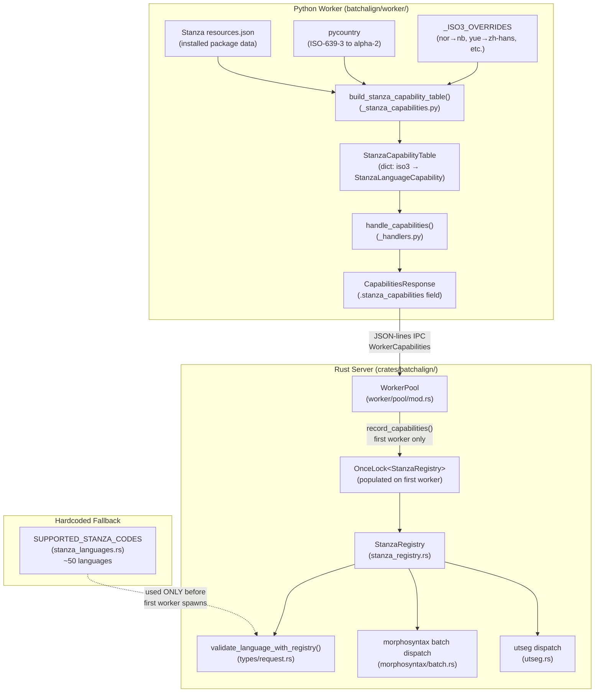

# Stanza Capability Registry

**Status:** Current
**Last modified:** 2026-05-02 08:55 EDT

The Stanza capability registry replaces 7 scattered hardcoded language tables
with a single runtime-authoritative data structure built from Stanza's own
`resources.json`. It answers questions like "does Dutch have constituency
parsing?" and "what is the alpha-2 code for Norwegian?" without any hardcoded
assumptions about Stanza's feature matrix.

## Problem: Hardcoded Language Tables

Before the registry, processor availability was scattered across 7 independent
tables in both Python and Rust:

| Former table | Location | What it hardcoded |
|--------------|----------|-------------------|
| `MWT_LANGS` | Python inference | Languages with multi-word token expansion |
| `SUPPORTED_STANZA_CODES` | `stanza_languages.rs` | ISO-639-3 codes Stanza could process |
| `iso3_to_alpha2` | Python worker | Code mapping for Stanza model loading |
| `CONSTITUENCY_LANGS` | Python utseg | Languages with constituency parsing |
| ~~`STANZA_SUPPORTED_ISO3`~~ (removed) | `request.rs` | Was a duplicate of `SUPPORTED_STANZA_CODES`; submission validation now delegates to the chat-ops list |
| Inline checks in `_stanza_loading.py` | Python worker | Ad hoc feature gating |
| Inline checks in `batch.rs` | Rust morphosyntax | Language filtering |

Every Stanza upgrade risked these tables drifting out of sync. The Dutch
`utseg` crash (requesting constituency for a language that lacked it) was a
direct consequence: `CONSTITUENCY_LANGS` included Dutch but Stanza's model
did not have constituency support.

## Architecture: Data Flow

The registry is built once at worker startup and flows from Python to Rust
through the worker capabilities IPC protocol.



<!-- Verified against:
  - batchalign/worker/_stanza_capabilities.py (builder, overrides, pycountry)
  - batchalign/worker/_handlers.py (handle_capabilities, CapabilitiesResponse)
  - crates/batchalign-types/src/worker.rs (WorkerCapabilities.stanza_capabilities, StanzaLanguageProcessors)
  - crates/batchalign/src/worker/pool/mod.rs (OnceLock, record_capabilities)
  - crates/batchalign/src/stanza_registry.rs (StanzaRegistry)
  - crates/batchalign/src/types/request.rs (validate_language_with_registry, delegates to chat_ops::is_stanza_supported)
  - crates/batchalign/src/morphosyntax/batch.rs (registry queries)
-->

## Python Side: Building the Table

`batchalign/worker/_stanza_capabilities.py` is the single source of truth.

**`build_stanza_capability_table()`** reads `stanza.resources.common.load_resources_json()`,
which returns the full Stanza resource dictionary keyed by alpha-2 language
codes. For each language entry that has a `"tokenize"` key (filtering out
non-language entries like `"default"`), it records which processors are
available:

| Processor | Stanza key | What it enables |
|-----------|-----------|-----------------|
| `tokenize` | `"tokenize"` | Basic tokenization |
| `pos` | `"pos"` | Part-of-speech tagging |
| `lemma` | `"lemma"` | Lemmatization |
| `depparse` | `"depparse"` | Dependency parsing |
| `mwt` | `"mwt"` | Multi-word token expansion (~45 languages) |
| `constituency` | `"constituency"` | Constituency parsing (~11 languages) |
| `coref` | `"coref"` | Coreference resolution |

**ISO-639-3 mapping** is built in two passes:

1. **`_ISO3_OVERRIDES`** — a small dict of codes where pycountry is wrong or
   Stanza uses non-standard identifiers (e.g., `nor→nb`, `yue→zh-hans`,
   `cmn→zh-hans`, `zho→zh-hans`, `msa→ms`).
2. **`pycountry.languages`** — for all remaining standard mappings.

The result is a `StanzaCapabilityTable` with `languages` keyed by ISO-639-3
code and `iso3_to_alpha2` for the code mapping. This is cached with
`@functools.lru_cache(maxsize=1)` for the process lifetime.

## IPC: Capabilities Response

When the Rust server queries a worker's capabilities (`_handlers.py:handle_capabilities()`),
the handler converts the `StanzaCapabilityTable` into a
`dict[str, StanzaLanguageProcessors]` (keyed by ISO-639-3, each value
containing an `alpha2` string and a `processors` list). This is serialized
as the `stanza_capabilities` field of `CapabilitiesResponse`
(`batchalign/worker/_types.py`).

On the Rust side, `WorkerCapabilities` in `crates/batchalign-types/src/worker.rs`
mirrors this structure with `stanza_capabilities: BTreeMap<String, StanzaLanguageProcessors>`.

## Rust Side: StanzaRegistry

`crates/batchalign/src/stanza_registry.rs` stores the deserialized
capabilities and provides typed query methods:

| Method | What it checks | Used by |
|--------|---------------|---------|
| `supports_morphosyntax(iso3)` | tokenize + pos + lemma + depparse | Submission validation, batch dispatch |
| `has_mwt(iso3)` | `mwt` processor available | Morphosyntax pipeline (includes MWT step only when available) |
| `has_constituency(iso3)` | `constituency` processor available | Utseg dispatch (falls back to sentence-boundary without it) |
| `alpha2(iso3)` | ISO-639-3 to Stanza alpha-2 | Model loading configuration |
| `supported_languages()` | All ISO-639-3 codes | Error messages, help text |
| `is_populated()` | Non-empty registry | Fallback gating |

### Storage: `OnceLock` in WorkerPool

The registry is stored in `WorkerPool.stanza_registry: OnceLock<Box<StanzaRegistry>>`.
`record_capabilities()` populates it from the first worker that reports
non-empty `stanza_capabilities`. The `OnceLock` ensures this is a one-shot
operation even under concurrent worker spawning.

Access is via `WorkerPool::stanza_registry() -> Option<&StanzaRegistry>`.
`None` means no worker has reported yet.

### Two-Phase Validation

Submission validation runs in two phases:

1. **Pre-filter** (`validate_language_support()` in `request.rs`):
   delegates to `chat_ops::stanza_languages::is_stanza_supported`,
   which consults the hardcoded `SUPPORTED_STANZA_CODES` set (~50
   languages). This runs even before any worker has started, so it
   catches obviously unsupported languages immediately.

2. **Authoritative check** (`validate_language_with_registry()` in
   `request.rs`): uses the live `StanzaRegistry` when available. This is
   called from `materialize_submission_job()` in `routes/jobs/mod.rs`
   where the registry is accessible via `AppState`.

Once the registry is populated, it supersedes the hardcoded table. The
hardcoded table exists only as a conservative safety net for the window
between server startup and the first worker's capability report.

## Per-Command Processor Requirements

| Command | Required processors | Optional processors |
|---------|-------------------|---------------------|
| morphotag | tokenize + pos + lemma + depparse | mwt (if available) |
| utseg | tokenize + pos | constituency (degrades to sentence-boundary without it) |
| coref | English-only, uses Stanza coref | -- |
| translate | Does not use Stanza | -- |
| align/transcribe | Does not use Stanza directly | -- |

## Graceful Degradation

The registry enables graceful degradation rather than hard failures:

- **No MWT:** Morphotag works without contraction expansion. The pipeline
  simply omits the `mwt` processor from the Stanza pipeline configuration.
- **No constituency:** Utseg falls back to sentence-boundary segmentation
  (`_stanza_loading.py:UtsegConfigBuilder` checks the capability table).
- **No depparse:** Morphotag is rejected at submission time with a clear
  error message listing supported languages.
- **Unknown language:** Rejected at submission with a formatted list of
  all supported ISO-639-3 codes.

## Maintaining the Fallback Table

After upgrading Stanza, regenerate the hardcoded fallback table:

```bash
uv run scripts/generate_stanza_language_table.py
```

This reads the installed Stanza's `resources.json`. The historically
hardcoded `SUPPORTED_STANZA_CODES` constant is no longer maintained;
the authoritative table is built dynamically from the Python worker's
live Stanza resources and sent to Rust via the capability response.
Delegation paths in `request.rs` and the transcribe plan-time gate consult
the live table (with chat-ops fallback if the registry is unavailable).

The Python worker also runs a typed `UnsupportedLanguageError`
preflight in `_stanza_loading.py::load_stanza_models` that consults
the live capability table — this is the authoritative drift safety
net regardless of how stale the Rust fallback gets.

## Key Source Files

| File | Role |
|------|------|
| `batchalign/worker/_stanza_capabilities.py` | Reads `resources.json`, builds `StanzaCapabilityTable` |
| `batchalign/worker/_handlers.py` | Serializes table into `CapabilitiesResponse.stanza_capabilities` |
| `batchalign/worker/_types.py` | `CapabilitiesResponse`, `StanzaLanguageProcessors` Pydantic models |
| `batchalign/worker/_stanza_loading.py` | Utseg config builder queries table for constituency/MWT |
| `crates/batchalign-types/src/worker.rs` | `WorkerCapabilities`, `StanzaLanguageProcessors` Rust types |
| `crates/batchalign/src/stanza_registry.rs` | `StanzaRegistry` with typed query methods |
| `crates/batchalign/src/worker/pool/mod.rs` | `OnceLock<StanzaRegistry>` storage, `record_capabilities()` |
| `crates/batchalign/src/types/request.rs` | Single Rust fallback via `is_stanza_supported_language()`; delegates to chat-ops |
| `crates/batchalign/src/types/request.rs` | `validate_language_with_registry()`; submission-time gate delegates to chat-ops |
| `crates/batchalign/src/pipeline/transcribe.rs` | Plan-time gate (registry first, chat-ops fallback) |
| `batchalign/worker/_stanza_loading.py` | `UnsupportedLanguageError` preflight before `stanza.Pipeline` |
| `crates/batchalign/src/morphosyntax/batch.rs` | Queries registry for language filtering |
| `scripts/generate_stanza_language_table.py` | Regenerates Rust fallback tables from installed Stanza |
