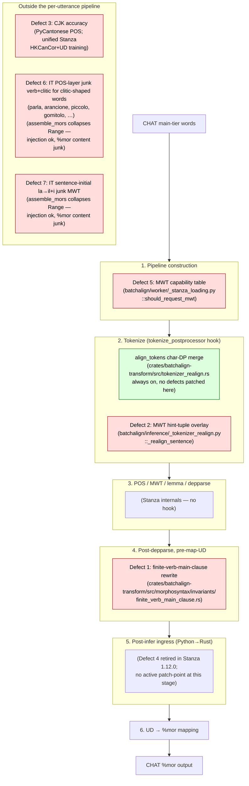

# Stanza Defect Mitigation Map

**Status:** Current
**Last updated:** 2026-06-19 18:31 EDT

Stanza is a third-party NLP library whose defects surface at different
pipeline stages depending on the root cause. batchalign3's mitigation
strategy is **patch at the stage where the defect originates** — not
earlier (would mask the signal), not later (would require re-deriving
state). This page maps every tracked Stanza defect to its patch-point
so a contributor debugging a new Stanza quirk can find similar
precedents by pipeline stage rather than by grepping the registry.

The authoritative list of defects with version pinning, reproducers,
and re-evaluation criteria lives at
[Stanza Limitations](../reference/stanza-limitations.md). This page
is a *view* over that list, organized by **where** each defect is
patched in the pipeline.

## Pipeline stages and their patch-points

**Note on Defects 6 and 7.** Both are **content-quality** defects,
not injection-gate failures. The `%mor` 1-to-1 count invariant holds
for both because `nlp/mapping/mod.rs::assemble_mors` correctly
collapses Stanza's MWT Range tokens into a single compound `%mor`
entry using `~`/`+`. The problem is what goes INSIDE that compound
entry: Stanza's POS/MWT layer produces linguistically wrong analyses
(`verb|par-Inf-S~pron|la-Prs-S3` for the bare imperative `parla`;
`det|il-Masc-Def-Art-Sing~det|il-Masc-Def-Art-Plur` for the
feminine-singular article `la`), and Stage 3 faithfully serializes
them. No pipeline gate rejects junk content.

## Cross-reference table

| Defect | Stage | Mitigation file | Test pointer | Stanza version confirmed |
|:-----:|:------|:----------------|:-------------|:------|
| [1](../reference/stanza-limitations.md#defect-1-copula-s-vs-possessive-s-disambiguation-fails-before-nominal-gerunds) | Post-depparse, pre-map-UD | `crates/batchalign-transform/src/morphosyntax/invariants/finite_verb_main_clause.rs` | `test_preserve_mwt_end_to_end.py`; `finite_verb_main_clause.rs` `#[cfg(test)]` (14 tests) | 1.10.1, 1.11.1, 1.12.0, 1.12.1, 1.13.0 |
| [2](../reference/stanza-limitations.md#defect-2-mwt-hint-tuples-must-be-preserved-through-postprocessors-stanzapython-interop-gotcha) | Tokenize (postprocessor hook) | `batchalign/inference/_tokenizer_realign.py::_realign_sentence` | `test_stanza_mwt_copula_observations.py`; `golden_l2_morphotag_*` (4 tests) | 1.10.1, 1.11.1, 1.12.0, 1.12.1, 1.13.0 |
| [3](../reference/stanza-limitations.md#defect-3-cjk-tokenization-and-pos-quality-reference-only--existing-workarounds) | Dedicated engines (not a pipeline patch) | `batchalign/inference/languages/cantonese/*` (PyCantonese); unified Stanza training (out-of-tree) | `test_cantonese_*`, `test_stanza_cantonese_*`, `test_mandarin_*` | 1.10.x, 1.11.x |
| [4](../reference/stanza-limitations.md#defect-4-neural-lm-control-tokens-leak-into-document-output-finnish-mwt) | Retired in Stanza 1.12.0 (no active patch-point) | — (mitigation files removed in commit `cea8f082`) | — | retired upstream in 1.12.0 |
| [5](../reference/stanza-limitations.md#defect-5-mwt-processor-selection-must-come-from-the-live-capability-table-not-a-hardcoded-mirror) | Pipeline construction | `batchalign/worker/_stanza_loading.py::should_request_mwt` | `test_stanza_loading.py::TestShouldRequestMwt`; `test_stanza_config_parity.py::TestMwtCapabilityDriven`; `test_stanza_he_el_mwt_splits.py`; `test_he_el_mwt_end_to_end.py` | every 1.x through 1.13.0 |
| [6](../reference/stanza-limitations.md#defect-6-italian-pos-layer-splits-words-with-clitic-shaped-endings-into-fake-verbclitic-compounds) | Unpatched content quality (POS layer, no hook; injection succeeds with junk content) | (none) | `test_stanza_mwt_probe_matrix.py::test_stanza_mwt_probe_with_postprocessor[ita__dell_opera_in_context]`, `[ita__parla_imperative_forte]`, `[ita__parla_imperative_piu_forte]`, `[ita__arancione_noun_bogus_verb]`, `[ita__piccolo_adj_bogus_verb]` (xfail, UD-level pins) | 1.11.1, 1.12.0, 1.12.1, 1.13.0 |
| [7](../reference/stanza-limitations.md#defect-7-italian-sentence-initial-article-la-gets-junk-mwt-expansion-il--i) | Unpatched content quality (MWT processor, no hook; injection succeeds with junk content) | (none) | `test_stanza_mwt_probe_matrix.py::test_stanza_mwt_probe_with_postprocessor[ita__parla_3sg_storia_context]` (xfail, UD-level pin) | 1.11.1, 1.12.0, 1.12.1, 1.13.0 |

## Stages without defects (today)

Two stages currently carry no defect mitigations and exist in the
diagram for completeness:

- **Char-DP merge in `align_tokens`** — always-on, language-agnostic.
  The 2026-04-21 per-language MWT-override audit confirmed that the
  DP alone satisfies the morphotag 1-to-1 invariant for every
  previously patched language (French, Italian, Portuguese, Dutch).
  Per-language override tables were retired; see the
  [per-language chapters](../reference/languages/overview.md) for
  the audit records.
- **Stanza internals (POS / MWT / lemma / depparse)** — no hook
  exists. Defects originating here are either (a) mitigated
  downstream (Defect 1), (b) handled by swapping engines (Defect 3),
  (c) retired upstream when the underlying library was fixed (Defect 4
  — fixed in Stanza 1.12.0), or (d) left as xfail-pinned UD-level
  observations with linguistically wrong `%mor` content flowing
  through unimpeded (Defects 6 and 7).

## When to add a new patch-point

Use this procedure for any newly discovered Stanza defect:

1. **Identify the stage where the defect originates.** A hint-tuple
   loss originates at tokenize; a wrong POS tag originates at POS;
   a control-token leak in `Document` output originates post-infer.
   Patch at the origin, not earlier or later.
2. **If an existing defect already patches that stage, extend its
   module.** Prefer coalescing over sprawl: the
   `crates/batchalign-transform/src/morphosyntax/invariants/` directory
   is the natural home for any future post-depparse UD-invariant
   rewrite.
3. **If no existing defect patches that stage, update this diagram
   before adding code.** Adding a stage to the diagram without a
   patch-point node is also valid — it documents where a future
   mitigation would live (e.g., "post-POS reassembly" is currently
   a named gap behind Defect 6).
4. **Register the defect in
   [`stanza-limitations.md`](../reference/stanza-limitations.md)**
   with the full format (version, reproducer, correct output,
   mitigation pointer, tests, re-evaluation criteria).
5. **Cross-link back to this diagram** from the defect's BA3
   mitigation section in the registry.

## Architectural gaps

One known gap today: **no `%mor` content-quality gate.** The pipeline
validates only the `%mor` COUNT invariant (N items == N Mor-alignable
CHAT words); there is no corresponding check on the linguistic
content of each `%mor` entry. As a result, Stanza's POS/MWT
pseudo-analyses flow through to the emitted `%mor` tier unchallenged:

- **Defect 6** (`parla → verb|par-Inf-S~pron|la-Prs-S3`): Stanza
  gives up on lemmatizing `par` and echoes the surface fragment as
  the lemma. The `%mor` chunk has the right count but the wrong
  content. Candidate signal: `head.lemma == head.text` on an MWT
  expansion.
- **Defect 7** (`la → det|il-...~det|il-...`): Stanza's MWT processor
  emits a 2-word expansion whose inner words don't reconstruct the
  token surface (`il + i ≠ la`) and whose lemmas both collapse to
  `il`. The `%mor` chunk has the right count but the wrong content.
  Candidate signal: `concat(inner_word_texts) != token_text`.

A content-quality gate would either (a) reject the utterance
(convert to `MisalignmentBug`-class absorption) when these signals
fire, (b) substitute a plain-POS `%mor` using the CHAT surface text,
or (c) route Italian through a different engine entirely. None of
these are in place today. Designing them is separate architectural
work, blocked on (i) deciding which of (a)/(b)/(c) fits the
succession target, and (ii) a content-quality test oracle (CLAN's
Italian MOR is a candidate).

An ita-corpus scan surfaced 73 main-tier `parla` occurrences across
43 files, but there is no automated `%mor`-content assertion yet.
Building one is a prerequisite to any principled fix — candidates
include a curated expected-`%mor` fixture per case, or CLAN's
Italian MOR output as an oracle.
