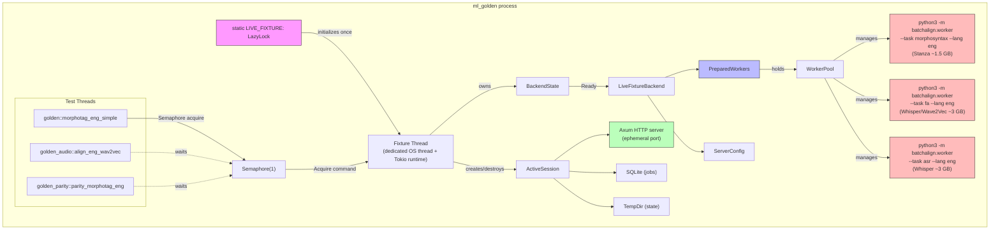
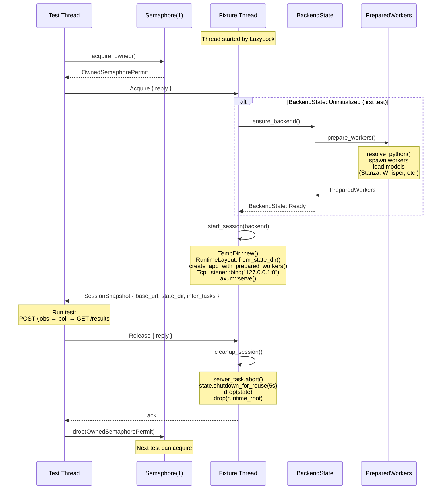
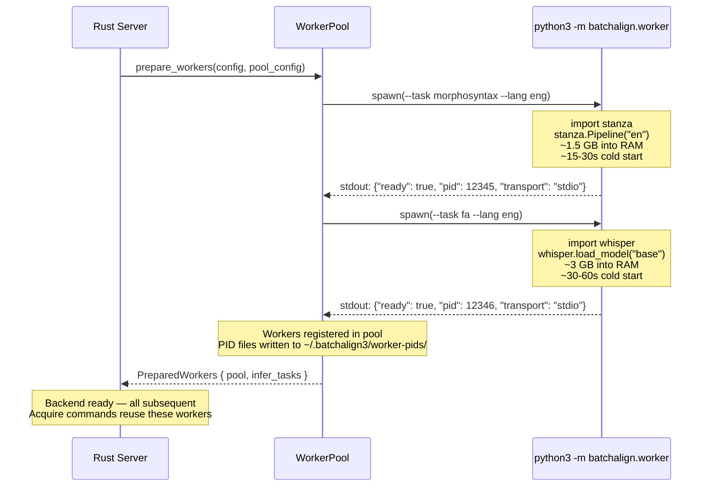
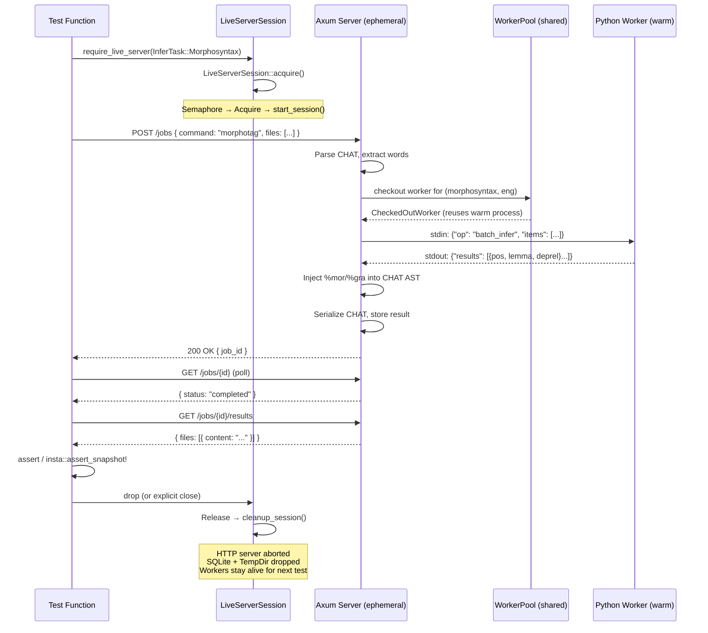

# Test Server and Worker Lifecycle

**Status:** Current
**Last updated:** 2026-03-20 17:45

## The problem

ML integration tests (golden snapshots, audio transcription, parity checks,
profile verification) need a running batchalign server with loaded Python ML
workers. Each worker loads Whisper, Stanza, or pyannote models consuming 2–5 GB
RAM. The lifecycle of these workers during testing has caused three kernel OOM
panics (2026-03-19, 2026-03-20) on a 64 GB developer machine.

### Root cause: per-binary server isolation (resolved)

Previously, each Rust integration test binary (`golden.rs`, `golden_audio.rs`,
`golden_parity.rs`, `profile_verification.rs`, etc.) was compiled as a separate
executable. Each binary included `mod common;` which compiled the shared fixture
module into its own address space. The fixture uses a `static LazyLock` for the
server backend — process-local, so 7 binaries = 7 independent worker pools.

### Implemented solution: single binary consolidation

All 7 ML binaries are now consolidated into one binary (`ml_golden.rs`) with
submodules. One binary = one process = one `LazyLock` = one `PreparedWorkers` =
one set of loaded models. Peak memory is ~8-12 GB instead of 7x that.

```
ml_golden (one binary, one process)
  → LazyLock → PreparedWorkers → python3 (Stanza, Whisper, Wave2Vec, pyannote)
  ├── ml_golden::golden           (12 tests)
  ├── ml_golden::golden_audio     (22 tests)
  ├── ml_golden::golden_parity    (16 tests)
  ├── ml_golden::live_server_fixture (5 tests)
  ├── ml_golden::profile_verification (3 tests)
  ├── ml_golden::option_receipt   (5 tests)
  └── ml_golden::error_paths      (7 tests)
```

The `LiveServerSession` fixture within the binary is well-designed:

- **One `PreparedWorkers` backend** shared across all 70 tests
- **Fresh HTTP server per session** (new port, new jobs dir, new SQLite)
- **Semaphore-gated sessions** so tests don't collide on control-plane state
- **Warm model cache** across tests — only the first test pays cold-start cost

## Architecture overview

The fixture system has three layers: the process-global backend (loaded
models), the fixture thread (session lifecycle), and per-test sessions
(isolated HTTP servers). This diagram shows the full structure:



## Fixture thread lifecycle

The fixture thread runs on a dedicated OS thread with its own Tokio runtime.
It processes `Acquire` and `Release` commands from test threads via an
`mpsc` channel. The backend (Python workers + models) is initialized lazily
on the first `Acquire` and cached for all subsequent sessions.



## Python worker startup and model loading

When the backend initializes (first `Acquire`), `prepare_workers()` spawns
Python worker subprocesses. Each worker loads multi-GB ML models into memory
and signals readiness over its stdio JSON-lines protocol.



## Per-test session lifecycle

Each test acquires a session (serialized by the semaphore), gets a fresh
HTTP server with its own jobs directory and SQLite database, runs its test
logic, then releases the session. The Python workers persist across sessions.



## Cleanup and safety layers

Multiple overlapping mechanisms ensure workers are cleaned up even if tests
crash or are killed.

```mermaid
graph TB
    subgraph "Normal shutdown"
        A["Test completes"] --> B["LiveServerSession::close()"]
        B --> C["cleanup_session()"]
        C --> D["server_task.abort()"]
        C --> E["state.shutdown_for_reuse(5s)"]
        E --> F["Workers returned to pool<br/>(stay warm for next test)"]
    end

    subgraph "Drop fallback"
        G["Test panics"] --> H["LiveServerSession::Drop"]
        H --> I["thread::spawn release"]
        I --> J["cleanup_session() on background thread"]
    end

    subgraph "Process exit"
        K["All tests done /<br/>binary exits"] --> L["WorkerPool::Drop"]
        L --> M["Kill all idle workers<br/>(SIGTERM)"]
        L --> N["Remove PID files"]
    end

    subgraph "Orphan recovery (next startup)"
        O["New test run starts"] --> P["PID file reaper"]
        P --> Q["Scan ~/.batchalign3/worker-pids/"]
        Q --> R{"Worker alive?<br/>Parent dead?"}
        R -->|"Yes (orphan)"| S["SIGTERM → 2s → SIGKILL"]
        R -->|"No (stale file)"| T["Remove PID file"]
        R -->|"Both alive"| U["Skip (belongs to<br/>running server)"]
    end

    subgraph "External guard"
        V["Claude Code session"] --> W["Guard hook checks<br/>pgrep batchalign.worker"]
        W -->|"Workers found"| X["Block test command<br/>(prevent double-spawn)"]
    end

    style F fill:#bfb,stroke:#333
    style M fill:#fbb,stroke:#333
    style S fill:#fbb,stroke:#333
```



## Defense-in-depth layers

These remain as additional safety nets beyond the single-binary consolidation:

| Layer | Where | What |
|-------|-------|------|
| nextest default-filter | `.config/nextest.toml` | ML binary excluded from `cargo nextest run` |
| nextest ml test group | `.config/nextest.toml` | ML binary serialized (`max-threads=1`) when opted in |
| Claude Code guard hook | `.claude/settings.local.json` | Blocks test commands when worker processes detected |
| Global worker cap | `WorkerPool` (`max_total_workers`) | Hard ceiling on total workers across all keys |
| `WorkerPool::Drop` | `pool/mod.rs` | Kills idle workers when pool dropped without `shutdown()` |
| PID file reaper | `pool/reaper.rs` | Scans `~/.batchalign3/worker-pids/` on startup, kills orphans |

## Future: shared test daemon (historical analysis)

If the test suite outgrows the single-binary approach (e.g., the binary
becomes too large to link, or test isolation requires separate processes),
the next step is a shared test daemon. This is preserved here as a future
option, not a current plan.

The idea: one long-lived server for the entire `cargo nextest run --profile
ml` invocation, with test binaries connecting as HTTP clients. The server's
autotuner and memory gate handle scheduling. Models load once and stay warm.

**Implementation options (in order of simplicity):**
1. **nextest setup script** — `[profile.ml.scripts.setup]` starts a daemon
2. **Test-managed daemon** — file-lock coordination in `common/mod.rs`
3. **Always-on dev daemon** — assume a running server, skip if absent

## Relationship to the broader worker architecture

The test lifecycle problem is a microcosm of the deployment lifecycle:

- **Development**: one developer machine, multiple concurrent test/dev sessions
- **Production (net)**: one server, multiple concurrent jobs from the fleet

The single-daemon test architecture exercises the same code paths as production:
autotuner, memory gate, worker pool, idle timeout, health checking. The
per-binary in-process approach exercises none of these, which is why it was
blindsided by the OOM crashes that production handles gracefully.

Making tests use the production dispatch path also means test failures surface
real bugs (scheduling, memory, lifecycle) rather than hiding them behind
per-test isolation.
