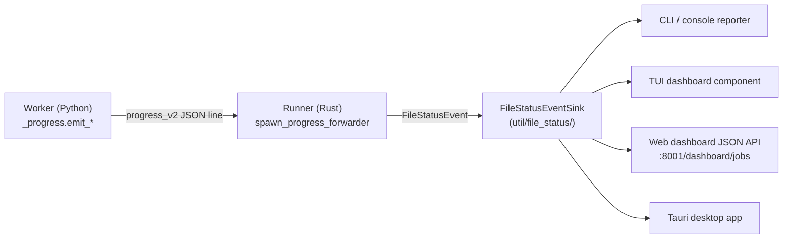

# Time Transparency: A Cross-Cutting UX Principle

**Status:** Current
**Last updated:** 2026-05-19 21:03 EDT

## Principle

> Transparency about where batchalign3 spends its time is vital for UX:
> all model downloading or loading from disk must be logged and also
> prominently displayed in UI whether console, TUI, app, or web
> dashboard.

Any operation that takes more than a perceptible moment must be both
**logged** (to the daemon and worker logs with structured metadata) and
**prominently displayed** in every UI surface batchalign3 exposes (CLI,
TUI, Tauri desktop app, web dashboard). Silent waits are UX bugs, not
acceptable defaults.

The reader of this page should leave with one rule in mind: **if a worker
spends more than ~1 second on something the user could mistake for "BA3 is
stuck", that something must surface to the UI**. Examples:

- Downloading any model resource (catalog, language pack, HuggingFace
  weights, torchaudio bundle, NeMo checkpoint).
- Loading a model from disk into RAM or GPU.
- GPU JIT compile.
- Audio decoding for long files.
- External API calls (Rev.AI ASR, Anthropic, Aliyun, etc.) — at minimum a
  `"Calling Rev.AI…"` event before the call returns.
- Sleep, backoff, retry — make the wait visible, not silent.

## Why this matters

The principle exists because of a specific incident shape that has
recurred more than once:

1. The worker enters a deterministic failure that masquerades as a wait
   (catalog missing, model not loaded, network unreachable).
2. The orchestrator treats the resulting worker exit as transient and
   retries.
3. Each retry dumps a multi-line stack trace to a log file with no
   user-visible signal.
4. The user sees an opaque error after several retries (or, worse, a
   silent multi-hour hang) and the on-call engineer finds gigabytes of
   log spam diagnosing it.

The canonical anti-pattern instance: an operator host produced hundreds
of GB of `server.log` over 24 hours because Stanza's resource catalog
was missing, the worker raised `UnsupportedLanguageError`, and the
orchestrator retried indefinitely. The user-visible message was the
unhelpful `"capability table is unavailable"`. Fix: catalog
auto-bootstrap (now emits a download event) plus this principle to
prevent the same shape from recurring with a different model family.

## Mechanism

### Wire protocol: `progress_v2` events

The worker emits user-facing events on stdout as JSON lines, distinct from
its final-result IPC payload:

```json
{"op": "progress_v2", "event": {"request_id": "...", "completed": 0, "total": 0, "stage": "downloading_stanza_catalog"}}
```

Source: `batchalign/worker/_protocol.py:write_progress_event`.

`stage` is a short machine-readable identifier (e.g.,
`downloading_stanza_catalog`, `loading_whisper_large`,
`calling_rev_ai_asr`). The Rust runner uses it both as a structured log
key and as a fallback display label. The user-facing wording lives in the
emitting site (see "Wording" below).

### Python side: helpers in `_progress.py`

```python
emit_download_event(stage, user_message, request_id=None, size_bytes_estimate=None)
emit_hf_download_if_missing(model_id, kind, request_id=None)
```

`emit_download_event` is the generic helper for non-HF downloads (Stanza
catalog, Stanza language packs, torchaudio bundles, NeMo).

`emit_hf_download_if_missing` probes the HuggingFace cache via
`huggingface_hub.try_to_load_from_cache` and emits only when the model
will actually download. Wrap every `from_pretrained()` call.

### Rust side: progress forwarding to the file-status sink

The runner spawns a `progress_forwarder` per request (see
`crates/batchalign/src/runner/dispatch/audio_task.rs:spawn_progress_forwarder`).
It reads `progress_v2` lines from worker stdout and dispatches them to a
`FileStatusEventSink` (see
`crates/batchalign/src/runner/util/file_status/event_sink.rs`). The sink
fans out to:

- **CLI / console**: rendered as a per-file status line by the runner's
  console reporter.
- **TUI**: same line, displayed in the dashboard component.
- **Web dashboard** at `:8001/dashboard/jobs/<id>`: the file status field
  is included in the JSON the dashboard polls.
- **Tauri desktop app**: consumes the same job/file status events through
  the dashboard JSON API.

Adding a UI surface? Subscribe to `FileStatusEventSink` events and render
the `stage` (and any user-facing wording the worker emits). Do not
duplicate event-shape logic in each UI; the sink is the single source.



## Operations that must be surfaced

This list is non-exhaustive but covers every category the codebase
currently has. Any new long operation must be added to it.

### Model downloads

Every family. See the developer-facing
[model downloads chapter](../developer/model-downloads-and-caching.md)
for the inventory and the helper-function shape.

### Model loads from disk to RAM or GPU

A multi-GB model load can take 30+ seconds even from a warm cache
(deserialization + GPU upload). Emit before the load, especially for
Whisper-large-class models.

### Audio decoding for long files

A multi-hour audio file's first decode can take a minute or more. The
worker should emit `"Decoding audio: <filename>…"` before the decode call.

### External API calls

Rev.AI ASR, Anthropic, Aliyun, OpenAI — anywhere the worker makes a
synchronous network call that could legitimately take more than a couple
seconds. At minimum: emit `"Calling <provider> for <task>…"` before the
call returns. For long-running providers like Rev.AI streaming, emit
periodic heartbeats so the user sees the call is still alive.

### Sleeps, backoffs, retries

Backoff loops that wait several seconds between attempts must surface
each wait. Without an event, a `time.sleep(30)` looks identical to "BA3
is stuck" from the outside. The orchestrator's retry layer
(`crates/batchalign/src/runner/util/error_classification.rs` and
`crates/batchalign/src/infer_retry.rs`) is the right place to hook this
in for transport-level retries.

## Wording: what the user reads

The `user_message` field — the text rendered to the user — must convey
four things for any download or load:

1. **What** is happening ("Downloading openai/whisper-large-v3 for ASR").
2. **How big** (approximate; `~3 GB` is fine).
3. That it's a **one-time cost** ("future runs will use the local cache"
   or "future runs will be instant").
4. That **BA3 is not stuck**.

Standardized templates live in `_progress.py`. When adding a family, copy
an existing template; do not invent new wording from scratch — UI users
get used to the shape.

For loads (no download), the shape is `"Loading <model> for <task>…"` with
an implicit "this should take a few seconds" because if it took longer it
would also need a progress signal mid-load.

## What NOT to do

- **Do not** swallow exceptions from long-blocking operations and return
  a default value. The Stanza catalog incident was exactly this: the
  bootstrap path swallowed `ResourcesFileNotFoundError` and returned
  `None`, leaving the gate above to surface a misleading "language not
  supported" error. If something is recoverable (download it), do that
  and emit. If it isn't, raise a typed error.
- **Do not** rely on the upstream library's stderr progress as the user-
  visible signal. HuggingFace's `tqdm` prints to terminal stderr, which
  reaches the CLI but not the TUI, web dashboard, or desktop app. The
  `progress_v2` channel is the only signal that reaches every UI.
- **Do not** emit progress events from the Rust runner's own slow
  operations without also surfacing them. If the runner is doing something
  slow (warming caches, validating fixtures), emit on the same channel
  that worker progress uses, into the same sink.
- **Do not** suppress events on cached / fast-path runs. Emitting only
  when a download will happen is the right call (BA3's
  `emit_hf_download_if_missing` does this); but a load that genuinely
  takes a few seconds — even from cache — still warrants a "Loading X…"
  event. Users prefer one always-shown line to a guessing game about
  whether a wait is "real".

## Adding a new long operation: contributor checklist

1. **Identify the slow site.** Anywhere the worker (or the runner) blocks
   for > 1 s.
2. **Choose a stage identifier.** Short, snake-case, unambiguous. Examples:
   `downloading_stanza_catalog`, `loading_whisper_large`,
   `calling_rev_ai_asr`, `decoding_audio`.
3. **Choose user wording.** Use the `_progress.py` templates. Convey the
   four things above. Be specific.
4. **Pair start with completion** when the operation is recoverable — e.g.,
   a download has both a "downloading…" event and a "ready" event.
5. **Verify each UI surface renders the event.** CLI: run the command and
   see the line. TUI: run with `--tui` and see the dashboard label. Web:
   poll the dashboard JSON. Tauri: check the desktop app's status panel.
6. **Add a regression test.** A unit test that mocks the slow path and
   asserts at least one `progress_v2` event was emitted with the right
   stage.

## Related references

- [User-facing model-downloads chapter](../user-guide/model-downloads.md).
- [Developer-facing model-downloads chapter](../developer/model-downloads-and-caching.md).
- Source: `batchalign/worker/_progress.py`, `batchalign/worker/_protocol.py`.
- Rust forwarder: `crates/batchalign/src/runner/dispatch/audio_task.rs:spawn_progress_forwarder`.
- Sink: `crates/batchalign/src/runner/util/file_status/event_sink.rs`.
