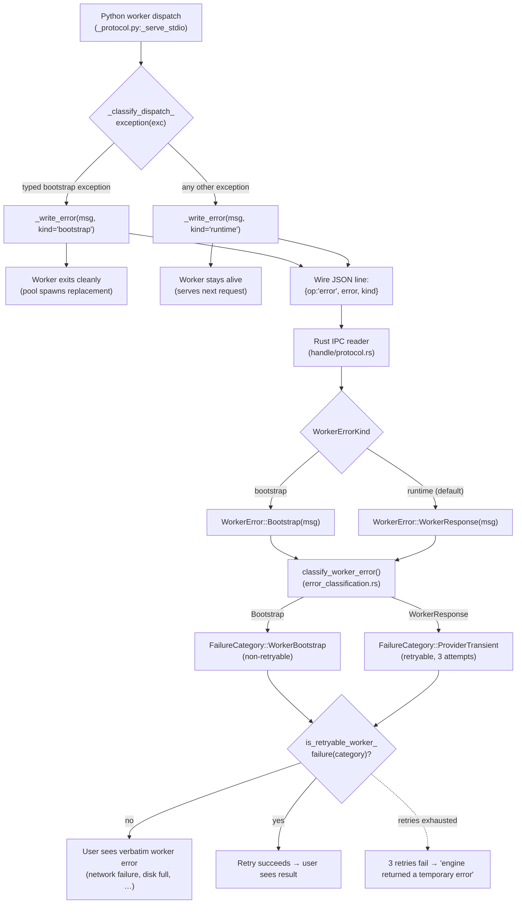
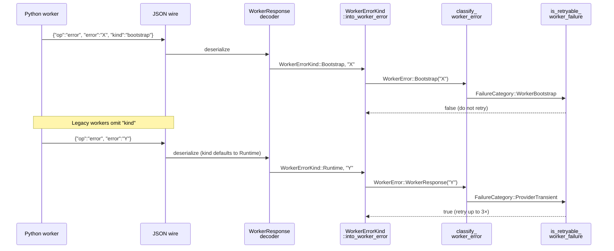

# Worker Failure Classification and Retry Architecture

**Status:** Current
**Last updated:** 2026-05-19 21:04 EDT

This chapter is the canonical contributor reference for how a Python
worker exception becomes, or does not become, an end-user error. It
covers the wire protocol, the typed error taxonomy on both sides of the
Rust/Python seam, the classifier that decides retry behavior, and the
user-facing message router. Add a new bootstrap-class error? Adding a
worker exception type? Adjusting retry policy? Start here.

The architecture documented in this chapter was rewritten on 2026-05-06
in response to two coupled defects:

1. **The on-demand model-download contract.** A fresh-install worker must
   automatically download missing models without any manual seeding. The
   user-visible failure for a missing-model condition must be an
   actionable network/disk/auth error, never an opaque "capability table
   is unavailable". See `book/src/batchalign/user-guide/model-downloads.md`.
2. **Bootstrap-class retry classification.** A worker that fails
   deterministically during bootstrap (missing model, catalog download
   failure, package import error) must NOT be retried by the
   orchestrator. Pre-fix, retries amplified one Stanza-catalog miss
   into hundreds of GB of `server.log` spam over a single day on a
   fleet host.

Both fixes are different facets of the same architectural shape, what
the worker can fail at, how it conveys that failure across the IPC seam,
and what the orchestrator does with it.

## The full pipeline at a glance



The key invariants the diagram encodes:

- **Bootstrap-class exceptions take a separate path on both sides of the
  seam.** Python emits with `kind=bootstrap`; Rust decodes into
  `WorkerError::Bootstrap`; classifier returns
  `FailureCategory::WorkerBootstrap`; `is_retryable_worker_failure`
  returns `false`.
- **The runtime path preserves all pre-2026-05-06 retry semantics.** Any
  exception that isn't a typed bootstrap error stays in the
  `WorkerResponse → ProviderTransient → retry up to 3×` loop.
- **The user-facing wording is verbatim for bootstrap errors.** The
  worker's typed error message (e.g., "Failed to download Stanza
  catalog: connection refused") reaches the user with light framing,
  not a generic "internal error" wrapper. Bootstrap errors are
  user-actionable.

## The wire protocol

### Request envelope (Rust → Python)

Defined by `WorkerRequest` in
`crates/batchalign/src/worker/handle/protocol.rs`. Tagged-union JSON over
stdio (or TCP for shared-GPU daemons):

```jsonc
{"op": "infer", "request": {...}}
{"op": "batch_infer", "request": {...}}
{"op": "execute_v2", "request": {...}}
{"op": "ensure_task", "request": {"task": "morphosyntax", "engine_overrides": null}}
{"op": "health"}
{"op": "capabilities"}
{"op": "shutdown"}
```

### Response envelope (Python → Rust)

Defined by `WorkerResponse` in the same file. Same tagged-union shape:

```jsonc
{"op": "infer", "response": {...}}
{"op": "batch_infer", "response": {...}}
{"op": "execute_v2", "response": {...}}
{"op": "progress_v2", "event": {...}}     // intermediate, before final response
{"op": "ensure_task", "response": {...}}
{"op": "health", "response": {...}}
{"op": "capabilities", "response": {...}}
{"op": "shutdown"}
{"op": "error", "error": "<message>", "kind": "runtime" | "bootstrap"}
```

The `error` op is the focus of this chapter. The `kind` field was added
2026-05-06; legacy workers that don't emit it default to `runtime` on
the Rust side, which preserves the pre-fix retry behavior exactly.

#### Why `kind` and not a separate `bootstrap_error` op?

Two reasons:

1. **One decode path, not two.** Adding a sibling op (`{"op":
   "bootstrap_error", ...}`) would double the number of match arms at
   every consumer of `WorkerResponse`, plus add a serializer surface. A
   discriminator field is cheaper.
2. **Backward compatibility.** A new op breaks legacy workers; an
   optional field with a default does not. Rolling out a wire change to
   the fleet must not require lockstep daemon redeploys.

## The Python side: `_serve_stdio` and exception handling

Source: `batchalign/worker/_protocol.py`.

### Pre-2026-05-06 behavior (the bug)

```python
def _serve_stdio() -> None:
    for raw_line in sys.stdin:
        # ... json decode ...
        dispatch = dispatch_protocol_message(message)  # raises propagate up
        _write_json(dispatch.payload)
```

An uncaught exception from `dispatch_protocol_message` propagated through
the loop, the worker's main module, and Python's interpreter shutdown
machinery, ultimately killing the process with exit code 1 and dumping
the traceback to stderr.

The Rust orchestrator saw `WorkerError::ProcessExited` →
`FailureCategory::WorkerCrash` → retryable, and retried up to 3× with
the same configuration. For deterministic bootstrap failures, every
retry crashed identically, generating ~3 KB of traceback per attempt.
On a fleet host this loop ran for ~24 hours and produced hundreds of
GB of log spam before the daemon was restarted.

### Post-2026-05-06 behavior

```python
def _serve_stdio() -> None:
    for raw_line in sys.stdin:
        # ... json decode ...
        try:
            dispatch = dispatch_protocol_message(message)
        except BaseException as exc:
            kind = _classify_dispatch_exception(exc)  # 'bootstrap' or 'runtime'
            # Log the full traceback once for diagnostics …
            _write_error(str(exc) or exc.__class__.__name__, kind=kind)
            if kind == "bootstrap":
                break        # Worker exits cleanly; pool spawns replacement.
            continue          # Worker stays alive for the next request.
        _write_json(dispatch.payload)
```

The catch is intentionally broad (`BaseException`, not `Exception`), we
want every exception to produce a structured error rather than a process
exit, including ones like `KeyboardInterrupt` that would otherwise leak
through. The price of `BaseException` is one rule for contributors:
**never raise `SystemExit` from inside a dispatch handler** (use the
shutdown op instead). The catch will swallow it.

`_classify_dispatch_exception` is the bootstrap-vs-runtime discriminator:

```python
def _classify_dispatch_exception(exc: BaseException) -> str:
    bootstrap_types = []
    try:
        from batchalign.worker._stanza_capabilities import StanzaCatalogDownloadError
        bootstrap_types.append(StanzaCatalogDownloadError)
    except ImportError:
        pass
    try:
        from batchalign.worker._stanza_loading import UnsupportedLanguageError
        bootstrap_types.append(UnsupportedLanguageError)
    except ImportError:
        pass
    return "bootstrap" if isinstance(exc, tuple(bootstrap_types)) else "runtime"
```

The lazy imports are deliberate: a missing optional dependency must not
crash the classifier itself. If a future ML library introduces typed
bootstrap errors, append them to the list, the `tuple(...)` dispatch
handles the type fan-in cleanly.

### Why does the worker exit on bootstrap errors?

A worker that hit a bootstrap failure is in a partially-initialized
state, model loaders may have allocated GPU memory, opened file
handles, or established network connections that the surviving
`_state` does not track. Continuing to serve requests after a bootstrap
failure invites silent data corruption (e.g., a request that needed
language `eng` running against a worker whose `eng` Pipeline never
finished loading).

The exit is safe because the orchestrator classifies bootstrap errors
as **non-retryable**: the pool spawns a fresh replacement worker on the
next request, but it does NOT re-execute the failing request that just
errored. The user gets the typed bootstrap error verbatim, no retry
storm, no log explosion.

For runtime errors, by contrast, the worker stays alive. A transient
inference failure on one input is no reason to throw away a fully-loaded
worker (and the gigabytes of GPU memory it holds).

### Transport coverage: stdio AND TCP

The same exception-shielding contract applies to all four worker request
loops in `_protocol.py`:

| Function | Transport | Mode |
|---|---|---|
| `_serve_stdio` | stdio | sequential |
| `_serve_stdio_concurrent` | stdio | concurrent (thread pool) |
| `_handle_tcp_connection_sequential` | TCP | sequential |
| `_handle_tcp_connection_concurrent` | TCP | concurrent (thread pool) |

Stanza/IO-profile workers use the TCP variants (one daemon, multiple
servers connecting). They are exactly the profiles that load Stanza
catalogs, the incident shape this whole architecture is designed to
prevent originally manifested on these workers. Every loop wraps
`dispatch_protocol_message` in a `BaseException` catch, classifies via
`_classify_dispatch_exception`, and emits the structured error envelope.
TCP handlers also tear the connection down on bootstrap-kind errors so
the orchestrator sees a typed error rather than a closed socket.

## The Rust side: `WorkerError`, `FailureCategory`, classifier

Source files:

| Concern | File |
|---|---|
| `WorkerError` enum | `crates/batchalign/src/worker/error.rs` |
| Wire `WorkerResponse` decoder | `crates/batchalign/src/worker/handle/protocol.rs` |
| TCP variant decoder | `crates/batchalign/src/worker/tcp_handle.rs` |
| `FailureCategory` enum | `crates/batchalign/src/types/scheduling.rs` |
| Classifier (`classify_worker_error`, `is_retryable_worker_failure`) | `crates/batchalign/src/runner/util/error_classification.rs` |
| Retry loop | `crates/batchalign/src/infer_retry.rs` |
| User-facing message router | `crates/batchalign/src/runner/util/error_classification.rs::user_facing_error` |

### `WorkerError` taxonomy

Each variant has a documented retryability class.

| Variant | Fires when | Retryable? |
|---|---|---|
| `SpawnFailed(String)` | The Python child process can't start (missing python, OS resource limits) | **Terminal**: same config will fail again |
| `ReadyTimeout { timeout_s }` | Worker started but didn't emit ready signal in time | Retryable, transient stall |
| `ReadyParseFailed(String)` | Worker emitted invalid ready signal | **Terminal**: version mismatch |
| `HealthCheckFailed(String)` | Periodic health probe failed | Retryable, pool replaces worker |
| `ProcessExited { code, stderr }` | Worker died unexpectedly mid-job | Retryable, but if deterministic, replacement will die too |
| `Protocol(String)` | IPC framing or response shape was wrong | Terminal-for-this-request, protocol desync |
| `WorkerResponse(String)` | Worker returned `{"op":"error", "kind":"runtime"}` | Retryable, per-request failure |
| **`Bootstrap(String)`** | Worker returned `{"op":"error", "kind":"bootstrap"}` | **Terminal**: deterministic |
| `Io(io::Error)` | Pipe-level I/O failure (broken pipe, etc.) | Retryable, pool replaces worker |
| `MemoryGuard(MemoryGuardError)` | Memory-guard refused to admit the worker (insufficient headroom under the configured budget) | **Not retried** by `is_retryable_worker_failure`: classified as `FailureCategory::MemoryPressure`, which is outside the retry set; the scheduler re-admits later once memory frees |
| `NoWorker { command, lang }` | Reserved variant; unused today | Terminal |

The `Bootstrap` variant added 2026-05-06 is the one this chapter is
about. Every existing variant kept its prior retryability class to
preserve behavior on already-debugged paths.

### `FailureCategory` and the retry decision

`FailureCategory` is the broader classification that the retry loop, the
user-facing message router, and the persistence layer all consume. Eleven
variants:

```text
Validation, ParseError, InputMissing, WorkerCrash, WorkerTimeout,
WorkerProtocol, WorkerBootstrap, ProviderTransient, ProviderTerminal,
MemoryPressure, Cancelled, System
```

Retry decision in `is_retryable_worker_failure`:

```rust,ignore
matches!(
    category,
    FailureCategory::WorkerCrash
        | FailureCategory::WorkerTimeout
        | FailureCategory::ProviderTransient
)
```

`WorkerBootstrap` is intentionally absent. That's the load-bearing
property: a bootstrap-class failure cannot reach the retry loop's
`continue` branch, so a deterministic failure stops at the first
attempt instead of echoing through three.

### How `kind` flows from wire to category



The `WorkerErrorKind::into_worker_error(message)` helper in
`handle/protocol.rs` is the single dispatch point, every wire decoder
goes through it. Eleven call sites in `handle/ipc.rs` and
`tcp_handle.rs` were updated as part of the the bootstrap-retry defect fix; they all share
this helper.

### One specialization: `ensure_task` errors are forced bootstrap

```rust,ignore
WorkerResponse::Error { error, kind } => {
    // ``ensure_task`` is the on-demand model-loading IPC; any error
    // here is by definition a bootstrap-class failure regardless
    // of the wire ``kind`` field. Default to ``Bootstrap`` …
    match kind {
        WorkerErrorKind::Bootstrap | WorkerErrorKind::Runtime => {
            Err(WorkerError::Bootstrap(format!("ensure_task failed: {error}")))
        }
    }
}
```

Why force-bootstrap regardless of the wire kind? Because `ensure_task`
is the on-demand model-loading IPC, its sole purpose is to bootstrap a
task into a worker's runtime state. A failure during that operation is
*always* deterministic across retries, even if the worker's
`_classify_dispatch_exception` doesn't yet know about the specific error
type. The orchestrator must not retry; if the cause was actually
transient, the user can re-submit the job.

This is a defense-in-depth measure: even if a future contributor adds a
new bootstrap-class error type to Python and forgets to add it to
`_classify_dispatch_exception`, an ensure_task failure still classifies
correctly.

## The user-facing message

Source: `crates/batchalign/src/runner/util/error_classification.rs::user_facing_error`.

The router maps `FailureCategory` to a final string the user sees in the
dashboard, CLI, TUI, and desktop app. Two design constraints shape it:

1. **No system internals.** Strings like "Broken pipe (os error 32)",
   "exit code: Some(1)", and Python tracebacks must never reach the
   user. They get logged via `tracing` for developer debugging.
2. **Bootstrap errors are exempt from the "internal error" framing.**
   The worker has already produced an actionable, user-facing message
   (network failure, disk full, missing auth). The router surfaces it
   verbatim with light wrapping.

The `WorkerBootstrap` arm:

```rust,ignore
FailureCategory::WorkerBootstrap => {
    let detail = truncate_tail(raw_error, 1000);
    format!("{command_label} failed for {filename}: {detail}")
}
```

Compare with the `WorkerCrash` arm:

```rust,ignore
FailureCategory::WorkerCrash => {
    let detail = truncate_tail(raw_error, 500);
    format!(
        "{command_label} failed for {filename}: the processing engine crashed.\n{detail}"
    )
}
```

Bootstrap errors are *not* "the processing engine crashed", they are
*"X is missing or unreachable, here's what to do"*. The verbatim
inclusion is what makes the difference.

## The retry loop

Source: `crates/batchalign/src/infer_retry.rs`.

```rust,ignore
for attempt_number in 1..=retry_policy.max_attempts {
    match pool.dispatch_execute_v2_with_progress(lang, request, progress_tx).await {
        Ok(response) => return Ok(response),
        Err(error) => {
            let category = classify_worker_error(&error);
            let has_retry_budget = attempt_number < retry_policy.max_attempts;

            if is_retryable_worker_failure(category) && has_retry_budget {
                let backoff_ms = retry_policy.backoff_for_retry(attempt_number);
                warn!(
                    task = ?request.task,
                    lang = %lang,
                    attempt_number,
                    max_attempts = retry_policy.max_attempts,
                    error = %error,
                    category = %category,
                    %backoff_ms,
                    "Retrying execute_v2 after transient worker failure"
                );
                tokio::time::sleep(Duration::from_millis(backoff_ms.0)).await;
                continue;
            }

            return Err(ServerError::Worker(error));
        }
    }
}
```

The fix lands transparently here: `is_retryable_worker_failure(category)`
returns `false` for `WorkerBootstrap`, the `if` falls through, the
function returns the error immediately. Pre-fix, the `category` was
`WorkerCrash`, the `if` was true, and the loop spun three times.

Future enhancement (not yet landed): emit a `progress_v2` event before
each retry sleep so the UI shows "Retrying after worker error
(attempt 2/3)…". This is a clean fit with the
[time-transparency principle](time-transparency.md) but is out of scope
for the the bootstrap-retry defect fix.

## Adding a new bootstrap-class error type

Checklist for contributors:

1. **Define the typed error in Python.** Inherit from a sensible base
   (`RuntimeError` for general bootstrap failures,
   `ValueError`/`UnsupportedLanguageError` for input-driven ones).
   Document that it is bootstrap-class in the docstring, the type
   itself is the contract.

2. **Register it in the classifier.** Add a lazy import + append to the
   `bootstrap_types` list in
   `batchalign/worker/_protocol.py:_classify_dispatch_exception`.

3. **Make sure the error message is actionable.** The user will see it
   verbatim. Include: what failed, where (URL, file path), why
   (network / disk / auth), and what they should do.

4. **Add a test.** Two patterns, both already in the codebase:
   - `batchalign/tests/test_serve_stdio_bootstrap_error.py`: assert
     the new exception type classifies as `bootstrap`.
   - A handler-level test that mocks the underlying failure and
     asserts the worker emits the right wire envelope.

5. **No Rust changes required** for additional bootstrap-class types
   on the Python side. The wire protocol is type-erased, Python just
   emits `kind: "bootstrap"`, and Rust's existing
   `WorkerError::Bootstrap` variant absorbs every such error
   uniformly.

If the new error class needs different orchestrator behavior (e.g.,
"retry after a delay even though it's deterministic"), that's a deeper
change, discuss before implementing.

## Adding a new wire-level worker error variant

Less common but documented for completeness. If a new orthogonal error
shape needs its own Rust variant (e.g., "external provider returned
permission-denied" → distinct user-facing remediation):

1. Add the variant to `WorkerError` in `worker/error.rs` with a doc
   comment explaining when it fires and its retryability class.
2. Add a matching `FailureCategory` variant in `types/scheduling.rs`
   (and update the `Display`/`FromStr` impls).
3. Update `classify_worker_error` to map the new `WorkerError` variant
   to the new category.
4. Update `user_facing_error` to render an actionable message for the
   new category.
5. Update `is_retryable_worker_failure` if the new category is
   retryable.
6. Update the test in `runner/util/mod.rs::worker_error_classification_is_stable`
   to lock in the classification.
7. Update this chapter's tables.

## Cross-references

- [Time transparency UX principle](time-transparency.md), why every
  long worker operation must surface to the UI; downstream consumer of
  the same `progress_v2` channel.
- [User-facing model-downloads chapter](../user-guide/model-downloads.md)
 , the user-facing contract that motivates the on-demand-download path.
- [Developer model-downloads chapter](../developer/model-downloads-and-caching.md)
 , full inventory of every model-load site.
- [Server architecture overview](server-architecture.md), the broader
  context this chapter slots into.
- [Server model loading](server-model-loading.md), per-command model
  inventory and lazy-load policy.
- [Stanza capability registry](stanza-capability-registry.md), the
  pre-flight gate whose silent-fail path was the proximate cause of the
  retry-classification bug this chapter documents.
