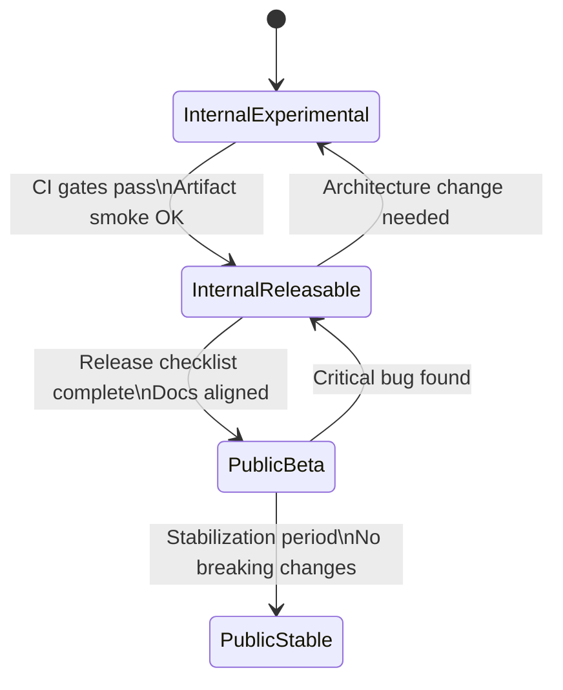

# Release Readiness State Machine

**Status:** Current
**Last updated:** 2026-05-01 09:47 EDT

This document defines the authoritative release-readiness states for
TalkBank's public-facing projects. Every release claim (in PRs, docs,
PyPI metadata, or conversations) must reference one of these states.
Contradictory or informal readiness language ("almost ready", "basically
done", "should be releasable") is not acceptable — use the state name.

## States

### Internal Experimental

- Active development, architecture may change
- No stability promises
- Not suitable for external users
- CI may be incomplete

### Internal Releasable

- CI gates pass consistently
- Artifacts build and smoke-test correctly
- Internal team can use reliably
- Not yet documented/polished for external users

### Public Beta

- Release checklist complete
- Documentation aligned with actual capabilities
- External users can try it with expectation of rough edges
- Breaking changes possible but documented
- `Development Status :: 4 - Beta` in PyPI classifiers

### Public Stable (1.0)

- Semver enforced
- Deprecation policy active
- Breaking changes only in major versions
- `Development Status :: 5 - Production/Stable` in PyPI classifiers

## Current State

**batchalign3: Public Beta**

Evidence:

- CI gates pass (tests, typecheck, lint)
- Artifact packaging has known issues (wheel CLI binary embedding)
- Cross-repo dependency not yet versioned
- Documentation being aligned with actual capabilities
- Platform support partially verified

Blockers to Public Stable:

- [ ] Wheel packaging fixed (T020)
- [ ] Cross-repo dependencies versioned (T098-T099)
- [ ] Full release checklist passing (T025)
- [ ] Stabilization period with no breaking changes

**talkbank-tools: Internal Releasable**

Evidence:

- CI gates pass (clippy, tests, parser equivalence)
- Release workflow fixed and smoke-tested
- Core crates (parser, model, transform, clan) well-tested
- VS Code extension functional but in preview

Blockers to Public Beta:

- [ ] Crates published to crates.io
- [ ] Release workflow end-to-end validated with a real tag
