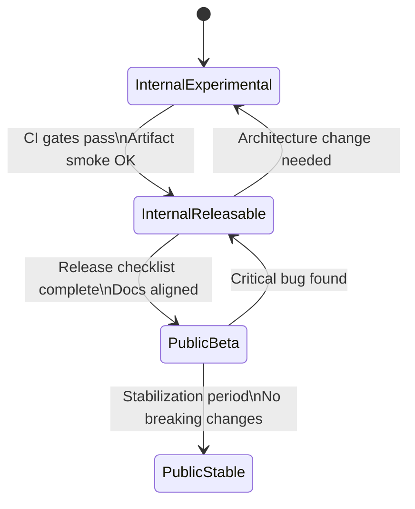

# Release Readiness State Machine

**Status:** Current
**Last updated:** 2026-08-30 21:00 EDT

This document defines the authoritative release-readiness states for
TalkBank's public-facing projects. Every release claim (in reviews, docs,
package metadata, or conversations) must reference one of these states.
Contradictory or informal readiness language ("almost ready", "basically
done", "should be releasable") is not acceptable, use the state name.

## States

```mermaid
stateDiagram-v2
    [*] --> InternalExperimental
    InternalExperimental --> InternalReleasable: CI gates pass\nArtifact smoke OK
    InternalReleasable --> PublicBeta: Release checklist complete\nDocs aligned
    PublicBeta --> PublicStable: Stabilization period\nNo breaking changes
    
    PublicBeta --> InternalReleasable: Critical bug found
    InternalReleasable --> InternalExperimental: Architecture change needed
```

### Internal Experimental

- Active development, architecture may change
- No stability promises
- Not suitable for external users
- CI may be incomplete

### Internal Releasable

- CI gates pass consistently
- Artifacts build and smoke-test correctly
- Internal team can use reliably
- Not yet documented/polished for external users

### Public Beta

- Release checklist complete
- Documentation aligned with actual capabilities
- External users can try it with expectation of rough edges
- Breaking changes possible but documented
- Preview/beta status in package metadata and installation docs

### Public Stable (1.0)

- Semver enforced
- Deprecation policy active
- Breaking changes only in major versions
- Stable status in package metadata and installation docs

## Current State

**batchalign3: Public Beta**

Evidence:

- CI gates pass (tests, typecheck, lint)
- Platform wheels embed the Rust CLI and are distributed through GitHub Releases
- The release workflow builds five wheels and performs clean-wheel CLI smokes
  on Linux, macOS, and Windows plus server-health smokes on Unix
- The Python/Rust runtime boundary, paid-evidence caches, offline replay, and
  debug evidence are documented preview surfaces
- The source lives in one Cargo workspace, so there is no floating cross-repo
  runtime dependency

Blockers to Public Stable:

- [ ] Public API/cache/evidence compatibility policy frozen for 1.0
- [ ] Supported platform tiers expanded and exercised continuously
- [ ] Code signing/notarization policy implemented where required
- [ ] Stabilization period with no breaking changes

**talkbank-tools Rust libraries: Internal Releasable**

Evidence:

- CI gates pass (clippy, tests, parser equivalence)
- Core crates (parser, model, transform, clan) well-tested

Blockers to Public Beta:

- [ ] Crates published to crates.io
- [ ] A separate crates.io release contract and end-to-end publication path
