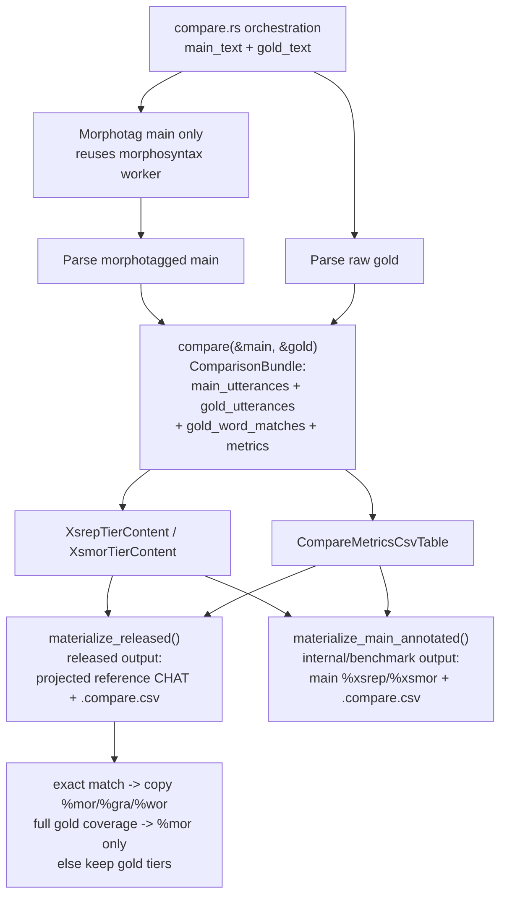

# Adding a New Command

**Status:** Current
**Last updated:** 2026-04-17 20:00 EDT

This guide walks through adding a new batchalign3 command end-to-end.

**Reference implementations by workflow family:**

| Family | Best example | Files to read |
|--------|-------------|---------------|
| `PerFileTransform` (one file → one output) | **`align`** | `commands/align.rs`, `runner/dispatch/fa_pipeline.rs` |
| `CrossFileBatchTransform` (batch-infer pool) | `morphotag` | `commands/morphotag.rs`, `runner/dispatch/infer_batched.rs` |
| `ReferenceProjection` (compare against gold) | `compare` | `commands/compare.rs`, `compare.rs` |
| `Composite` (orchestrates sub-workflows) | `benchmark` | `commands/benchmark.rs`, `runner/dispatch/benchmark_pipeline.rs` |

**Start with `align`** — it is still the simplest command-owned example. If
your command takes CHAT text in and produces modified CHAT out, follow `align`.
If your command needs to batch multiple files through one ML call, follow
`morphotag`.

## Quick start

```bash
make check    # after each file edit (~6s)
make test     # verify nothing broke (~6s)
```

## Architecture overview

Every command flows through these layers:

```
CLI args → CommandOptions → JobSubmission → Runner
        → shared family dispatch / worker pool → output materialization
```

The key files, in the order you'll edit them:

| Step | File | What you add |
|------|------|-------------|
| 1 | `batchalign-types/src/domain.rs` | `ReleasedCommand::YourCommand` variant |
| 2 | `batchalign/src/commands/your_command.rs` | `CommandDefinition` |
| 3 | `batchalign/src/commands/catalog.rs` and `commands/mod.rs` | Register/export the module |
| 4 | `batchalign/src/your_command.rs` or shared runner code | Core logic (ML dispatch, post-processing) |
| 5 | `batchalign/src/args/commands.rs` | CLI arg struct |
| 6 | `batchalign/src/args/mod.rs` | `CommandProfile` match arm |
| 7 | `batchalign/src/args/options.rs` | `CommandOptions` variant + `build_typed_options` arm |

## Step 1: Add the ReleasedCommand variant

```rust
// crates/batchalign-types/src/domain.rs
pub enum ReleasedCommand {
    // ... existing ...
    YourCommand,  // ← add here
}
```

Update the `ALL` array, `as_str()`, `TryFrom<&str>`, and `From<ReleasedCommand> for CommandName`.

## Step 2: Add the command-owned definition

```rust
// crates/batchalign/src/commands/your_command.rs
use crate::ReleasedCommand;
use crate::commands::spec::declare_batched_text_command;
use crate::worker::InferTask;

declare_batched_text_command!(
    YourCommandSpec,
    YOUR_COMMAND_DEFINITION,
    ReleasedCommand::YourCommand,
    InferTask::YourTask,
);
```

Then export the module from `commands/mod.rs` and add the definition to
`commands/catalog.rs`. Do **not** create a second registry layer; the
command-owned catalog is the source of truth for released command metadata.

Prefer the family declaration helpers over hand-writing
`CommandWorkflowDescriptor` or calling the lower-level `CommandDefinition`
constructors directly. The normal command-authoring contract is now:

- choose the nearest family helper once
- supply the released command name and any family-specific task/input knobs
- let the helper generate the canonical `CommandDefinition`

The lower-level descriptor fields are runtime metadata, not normal
contributor-facing authoring surface. If you find yourself reaching for
`RunnerDispatchKind` or `CommandCapabilityKind` in an ordinary new command, stop
and first ask whether one of the existing family helpers should grow to cover
your case.

### Which family helper should I use?

| Family helper | Use when | Example |
|---------------|----------|---------|
| `declare_batched_text_command!(...)` | Pool text files, batch-infer, fan out | `morphotag`, `utseg`, `translate`, `coref` |
| `declare_reference_projection_command!(...)` | Compare against a reference | `compare` |
| `declare_forced_alignment_command!(...)` | Forced alignment over transcript/media inputs | `align` |
| `declare_transcription_command!(...)` | ASR transcription to CHAT | `transcribe`, `transcribe_s` |
| `declare_media_analysis_command!(...)` | Media/audio feature extraction | `opensmile`, `avqi` |
| `declare_benchmark_command!(...)` | Composite benchmark orchestration | `benchmark` |

These helpers are backed by family-specific traits in
`crates/batchalign/src/commands/spec.rs`. They intentionally hide the
server-only routing details and the lower-level constructor calls. Command
authors should pick the semantic family that matches local/direct development;
server execution reuses the same definition and derives the runtime path later.

## Step 3: Implement the command-owned module

Create `crates/batchalign/src/commands/your_command.rs`.

**For a command that reuses an existing runner family**:

```rust
// commands/your_command.rs
use crate::ReleasedCommand;
use crate::commands::spec::declare_batched_text_command;
use crate::worker::InferTask;

declare_batched_text_command!(
    YourCommandSpec,
    YOUR_COMMAND_DEFINITION,
    ReleasedCommand::YourCommand,
    InferTask::YourTask,
);
```

That is now the normal case. For the currently shipped command families, the
shared runner dispatches directly from the `CommandDefinition`, so ordinary
command modules are usually just definitions plus any command-local domain code.
Only touch `runner/dispatch/*` when your command shape is genuinely new.

**If you truly need a new family**, add or extend the shared runner kernel and
keep the command module as the contributor-facing entrypoint:

```rust
use crate::pipeline::PipelineServices;
use crate::runner::{DispatchHostContext, RunnerJobSnapshot};
pub(crate) async fn run(
    job: &RunnerJobSnapshot,
    host: &DispatchHostContext,
    services: PipelineServices<'_>,
) {
    let Some(plan) = YourDispatchPlan::from_job(job, host.config()) else {
        return;
    };
    dispatch_your_family(job, host, services, plan).await;
}
```

See `commands/align.rs`, `commands/morphotag.rs`, and `commands/benchmark.rs`
for the current real examples.

### Direct-first development contract

When adding an ordinary command, assume:

- the command should run in direct mode on a laptop first
- the command should not need to know whether a server exists
- the command definition is the single source of truth
- server mode may derive a different execution host, but not a different command
  meaning

If your command truly needs server-specific behavior, make that an explicit
opt-in in shared runtime code rather than teaching every command author about
server internals.

If none of the current family helpers fit, that is a platform/runtime task: add
or extend one family trait/helper in `commands/spec.rs`, then wire the shared
runner family once. Ordinary command authors should not solve that by
hand-writing one-off runtime metadata.

## Step 4: Core logic

Create `crates/batchalign/src/your_command.rs` with the actual ML dispatch:

```rust
pub(crate) async fn run_your_command_impl(
    chat_text: &str,
    services: PipelineServices<'_>,
    params: &YourCommandParams<'_>,
) -> Result<String, ServerError> {
    // 1. Parse CHAT text
    // 2. Build infer request
    // 3. Dispatch to worker pool
    // 4. Post-process response
    // 5. Return modified CHAT text
}
```

See `morphosyntax.rs` or `translate.rs` for complete examples.

## Step 5: CLI args

Add to `crates/batchalign/src/args/commands.rs`:

```rust
#[derive(Args, Debug, Clone)]
pub struct YourCommandArgs {
    #[command(flatten)]
    pub common: CommonOpts,

    #[arg(long, default_value = "eng")]
    pub lang: String,

    // ... command-specific flags ...
}
```

Add to the `Commands` enum:

```rust
pub enum Commands {
    // ...
    YourCommand(YourCommandArgs),
}
```

## Step 6: Command profile

In `crates/batchalign/src/args/mod.rs`, add a match arm:

```rust
Commands::YourCommand(a) => CommandProfile {
    command: ReleasedCommand::YourCommand,
    lang: &a.lang,
    num_speakers: 1,
    extensions: &["cha"],
},
```

## Step 7: Typed options

In `crates/batchalign/src/types/options.rs`, add:

```rust
pub enum CommandOptions {
    // ...
    YourCommand(YourCommandOptions),
}
```

And in `crates/batchalign/src/args/options.rs`, add the `build_typed_options` arm.

## Step 8: Verify

```bash
make check          # compiles?
make test           # 1,273 tests still pass?
./target/debug/batchalign3 your-command --help   # CLI works?
```

## Python worker side

If your command needs a new ML model:

1. Add an `InferTask` variant in `crates/batchalign/src/worker/mod.rs`
2. Add a `WorkerProfile` mapping in `crates/batchalign/src/worker/registry.rs`
3. Implement the Python worker handler in `batchalign/worker/`

If reusing an existing model (e.g., Stanza for morphosyntax), you only need
to wire the Rust side — the worker already knows how to handle the infer task.

---

## Worked example: Compare (ReferenceProjection)

Compare is the most instructive example because it uses the `ReferenceProjection`
family — the workflow produces typed intermediate artifacts, then a swappable
`Materializer` turns them into the final output. This is how BA2's
`CompareEngine` + `CompareAnalysisEngine` pair maps to BA3 without falling back
to string-level projection or ad hoc string assembly at the serialization
boundary.

### BA2 Python → BA3 Rust mapping

| BA2 Python (`compare.py`) | BA3 Rust | File |
|---------------------------|----------|------|
| `_find_best_segment()` — bag-of-words window search | `batchalign::chat_ops::compare::find_best_segment` | same |
| `CompareEngine.process()` — local window alignment + token status | `batchalign::chat_ops::compare::compare()` | `batchalign/src/compare.rs` |
| `CompareAnalysisEngine.analyze()` — metrics CSV | `CompareMetricsCsvTable` / `format_metrics_csv()` via compare materializers | `batchalign/src/compare.rs` / `compare.rs` |
| gold document projection | `project_gold_structurally()` | `batchalign/src/compare.rs` |
| `Document` / `Utterance` / `Form` model | `ChatFile` AST + dependent tiers | `talkbank-model` / `batchalign` |
| CLI dispatch `morphosyntax -> compare -> compare_analysis` | `build_comparison_artifacts()` + released/main-annotated materializers | `compare.rs` |

### Architecture sketch



### Key types

```rust
// Intermediate artifacts — produced by build_comparison_artifacts(), consumed by materializer
struct ComparisonArtifacts {
    main_file: ChatFile,        // parsed morphotagged main
    gold_file: ChatFile,        // parsed gold
    bundle: ComparisonBundle,   // alignment + metrics from DP
}

struct ComparisonBundle {
    main_utterances: Vec<UtteranceComparison>,
    gold_utterances: Vec<UtteranceComparison>,
    gold_word_matches: Vec<GoldWordMatch>,
    metrics: CompareMetrics,
}

struct XsrepTierContent {
    items: Vec<CompareTierItem<CompareSurfaceToken>>,
}

struct XsmorTierContent {
    items: Vec<CompareTierItem<ComparePosLabel>>,
}

struct CompareMetricsCsvTable {
    rows: Vec<CompareMetricsCsvRow>,
}

struct CompareMaterializedOutputs {
    chat_output: String,
    metrics_csv: String,
}

struct MainAnnotatedCompareOutputs {
    annotated_main_chat: String,
    metrics_csv: String,
}
```

### How the BA2 `_find_best_segment()` + local DP maps

BA2's `CompareEngine.process()` does everything in one 250-line method:
extract words → conform → find windows → DP align → annotate gold → set timing.

BA3 splits this into layers:

1. **`batchalign::chat_ops::compare`** — pure functions, no ML, no IO:
   - `find_best_segment()` — same local-window idea as BA2
   - `compare(&main, &gold)` → `ComparisonBundle` with main/gold compare views,
     structural word matches, and metrics
   - `project_gold_structurally()` — AST-first gold projection
   - `XsrepTierContent` / `XsmorTierContent` — typed compare-tier models lowered
     once at the `UserDefinedDependentTier` boundary
   - `CompareMetricsCsvTable` / `format_metrics_csv()` — typed metrics rows
     serialized through the Rust `csv` crate

2. **`compare.rs`** — orchestration:
    - `build_comparison_artifacts()` — morphotag main only, parse gold raw, call `compare()`
    - `materialize_released()` — released compare output path
    - `materialize_main_annotated()` — internal benchmark/main output path

3. **`execution/`** — recipe-driven server integration (new model):
    - `dispatch_compare_job()` builds a `JobPlan` and runs `ExecutionKernel`
    - `CompareStageExecutor` handles recipe stages: plan work units, read
      inputs, morphosyntax, compare-align, materialize outputs
    - Resolves gold file from `*.gold.cha` companion via planner

### How to extend structural gold projection

The gold materializer is no longer a stub. Extend it by working with typed data:

1. Edit `project_gold_structurally()` in
   `batchalign/src/compare.rs`.
2. Use `ComparisonBundle.gold_word_matches` and AST accessors, not `%xsrep` /
   `%xsmor` strings, as the projection source.
3. Keep the current safety rules explicit: exact matches may copy `%mor` /
   `%gra` / `%wor`; full gold-word coverage may project `%mor`; partial `%gra` /
   `%wor` needs chunk-safe mapping before it is allowed.
4. Keep gold raw during artifact construction unless the reference file already
   contains tiers you are intentionally preserving.

### Serialization rule

When a workflow emits structured artifacts, add explicit pre-serialization
types before you add serializer code.

- New semantic strings must get newtypes.
- CHAT tier content should be written from typed models via `WriteChat`.
- CSV outputs should be written from typed row/table models via `csv`.
- Do not drive semantics from `format!`, `join`, `split`, or regex surgery over
  already serialized output.

### Files to read (in order)

1. `crates/batchalign/src/compare.rs` — compare core + structural projection
2. `crates/batchalign/src/compare.rs` — orchestration + materializers
3. `crates/batchalign/src/execution/` — recipe-driven dispatch (replaces old `compare_pipeline.rs`)
4. `crates/batchalign/src/planning/` — `build_job_plan()` for typed execution plans
5. `book/src/migration/ba2-compare-migration.md` — BA2-master compare to BA3 map
6. BA2 reference: `~/batchalign2-master/batchalign/pipelines/analysis/compare.py`
