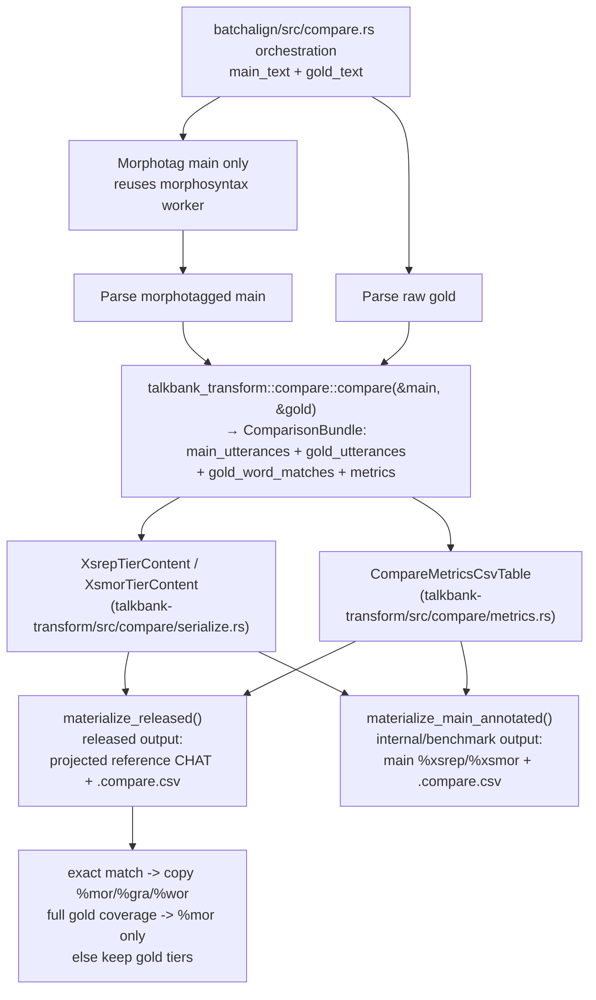

# Adding a New Command

**Status:** Current
**Last updated:** 2026-07-29 18:41 EDT

This guide walks through adding a new batchalign3 command end-to-end.

**Reference implementations by workflow family:**

Commands are DECLARED, not authored: there is no per-command module. Each is
one `CatalogEntry` in `recipe_runner/catalog.rs` naming a `Recipe` in
`recipe_runner/recipes.rs`. Read the nearest existing entry and its recipe.

| `CommandFamily` | Best example | What to read |
|--------|-------------|---------------|
| `AudioSequential` (one media file at a time) | **`align`** | `ALIGN_RECIPE`, `runner/dispatch/fa_pipeline.rs` |
| `BatchedText` (pooled batch-infer) | `morphotag` | `MORPHOTAG_RECIPE`, `runner/dispatch/infer_batched.rs` |
| `ReferenceProjection` (compare against gold) | `compare` | `COMPARE_RECIPE`, `compare.rs` |
| `MediaAnalysis` (non-CHAT artifact out) | `opensmile` | `OPENSMILE_RECIPE`, `runner/dispatch/media_analysis_v2.rs` |
| `Composite` (reuses other recipes) | `benchmark` | `BENCHMARK_RECIPE`, `runner/dispatch/benchmark_pipeline.rs` |

**Start with `align`** if your command takes CHAT in and produces modified CHAT
out; **`morphotag`** if it batches several files through one ML call.

**History, so the old shape is not rebuilt by accident.** Until 2026-07-28
there was a `commands/` module holding one module per command, six
`declare_*_command!` macros, six marker traits and a `CommandDefinition` type.
Removing an `#![allow(dead_code)]` showed the whole layer produced values
nothing read, and it was deleted (`b610a885`). The remaining catalog of one-line
delegations and the compatibility view types followed on 2026-07-29. Earlier
revisions of this guide walked contributors through that layer; if you find
advice elsewhere in the book telling you to write `commands/your_command.rs`,
it is stale, and this page is the current procedure.

## Quick start

```bash
make check    # after each file edit (~6s)
make test     # verify nothing broke (~6s)
```

## Architecture overview

Every command flows through these layers:

```text
CLI args → CommandOptions → JobSubmission → Runner
        → shared family dispatch / worker pool → output materialization
```

The key files, in the order you'll edit them:

| Step | File | What you add |
|------|------|-------------|
| 1 | `batchalign-types/src/domain.rs` | `ReleasedCommand::YourCommand` variant |
| 2 | `batchalign/src/recipe_runner/recipes.rs` | `YOUR_COMMAND_RECIPE`: the ordered stages |
| 3 | `batchalign/src/recipe_runner/catalog.rs` | one `CatalogEntry` declaring every field |
| 4 | `batchalign/src/your_command.rs` or shared runner code | Core logic (ML dispatch, post-processing) |
| 5 | `batchalign/src/cli/args/commands.rs` | CLI arg struct |
| 6 | `batchalign/src/cli/args/mod.rs` | `CommandProfile` match arm |
| 7 | `batchalign/src/cli/args/options.rs` | `CommandOptions` variant + `build_typed_options` arm |

Steps 2 and 3 are the whole registration story. Three tests fail until they are
done, each naming what is missing: `every_released_command_has_a_spec` (no
entry), `per_command_metadata_is_stable` and `declared_output_naming_is_stable`
(entry present, metadata not stated).

## Step 1: Add the ReleasedCommand variant

```rust
// crates/batchalign-types/src/domain.rs
pub enum ReleasedCommand {
    // ... existing ...
    YourCommand,  // ← add here
}
```

Update the `ALL` array, `as_str()`, `TryFrom<&str>`, and `From<ReleasedCommand> for CommandName`.

## Step 2: Add the stage recipe

A `Recipe` is the ordered list of stages the runtime executes, each stage naming
its own prerequisites. Add it to `crates/batchalign/src/recipe_runner/recipes.rs`
next to the existing twelve, then read the nearest one in full: stage ordering is
validated (`Recipe::validate`), so a missing prerequisite is a failing test
rather than a runtime surprise.

```rust,ignore
pub(super) const YOUR_COMMAND_RECIPE: Recipe = Recipe {
    mode: ExecutionMode::BatchedStage,
    stages: &[
        RecipeStage::new(
            RecipeStageId::PlanWorkUnits,
            RecipeStagePresence::Required,
            StageExecutionKind::PerWorkUnit,
            FileStage::Reading,
            &[],
        ),
        // ... your stages, each listing the stages it depends on ...
    ],
};
```

`mode` must equal the `execution_mode` you declare in step 3; a catalog test
enforces the pair.

## Step 3: Declare the catalog entry

One `CatalogEntry` in `crates/batchalign/src/recipe_runner/catalog.rs`. This is
the ONLY place a released command is registered.

```rust,ignore
CatalogEntry {
    command: ReleasedCommand::YourCommand,
    family: CommandFamily::BatchedText,
    planner: PlannerKind::TextInputs,
    execution_mode: ExecutionMode::BatchedStage,
    capability_kind: CommandCapabilityKind::DirectInfer,
    io_profile: CommandIoProfile::PathsModeText,
    runner_dispatch_kind: RunnerDispatchKind::BatchedTextInfer,
    capabilities: CapabilityPlan {
        primary_infer_task: InferTask::YourTask,
        additional_infer_tasks: &[],
        surface: CapabilitySurface::RecipeOwned,
    },
    output_policy: OutputPolicy {
        primary: FileNamingPolicy::PreserveInput,
        primary_content_type: ContentType::Chat,
        sidecars: NO_SIDECARS,
    },
    recipe: &YOUR_COMMAND_RECIPE,
},
```

**Every field is stated; none is inferred.** Until 2026-07-29 three of them
(`capability_kind`, `io_profile`, `runner_dispatch_kind`) were computed by
matching on the command name with a catch-all `_ =>` default, so a new command
silently inherited answers nobody had chosen: a text io profile and the
batched-text dispatch path, surfacing later as "cannot reach the audio" at run
time. Declaring them means the compiler asks you the question.

**`family` is the one field with reach.** It implies eight runtime policies
(scheduling, model sharing, batching, parallelism, resource lane,
constrained-host behaviour, warmup eligibility, and the workflow family) through
`const fn`s on `CommandFamily`. Pick the family whose implications you want, and
read those methods in `recipe_runner/command_spec.rs` before choosing; do not
pick by name resemblance.

**Position in the table is a user-visible contract.** `COMMAND_SPECS` order is
the order `/health` advertises capabilities in, and the dashboard renders. Insert
your entry where you want it to appear, next to its family's siblings.

If none of the five families fits, that is a platform task, not a command task:
extend `CommandFamily` and its eight derivations once (the compiler will list
every match arm needing an answer), then declare your command against the new
family.

### Direct-first development contract

When adding an ordinary command, assume:

- the command should run in direct mode on a laptop first
- the command should not need to know whether a server exists
- the catalog entry is the single source of truth
- server mode may derive a different execution host, but not a different command
  meaning

If your command truly needs server-specific behavior, make that an explicit
opt-in in shared runtime code rather than teaching every command author about
server internals.

## Step 4: Core logic

Create `crates/batchalign/src/your_command.rs` with the actual ML dispatch:

```rust,ignore
pub(crate) async fn run_your_command_impl(
    chat_text: &str,
    services: PipelineServices<'_>,
    params: &YourCommandParams<'_>,
) -> Result<String, ServerError> {
    // 1. Parse CHAT text
    // 2. Build infer request
    // 3. Dispatch to worker pool
    // 4. Post-process response
    // 5. Return modified CHAT text
}
```

See `crates/batchalign/src/morphosyntax/` (directory module) or `crates/batchalign/src/translate.rs` (single-file module) for complete examples.

## Step 5: CLI args

Add to `crates/batchalign/src/cli/args/commands.rs`:

```rust,ignore
#[derive(Args, Debug, Clone)]
pub struct YourCommandArgs {
    #[command(flatten)]
    pub common: CommonOpts,

    #[arg(long, default_value = "eng")]
    pub lang: String,

    // ... command-specific flags ...
}
```

Add to the `Commands` enum:

```rust,ignore
pub enum Commands {
    // ...
    YourCommand(YourCommandArgs),
}
```

## Step 6: Command profile

In `crates/batchalign/src/cli/args/mod.rs`, add a match arm:

```rust,ignore
Commands::YourCommand(a) => CommandProfile {
    command: ReleasedCommand::YourCommand,
    lang: &a.lang,
    num_speakers: 1,
    extensions: &["cha"],
},
```

## Step 7: Typed options

In `crates/batchalign/src/types/options.rs`, add:

```rust,ignore
pub enum CommandOptions {
    // ...
    YourCommand(YourCommandOptions),
}
```

And in `crates/batchalign/src/cli/args/options.rs`, add the `build_typed_options` arm.

## Step 8: Verify

```bash
cargo test -p batchalign                         # the whole crate suite
./target/debug/batchalign3 your-command --help    # CLI works?
```

A test count is deliberately not quoted here: the previous revision promised
"1,273 tests" long after the real number had moved past 1,750, which teaches a
contributor to distrust the page.

## Python worker side

If your command needs a new ML model:

1. Add an `InferTask` variant (`crates/batchalign-types/src/worker.rs`) and its
   stable snake_case label in `worker/target.rs::task_name`
2. Add a `WorkerProfile` mapping in `crates/batchalign/src/worker/registry.rs`
3. Implement the Python worker handler in `batchalign/worker/`

If reusing an existing model (e.g., Stanza for morphosyntax), you only need
to wire the Rust side, the worker already knows how to handle the infer task.

---

## Worked example: Compare (ReferenceProjection)

Compare is the most instructive example because it uses the `ReferenceProjection`
family, the workflow produces typed intermediate artifacts, then a swappable
`Materializer` turns them into the final output. This is how BA2's
`CompareEngine` + `CompareAnalysisEngine` pair maps to BA3 without falling back
to string-level projection or ad hoc string assembly at the serialization
boundary.

### BA2 Python → BA3 Rust mapping

| BA2 Python (`compare.py`) | BA3 Rust | File |
|---------------------------|----------|------|
| `_find_best_segment()`: bag-of-words window search | `talkbank_transform::compare::find_best_segment` | `crates/batchalign-transform/src/compare/engine.rs:72` |
| `CompareEngine.process()`: local window alignment + token status | `talkbank_transform::compare::compare()` | `crates/batchalign-transform/src/compare/engine.rs:173` |
| `CompareAnalysisEngine.analyze()`: metrics CSV | `CompareMetricsCsvTable` / `CompareMetricsCsvRow` | `crates/batchalign-transform/src/compare/metrics.rs:8,103` |
| gold document projection | `project_gold_structurally()` | `crates/batchalign-transform/src/compare/materialize.rs:209` |
| compare data model (bundle, utterances, metrics, word matches) | `ComparisonBundle` / `UtteranceComparison` / `CompareMetrics` / `GoldWordMatch` | `crates/batchalign-transform/src/compare/model.rs:75,27,38,92` |
| tier serialization models | `XsrepTierContent` / `XsmorTierContent` | `crates/batchalign-transform/src/compare/serialize.rs:186,228` |
| `Document` / `Utterance` / `Form` model | `ChatFile` AST + dependent tiers | `talkbank-model` |
| CLI dispatch `morphosyntax -> compare -> compare_analysis` | `build_comparison_artifacts()` + released/main-annotated materializers | `crates/batchalign/src/compare.rs` (orchestrator) |

### Architecture sketch


```mermaid
flowchart TD
    request["batchalign/src/compare.rs orchestration\nmain_text + gold_text"] --> morph["Morphotag main only\nreuses morphosyntax worker"]
    request --> gold["Parse raw gold"]
    morph --> main["Parse morphotagged main"]
    main --> bundle["talkbank_transform::compare::compare(&main, &gold)\n→ ComparisonBundle:\nmain_utterances + gold_utterances\n+ gold_word_matches + metrics"]
    gold --> bundle
    bundle --> tiers["XsrepTierContent / XsmorTierContent\n(talkbank-transform/src/compare/serialize.rs)"]
    bundle --> csv["CompareMetricsCsvTable\n(talkbank-transform/src/compare/metrics.rs)"]
    tiers --> released["materialize_released()\nreleased output:\nprojected reference CHAT + .compare.csv"]
    tiers --> main_view["materialize_main_annotated()\ninternal/benchmark output:\nmain %xsrep/%xsmor + .compare.csv"]
    csv --> released
    csv --> main_view
    released --> safety["exact match -> copy %mor/%gra/%wor\nfull gold coverage -> %mor only\nelse keep gold tiers"]
```

### Key types

```text
// Intermediate artifacts: produced by build_comparison_artifacts(), consumed by materializer
struct ComparisonArtifacts {
    main_file: ChatFile,        // parsed morphotagged main
    gold_file: ChatFile,        // parsed gold
    bundle: ComparisonBundle,   // alignment + metrics from DP
}

struct ComparisonBundle {
    main_utterances: Vec<UtteranceComparison>,
    gold_utterances: Vec<UtteranceComparison>,
    gold_word_matches: Vec<GoldWordMatch>,
    metrics: CompareMetrics,
}

struct XsrepTierContent {
    items: Vec<CompareTierItem<CompareSurfaceToken>>,
}

struct XsmorTierContent {
    items: Vec<CompareTierItem<ComparePosLabel>>,
}

struct CompareMetricsCsvTable {
    rows: Vec<CompareMetricsCsvRow>,
}

struct CompareMaterializedOutputs {
    chat_output: String,
    metrics_csv: String,
}

struct MainAnnotatedCompareOutputs {
    annotated_main_chat: String,
    metrics_csv: String,
}
```

### How the BA2 `_find_best_segment()` + local DP maps

BA2's `CompareEngine.process()` does everything in one 250-line method:
extract words → conform → find windows → DP align → annotate gold → set timing.

BA3 splits this into layers:

1. **`talkbank_transform::compare`** (`crates/batchalign-transform/src/compare/`): pure functions, no ML, no IO:
   - `find_best_segment()` (`engine.rs:72`), same local-window idea as BA2
   - `compare(&main, &gold)` (`engine.rs:173`) → `ComparisonBundle` with main/gold compare views,
     structural word matches, and metrics
   - `project_gold_structurally()` (`materialize.rs:209`), AST-first gold projection
   - `XsrepTierContent` / `XsmorTierContent` (`serialize.rs:186,228`), typed compare-tier models lowered
     once at the `UserDefinedDependentTier` boundary
   - `CompareMetricsCsvTable` / `CompareMetricsCsvRow` (`metrics.rs:8,103`), typed metrics rows
     serialized through the Rust `csv` crate

2. **`crates/batchalign/src/compare.rs`**: orchestration:
    - `build_comparison_artifacts()`: morphotag main only, parse gold raw, call `compare()`
    - `materialize_released()`: released compare output path
    - `materialize_main_annotated()`: internal benchmark/main output path

3. **`execution/`**: recipe-driven server integration (new model):
    - `dispatch_compare_job()` builds a `JobPlan` and runs `ExecutionKernel`
    - `CompareStageExecutor` handles recipe stages: plan work units, read
      inputs, morphosyntax, compare-align, materialize outputs
    - Resolves gold file from `*.gold.cha` companion via planner

### How to extend structural gold projection

The gold materializer is no longer a stub. Extend it by working with typed data:

1. Edit `project_gold_structurally()` in
   `crates/batchalign-transform/src/compare/materialize.rs:209` (the
   actual implementation; `crates/batchalign/src/compare.rs:27,140`
   only re-exports and calls it).
2. Use `ComparisonBundle.gold_word_matches` and AST accessors, not `%xsrep` /
   `%xsmor` strings, as the projection source.
3. Keep the current safety rules explicit: exact matches may copy `%mor` /
   `%gra` / `%wor`; full gold-word coverage may project `%mor`; partial `%gra` /
   `%wor` needs chunk-safe mapping before it is allowed.
4. Keep gold raw during artifact construction unless the reference file already
   contains tiers you are intentionally preserving.

### Serialization rule

When a workflow emits structured artifacts, add explicit pre-serialization
types before you add serializer code.

- New semantic strings must get newtypes.
- CHAT tier content should be written from typed models via `WriteChat`.
- CSV outputs should be written from typed row/table models via `csv`.
- Do not drive semantics from `format!`, `join`, `split`, or regex surgery over
  already serialized output.

### Files to read (in order)

1. `crates/batchalign-transform/src/compare/`: compare core (engine.rs, model.rs, materialize.rs, serialize.rs, metrics.rs)
2. `crates/batchalign/src/compare.rs`: orchestration + materializers
3. `crates/batchalign/src/execution/`: recipe-driven dispatch (replaces old `compare_pipeline.rs`)
4. `crates/batchalign/src/planning/`: `build_job_plan()` for typed execution plans
5. `book/src/batchalign/migration/ba2-compare-migration.md`: BA2-master compare to BA3 map
6. BA2 reference: archived in the maintainers' BA2 working copy (see migration docs for location)
