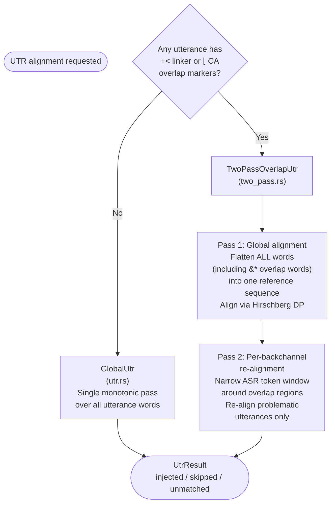

# Overlap-Aware Alignment Improvements

**Status:** Current
**Last updated:** 2026-05-19 22:37 EDT

This page documents overlap-aware alignment improvements: what is shipped
and known limitations.

## Shipped Features

The following features are **live in production** as defaults. They are not
behind experimental flags — any `batchalign3 align` run on a file with overlaps
uses them automatically.

| Feature | Default | CLI override |
|---------|---------|-------------|
| Two-pass overlap UTR | **Gated** — requires `--utr-strategy two-pass` | `--utr-strategy two-pass` to enable |
| Fuzzy word matching (Jaro-Winkler) | Threshold 0.85 | `--utr-fuzzy 1.0` for exact-only |
| CA marker window narrowing | Enabled (when two-pass active) | `--utr-ca-markers disabled` |
| Density-aware fallback | 30% threshold | `--utr-density-threshold` |
| Tight buffer for pass-2 | 500ms | `--utr-tight-buffer` |
| End-time overlap clamping | Always on | N/A |
| %wor suppression for CA | Auto when `@Options: CA` | `--nowor` for non-CA |

**Defaults were tuned on:** SBCSAE, Jefferson NB, TaiwanHakka, APROCSA.

**Two-pass is opt-in.** The two-pass UTR strategy is gated behind
`--utr-strategy two-pass` because it can regress alignment on certain
inputs (CA transcripts with two timestamps on a main line; transcripts
with substantial overlap between consecutive utterances). `Auto` always
selects `GlobalUtr`.

**End-time overlap clamping:** `enforce_monotonicity()` clamps utterance
N's end to utterance N+1's start, eliminating the systematic overlap
that UTR's independent per-utterance token range assignment can produce.

**CA %wor suppression:** `@Options: CA` files automatically skip %wor
generation — CA prosodic notation cannot be represented in %wor.

---

This page also evaluates *further* improvements to UTR alignment for transcripts
with dense overlapping speech (`&*` markers) and heavily restructured transcripts.

## Why This Matters

The cost of alignment failure is not abstract.  Every untimed utterance that
the aligner could have gotten right but didn't becomes manual labor: a human
must listen to the audio, locate the utterance, and fix the bullet by hand.
For overlap-heavy corpora (aphasia protocols, conversation analysis, any
multi-party recording), this can mean hours per file.  Even a small
improvement in coverage — 5-10% fewer untimed utterances — translates
directly into saved human effort on the last mile of correction.

This makes alignment quality a high-leverage investment.  The algorithms
don't need to be perfect; they need to be measurably better, and the
improvement needs to be validated empirically on real data.

## Strategy Selection and Two-Pass Architecture

The UTR strategy is selected based on the file's overlap markers. The
following diagram shows the selection logic and the two-pass approach.



Source: `select_strategy()` in
`crates/batchalign/src/chat_ops/fa/utr.rs:116`, overlap detection in
`chat_ops/fa/utr/overlap_markers.rs`, two-pass logic in
`chat_ops/fa/utr/two_pass.rs`.

## Problem Statement

The UTR global DP aligner is monotonic: it assumes that words later in the
transcript correspond to words later in the audio.  Two things break this
assumption:

1. **`&*` markers** embed one speaker's words inside another's utterance,
   creating text positions that don't match audio positions.
2. **Transcript restructuring** — splitting run-on ASR utterances, adding
   speakers, reattributing speech — creates a word sequence that diverges
   from the ASR's word sequence in ways that go beyond `&*`.

In the worst documented case (2265_T4 from APROCSA), 36.5% of utterances
lost timing (232 of 636).

See [Monotonicity Invariant](../reference/forced-alignment.md#monotonicity-invariant)
for the user-facing explanation and
[Known DP Failure Modes](../../architecture/parser-and-grammar/dynamic-programming.md#known-dp-failure-modes)
for the theoretical context.

## What We Don't Know Yet

**We do not have empirical data on which failure source dominates.**  The
estimates in this document are architectural reasoning, not measurements.
Before committing to either approach, we need the simulation experiment
described in [Empirical Validation](#empirical-validation-before-building).

Key unknowns:

- In the 2265_T4 file, only 15 of 232 untimed utterances actually contain
  `&*` markers (6.5%).  The untimed blocks are dominated by rapid
  multi-speaker turn-taking (16 speaker transitions in 23 utterances).
  This suggests transcript restructuring — not `&*` — is the primary cause
  in this file.

- We do not know whether per-speaker word order matches audio order after
  restructuring.  If a user moved PAR utterances around (not just added
  `&*` markers), even per-speaker DP would see divergence.

- The 2-speaker experiment (reassigning REL1/REL2 to INV) produced
  identical results.  This proves extra speakers aren't the issue, but it
  doesn't distinguish between `&*` pollution and turn-order divergence as
  the root cause.

- Of the 271 files on the no-align exclusion list, 249 are from
  Fridriksson-2 (which may have different failure patterns than APROCSA).
  We haven't characterized why those files fail.

## Two Sources of Failure

### Source 1: `&*` words pollute the reference sequence

The current `flatten_words()` includes `&*`-embedded words in the reference
sequence.  These words belong to a different speaker and appear at different
temporal positions in the ASR output.  The DP tries to match them, consumes
ASR tokens at wrong positions, and desynchronizes subsequent matches.

**Fixable by stripping `&*` words from the DP reference.**

### Source 2: Transcript structure diverges from ASR structure

When a reviewer splits a run-on ASR utterance into three turns, adds new
speakers, and reattributes speech, the resulting word sequence diverges from
what fresh ASR produces — even with `&*` words stripped.  The DP must align
two genuinely different word sequences (the edited transcript vs. fresh ASR),
and the cumulative divergence across hundreds of utterances causes sync loss
in dense regions.

**Not fixable within a single-stream monotonic framework.**  Requires
per-speaker separation (Approach 2) or a fundamentally different alignment
strategy.

## Empirical Validation Before Building

**Do this before writing any production code.**

### Simulation: per-speaker coverage without per-speaker UTR

The key question for per-speaker UTR is: *within each speaker's stream,
does the word order match the audio order?*  We can test this cheaply:

1. Take the 2265_T4 input file (636 utterances, 4 speakers).
2. Produce 4 single-speaker CHAT files (one per speaker, same audio).
3. Run existing `align` on each single-speaker file against the full audio.
4. Measure timed-utterance coverage per speaker.
5. Sum across speakers and compare to the 63.5% global coverage.

If per-speaker coverage is dramatically better (e.g., 85-90%), per-speaker
UTR is worth building.  If it's similar to 63.5%, the problem is
within-speaker divergence and per-speaker UTR won't help either.

This is a few hours of manual work, not an engineering project.  It should
be done on at least 3-4 files: 2265_T4, 2420_T3 (72 `&*` markers),
2463_T2 (82 `&*` markers), and one Fridriksson-2 file from the no-align
list.

### Fuzzing: alignment degradation curves

Programmatically generate variants of a known-good aligned CHAT file by
applying controlled perturbations:

- **Utterance reordering:** Swap adjacent utterances, swap across speakers,
  move utterances to random positions.
- **`&*` injection:** Insert synthetic `&*` markers at random positions.
- **Turn splitting:** Split one utterance into two at a random word boundary.
- **Turn merging:** Merge two consecutive same-speaker utterances.
- **Speaker reattribution:** Change the speaker code on random utterances.

Run `align` on each variant and measure coverage.  Plot coverage as a
function of perturbation intensity.  This gives a **degradation curve** that
tells us:

- How robust the current aligner is to each type of perturbation.
- Which perturbation types cause the steepest degradation.
- Whether backbone extraction or per-speaker UTR flattens the curve.

The fuzzer can reuse APROCSA files (which have audio) as base documents.
Each variant preserves the same audio, so alignment infrastructure works
unchanged.

### Curated multi-version transcripts

The gold standard: multiple independent human transcriptions of the same
recording, each with different editorial choices about turn boundaries,
overlap annotation, and speaker attribution.  Running `align` on all
versions measures how sensitive the pipeline is to transcriber style.

This is more expensive (requires human effort) but APROCSA may already
have partially independent versions: the raw ASR output, a user's review,
and potentially a second reviewer's version.

## Approach 1: Backchannel-Aware Backbone Extraction

### What it does

Before building the UTR reference sequence, strip all `&*`-embedded segments
from each utterance.  The stripped words are recorded for later interpolation
but excluded from the DP alignment.

```text
Original utterance:
*PAR:  I'm hoping to play here &*INV:yeah in a month or two .

Backbone for DP:
  I'm hoping to play here in a month or two

Stripped (recorded, not matched):
  yeah  (from &*INV, position: after "here", utterance index: 37)
```

The stripping operates at the AST level using the existing `&*` structure in
`UtteranceContent::OverlappingSpeech`.  No text parsing or regex is needed.

After backbone alignment, stripped segments get timing via bracketed
interpolation (from neighboring backbone words) or optional ASR
cross-reference.

### What it fixes

- Eliminates `&*` words as a source of DP desync.
- For files where `&*` is the primary divergence (moderate overlap, no heavy
  restructuring), this may recover most or all untimed utterances.
- For short isolated backchannels ("mhm", "yeah"), prevents a single
  misplaced word from cascading into a multi-utterance sync loss.

### What it does not fix

- Does not help when transcript restructuring (split/merge/reattribute) is
  the dominant divergence.  In the 2265_T4 case, the backbone word sequences
  still diverge substantially from fresh ASR because a user reorganized turns,
  not just because of `&*` markers.
- Even after stripping, the ASR output still contains the `&*` speakers' words
  as unmatched noise.  For isolated cases the DP skips them as insertions.
  For dense overlap (30% of utterances with `&*`, many multi-`&*` utterances)
  the cumulative unmatched ASR words shift the alignment cost landscape enough
  to cause sync loss in the worst regions.

### Impact estimates (unvalidated)

These are architectural guesses.  The simulation experiment above must
validate them before we rely on them.

| File type | Current untimed | After backbone extraction |
|-----------|----------------|--------------------------|
| Moderate `&*`, no restructuring | 5-15% | ~0-5% (good recovery) |
| Dense `&*`, no restructuring | 15-25% | ~5-15% (meaningful improvement) |
| Dense `&*` + heavy restructuring (2265_T4 class) | 35%+ | ~25-30% (modest improvement) |
| No `&*` markers | 0-5% | Identical (no-op) |

### Implementation

The change is entirely within UTR
(`crates/batchalign/src/chat_ops/fa/utr.rs`) and its caller in
`crates/batchalign/src/chat_ops/fa/orchestrate.rs`. No FA changes
are needed.

```rust
/// A word excluded from the DP reference sequence because it belongs
/// to an &* overlapping speech segment.
struct StrippedOverlapWord {
    /// Index of the utterance this word belongs to.
    utterance_idx: usize,
    /// Position within the utterance's word list (so we can reinsert timing).
    word_position: usize,
    /// The word text (for optional ASR cross-reference).
    text: String,
    /// Speaker of the &* segment (e.g., "INV").
    overlap_speaker: String,
}

/// Result of the stripping phase.
struct BackboneExtraction {
    /// Backbone words in text order (input to DP).
    backbone_words: Vec<String>,
    /// Mapping from backbone word index to (utterance_idx, word_position).
    backbone_provenance: Vec<(usize, usize)>,
    /// Stripped overlap words, for post-DP interpolation.
    stripped: Vec<StrippedOverlapWord>,
}
```

The content walker (`for_each_leaf` with domain `None`) already traverses
`OverlappingSpeech` nodes.  Stripping is a read-only partition — the AST is
not modified.

Interpolation for stripped segments:

```text
start = backbone_word[i].end_ms
end   = backbone_word[i+1].start_ms
```

If the gap is large enough (>100ms) and the ASR cross-reference finds a match
within that window, the ASR timestamp is used instead.  ASR cross-reference is
optional and can be deferred.

Backward-compatible: files without `&*` markers produce identical backbone
sequences and behave identically to today.

## Approach 2: Per-Speaker UTR

### What it does

Instead of aligning one interleaved reference sequence against one interleaved
ASR sequence, run ASR separately per speaker channel (using diarization
boundaries) and match each speaker's utterances against only that speaker's
ASR stream.

A full per-speaker UTR implementation is not currently shipped.

### Why this should be the correct solution

The fundamental problem is that the DP aligns two interleaved multi-speaker
sequences.  When the interleaving order differs between transcript and ASR
(which is guaranteed for restructured transcripts), a monotonic aligner
cannot represent the crossing.

Per-speaker alignment eliminates the interleaving entirely.  Each speaker's
words are in temporal order within their own stream.  There is no crossing to
represent.

**However:** we have not validated that within-speaker word order is preserved
after transcript restructuring.  If a user reordered PAR's utterances
(not just added `&*` markers), even per-speaker DP would see divergence.
The simulation experiment must answer this question.

### Impact estimates (unvalidated)

| File type | Current untimed | After per-speaker UTR |
|-----------|----------------|----------------------|
| Moderate `&*`, no restructuring | 5-15% | ~0-2% |
| Dense `&*`, no restructuring | 15-25% | ~0-5% |
| Dense `&*` + heavy restructuring (2265_T4 class) | 35%+ | ~5-10% (if within-speaker order is preserved) |
| No `&*` markers | 0-5% | ~0-2% (slight improvement from cleaner per-speaker matching) |

The remaining untimed percentage comes from cases where diarization
boundaries are wrong (speaker confusion) or where the ASR itself fails
(very short utterances, heavy noise).  **These estimates assume that
within-speaker word order matches audio order, which is unverified.**

### What it does not fix

- Files where diarization is unreliable (very similar voices, heavy
  cross-talk where speakers talk simultaneously for extended periods).
- Files where the transcript attributes speech to speakers the diarization
  model cannot distinguish.
- Within-speaker reordering (if it exists in real transcripts).
- The cost: N speaker channels x ASR calls instead of 1.  For a 4-speaker
  file this is roughly 4x the ASR compute.  Caching mitigates repeat runs.

## Recommendation

**What shipped (two-pass + fuzzy) is the low-hanging fruit. Further
improvements require empirical validation before building.**

The two-pass overlap strategy and fuzzy matching are already live (see
[Shipped Features](#shipped-features) above). The
remaining proposals below address the harder cases — dense `&*` markers
and heavy transcript restructuring — where two-pass alone is insufficient.

### Step 0: Simulation experiment (before any further code)

Run the per-speaker coverage simulation on 4+ files.  This takes hours, not
days, and tells us whether per-speaker UTR is worth the ~500-800 line
investment.  Also characterize the 249 Fridriksson-2 files on the no-align
list — they may have entirely different failure patterns.

### Step 1: Backbone extraction (only if simulation shows `&*` matters)

If the simulation shows that `&*` stripping alone improves coverage on some
file class, build it.  ~100-150 lines of Rust, zero regression risk.

### Step 2: Per-speaker UTR (only if simulation shows per-speaker helps)

If per-speaker single-speaker files show dramatically better coverage than
the global run, build the full per-speaker UTR pipeline.  Gate behind
`--per-speaker-utr` flag initially.

### Step 3: Fuzzing harness (regardless)

Build the alignment fuzzer to generate degradation curves.  This is valuable
independent of which approach we build — it gives us a regression test suite
for any future alignment changes, and it characterizes the robustness of the
current system.  The fuzzer can be reused to validate any future algorithm
changes.

### What we should not do

- **Non-monotonic local alignment.**  Custom alignment algorithms are
  research projects, not engineering tasks.  The benefit over per-speaker
  UTR is marginal and the implementation/testing cost is much higher.

- **Accept non-monotonic bullets.**  Relaxing E362 would require changes to
  CLAN's player and every downstream tool that assumes monotonic seeking.
  The ecosystem cost is prohibitive.

- **Build without measuring.**  The estimates in this document are guesses.
  Shipping code based on architectural reasoning alone risks building
  something that doesn't actually help the files users complain about.

- **Nothing.**  The current behavior is defensible (no corruption, only
  coverage loss) but the user experience is poor for overlap-heavy files.
  Users who invest hours hand-editing a transcript and then lose a third of
  their timing have a legitimate complaint.  Even small improvements in
  coverage save real human time on the last mile of manual correction.

## Relationship to other approaches

- **Trouble-window alignment** (a complementary unimplemented design):
  trouble-window would address the re-run workflow (preserve existing
  timing, realign only changed regions). These proposals address
  initial alignment quality for overlap-heavy files; both can coexist.

- **Per-speaker UTR** (the unimplemented detailed plan for Approach 2):
  backbone extraction composes with it — strip `&*` from per-speaker
  references.

- **`align --before`:** Already implemented. Preserves timing for
  unmodified utterances during re-runs. Helps with the re-edit
  workflow but does not improve initial alignment of a restructured
  transcript.

## Test Strategy

- **Simulation first:** Per-speaker coverage on real files, before any
  production code.

- **Fuzzing:** Alignment degradation curves on controlled perturbations.
  Reusable as a regression suite for any future alignment changes.

- **Unit tests:** Synthetic CHAT files with known `&*` patterns, verifying
  backbone extraction and interpolation.

- **Golden tests:** Run on existing golden test files and verify no
  regression.  Update golden expectations where coverage improves.

- **Corpus-level validation:** Run on APROCSA and other overlap-heavy
  corpora from aphasia-data.  Report timed-utterance percentage before and
  after, broken down by file overlap density.  No hand-waving: if the
  numbers don't improve meaningfully, document that honestly and reconsider
  the approach.
