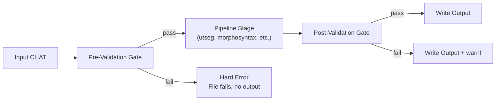
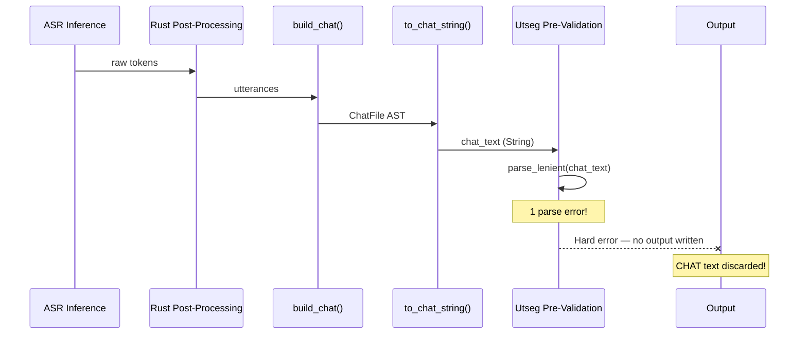

# CHAT Validation Failures

**Status:** Current
**Last updated:** 2026-05-21 15:10 EDT

This document catalogs how CHAT validation failures arise, how they are handled
in BA3 vs BA2, and what the correct behavior should be. It is the reference for
any future changes to the pre-validation and post-validation gates.

## Background: BA2 Had No Validation Gates

Batchalign2 (baseline `84ad500b`) had **zero CHAT validation**
anywhere in the pipeline:

- **No pre-validation**: raw Whisper output was converted directly to a
  `Document` (Pydantic model) with no structural checks. If Whisper returned
  inverted timestamps, they were silently propagated. If the CHAT parser hit a
  `CHATValidationException` during *input* parsing, the exception propagated to
  the dispatch loop, which caught it, logged the traceback, and **continued to
  the next file**.

- **No post-validation**: after morphosyntax/utseg/FA, the output was
  serialized and written with no roundtrip check. Malformed output was silently
  written to disk.

- **No intermediate validation**: no stage-to-stage validation between ASR
  assembly, utseg, and morphosyntax.

The result: BA2 almost always produced *some* output, even when that output was
wrong. Users discovered problems only when they opened the file in CLAN.

## BA3 Validation Architecture

BA3 introduced two validation gates:

### Pre-Validation (hard error)

- **Where:** `pipeline/text_infer.rs:91-98` (single-file path),
  `utseg.rs:129-139` (batch path)
- **What it checks:** `validate_to_level(file, parse_errors, level)` —
  typically `ValidityLevel::StructurallyComplete` (L1)
- **On failure:** returns `Err(ServerError::Validation(...))` — the file
  **fails with no output**
- **Rationale:** running NLP (Stanza, etc.) on structurally broken CHAT would
  produce garbage and waste GPU time

### Post-Validation (warn-only)

- **Where:** `pipeline/text_infer.rs:131-134`
- **What it checks:** `validate_output(file, command)` — roundtrip structural
  integrity
- **On failure:** logs `warn!` but **writes the output anyway**
- **Rationale:** output is more useful than no output; the user can inspect the
  file even if it has issues

## The Problem: Pre-Validation in the Transcribe Pipeline

The transcribe pipeline has an asymmetry:

1. ASR inference produces raw tokens
2. Rust post-processing converts tokens to utterances
3. `build_chat()` assembles a CHAT AST and serializes it
4. **Utseg pre-validates the serialized CHAT** — and if it fails L0
   (parse errors), the file is a hard error with no output

This means: if `build_chat()` or `to_chat_string()` produces CHAT text that
doesn't roundtrip cleanly through the parser, the entire file fails silently.
**The CHAT text that would explain the problem is discarded.**

### Real-world incidents

| Job | File | Error | Root Cause | Output? |
|-----|------|-------|-----------|---------|
| `696870c7` | maria18.wav | `[L0] File has 1 parse error(s)` | Unknown — CHAT discarded | No |
| `696870c7` | sastre02.wav | `[L0] File has 1 parse error(s)` | Unknown — CHAT discarded | No |
| `696870c7` | maria16.wav | `end_s must be >= start_s` | Whisper hallucinated inverted timestamps | No |
| `696870c7` | maria27.wav | `end_s must be >= start_s` | Whisper hallucinated inverted timestamps | No |

## Validity Levels

The validation system uses three levels, each including all checks from lower
levels:

| Level | Name | Checks |
|-------|------|--------|
| L0 | `Parseable` | No parse errors (clean tree-sitter CST) |
| L1 | `StructurallyComplete` | L0 + participants, languages, speaker codes, terminators |
| L2 | `MainTierValid` | L1 + well-formed words, valid timing bullets |

Pre-validation gates use L1 (`StructurallyComplete`) for text-infer commands
(morphosyntax, utseg, translate, coref). The transcribe pipeline's utseg stage
inherits this behavior.

## What Should Happen

The correct behavior depends on context:

### For externally-supplied CHAT (align, morphotag, utseg commands)

Pre-validation is correct as a hard error. The user supplied CHAT that doesn't
meet structural requirements. They should fix their input before spending GPU
time on it.

### For internally-generated CHAT (transcribe pipeline)

Pre-validation as a hard error is **wrong**. The CHAT was generated by our own
code — if it has parse errors, that's a bug in `build_chat()` or
`to_chat_string()`, not bad user input. The correct behavior is:

1. **Always write the output** — even with validation warnings, the CHAT is the
   most valuable diagnostic artifact
2. **Log the validation errors** — so they can be investigated
3. **Skip the failing stage** — if utseg pre-validation fails, skip utseg and
   write the pre-utseg CHAT as the output

This matches BA2's behavior (always produce output) while adding the diagnostic
logging that BA2 lacked.

## Current Mitigations

Two mitigations are in place:

1. **Always-on error logging**: when utseg pre-validation fails, the full CHAT
   text is logged at `warn!` level (`utseg.rs`). This makes failures
   diagnosable from server logs without `--debug-dir`.

2. **Debug artifact dumps**: with `--debug-dir`, the transcribe pipeline writes
   intermediate CHAT at every stage boundary. The `sample_post_asr.cha` artifact
   captures the CHAT that utseg would have rejected.

## Construction-Time Validation as the Primary Guard

The current pipeline guards against the "serializer produces
unparseable CHAT" class in three layers:

1. **ASR request configuration.** For each ASR engine BA3 supports,
   the request options are chosen to return spoken-form text when
   possible — matching CHAT's semantics. For Rev.AI on English and
   Spanish this means `skip_postprocessing=true` (skip Inverse Text
   Normalization), so numerals / `%` / written-form date tokens never
   appear in the response for those languages. See
   `crates/batchalign/src/revai/preflight.rs::skip_postprocessing_hint`.

2. **Fallible `ChatWordText` construction.**
   `transcript_from_asr_utterances` calls
   `ChatWordText::try_from_lang` per word and returns
   `Err(TranscriptBuildError)` naming the offending utterance /
   speaker / language / token if any word fails CHAT-legality.
   Language- and engine-agnostic: for languages where Rev.AI ignores
   `skip_postprocessing` (everything other than en/es), or for a
   different ASR provider with different behavior, the pipeline
   either produces valid CHAT or fails loudly at the offending token
   with a specific message.

3. **Rich L0 validation-gate error message.**
   `validate_to_level(&ChatFile, parse_errors: &[ParseError], level)`
   surfaces the first error's code, byte span, and offending text
   excerpt, not just a count. Any residual malformation that does
   slip through still surfaces actionable diagnostics.

These layers are complementary. Layer 1 makes the common
English/Spanish path Just Work without any post-processing round
trip. Layer 2 prevents a silent regression if anything about layer 1
changes — different engine, different flag, different language.
Layer 3 ensures that if layer 2 does fail, the user sees exactly
what broke.

## Future Work

- **Transcribe pipeline resilience**: change the transcribe pipeline's utseg
  and morphosyntax stages to catch validation errors, log them, and emit the
  pre-stage CHAT as the output instead of failing the file. This is the single
  most impactful change — it converts hard failures into degraded-but-usable
  output.

- **Validation error classification**: distinguish between "structurally broken
  input" (user's fault, hard error) and "roundtrip failure in our serializer"
  (our bug, should always emit output).

- **Dashboard error display**: surface the CHAT text and validation errors in
  the dashboard job detail view, not just the error message string.

## File Reference

| File | Role |
|------|------|
| `crates/talkbank-model/src/pipeline.rs` | `ValidityLevel` enum |
| `crates/talkbank-transform/src/validate.rs` | `validate_to_level()`, `validate_output()` |
| `crates/batchalign/src/pipeline/text_infer.rs` | Single-file cached text pipeline with pre/post gates |
| `crates/talkbank-transform/src/utseg.rs` | Batch utseg path with pre-validation + CHAT dump |
| `crates/batchalign/src/pipeline/transcribe.rs` | Transcribe pipeline stages (ASR → utseg → morphosyntax) |
| `crates/batchalign/src/runner/debug_dumper.rs` | `DebugDumper` — zero-cost artifact writer |
| `batchalign/inference/asr.py` | Whisper timestamp clamping |
