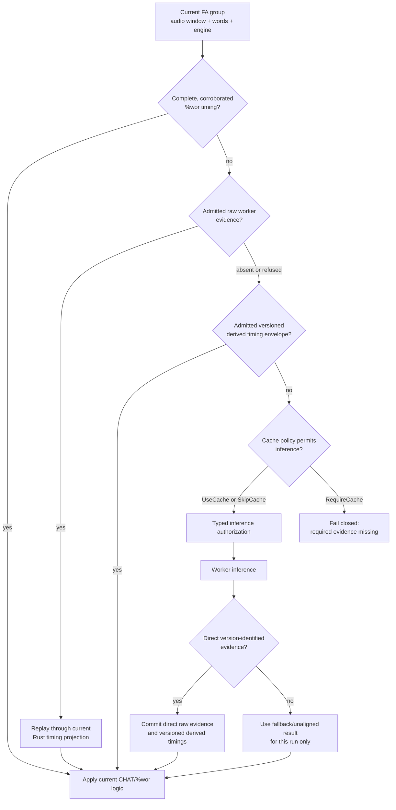

# align: Developer Reference

**Status:** Current
**Last updated:** 2026-09-02 20:07 EDT

Implementation guide for the `align` command. For user-facing documentation,
see [User Guide: align](../../user-guide/commands/align.md).

---

## Implementation map

| Layer | Location | Responsibility |
|-------|----------|----------------|
| CLI args | `crates/batchalign/src/cli/args/commands.rs`: `AlignArgs` | UTR/FA engine flags, strategy, fuzzy, buffer params |
| Options builder | `crates/batchalign/src/cli/args/options.rs:130-194` (inline dispatch) | Maps `AlignArgs` → `CommandOptions::Align(AlignOptions)` |
| Command definition | `crates/batchalign/src/commands/align.rs`: `AlignCommand` | `CommandDefinition` impl, pre-validation gate |
| FA pipeline | `crates/batchalign/src/runner/dispatch/fa_pipeline.rs` | Per-file FA orchestration: UTR → grouping → FA → injection |
| UTR dispatch | `crates/batchalign/src/runner/dispatch/utr.rs` | `resolve_strategy()`, language-aware strategy gate |
| UTR library | `crates/batchalign/src/chat_ops/fa/utr.rs` | `run_utr_pass()`, `inject_utr_timing()`, partial-window logic |
| FA library | `crates/batchalign/src/chat_ops/fa/` | Grouping, extraction, DP alignment, injection, postprocessing |
| Worker boundary | `batchalign/worker/_fa_v2.py` + `crates/batchalign-pyo3/src/worker_fa_exec.rs` | Rust owns request validation and V2 response shaping; Python hosts model callbacks |
| Model callback | `batchalign/inference/fa.py` | Whisper token onsets or indexed Wave2Vec word intervals with optional model score |
| Durable evidence | `crates/batchalign/src/types/traces.rs`, `runner/debug_dumper.rs` | Versioned, fail-closed FA evidence sidecar when `--debug-dir` is enabled |

---

## `@Options: NoAlign`: strict pass-through

Files containing `@Options: NoAlign` are **returned completely unchanged**.
The pipeline performs zero modifications: no timestamps are added, removed,
or adjusted, no `%wor` tier is generated or updated, and no legacy decision
tiers (`%xalign`, `%xrev`) are stripped.

The rationale is that a researcher who sets `@Options: NoAlign` has explicitly
opted this file out of all alignment processing.  Batchalign must respect that
decision unconditionally, including for cleanup passes that might seem benign
(such as monotonicity enforcement).  Any existing timestamps, even backward
ones from a previous run, are the researcher's responsibility.

If a file with `@Options: NoAlign` carries validation errors from a previous
FA run, the correct fix is to repair the file manually or remove the option,
re-run align, and re-add the option if still needed.

Implementation: `run_fa_from_ast` checks `is_no_align(&chat_file)` immediately
after parsing (before media resolution, pre-validation, and all FA logic) and
returns `FaResult::without_groups(...)`.

---

## Pre-validation gate

`align` requires CHAT Level 2 (parseable + headers + valid main tiers) before
running inference. Invalid files are rejected immediately with a typed error
rather than consuming GPU time. See
[Command Contracts](../../architecture/command-contracts.md) for the validity
level definitions.

Implemented in `crates/batchalign/src/commands/align.rs`:
```rust,ignore
validate_to_level(chat, ValidationLevel::MainTiers)?;
```

---

## Cache key structure

FA group keys are BLAKE3 hashes over:

- audio identity (resolved path, mtime, and size)
- file-relative audio window (`start_ms`, `end_ms`)
- normalized word sequence
- typed FA engine
- response-schema discriminator where required
- for onset-only engines, the text/healing mode that affects parsed timings

The cache backend namespaces that key by task (`forced_alignment`) and the
worker-advertised engine version. Word-interval keys carry
`model_score_v1`: this intentionally retires historical interval entries that
deserialize correctly but predate score retention. Whisper has no interval
score to recover and keeps its established cache namespace.

UTR ASR results are cached separately per audio segment (file path + start_ms
+ end_ms). Segment cache hits avoid re-running ASR on already-processed
windows during the partial-window optimization.

Cache implementation: `crates/batchalign/src/cache/` (hot: moka,
cold: SQLite). Bypass with global `--override-media-cache`.

`align` has two independently resolved cache tasks. `FaParams::cache_policy`
governs `forced_alignment`; `FaDispatchPlan::utr_cache_policy` governs both
the initial and fallback `utr_asr` passes. Do not collapse the latter into
`FaParams`: selective refresh and replay experiments depend on changing one
policy without changing the other. `--require-media-cache` resolves both to
`RequireCache` and prevents either unresolved boundary from authorizing
inference.

`FaParams::projection_policy()` combines the engine-derived `WordEndPolicy`
with typed `ExistingWorBoundaryPolicy` and `EndOverlapPolicy` values. Full,
incremental, all-`%wor`, and empty-group paths consume that single
`FaProjectionPolicy`, preventing execution shape from changing the local
interpretation of the same evidence. Both local policies are deliberately
absent from `cache_key()`: changing either must replay the same evidence, not
create a new inference identity.

The final phase is also typed. Fresh injection produces `FaApplied`; a
no-injection path can only enter through `finalize_without_injection`. Both
must produce `FaFinalized`, which runs `BulletRepairPolicy` first and
`EndOverlapPolicy` monotonicity second. Only `FaFinalized` can enter
`FaDecisions`. This prevents the former incremental defect where monotonicity
clamped away a small overlap before optional repair could average it, and the
former reuse defect where no-injection paths silently selected the default
overlap policy.

Partial `%wor` reuse has a load-bearing phase boundary. Before grouping,
`refresh_reusable_utterances()` always uses compatibility preservation so the
input bullet continues to define the same audio window and raw cache key, and
(2026-09-01 review, item 2) it is now MECHANICAL ONLY: it never writes `%wor`
itself. It returns the utterances it touched, and `run_fa_from_ast` folds
them into the SAME `FaApplied` write phase that this run's fresh injections
use, via `FaApplied::also_touched`, so their `%wor` (when requested) is
written once, after `EndOverlapPolicy` resolves, never before. The
all-reusable fast path (no grouping, no inference) is the same: it rebuilds
directly from the existing admitted `%wor` timings via
`refresh_reusable_alignment`, then reaches the write phase through
`projection_without_injection_with_touched` rather than a bare
`finalize_without_injection` with a separate write. The explicit projection
policy applies only after evidence collection. The option does not force a
fully reusable document back through raw-cache replay. A cache-required
development experiment caught and refused an early version that rebuilt before
grouping; that refusal is the executable reason this phase separation must
remain visible in code and diagrams. `add_wor_tier` itself is `pub(crate)`.
In a PRODUCTION build it has exactly one caller: that one write phase
(`FaApplied::then_enforce_monotonicity`). The only other callers are test
code: unit tests of `%wor` generation shape itself, which do not claim the
ordering property, and the `refresh_existing_alignment` /
`refresh_existing_alignment_with_boundary_policy` convenience wrappers,
which write `%wor` directly and are `#[cfg(test)]` (2026-09-01 review, item
12) precisely because they have no production caller left -- the cheap
rerun path that used to call them now goes through
`refresh_reusable_alignment` and the write phase instead, as this page
already describes below.

```mermaid
flowchart LR
    I["Input CHAT + existing %wor"] --> R["Pre-group refresh<br/>always Preserve"]
    R --> G["Stable group windows<br/>and raw cache keys"]
    G --> E{"Evidence state"}
    E -->|raw hit| P["FaProjectionPolicy"]
    E -->|wor reuse| P
    E -->|required miss| F["EvidenceUnavailable refusal"]
    P -->|Preserve prior bounds| C["Compatibility word projection"]
    P -->|RebuildFromEvidence| H["Admitted word hull projection"]
    C --> PHASE["FaApplied or typed<br/>no-injection projection"]
    H --> PHASE
    PHASE --> B{"BulletRepairPolicy"}
    B -->|Disabled| O{"EndOverlapPolicy"}
    B -->|Enabled| RPR["Repair: same three-way resolution\non measured hulls, small overlaps only"] --> O
    O -->|"PreserveCrossSpeaker (default)"| X["Same-speaker: 3-way resolution\nfrom measured hulls;<br/>cross-speaker: untouched"]
    O -->|ClampAllAdjacent| COMP["3-way resolution for EVERY\nadjacent pair, any speakers"]
    X --> WOR["WorPlan::Pending →<br/>write %wor from RESOLVED state"]
    COMP --> WOR
```



---

## Four-state evidence resolution

Each FA group is checked for reusability in priority order before inference:

**Tier 1: Reuse from `%wor` tier**

If all utterances in a group have clean `%wor` timing from a previous run,
those word timings are used directly without re-processing. This is the fastest
path and requires no worker inference.

**Tier 2: Raw-evidence replay**

If Tier 1 doesn't apply, prefer the immutable worker-protocol response. BA3
re-admits it against the current request facts, then runs the current Rust
projection. This is the research path: local reconciliation can change without
running the model again.

**Tier 3: Versioned derived-timing fallback**

When raw evidence is absent or refused, an admitted derived timing envelope can
still satisfy the group. It must prove the requested engine, selected-worker
version, semantic key, and word cardinality. Historical bare vectors are
refused because they cannot prove direct-versus-fallback provenance, while a
new raw entry cannot be masked by an older local projection.

**Tier 4: Authorized inference**

Only a miss at all three earlier states reaches the worker. `RequireCache`
cannot construct the authorization value needed by the worker batch. A direct,
version-identified worker response is stored in both raw and derived layers;
fallback output is valid for the live run but deliberately remains uncached.



Implementation: `crates/batchalign/src/fa/mod.rs` and
`crates/batchalign/src/fa/transport.rs`.

---

## Worker IPC: FA task (V2 protocol)

```text
Client → Worker: execute_v2 request (abridged)
{
  "task": "fa",
  "request": {
    "backend": "wav2vec" | "whisper" | "wav2vec_canto",
    "audio_ref_id": "...",
    "payload_ref_id": "...",
    "text_mode": "char_joined" | "space_joined" | "char_spaced"
  },
  "attachments": ["prepared audio", "prepared text payload"]
}
```

Worker → Client is one of two typed results:

- Wave2Vec/Cantonese: one indexed optional interval per requested word,
  `{start_ms, end_ms, confidence?}`. Rust validates the count and applies the
  intervals directly; there is no DP remapping.
- Whisper: token text plus onset time. Rust uses DP alignment to reconcile
  those returned tokens with CHAT words and derives word ends because the
  engine did not measure them.

The Python Wave2Vec callback duration-weights token-span scores into a word
score before crossing the V2 boundary. Rust validates that optional score as a
finite value in `0..=1`, stores it quantized to millionths, and keeps it
separate from boundary provenance. The score is not treated as a calibrated
probability.

---

## UTR strategy resolution

`resolve_strategy()` in `crates/batchalign/src/runner/dispatch/utr.rs:80-114`:

**Auto strategy (default):** Always returns `GlobalUtr` regardless of language or overlap markers.

The previous auto-detection logic (which selected `TwoPassOverlapUtr` for English
files with `+<` or CA overlap markers) was **disabled 2026-03-30** due to:
1. Operator-reported alignment regressions on real files
2. At the time, `enforce_monotonicity()` corrected only start regressions and
   left end overlap unexamined. Current code clamps adjacent ends, but a clamp
   that cuts retained word timing is now evidence for review rather than proof that the
   overlap-aware segmentation was wrong.
3. Two-pass algorithm was only tuned on 4 corpora, not broadly validated

**Explicit overrides:**
- `--utr-strategy global` → `GlobalUtr` (single-pass monotonic recovery)
- `--utr-strategy two-pass` → `TwoPassOverlapUtr` (experimental; overlap-aware,
  gated until its segmentation and downstream overlap policy are validated)

When both `total_audio_ms` and `max_group_ms` are available, a `GroupingContext` is
passed to `TwoPassOverlapUtr` so it can detect and avoid the wider-window regression
on non-English files. This is only consulted on explicit `--utr-strategy two-pass`;
`Auto` does not reach this code path.

---

## Incremental processing (`--before`)

When `--before PATH` is provided, `process_fa_incremental()` in
`fa_pipeline.rs` diffs the old and new CHAT files, classifies each utterance
as Added/Removed/Modified/Unchanged, and only runs FA on content that changed.
Stable `%wor` entries from the old file are copied directly, skipping the FA
worker entirely for unchanged groups.

See [Incremental Processing](../../architecture/incremental-processing.md).

---

## FA grouping constraints

`group_utterances()` enforces two independent split constraints. A group is
flushed when either is exceeded by adding the next utterance:

- **Time window**: configured via `AlignOptions.max_group_ms` (default 20 000 ms)
- **Character-token limit**: `WHISPER_FA_MAX_LABEL_TOKENS = 448` (constant in
  `grouping.rs`). Whisper's CTC FA counts every character of every word as one
  label token. Exceeding 448 raises a hard Python `ValueError`. Dense languages
  (Spanish, any long-word corpus) can hit this inside a normal time window.

The flush guard is skipped only when the current group is empty, if one
utterance alone exceeds 448 chars it is sent as its own group (fail gracefully
rather than drop silently).

See [Forced Alignment: FA grouping strategy](../../reference/forced-alignment.md#fa-grouping-strategy)
for the full rationale, flowchart, and edge cases.

---

## Pre-grouping preparation steps

Before FA grouping, the AST undergoes two surgical modifications to prepare utterance
bullets for inference:

**Narrow bullet rescue** (enabled always)  
When `transcribe` writes a bullet that is too narrow to contain its words (e.g., 22
words in 380 ms = 58 wps, physically impossible), the rescue pre-pass detects and
expands that bullet into the trailing inter-utterance gap. This gives FA a wide-enough
audio window to find the actual speech. After FA finishes, `update_utterance_bullet`
overwrites the rescued range with the FA word span (tighter), so the rescue is
self-healing and auditable.

Implementation: `crates/batchalign/src/chat_ops/fa/mod.rs:247-267`. Decisions (which utterances
were rescued) are recorded in structured evidence rather than injected into CHAT.

**Edge filler expansion** (enabled always)  
UTR-assigned bullets may be too narrow to include trailing or leading fillers whose
audio lives in inter-utterance gaps. This step expands utterance bullets to cover
those edge fillers, ensuring they are included in the FA group.

Implementation: `crates/batchalign/src/chat_ops/fa/mod.rs:269-272`.

## Compound filler splitting

CHAT underscore-joined fillers (`&-you_know`, `&-sort_of`) are split at
underscores before being sent to the FA engine because ASR models return them
as separate words. After alignment, the N timings are merged back into one span.
Only `WordCategory::Filler` words are split, regular compounds (`ice_cream`)
are unchanged.

See `crates/batchalign/src/chat_ops/fa/COMPOUND_FILLER_ALIGNMENT.md`.

---

## Decision evidence and CHAT cleanup

The align pipeline records structural decisions internally. It projects them
into structured evidence and never generates `%xalign` or `%xrev`. The legacy
`review_level` values remain accepted for wire compatibility but do not change
this presentation policy.

**Decision sources** (in order):
1. **Narrow bullet rescue**: utterances whose bullets were pre-expanded before
   grouping (see "Pre-grouping preparation steps")
2. **FA word timing injection**: word boundaries, timing drops, speech gaps
3. **Experimental bullet repair**: only if `--bullet-repair` flag is enabled
4. **Monotonicity enforcement**: start-time regressions stripped, end-time overlaps clamped

All previous `%xalign`/`%xrev` tiers are stripped, including on clean re-runs
with no new decisions.

Implementation: `crates/batchalign/src/chat_ops/fa/mod.rs:506-537`. The injection layer is in
`crates/batchalign-transform/src/decisions/`.

### Durable alignment evidence

CHAT decision tiers are no longer a projection surface. With `--debug-dir`,
`FaResult::into_timeline_trace` produces the authoritative research record in
`<stem>_fa_evidence.json` through `DebugDumper::dump_fa_evidence`. The dump is
fail-closed when requested and includes:

- schema version, engine, and worker-advertised engine version;
- group windows, words, and stable word IDs;
- per-group source (`wor_reuse`, `cache`, or `inference`) and cache key;
- pre-injection valid timings, optional model score, and exhaustive origin
  chains for both boundaries;
- the exact typed decision records retained independently of CHAT output;
- `dropped_word_timings`: every word timing the run discarded outright, one
  self-describing record each (line, utterance, speaker, tier, word position,
  measured span, and the bound it exceeded). Derived from the timing decisions
  at assembly time by `FaTimingDecisionTrace::dropped_word_timings`, so it
  cannot drift from them, and always written, empty when nothing was dropped;
- fallback events and post-validation violations.

The indexed alignment algorithm temporarily needs separate vectors while
cache hits and worker replies arrive out of order. Before `FaResult` can exist,
`assemble_group_evidence` verifies that the group, source, cache-key, and
pre-injection-timing populations have identical cardinality and consumes them
into one `FaGroupEvidence` value per group. The result type stores only those
paired values. `into_timeline_trace` may flatten them back into the established
parallel JSON fields, but current BA3 code cannot construct a trace by pairing
one group's timings with another group's provenance.

`DebugDumper::evidence_stem` preserves the plain basename for a bare filename.
For a nested submitted identity it appends twelve hex characters from a BLAKE3
digest of the complete filename. This prevents equal basenames in different
corpus branches from sharing one evidence path.
Serialization completes before the destination is opened. The resulting bytes
are synchronized and atomically replace the destination, followed by a
directory synchronization on Unix. An interrupted write therefore cannot
leave a truncated JSON artifact or follow a pre-existing destination symlink.

Rev-backed UTR calls the same `dump_rev_evidence` boundary after raw evidence
resolution and before timed-word projection. It selects
`RevAsrProjectionRevision::UtrAsrResponseV1`; the closed revision type prevents
a caller from inventing a label or attaching transcribe's ASR revision by
string convention. `rev_utr_evidence_identity` combines the stable CHAT
filename with the raw evidence-key prefix, preventing full-file and
partial-window calls from overwriting each other while avoiding temporary
segment paths as identities.

Schema version 2 added `decisions` to retain post-inference clamping, repair,
and timing-removal outcomes. A typestate return from `retain_decision_evidence`
is consumed into the evidence trace, so the JSON cannot be assembled from a
different record set than the pipeline produced. The complete-`%wor` fast path
and a grouping-empty path retain any decisions they make as well; zero fresh
inference groups does not erase a monotonicity change or grouping refusal.
Schema version 3 adds stable current and neighbouring utterance ordinals to
every numeric monotonicity effect. The legacy `line_idx` fields name the input
`ChatFile.lines` state and are retained for debugging, but they cannot alone
address final CHAT because provenance serialization may insert an `@Comment`
header. An utterance ordinal is invariant under header-only changes. Research
consumers should corroborate both coordinates against the exact input and
resolve the ordinal against output while checking speaker and spoken-token
identity; they must not index final `ChatFile.lines` with the legacy value.
`post_injection_timings`
remains intentionally empty: the
post-processing phase still lowers final `WordTiming` values into CHAT bullets
before a group-shaped evidence record can retain them, particularly for split
compound fillers. Do not describe any current schema as a complete repair history. A later
future schema must carry a typed identity mapping across that phase rather than
re-reading bullets and falsely labeling them observations.

---

## Post-FA validation

After FA finishes, the CHAT file is validated at Level 2 (output gate equivalent to
[Command Contracts: align post-validation](../../architecture/command-contracts.md#align-post-validation)).
Validation errors are **warnings only**: cross-speaker overlap is normal in
conversation data and non-fatal. If critical errors appear (e.g., invalid tier
codes), they are logged but do not fail the job.

Implementation: `crates/batchalign/src/chat_ops/fa/mod.rs:539-554`.

---

## Testing

```bash
# Fast unit tests (no ML models)
make test

# FA-specific tests with real models (only on Fleet/Large-tier hosts, ≥ 256 GB RAM)
cargo test -p batchalign --features ml-golden --test ml_golden fa::

# Incremental processing tests
cargo test -p batchalign --test incremental
```

Key test locations:
- `crates/batchalign/src/chat_ops/fa/`: unit tests for grouping, injection, UTR
- `crates/batchalign/tests/`: integration tests for the FA pipeline

---

## Related developer documentation

- [Command Flowcharts: align](../../architecture/command-flowcharts.md#align), detailed runtime flowchart with 3 diagrams
- [Forced Alignment](../../reference/forced-alignment.md), algorithm design, prerequisites
- [Dynamic Programming](../../../architecture/parser-and-grammar/dynamic-programming.md), Hirschberg aligner
- [Incremental Processing](../../architecture/incremental-processing.md), `--before` mechanics
- [Overlap Encoding](../../architecture/overlap-encoding.md), `+<` and CA marker handling
- [Command Contracts](../../architecture/command-contracts.md), pre/post validation gates
- [Adding Commands](../adding-commands.md), use `align` as the reference implementation for `PerFileTransform`
