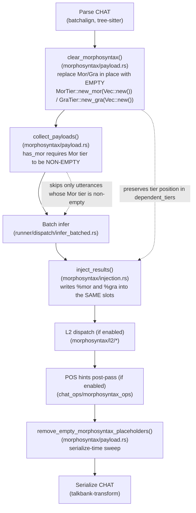

# morphotag: Developer Reference

**Status:** Current
**Last updated:** 2026-05-19 22:58 EDT

Implementation guide for the `morphotag` command. For user-facing
documentation, see [User Guide: morphotag](../../user-guide/commands/morphotag.md).

---

## Implementation map

| Layer | Location | Responsibility |
|-------|----------|----------------|
| CLI args | `crates/batchalign/src/cli/args/commands.rs`: `MorphotagArgs` | lang, retokenize, skipmultilang, lexicon, no-l2-morphotag, pos-hints |
| Options builder | `crates/batchalign/src/cli/args/options.rs:248-255` (inline dispatch) | Maps `MorphotagArgs` → `CommandOptions::Morphotag(MorphotagOptions)` |
| Command definition | `crates/batchalign/src/commands/morphotag.rs` | `CommandDefinition` impl, pre-validation gate |
| Morphosyntax orchestration | `crates/batchalign/src/morphosyntax/` | Cross-file batching, cache lookup, worker dispatch, result injection |
| Batch dispatch | `crates/batchalign/src/runner/dispatch/infer_batched.rs` | Pools all files into a single ML call |
| Injection | `crates/batchalign-transform/src/morphosyntax/injection.rs` | `inject_results()`: writes `%mor`/`%gra` from typed UD annotations |
| Retokenization | `crates/batchalign/src/retokenize/` | Character-level DP for Stanza word splits/merges |
| Payload collection & injection | `crates/batchalign-transform/src/morphosyntax/`: `collect_payloads()`, `clear_morphosyntax()`, `inject_results()`, `remove_empty_morphosyntax_placeholders()` | Cross-crate: domain logic lives in talkbank-transform model layer |
| Worker IPC | `batchalign/inference/morphosyntax.py`: `batch_infer_morphosyntax()` | Loads Stanza, returns raw `to_dict()` UD annotations |

Local submissions (auto-daemon or loopback `--server`) use `paths_mode=true`:
the CLI posts source/output path lists instead of CHAT bytes. See
[Submission Modes](../../reference/command-io.md#submission-modes-paths_modetrue-vs-paths_modefalse).

---

## Cross-file batching

`morphotag` is the canonical `CrossFileBatchTransform` command. All utterances
from all input files are pooled into a single Stanza inference call. This
eliminates per-file model warm-up overhead.

Cache hits are injected immediately. Only cache-miss utterances are sent to the
worker. After the worker responds, results are repartitioned by file and
injected per-file.

`infer_batched.rs` is the shared dispatch helper for all cross-file batch
commands (morphotag, utseg, translate).

---

## Cache key structure

Morphotag cache keys (BLAKE3 hash of):
- Normalized word sequence
- Language code (3-letter ISO)
- Terminator character (determines Stanza sentence boundary)
- Special form flags (retrace, abbreviation, etc.)
- Engine version string

Keys are stable across restarts. The cold SQLite cache persists across
batchalign3 upgrades; wipe it when Stanza model versions change.

Bypass: global `--text-cache` disables the text NLP cache entirely for
the current invocation.

---

## Worker IPC: morphosyntax task

```text
batch_infer request:
{
  "task": "morphosyntax",
  "items": [
    { "words": ["hello", "world"], "lang": "eng",
      "terminator": ".", "special_forms": [] },
    ...
  ]
}

batch_infer response:
[
  [
    { "id": [1], "text": "hello", "upos": "INTJ", "lemma": "hello",
      "head": 2, "deprel": "discourse", "feats": {} },
    ...
  ],
  ...
]
```

The Rust injection layer (`inject_results()`) maps the UD annotation back to
the CHAT AST word by word, writing `%mor` (`pos|lemma` notation) and `%gra`
(`idx head deprel`) tiers.

### Upstream-defect ingress filter (Python side)

Before the UD annotations cross back from Python to Rust,
`batch_infer_morphosyntax` runs a known-defect workaround over every
Stanza sentence: any ``<SOS>``, ``<EOS>``, ``<UNK>``, ``<PAD>``, ``<s>``,
``</s>`` (and similar neural-LM control-token) substrings that leaked
into ``word.text`` or ``word.lemma`` are stripped in place. Every
rewrite emits a ``tracing.warning`` naming the language, the leaked
value, and the post-strip replacement so the workaround is visible
in ``~/.batchalign3/server.log``.

This is Defect 4 in the [Stanza Limitations
registry](../../reference/stanza-limitations.md#defect-4-neural-lm-control-tokens-leak-into-document-output-finnish-mwt).
The minimum trigger is 3+-word Finnish input containing ``tollei`` on
Stanza 1.11.1. ``chatter validate`` is the downstream gate if a leak
variant escapes the filter's vocabulary.

Code + tests:

- `batchalign/inference/_control_token_filter.py`: pure stripper + regex
- `batchalign/inference/morphosyntax.py`: call site inside
  `batch_infer_morphosyntax` after `doc.to_dict()`
- `batchalign/tests/inference/test_control_token_filter.py`,
  34 pure-function tests (regex vocabulary, strip contract, MWT safety)
- `batchalign/tests/pipelines/morphosyntax/test_stanza_fi_mwt_sos_leak.py`
 , standalone upstream reproducer
- `batchalign/tests/pipelines/morphosyntax/test_control_token_leak_propagation.py`
 , integration test through `batch_infer_morphosyntax`

The five-step workflow that produced this filter is the same one any
future upstream defect should follow, see
[Upstream Defect Policy](../upstream-defect-policy.md).

### Language-group failure propagation (Rust side)

A separate layer at the Rust orchestrator handles **pool-level** failures:
worker saturation, timeouts, worker crashes, and the now-retired
"would deadlock" bailout (replaced by idle-cross-group
eviction in `worker/pool/eviction.rs`). The typed
[`LanguageGroupFailure`](https://github.com/TalkBank/talkbank-tools/blob/main/crates/batchalign/src/morphosyntax/outcomes.rs)
aggregator receives per-group outcomes, and
[`classify_file_for_injection`](https://github.com/TalkBank/talkbank-tools/blob/main/crates/batchalign/src/morphosyntax/outcomes.rs)
routes every file whose utterance range intersects a failed group to
`TextBatchFileResult::err`, skipping `inject_results()` so no CHAT is
serialized with stripped tiers.

The two layers are complementary:

| Layer | Handles | Response |
|---|---|---|
| Python ingress filter | Upstream library produces bad individual tokens | Strip + log; file lands clean |
| Rust failure propagation | Pool-level failure produced no response at all | Per-file error; file not written |

Code: `crates/batchalign/src/morphosyntax/outcomes.rs` (pure
aggregator + classifier, 13 tests),
`crates/batchalign/src/morphosyntax/dispatcher.rs` (trait boundary
for fake-pool tests),
`crates/batchalign/src/morphosyntax/saturation_tests.rs` (3
end-to-end corruption-regression tests).

See also: [Batchalign Workers, Saturation Safeguards](../../../architecture/runtime/batchalign-workers.md#worker-pool-saturation-safeguards).

---

## Pipeline stages: parse → clear → collect → infer → inject → serialize

Morphotag runs a re-entrant pipeline that must preserve CHAT round-trip
fidelity. The important stages in order:



Diagram verified against: `crates/batchalign/src/morphosyntax/batch.rs` (orchestration),
`crates/batchalign-transform/src/morphosyntax/injection.rs` (inject_results),
`crates/batchalign-transform/src/morphosyntax/payload.rs` (clear/collect/sweep),
`crates/batchalign/src/chat_ops/morphosyntax_ops/tests.rs` (tier-order regression tests).

### Tier-order preservation

`clear_morphosyntax` previously removed the `%mor` and `%gra` dependent
tiers outright. `inject_results` then called the old "remove-then-add"
pattern at the end of `dependent_tiers`, so regenerated tiers were
displaced to the tail of the list. On files whose source layout put
`%wor` last, very common, the round trip `parse → clear → infer →
inject → serialize` produced a large, spurious tier-order diff.

The current pattern:

1. `clear_morphosyntax` **replaces** the Mor/Gra entries in place with
   empty `MorTier::new_mor(Vec::new())` and `GraTier::new_gra(Vec::new())`.
   Original tier position is retained.
2. `inject_results` writes into the same slots.
3. `remove_empty_morphosyntax_placeholders` is called at serialize time
   to remove any still-empty placeholders (utterances where no
   morphosyntax was produced).
4. `crates/batchalign/src/chat_ops/fa/mod.rs::add_wor_tier` (line 244) uses
   `replace_or_add_tier` instead of the old `remove_wor_tier + push`
   sequence, applying the same preservation principle to `%wor`.

**Regression tests** (in `crates/batchalign/src/chat_ops/morphosyntax_ops/tests.rs`):

- `clear_then_reinject_preserves_tier_order_mor_gra_wor` (line 1185)
- `add_wor_tier_preserves_tier_order_wor_mor_gra` (line 1258)
- `collect_payloads_treats_empty_mor_placeholder_as_unprocessed` (line 1302), tier-order test covering the empty-placeholder sweep

### `collect_payloads` empty-placeholder fix

`collect_payloads` uses a `has_mor` check to skip utterances that have
already been annotated. The original check tested only for the presence
of the `DependentTier::Mor` variant, which meant the empty placeholders
left by `clear_morphosyntax` looked "already processed" and every
utterance was skipped.

Net effect before the fix: `collect_payloads` returned zero payloads
after clearing, the worker was never called, and `%mor` / `%gra` were
silently stripped from the entire file.

`has_mor` now requires the Mor tier to be **non-empty**: it returns
false for an empty placeholder. Regression test:
`collect_payloads_treats_empty_mor_placeholder_as_unprocessed`.

This is a single-call, four-regression-test cluster (three for
tier-order preservation plus this one) that together pin the round-trip
contract.

---

## Pre-validation gate

`morphotag` requires CHAT Level 2 (parseable + headers + valid main tiers) before
batching. Invalid files are rejected immediately. A file with malformed headers
or invalid main tiers would produce mis-keyed cache entries and corrupt downstream
morphosyntax assignments.

---

## Language-group concurrency control

Multilingual CHAT files produce batch items with different per-item languages.
Each language group must be dispatched to a worker loaded with the correct Stanza
model, sending French text to an English MWT pipeline produces corrupt Range tokens.

Language groups are dispatched **concurrently** using a semaphore to prevent deadlock:
each language group acquires a semaphore permit before accessing the worker pool.
This ensures that we never try to start more language groups simultaneously than
the worker pool can support (`max_total_workers / max_workers_per_key`).

When a language group finishes and releases its permit, the next waiting group
acquires it and starts, no deadlock, full utilization, all groups eventually
complete. This is the same concurrency pattern the FA pipeline uses for per-file
parallelism.

Implementation: `crates/batchalign/src/morphosyntax/batch.rs:288-312`.

---

## Retokenization (`--retokenize`)

When `--retokenize` is set, `TokenizationMode::StanzaRetokenize` is passed to
the worker. Stanza may split or merge words on the main tier to match UD
tokenization. The retokenization is implemented in Rust
(`crates/batchalign/src/retokenize/`) using a character-level
Hirschberg DP to map Stanza tokens back to original CHAT positions. Existing
`%wor` timing bullets become stale after retokenization.

---

## Per-utterance language routing

Individual utterances with `[- lang]` precodes are routed to the Stanza
pipeline for that language, regardless of the file-level `@Languages` header.
The routing table is built by `collect_payloads()` in the morphosyntax
orchestration layer.

See [Language Routing](../../../architecture/language-and-multilingual/language-routing.md#per-utterance-routing-into-stanza).

---

## L2 morphotag dispatch (default; opt out via `--no-l2-morphotag`)

By default the morphotag pipeline defers the legacy `L2|xxx`
blanking for `@s` words and instead routes them to a
secondary-language Stanza model, merges the response with the
primary model's structural analysis, and splices the merged result
back into the CHAT AST. `--no-l2-morphotag` restores the legacy
blanking behavior.

```mermaid
sequenceDiagram
    participant Orch as Orchestrator<br/>(morphosyntax/batch.rs)
    participant Primary as Primary Stanza<br/>(e.g. deu)
    participant L2 as L2 extractor<br/>(l2/extract.rs)
    participant Spans as Span grouper<br/>(l2/spans.rs)
    participant Secondary as Secondary Stanza<br/>(e.g. eng)
    participant Merge as Merge algorithm<br/>(l2/merge.rs)
    participant Splice as Splice<br/>(l2/splice.rs)

    Orch->>Primary: Full utterance,<br/>L2 blanking deferred
    Primary-->>Orch: UD annotations for all words<br/>including @s words
    Orch->>L2: extract_l2_deferred_positions()
    L2-->>Orch: Vec&lt;L2DeferredPosition&gt;<br/>(@s words + primary UD)
    Orch->>Spans: group_deferred_into_dispatch_spans()
    Spans-->>Orch: Vec&lt;DispatchSpan&gt;<br/>(contiguous same-lang)
    loop For each target language
        Orch->>Secondary: infer_batch(retokenize=true)<br/>per-span batch items
        Secondary-->>Orch: Vec&lt;UdResponse&gt;
        loop For each @s word in span
            Orch->>Merge: merge_primary_secondary_with_context(<br/>primary, secondary_mor,<br/>secondary_ud_sentence)
            Note over Merge: Priority 0: compound:prt?<br/>Priority 1-6: constraint chain
            Merge-->>Orch: MergedL2Morphology
        end
    end
    Orch->>Splice: splice_l2_into_chat()
    Splice-->>Orch: SpliceOutcome<br/>(spliced / fallback / gra_upgraded)
```

**Module layout** (`crates/batchalign-transform/src/morphosyntax/l2/`):

| Module | Responsibility |
|--------|----------------|
| `extract.rs` | Walks primary UD response, picks out `@s`-word positions and their primary structural info (deprel, head, UPOS, dependents). |
| `spans.rs` | Groups deferred positions into contiguous same-language spans for per-span Stanza dispatch. |
| `merge.rs` | POS resolution priority chain including Priority 0 (`compound:prt` phrasal-verb recognition) and Priority 1-6 (constraint-based). |
| `deprel.rs` | `UdDeprel` newtype, deprel→POS constraint mapping, deprel inference from resolved POS. |
| `splice.rs` | Replaces `L2\|xxx` with the merged MOR + corrected GRA in the CHAT AST. |
| `crates/batchalign/src/morphosyntax/batch.rs` | Thin adapter that submits the planned secondary spans to workers and hands the results back to the transform-layer seam. |

**Dispatch wiring:** `crates/batchalign/src/morphosyntax/batch.rs::dispatch_secondary_l2`.
The caller invariant is that `map_ud_sentence` produces one `Mor`
per CHAT `@s` word (MWT Range tokens collapsed into clitics). When
`sentence.words.len() == mors.len()` the caller threads a
`SecondaryUdContext { sentence, word_position }` into the merge so
Priority 0 can check `compound:prt` relations; otherwise it passes
`None` and the merge falls back to the constraint chain alone.

See [L2 Morphotag: Per-Word Code-Switching Analysis](../../reference/l2-morphotag.md)
for the design rationale and merge algorithm details.

---

## Validation and normalization policy for `@s`

- E255 is now the hard-stop policy for whole-utterance same-language all-`@s`
  patterns. Morphotag does not auto-normalize those utterances; the transcript
  must use `[- lang]`.
- E254 is warn-only for explicit `@s:LANG` markers whose `LANG` is absent from
  `@Languages`. Dispatch still uses the explicit target language; the warning is
  about header drift, not routing failure.
- `chatter debug fix-s` is the companion repair tool. It rewrites qualifying
  whole-utterance `@s` runs to `[- lang]`, appends missing explicit languages to
  `@Languages`, and skips files that are already correct.

---

## Transcriber `$POS` hint post-pass (enabled by default)

After injection completes, if `--respect-pos-hints` is enabled (default; opt-out
via `--no-pos-hints`), the morphotag pipeline walks the ChatFile and overrides
`%mor` POS categories that disagree with transcriber `$POS` annotations.

The post-pass preserves:
- Lemma (from Stanza)
- Morphological features (from Stanza)

Only the POS category (UPOS → CLAN notation) is checked and potentially overridden.
Lemma and features from Stanza remain intact.

The outcome tracks 5 categories:
- `hints_considered`: total `$POS` annotations found
- `hints_agreed`: transcriber POS matched Stanza output (no change needed)
- `hints_overridden`: Stanza POS overridden by transcriber annotation
- `hints_unmapped`: transcriber POS code not in the CLAN↔UPOS mapping table
- `hints_skipped_no_mor`: utterance had no `%mor` tier to override

Implementation: `crates/batchalign/src/chat_ops/morphosyntax_ops/pos_hints.rs`,
`batchalign/src/morphosyntax/batch.rs:509-521`.

---

## Morphosyntax alignment validation

After injection, the pipeline runs alignment validation to detect `%mor`/`%gra`
sync issues. The validator checks:
- Each `%mor` tier has a corresponding `%gra` tier
- Word counts match
- Dependency head indices are in bounds

Validation errors are **warnings only** (logged but non-fatal). Files are still
serialized so invalid files can be inspected for debugging. The validation gate
exists to catch corruption from upstream defects (e.g., Stanza control-token
leaks) that escape the ingress filter.

Implementation: post-injection alignment validation lives in
`crates/batchalign-transform/src/morphosyntax/injection.rs` (the module
top comment names the responsibility, and the typed
`MisalignmentBug` / `MisalignmentDiagnostic` paths fire at the result
sites in that file). The batchalign-side `morphosyntax/worker.rs`
calls the injection path and propagates the validation outcomes.

```bash
# Unit tests (no ML models)
make test

# Morphotag golden tests (real Stanza models — only on Fleet/Large-tier hosts with the models present)
cargo nextest run --profile ml -E 'test(morphosyntax::)'

# Retokenization unit tests
cargo nextest run -p batchalign -E 'test(retokenize::)'
```

---

## Related developer documentation

- [Command Flowcharts: morphotag](../../architecture/command-flowcharts.md#morphotag), detailed runtime flowchart
- [Morphosyntax Pipeline](../../reference/morphosyntax.md), %mor/%gra format
- [Stanza Capability Registry](../../architecture/stanza-capability-registry.md)
- [Incremental Processing](../../architecture/incremental-processing.md), `--before` flag
- [Adding Commands](../adding-commands.md), use `morphotag` as the reference for `CrossFileBatchTransform`
