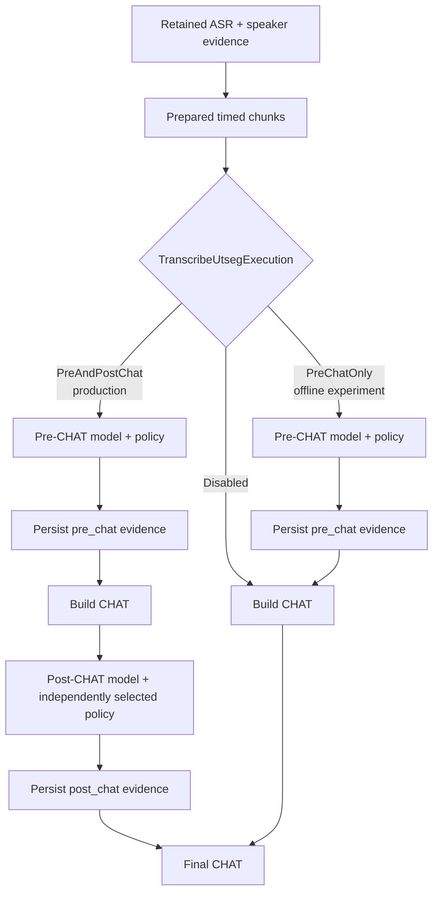

# transcribe: Developer Reference

**Status:** Current
**Last updated:** 2026-08-30 20:05 EDT

Implementation guide for the `transcribe` command. For user-facing
documentation, see [User Guide: transcribe](../../user-guide/commands/transcribe.md).

---

## Implementation map

| Layer | Location | Responsibility |
|-------|----------|----------------|
| CLI args | `crates/batchalign/src/cli/args/commands.rs`: `TranscribeArgs` | Typed ASR and speaker engines, diarization, lang, num-speakers |
| Options builder | `crates/batchalign/src/cli/args/options.rs:195-243` (inline dispatch) | Maps `TranscribeArgs` → `CommandOptions::Transcribe(TranscribeOptions)` |
| Catalog entry | `crates/batchalign/src/recipe_runner/catalog.rs` | the `CatalogEntry` for `transcribe` |
| Stage recipe | `crates/batchalign/src/recipe_runner/recipes.rs` | `TRANSCRIBE_RECIPE` |
| Pipeline orchestration | `crates/batchalign/src/pipeline/transcribe.rs`: `run_transcribe_pipeline()` | ASR, optional dedicated diarization, post-process, speaker projection, pre-CHAT utseg, CHAT assembly, optional morphotag, serialize |
| Per-file dispatch | `crates/batchalign/src/runner/dispatch/transcribe_pipeline.rs` | Concurrent file orchestration bounded by semaphore |
| ASR post-processing | `crates/batchalign-transform/src/asr_postprocess/mod.rs` | 8 stages: compound merge, MWT split, number expand, Cantonese norm, long-turn split, retokenization, disfluency, retrace detection |
| Pre-CHAT utterance segmentation | `crates/batchalign/src/pipeline/transcribe.rs`: `process_asr_with_prechat_segmentation()` | Runs for eng/cmn/zho/yue when enabled: admitted BERT evidence and selected policy applied to prepared chunks before `build_chat` |
| CHAT assembly | `crates/batchalign-transform/src/build_chat/mod.rs:41`: `build_chat()` | Assembles `ChatFile` AST from `TranscriptDescription` (typed bridge) |
| Speaker projection | `crates/batchalign/src/chat_ops/speaker.rs`: `project_speakers_onto_chunks()` | Projects raw segments onto timed ASR words and splits prepared chunks before utseg and CHAT assembly |
| Speaker evidence cache | `crates/batchalign/src/transcribe/evidence_cache.rs` | Separate raw/derived identities and envelopes, per-key lease, typed miss authorization, durable commits, fakeable inference boundary |
| Same-job turn retention | `crates/batchalign/src/runner/debug_dumper.rs`: `dump_speaker_turns()` | When `--debug-dir` is set, writes the exact dedicated turns used by transcribe or returns a typed failure |
| Canonical turns schema | `crates/batchalign/src/runner/dispatch/diarize_turns.rs` | Serializes chatter-compatible turns with backend-derived provenance |
| ASR worker IPC | `batchalign/inference/asr.py` | Python-hosted ASR engines; Rev is Rust-owned |
| Raw Rev evidence cache | `crates/batchalign/src/revai/evidence_cache.rs` | Provider-media identity, exact transcript JSON or typed legacy envelope, miss authorization, durable commit, fakeable Rev boundary |
| Speaker worker IPC | `batchalign/inference/speaker.py`: `infer_speaker_prepared_audio()` | Exhaustive dispatch over pyannoteAI, local Pyannote, and NeMo, returning a backend-specific evidence variant |
| pyannoteAI adapter | `batchalign/inference/pyannote_ai.py` | Typed prepare, upload, submit, complete lifecycle for Precision-2 exclusive diarization |

---

## Current evidence-to-CHAT topology

This diagram is the whole transcribe path after the v0.3 evidence work. It
separates evidence acquisition from deterministic local projection and makes
the two utterance-segmentation passes visible. Dashed arrows are retained
research/debug artifacts, not CHAT dependent tiers.

```mermaid
flowchart LR
    MEDIA["Inference media"]
    ROUTE{"Execution source"}
    REV["Rev request identity<br/>raw cache / authorized provider call"]
    OTHER["Non-Rev ASR worker"]
    REPLAY["Fingerprint-admitted legacy<br/>projected replay"]
    ASR["Typed AsrResponse"]
    SPKQ{"Dedicated diarization?"}
    SPK["Speaker request identity<br/>raw cache / authorized inference"]
    TURNS["Validated exact turns"]
    PROJ["Project speakers onto<br/>timed ASR words"]
    PREP["Deterministic ASR cleanup<br/>and prepared chunks"]
    PREUT["Pre-CHAT boundary model<br/>+ selected policy"]
    CHAT["Build CHAT AST"]
    POSTUT["Optional post-CHAT utseg<br/>+ independently selected policy"]
    MOR["Optional morphosyntax"]
    OUT["Validated final CHAT"]
    RAWE["Raw Rev causal evidence"]
    SPKE["Raw/derived speaker<br/>causal evidence"]
    UTE["Pre/post-CHAT utseg<br/>evidence + local receipts"]
    RUN["Replay/run receipt"]

    MEDIA --> ROUTE
    ROUTE -->|"live Rev"| REV --> ASR
    ROUTE -->|"live other ASR"| OTHER --> ASR
    ROUTE -->|"offline replay"| REPLAY --> ASR
    ASR --> SPKQ
    SPKQ -->|"yes, live"| SPK --> TURNS
    SPKQ -->|"yes, replay"| TURNS
    SPKQ -->|"no"| PROJ
    TURNS --> PROJ
    ASR --> PROJ
    PROJ --> PREP --> PREUT --> CHAT --> POSTUT --> MOR --> OUT
    REV -.-> RAWE
    SPK -.-> SPKE
    TURNS -.-> SPKE
    PREUT -.-> UTE
    POSTUT -.-> UTE
    REPLAY -.-> RUN
    OUT -.-> RUN
```



Disabled optional stages are identity edges: without dedicated turns, speaker
projection preserves the ASR chunks; without utseg, the prepared chunks go
directly to CHAT construction; without morphosyntax, post-CHAT output goes to
final validation. A replay state carries no Rev or speaker inference
capability, so reaching either paid boundary requires an explicit exhaustive
match change.

---

## ASR post-processing chain

All ASR post-processing runs in Rust (`crates/batchalign-transform/src/asr_postprocess/`). The pipeline is deterministic and language-aware.

### 8-stage pipeline

1. **Compound merging**: rejoin compound words split by ASR
   - Language-specific: English phrasal verbs, CJK terms, etc.
   - Implemented: `compounds::merge_compounds()`

2. **Multi-word token splitting**: split tokens containing spaces, interpolate timestamps
   - Normalizes ASR outputs that glue multiple words together
   - Distributes timing proportionally by text length

3. **Number expansion**: convert digit strings to word form
   - Cardinals: 47 languages via `NUM2LANG` static table (data/num2lang.json)
   - CJK: specialized `num2chinese` path
   - Ordinals/decades: English-specific `ordinal_year_eng` composer
   - Currency, percent, dash-ranges: dedicated Rust handlers
   - **Runtime:** Pure Rust table lookup (Python `num2words` involved at **build time only** for codegen; removed from runtime 2026-04-26)

4. **Cantonese normalization** (yue only), simplified→HK traditional + domain replacements
   - Uses `ferrous-opencc` crate + replacement table
   - Implemented: `cantonese::normalize()`

5. **Long-turn splitting**: chunk monologues >300 words
   - Prevents unbounded utterance lengths in downstream processing

6. **Retokenization**: punctuation-based utterance splitting
   - Splits by CHAT-legal sentence terminators (`.` `?` `!` `+...` etc.)
   - Handles long-pause splitting when ASR omits punctuation

7. **Disfluency replacement**: mark filled pauses and orthographic variants
   - Filled pauses: `"um"` → `"&-um"`, `"uh"` → `"&-uh"` (per-language wordlists)
   - Replacements: `"'cause"` → `"(be)cause"`, `"gonna"` → `"going to"` (CJK-aware)
   - Implemented: `cleanup::apply_disfluency_replacements()`

8. **N-gram retrace detection**: detect repeated n-grams, wrap in `<...> [/]` annotation
   - Identifies speaker self-corrections (rephrasings)
   - Implemented: `cleanup::apply_retrace_detection()` over shared
     `analyze_exact_retraces()` evidence

---

## Pre-CHAT utterance segmentation (lang-specific)

For **eng, cmn, zho, yue**, a BERT-based utterance segmentation model runs
**after ASR post-processing and dedicated speaker projection** but **before
CHAT assembly**:

- Implemented in `crates/batchalign/src/pipeline/transcribe.rs`:
  `process_asr_with_prechat_segmentation()`
- Called only when utterance segmentation is enabled and
  `uses_prechat_utterance_model(resolved_lang)` is true
- Workflow:
  1. Prepare ASR chunks (stages 1-8 above)
  2. If dedicated diarization ran, project its segments onto timed words with
     `project_speakers_onto_chunks()` and split chunks at speaker changes
  3. Call `infer_utseg_predictions_with_policy()` to get admitted per-chunk
     boundaries and retain their typed inference source, model evidence, and
     any local-policy receipt
  4. Apply `split_prepared_chunk_by_assignments()` to split chunks at boundaries
  5. When `--debug-dir` is enabled, atomically persist the versioned
     `pre_chat` evidence before it can be erased to assignments
  6. Convert to final utterances and finalize
- **Purpose:** Improve sentence boundary detection for languages with ambiguous punctuation
- For all other languages: skip pre-CHAT segmentation; use punctuation-based retokenization only

### The production two-pass topology

For a supported language, normal transcribe execution runs the utterance model
twice: once over prepared timed ASR words before CHAT construction, and once
over main-tier words after CHAT construction. `TranscribeUtsegExecution` owns
this topology as a closed state:

- `Disabled` makes neither pass reachable.
- `PreChatOnly` is reserved for an explicit offline topology experiment.
- `PreAndPostChat { pre_chat, post_chat }` is the production shape and records
  the decision policy for each pass separately.

Changing the first pass can change the contexts seen by the second. A result
from a one-pass replay is therefore not a clean measurement of a decoder
policy against production.



`batchalign3 eval transcribe-replay run` replays retained ASR and speaker
evidence without provider inference. Its `--utseg-passes` choices are:

| Choice | Meaning |
|---|---|
| `both` | Apply the selected policy on both production passes. |
| `pre-chat-only` | Apply it before CHAT and omit the post-CHAT pass. This changes topology. |
| `policy-on-pre-chat-only` | Keep both passes; apply the selected policy only before CHAT. |
| `policy-on-post-chat-only` | Keep both passes; apply the selected policy only after CHAT. |

The last two choices isolate a policy while holding production topology and
the other pass fixed. Replay receipts record the exact pre- and post-CHAT
policies. The replay-only `--no-utseg` option disables both passes and cannot
be combined with a policy or pass selection.

Post-CHAT splitting consumes a closed `SplitMainTimingEvidence` state. A
`PartitionedWorTiers` value exists only after Chatter proves equal
policy-selected counts and canonical lexical correspondence, so a same-count
edit cannot enter the partition operation. `CompletePerChildMainTiming` then
exists only when Chatter's sequence assessment yields one complete positive
word-timing hull for every retained child; the transform assigns those hulls
to the corresponding main tiers. All other shapes become
`ParentOnlyMainTiming`, which can preserve the original parent bullet on the
last child but cannot create an earlier-child bullet. This all-or-fallback
transition prevents stale or partially timed evidence from presenting a
mixture of measured and guessed child spans as if they had the same status.

---

## Worker IPC: ASR task (V2 protocol)

```text
execute_v2 request:
{
  "task": "asr",
  "prepared_audio": { path, start_ms, end_ms, sample_rate },
  "engine": "whisper" | "whisperx" | "whisper_oai" | "tencent" | ...,
  "language": "eng",
  "num_speakers": 2
}

execute_v2 response:
{
  "tokens": [
    { "word": "hello", "start_s": 0.12, "end_s": 0.45,
      "speaker": "SPEAKER_00", "confidence": 0.98 },
    ...
  ]
}
```

The speaker field is optional and depends on the worker backend. Rev.AI does
not use this Python worker request: Rust resolves, validates, and durably
caches raw Rev evidence at its own paid-service boundary before projecting an
`AsrResponse`.

## Worker IPC: speaker task (V2 protocol)

When `--diarization enabled` is set, a second worker call runs after ASR:

```text
execute_v2 request:
{
  "task": "speaker",
  "prepared_audio": { path, ... },
  "backend": "pyannote_ai" | "pyannote" | "nemo",
  "num_speakers": 2
}

execute_v2 response:
{
  "evidence": {
    "kind": "pyannote_ai",
    "job_id": "provider-job-id",
    "output": { "exclusiveDiarization": [ ... ] },
    "warning": null
  }
}
```

Local Pyannote and NeMo responses use the `pyannote` and `nemo` evidence
variants, respectively, each with its model-native millisecond segment list.
The FFI rejects a response whose evidence variant does not match the backend
in the request.

The typed CLI selector `SpeakerEngineName` maps exhaustively to
`SpeakerBackendV2`. When no explicit speaker engine is supplied, enabled
diarization selects `PyannoteAi`. The cloud adapter uses explicit lifecycle
states: `PreparedWav`, `UploadedMedia`, `SubmittedDiarizationJob`, and
`CompletedDiarizationJob`. Only a completed job can cross the worker boundary.
It requests `exclusive: true`; the versioned Rust normalizer prefers
`exclusiveDiarization`, which is the provider output designed for ASR
reconciliation.

Before that worker call, `SpeakerEvidenceRequest::from_audio()` hashes the full
inference media source and combines the digest with the preparation revision,
backend, expected speaker count, speaker-model revision, and evidence schema.
The model revision is a dedicated `SpeakerEvidenceModelRevision` newtype; the
pipeline cannot substitute its ASR `EngineVersion`.

`resolve_speaker_evidence()` owns the production decision:

1. Acquire the process-local lease for the semantic cache key.
2. Validate and replay derived segments when present.
3. On a derived miss, validate retained raw evidence, normalize it under the
   current `SpeakerNormalizationRevision`, and commit a new derived envelope.
4. Only when raw evidence is also absent, produce a typed
   `SpeakerEvidenceMiss` and consume it into `SpeakerInferenceAuthorization`.
5. Split the authorization into a single-use run and commit permit; reread and
   verify the source digest, producing `VerifiedSpeakerEvidenceRun`.
6. Prepare worker PCM from the verified run's owned bytes and cross the
   `SpeakerEvidenceInference` boundary exactly once.
7. Validate provenance and durably commit raw evidence, then derived segments,
   before releasing the lease.

`SpeakerWorkerInference` is the production implementation. Tests use the same
resolver with a call-counting fake, which proves how many times the billable
boundary is crossed. `infer_speaker()` itself is private behind the adapter.
Concurrent identical requests wait on the same lease and re-check SQLite after
the first request commits.

Cache corruption and cache-write errors fail the file. They never become a
miss, because that would make broken local state authorize a surprise paid
call. `--override-media-cache` deliberately constructs a forced-refresh miss,
then replaces the entry after successful inference.

`--require-media-cache` selects `CachePolicy::RequireCache`. On a raw miss,
speaker and Rev lookup return a typed evidence error rather than
`SpeakerEvidenceMiss` or `RevAsrEvidenceMiss`; consequently no
`SpeakerInferenceAuthorization` or `RevAsrInferenceAuthorization` can exist.
Warm raw evidence remains replayable, and a derived-speaker miss can still
travel through the raw-hit transition and run the local normalizer.

FA closes the same route at the worker boundary. Cache partitioning produces
raw miss indices, but only `plan_fa_inference()` can turn them into
`FaInferenceAuthorization`, which is required by `FaWorkerBatch`. Required
cache plus any unresolved group returns an error instead. This applies to both
full-file and incremental FA; neither can assemble a worker batch directly
from a miss vector.

The normalized UTR cache is derived evidence. A required-cache Rev UTR miss may
therefore continue to the raw Rev resolver, where retained provider evidence
can be projected again but a raw miss fails before provider inference. For
local UTR backends, which have no separate raw-evidence layer, a required
normalized-cache miss fails.

The raw envelope stores `SpeakerInferenceEvidenceV2`; for pyannoteAI this
includes the completed job ID, complete provider output object, and optional
warning. A separate envelope stores normalized `SpeakerSegmentV2` values and
is keyed by the raw fingerprint plus `SpeakerNormalizationRevision`. Changing
only the local projection therefore cannot authorize a new paid call. The
pyannoteAI raw key uses its visible `precision-2` alias; the provider does not
expose an immutable backend build hash. That limit is documented rather than
hidden behind an overclaim of perfect invalidation.

Rev.AI transcription follows the same stronger pattern through
`resolve_rev_asr_evidence()`. Its durable `CompletedRevAsrEvidence` retains the
resolved language and provider-shaped `Transcript` before token conversion.
`RevAsrService` cannot perform provider work without
`RevAsrInferenceAuthorization`, and generic ASR accepts `NonRevAsrBackend`, so
`RustRevAi` cannot bypass the cache gate through that function.

The raw key's provider-media digest is semantically load-bearing. Controlled
MP3-versus-decoded-PCM16 submissions have produced broad lexical, timing, and
Rev speaker-boundary differences, so no normalization layer may replace it
with a decoded-waveform or perceptual-equivalence key. A future configurable
Rev media-preparation policy must identify its exact prepared bytes and recipe;
it cannot reuse evidence from another encoding merely because the source
recording is the same.

The legacy batch preflight shortcut is disabled for transcribe, benchmark, and
align because it submitted before evidence lookup. Cold calls currently use
normal per-file concurrency. A future cache-aware parallel preflight must use
plan variants that contain either validated evidence or an authorized miss;
an optional untyped job ID is not an acceptable replacement.

`project_speakers_onto_chunks()` treats those segments as authoritative before
utterance segmentation. Each timed ASR word receives the label with the
greatest summed overlap. The operation then splits prepared chunks at label
changes. It reports contested words, unattested words, and inserted boundaries;
untimed tokens inherit adjacent evidence, and timed gaps take the nearest
dedicated segment. Once the dedicated segment set is nonempty, the projection
type cannot emit an ASR-origin label.

`DiarizationLabelCoordinates` is the sole coordinate map from model-native
labels to anonymous speaker indices. Both CHAT projection and canonical turns
serialization consume this type. This prevents a valid but false state where
`PAR0` in CHAT identifies a different voice from `PAR0` in the retained turns
artifact.

When `--debug-dir` is enabled, `stage_speaker_diarization()` calls
`DebugDumper::dump_speaker_evidence()` and
`DebugDumper::dump_speaker_turns()` before moving the segments into pipeline
state. The first persists a resolver-bound causal record: source digest,
request and model semantics, both cache identities, normalization revision,
cache outcome, named segment projection, and a versioned content digest of the
validated timing/label sequence. The second persists the exact normalized
turns consumed downstream. Its result is
`SpeakerTurnsDumpOutcome::Disabled` or
`SpeakerTurnsDumpOutcome::Written(PathBuf)`. Enabled failures are typed as
`SpeakerTurnsDumpError` and fail the file. Provenance is derived exhaustively
from `SpeakerBackendV2` through `SpeakerTurnsSource`; callers cannot attach an
arbitrary source string.

The Rev resolver captures a private trace seed from the exact
`RevAsrEvidenceRequest` and returns it bound to the resolved cache outcome.
The resolved evidence also carries a typed fidelity: strictly decoded,
byte-preserving provider JSON for a new response, or a legacy typed projection
migrated from storage schema 2. The
Rev branch of `stage_asr_infer()` adds the named ASR projection and calls
`DebugDumper::dump_rev_evidence()` before discarding raw evidence identity.
The dump is atomic, collision-resistant for nested input identities, and
fail-closed. This is intentionally distinct from `_asr_response.json`: the
latter contains projected tokens, while the Rev sidecar proves which media,
provider presentation, cache entry, and projection produced them.

Utterance-boundary inference has its own typed admission and evidence path.
Python returns a closed semantic action for each classified word, a fixed-point
sentence-end probability, and both the raw and adjacency-policy-applied action.
Normalization omission and short-input bypass are variants rather than magic
scores. `AdmittedUtsegPrediction` in Rust refuses ambiguous success payloads,
assignment-length mismatches, evidence-length mismatches, and missing model
identity before an applicable transform response can exist.

`UtsegEvidenceTrace` retains the exact request words, admitted assignments,
inference-source variant, and model evidence. Transcribe writes distinct
`pre_chat` and `post_chat` artifacts through `UtsegEvidenceSink`; disabled and
enabled sinks are explicit states, and an enabled serialization or durable
write failure fails the file. The ordinary standalone `utseg` command still
projects admitted predictions to the legacy assignment response deliberately;
it does not claim to have written a transcribe debug artifact.

---

## Language resolution flow

When the user specifies `--lang auto`, language detection happens in two phases:

### Phase 1: ASR-level detection
- ASR worker returns detected `lang` field in response (e.g., "spa", "fra", "eng")
- This becomes the **resolved language** for CHAT headers and NLP stages (utseg, morphosyntax)
- Implemented: `resolved_asr_language()` in `crates/batchalign/src/pipeline/transcribe.rs:362-385`

### Phase 2: Per-utterance code-switching detection (if lang=auto)
- During `build_chat()`, each utterance text is analyzed with `lang_detect::detect_utterance_language()`
- Detected language stored in `Utterance.lang` field
- Used to emit `[- lang]` code-switching precodes in CHAT tier (if different from resolved language)
- Implemented: `build_chat()` stage lines 629-657

For fixed languages (not auto):
- No per-utterance detection; entire file uses specified language
- No code-switching precodes emitted

---

## Rev.AI `skip_postprocessing` gate

For `lang == eng || lang == fra`, Rev.AI is called with
`skip_postprocessing=true`. This suppresses Rev.AI's built-in punctuation
so that BA3's BERT utseg model handles sentence boundary detection. For all
other languages, Rev.AI post-processing is applied. Gate implemented in
`batchalign/inference/asr.py`: `_revai_request()`.

---

## `transcribe_s` vs `transcribe`

`transcribe_s` is not a separate CLI command. It is an internal command
variant triggered by `--diarization enabled`. Both share the same
`transcribe_pipeline.rs` orchestrator; the only difference is whether the
dedicated speaker stage runs.

---

## Testing

```bash
# Fast unit tests (no ML models)
make test

# Transcribe golden tests (real ASR models, only on Fleet/Large-tier hosts)
cargo test -p batchalign --features ml-golden --test ml_golden transcribe::

# Python ASR inference tests
uv run pytest batchalign/tests/test_asr.py -m golden
```

---

## Related developer documentation

- [Command Flowcharts: transcribe](../../architecture/command-flowcharts.md#transcribe), detailed runtime flowchart
- [ASR Token Pipeline](../../architecture/asr-token-pipeline.md), post-processing details
- [Cantonese and CJK, Architecture](../../../architecture/language-and-multilingual/cantonese-and-cjk.md), Tencent, Aliyun, FunASR engine dispatch
- [Number Expansion](../../reference/number-expansion.md), per-language Rust expansion
