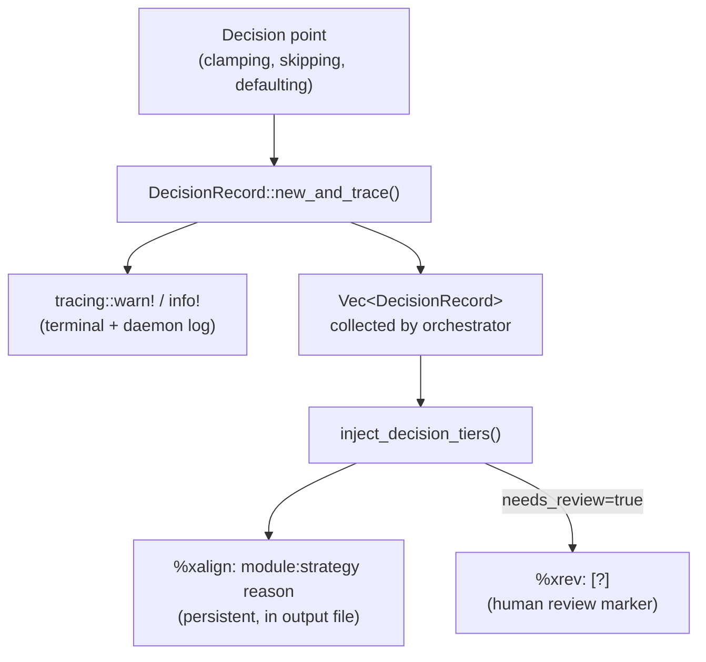

# Decision Provenance

**Status:** Current
**Last updated:** 2026-05-19 22:44 EDT

## Overview

Every batchalign3 command makes decisions that alter output: clamping
timestamps, stripping timing, skipping utterances, defaulting values,
normalizing text. These decisions were previously logged via `tracing` but
invisible to the user in the output CHAT file.

The **decision provenance system** surfaces these decisions as `%xalign` and
`%xrev` dependent tiers so users can review what the pipeline did and why.

## Architecture

**Single source of truth:** Every decision point creates a `DecisionRecord`
via `new_and_trace()`, which emits a structured tracing event AND returns
the record. No duplicate logging — the `DecisionRecord` is the source of
truth; tracing events, `%xalign` tiers, and dashboard warnings are all
derived from it.



Key design principle: **callers should NOT separately call `tracing::warn!`**
with the same information. `DecisionRecord::new_and_trace()` handles both
the tracing event and the record creation in one call.

## DecisionRecord

**Source:** `crates/talkbank-transform/src/decisions.rs` —
`DecisionRecord` at :281, `DecisionModule` at :38, `new_and_trace`
at :344, `inject_decision_tiers` at :380.

```rust,ignore
pub struct DecisionRecord {
    pub line_idx: usize,           // which utterance
    pub speaker: String,           // speaker code
    pub module: DecisionModule,    // pipeline stage
    pub strategy: &'static str,    // what was done
    pub reason: String,            // structured key=value detail
    pub needs_review: bool,        // emit %xrev: [?]?
}
```

### DecisionModule

| Module | Pipeline stage |
|--------|---------------|
| `Fa` | Forced alignment (grouping, injection, postprocessing) |
| `Utr` | Utterance timing recovery |
| `Monotonicity` | Monotonicity enforcement (end-time clamping, start-time stripping) |
| `Morphosyntax` | Stanza mapping, retokenization |
| `Utseg` | Utterance segmentation |
| `Build` | CHAT building from ASR output |
| `AsrPostprocess` | Compounds, numbers, Cantonese, retraces |

### Tier format

`%xalign` content is: `module:strategy reason_string`

```text
*CHI:   hello world . ⌈15⌉1000_5000⌈15⌉
%xalign:	monotonicity:end_clamped overlap=1200ms prev_end=6200 next_start=5000
```

When `needs_review` is true, a `%xrev: [?]` tier is also added:

```text
*CHI:   hello world .
%xalign:	monotonicity:timing_stripped non_monotonic start_ms=2000 previous_start_ms=5000
%xrev:	[?]
```

## Controlling output

The `--review-level` flag controls which decision tiers are emitted:

| Level | Behavior |
|-------|----------|
| `none` | No decision tiers (smallest output) |
| `low-confidence` (default) | Only `needs_review=true` decisions |
| `all` | Every decision + informational `%xalign: no_decisions` on clean utterances |

## Currently instrumented decisions

### Monotonicity enforcement

| Strategy | needs_review | When |
|----------|:------------:|------|
| `timing_stripped` | yes | Utterance start time is before previous utterance's start (E362 violation). All timing removed. |
| `end_clamped` | no | Utterance end time exceeds next utterance's start. End clamped to next start. |

**Source:** `crates/batchalign/src/chat_ops/fa/orchestrate.rs:213` —
`enforce_monotonicity()`

### UTR unmatched

| Strategy | needs_review | When |
|----------|:------------:|------|
| `utr_unmatched` | yes | Untimed utterance could not be matched to any ASR tokens during timing recovery. |

**Source:** `crates/batchalign/src/chat_ops/fa/utr.rs:223` — `run_global_utr()`

### FA word timing drop

| Strategy | needs_review | When |
|----------|:------------:|------|
| `words_timing_dropped` | yes | Word-level timing was dropped because clamping to utterance boundary made start >= end. |

**Source:** `crates/batchalign/src/chat_ops/fa/postprocess.rs:37` —
`postprocess_utterance_timings()`

### FA bullet repair (existing)

Repair decisions from `crates/batchalign/src/chat_ops/fa/repair.rs:58`
(`RepairDecision`) are converted to `DecisionRecord` via
`From<&RepairDecision>` and included in the same injection pass.

### Morphosyntax (morphotag command)

| Strategy | needs_review | When |
|----------|:------------:|------|
| `mapping_failed` | yes | UD→CHAT conversion failed for this utterance. No %mor/%gra produced. |
| `retokenization_failed` | yes | Stanza tokens could not be mapped back to CHAT words. No %mor/%gra produced. |
| `injection_failed` | yes | MOR word count mismatch (e.g., MWT expansion). No %mor/%gra produced. |
| `nlp_no_sentences` | yes | Stanza returned an empty response for this utterance. No %mor/%gra produced. |

**Source:** `crates/talkbank-transform/src/morphosyntax/injection.rs`
(consumed by `crates/batchalign/src/morphosyntax/worker.rs` on the
mapping/retokenization/injection error paths).

## Audit of uninstrumented silent decisions

These decisions are logged via `tracing` but not yet tracked as
`DecisionRecord`. They are candidates for future instrumentation:

| Decision | File | Priority |
|----------|------|:--------:|
| FA grouping skip (no timing/estimate) | `crates/batchalign/src/chat_ops/fa/grouping.rs` | Medium |
| Token stitching partial | `crates/batchalign/src/chat_ops/fa/alignment.rs` | Medium |
| Hardcoded period terminator | `crates/talkbank-transform/src/build_chat/` (directory) | Low |
| Default language (eng) | `crates/talkbank-transform/src/build_chat/` | Low |
| Cantonese normalization | `crates/talkbank-transform/src/asr_postprocess/cantonese.rs` | Low |
| Compound merging | `crates/talkbank-transform/src/asr_postprocess/compounds.rs` | Low |
| Number expansion | `crates/talkbank-transform/src/asr_postprocess/num2text.rs` | Low |
| Retrace detection | `crates/talkbank-transform/src/asr_postprocess/mod.rs` | Low |
| Stanza terminator mismatch | `crates/talkbank-transform/src/retokenize/parse_helpers.rs` | Low |
| Retokenization fallback | `crates/talkbank-transform/src/morphosyntax/injection.rs` | Medium |

## Integration with existing %xalign/%xrev

The decision provenance system generalizes the existing FA bullet
repair review tier infrastructure
(`crates/batchalign/src/chat_ops/fa/review_tiers.rs:26`
`inject_review_tiers`). The original `inject_review_tiers()` function
and `RepairDecision` type (`chat_ops/fa/repair.rs:58`) are preserved
for backward compatibility. `DecisionRecord` adds the `module` field
and `From<&RepairDecision>` enables seamless conversion.

The FA orchestrator (`crates/batchalign/src/chat_ops/fa/mod.rs` +
`chat_ops/fa/orchestrate.rs`) now collects decisions from all stages
(FA postprocessing, bullet repair, monotonicity enforcement) and
injects them in a single pass via `inject_decision_tiers()` (defined
at `crates/talkbank-transform/src/decisions.rs:380`).
