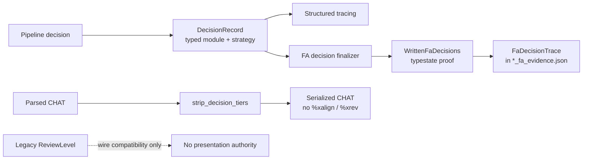
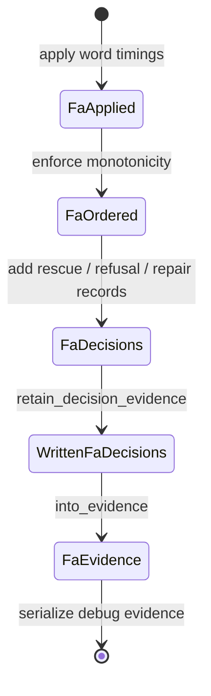

# Decision Evidence

**Status:** Current
**Last updated:** 2026-08-30 19:35 EDT

## Current policy

Batchalign3 records machine decisions such as timing removal, boundary
clamping, grouping refusal, and morphosyntax mapping failure as typed
`DecisionRecord` values. It does **not** write `%xalign` or `%xrev` dependent
tiers. The `align` and `morphotag` serialization paths strip those two
abandoned legacy tiers if they are present in an input file.

The CLI and wire protocol still accept `review_level` values so stored jobs and
older clients continue to deserialize. The value is deliberately absent from
the operation that finalizes decision evidence, so no caller can use it to
authorize CHAT-tier generation.


```mermaid
flowchart LR
    P["Pipeline decision"] --> R["DecisionRecord<br/>typed module + strategy"]
    R --> L["Structured tracing"]
    R --> F["FA decision finalizer"]
    F --> W["WrittenFaDecisions<br/>typestate proof"]
    W --> J["FaDecisionTrace<br/>in *_fa_evidence.json"]

    C["Parsed CHAT"] --> S["strip_decision_tiers"]
    S --> O["Serialized CHAT<br/>no %xalign / %xrev"]

    V["Legacy ReviewLevel"] -. "wire compatibility only" .-> X["No presentation authority"]
```

This separation is intentional. CHAT remains the researcher-facing transcript;
machine confidence and provenance remain machine-readable evidence rather than
dependent-tier clutter.

## The typed record

`DecisionRecord` is defined in
`crates/batchalign-transform/src/decisions.rs`:

```rust,ignore
pub struct DecisionRecord {
    pub line_idx: LineIdx,
    pub speaker: String,
    pub strategy: DecisionStrategy,
    pub reason: String,
    pub needs_review: bool,
}
```

`LineIdx` is a newtype over the index into `ChatFile.lines`; it cannot be
silently confused with an utterance ordinal. `DecisionStrategy` is an
exhaustive enum over module-specific strategy enums. Stable module and strategy
names are derived from those variants for tracing and serialized evidence.

`DecisionRecord::new_and_trace()` constructs and immediately traces a record.
Callers that construct records through an outcome adapter call `trace()` at the
decision boundary. A caller must not emit a second ad-hoc warning for the same
decision.

## Forced-alignment evidence lifecycle

Forced alignment has the complete durable path. The pipeline collects every
decision source in a `FaDecisions` struct rather than assembling parallel
vectors by convention. Adding a new source breaks both the full and incremental
paths at compile time until each explicitly supplies it.


```mermaid
stateDiagram-v2
    [*] --> FaApplied: apply word timings
    FaApplied --> FaOrdered: enforce monotonicity
    FaOrdered --> FaDecisions: add rescue / refusal / repair records
    FaDecisions --> WrittenFaDecisions: retain_decision_evidence
    WrittenFaDecisions --> FaEvidence: into_evidence
    FaEvidence --> [*]: serialize debug evidence
```

`retain_decision_evidence` performs two inseparable actions:

1. strips legacy `%xalign` and `%xrev` tiers from the CHAT model; and
2. returns `WrittenFaDecisions`, whose records and numeric timing effects are
   consumed into the FA evidence trace.

With `--debug-dir`, the resulting `<stem>_fa_evidence.json` contains typed
decision records alongside group windows, word identities, cache keys, source
classification, raw/pre-injection timings, fallback events, and validation
violations. The evidence file is the research and replay surface; CHAT is not.

The full, incremental, complete-`%wor`, and grouping-empty paths all traverse
the same finalizer. A run with zero fresh inference groups therefore cannot
erase a grouping refusal or monotonicity decision.

## Other command families

The shared vocabulary is broader than the currently durable evidence sinks.
That distinction matters:

| Command family | Typed outcome/record today | Trace today | Durable per-file decision evidence today |
|---|---|---|---|
| Forced alignment | Yes | Yes | Yes, in FA debug evidence when requested |
| Morphotag | Yes | Yes for anomaly records | No; the injection collection is not yet serialized |
| Utterance segmentation | Typed outcomes and adapters exist | Not a complete production sink | No |
| Coreference | Typed outcomes and adapters exist | Not a complete production sink | No |

Do not describe the common `DecisionRecord` vocabulary as though every command
already persists it. Extending durable evidence to morphotag, utseg, and coref
requires a typed result owned by each command and an explicit serialization
boundary; reintroducing CHAT tiers is not that boundary.

## CHAT cleanup paths

Both `align` and `morphotag` strip legacy review tiers unconditionally before
serialization. This includes:

- a normal inference run;
- a cache-only or no-work run;
- incremental morphotag with no changed utterances; and
- CA morphotag pass-through.

The CA case is covered by an end-to-end pipeline regression test because it
previously returned before cleanup and preserved old tiers.

## Adding a decision

1. Add a variant to the narrowest module-specific strategy enum.
2. Add its stable name in that enum's exhaustive `as_str()` match.
3. Construct the record at the point where the decision is made, using a typed
   line index and a structured key/value reason.
4. Set `needs_review` only when a human can usefully adjudicate the outcome.
5. Thread the record into the command's typed result. For FA, add a field to
   `FaDecisions` if it is a new producer; do not append it independently in the
   full and incremental paths.
6. Add a boundary test proving the record reaches its evidence sink. Do not add
   a test for CHAT-tier generation; no such operation exists.

## Legacy compatibility

`ReviewLevel::{None, LowConfidence, All}` remains serializable and parseable.
All values have the same presentation behavior: no `%xalign` or `%xrev` output.
New scripts should omit `--review-level`.

`strip_decision_tiers` retains its explicit legacy labels because removal must
recognize old files. References to those labels in cleanup tests are historical
fixtures, not supported output examples.
