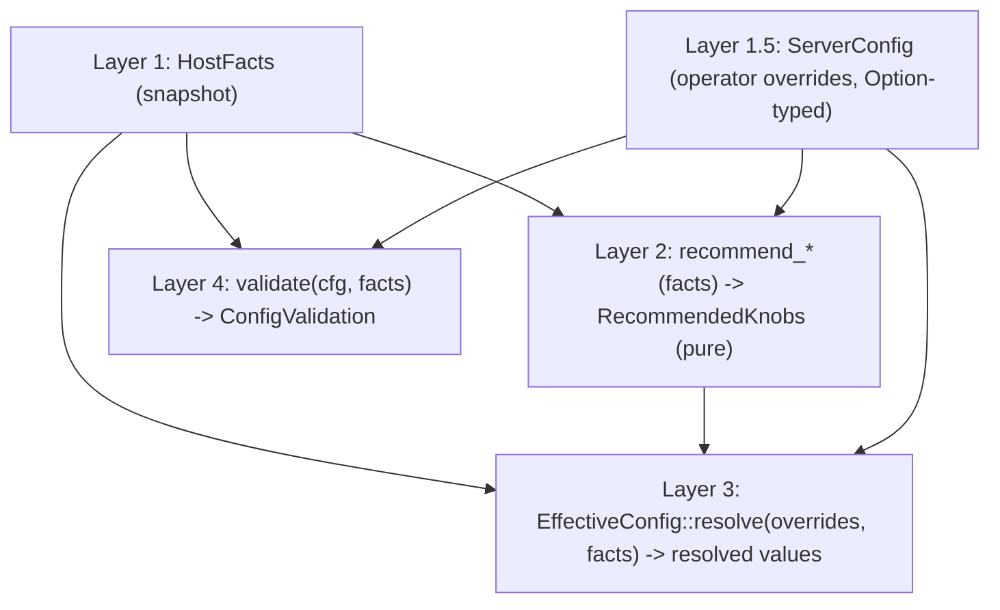

# Host Facts Pipeline

**Status:** Current
**Last updated:** 2026-05-08 18:40 EDT

The host-facts pipeline is the four-layer architecture that resolves
operator overrides against detected host capabilities and warns when
they contradict each other. It exists so a single `server.yaml` can
deploy across heterogeneous fleet hosts (Apple Silicon dev machines,
Linux + CUDA GPU servers, no-GPU laptops) without per-host tuning;
each host's resolved values come from the recommendation function
when the operator hasn't overridden them.

For the operator surface, see [`doctor`](../user-guide/doctor.md).
This architecture was motivated by a queue-wait incident on
2026-04-25.

## The four layers



### Layer 1: `HostFacts`

A snapshot of "what is this host?". Populated once at server startup
by a `HostFactsSource` and held in `AppState` for the process
lifetime. Downstream layers consume this struct; nothing else in the
runtime polls the OS for facts that live here.

Production source: `RealHostFactsSource` (in `host_facts/mod.rs`)
performs sysinfo polls (RAM, CPU count), platform detection (OS,
arch via `std::env::consts`), and GPU detection (Apple Silicon
short-circuit on macOS+arm64, `nvidia-smi` subprocess on Linux).
Detection is millisecond-scale. The snapshot lives for the process
lifetime; runtime memory pressure is handled by
`worker::memory_guard`'s live polls, not by re-detecting facts.

Test source: `MockHostFactsSource::new(facts)` returns a
pre-constructed `HostFacts` for table-driven testing. Together with
the `host_facts::test_helpers` fixtures
(`apple_silicon_64gb()` and `linux_cuda_24gb()`), every layer can
be tested against synthetic host shapes without touching real
hardware.

### Layer 2: `recommend_*` functions

Pure per-knob functions that derive a recommendation from `&HostFacts`.
Each lives in `host_facts/recommendations.rs` with table-driven unit
tests that pin the formula. The current per-knob recommenders:

| Function | Formula |
|---|---|
| `recommend_gpu_thread_pool_size` | 4 on functional GPU, 1 otherwise |
| `recommend_force_cpu` | `!gpu.is_functional_for_batchalign()` |
| `recommend_max_total_workers` | `clamp(ram_total_mb / 6 GB, 2, 32)`; fallback 4 when ram = 0 |
| `recommend_max_concurrent_jobs` | tier-and-CPU bounded (CPU clamped to `[1, 8]` against tier `max_suggested_workers`) |
| `recommend_max_workers_per_job` | per-command formula honoring `gpu_thread_pool_size` cap |
| `recommend_max_workers_per_key` | per-profile RAM-derived (gpu = ram/16GB clamped to `[1,8]`, stanza = ram/12GB clamped to `[1,8]`, io = 1) |

`recommend_memory_gate_mb` was retired on 2026-05-08 alongside the
`EMPIRICAL_MAX_CONCURRENT_JOBS_CAP = 4` clamp on
`recommend_max_concurrent_jobs`. Live admission/eviction primitives
in `worker/pool/{cpu_gate,memory_gate,rss_observer,idle_eviction}.rs`
replaced their roles — see [Memory Safety](memory-safety.md) for the
admission/eviction gate chain.

The `RecommendedKnobs` struct bundles the host-level scalar values;
`max_workers_per_job` and `max_workers_per_key` use richer per-key
shapes that don't fit the bundle.

### Layer 1.5: `ServerConfig` (operator overrides)

Each migrated knob is `Option<T>` in `ServerConfig`:

| Knob | Type | Sentinel migration |
|---|---|---|
| `gpu_thread_pool_size` | `Option<u32>` | `0 -> None` via `zero_as_none` |
| `force_cpu` | `Option<bool>` | no shim — `false` is meaningful |
| `max_total_workers` | `Option<u32>` | `0 -> None` |
| `max_concurrent_jobs` | `Option<u32>` | `0 -> None` |
| `max_workers_per_job` | `Option<u32>` | `0 -> None` |
| `max_workers_per_key` | `Option<u32>` | `0 -> None` (uniform fan-out across profiles) |
| `memory_gate_mb` | `Option<MemoryMb>` | `0 -> None` (`IsZero` impl on the newtype) |

`Some(v)` is an explicit operator override; `None` falls through to
the recommendation. The `zero_as_none` serde shim
(in `host_facts/serde_helpers.rs`) collapses pre-migration
`field: 0` from deployed `server.yaml` files to `None` so the
existing fleet keeps working without a coordinated re-render.
Phase G2 of the migration removes the shim once every host has been
re-rendered.

### Layer 3: `EffectiveConfig`

The resolved per-host runtime view. Constructed via
`EffectiveConfig::resolve_from_server_config(&cfg)` (which detects
facts, lifts `ServerConfig` to `ConfigOverrides`, and merges) or
the lower-level `EffectiveConfig::resolve(&overrides, &facts)` for
tests. Stored as `Arc<EffectiveConfig>` on `DispatchHostContext`
so per-job dispatch reads the resolved view rather than re-detecting.

The merge rule per knob is uniform: `override.unwrap_or(recommendation)`.
Per-profile and per-command merges follow the same rule, applied per
field/command.

### Layer 4: `validate`

Pure function `validate(cfg, facts) -> ConfigValidation`. Reads
operator overrides directly from `ServerConfig` (NOT from
`EffectiveConfig`, which has already merged the two — the validator
needs to distinguish "operator explicitly set X" from "fell through
to recommendation").

Today's findings:

- **Warnings** (non-fatal): override contradicts recommendation in a
  way that's suboptimal but won't crash. Surfaced as `tracing::warn!`
  at startup; `doctor --check` exits non-zero only if
  `--warnings-as-errors` is set.
  - `GpuThreadPoolSizeAboveOneOnCpu`
  - `MaxConcurrentJobsAboveRamBudget`
  - `MaxTotalWorkersAboveRamBudget`
  - `ForceCpuFalseOnNonFunctionalGpu`
- **Errors** (fatal): override would deterministically crash. Server
  refuses to start; `doctor --check` exits non-zero. Today's variant:
  - `MaxConcurrentJobsWouldDeterministicallyOom` — fires when
    `configured * worst_case_per_job_peak_ram_mb > ram_total_mb`.
    The "worst case" is the heaviest worker profile (GPU at 16 GB
    today). If even that scheduling outcome exceeds physical RAM,
    no jobset can fit; the server refuses to start.

Conservative-vs-recommendation cases (operator under-eager) are
intentionally silent: the operator knows their host better than
`recommend()` does, and silence is the right ergonomics for
"intentionally cautious".

## Wiring at startup

```mermaid
sequenceDiagram
    participant CLI
    participant serve_with_runtime as serve_with_runtime
    participant DispatchHostContext as DispatchHostContext
    participant Validate as validate()
    participant Workers

    CLI->>serve_with_runtime: cfg, pool_config, layout
    serve_with_runtime->>Validate: cfg + RealHostFactsSource.detect()
    Validate-->>serve_with_runtime: warnings -> tracing::warn!; errors -> abort
    serve_with_runtime->>DispatchHostContext: from_store (per JobStore)
    DispatchHostContext->>DispatchHostContext: EffectiveConfig::resolve_from_server_config
    DispatchHostContext-->>Workers: WorkerRuntimeConfig populated from EffectiveConfig
```

The two `RealHostFactsSource.detect()` calls per startup
(`serve_with_runtime` for validation, `DispatchHostContext` for
runtime) are both millisecond-scale. Sharing the snapshot would be
a small cleanup; deferred until the cost actually shows up.

## Adding a new knob

1. **Recommendation**: add `recommend_NEW(facts: &HostFacts) -> T`
   in `recommendations.rs` with table-driven unit tests covering
   the relevant fact shapes (Apple Silicon, CUDA, no-GPU).
2. **Override slot**: add `NEW: Option<T>` to `ConfigOverrides` in
   `effective.rs` and to `EffectiveConfig` (resolved value).
3. **Resolve**: extend `EffectiveConfig::resolve` with the merge
   line `NEW: overrides.NEW.unwrap_or(r.NEW)`.
4. **ServerConfig field**: add `NEW: Option<T>` with `zero_as_none`
   if T is integer-shaped (`#[serde(default,
   deserialize_with = "zero_as_none", skip_serializing_if =
   "Option::is_none")]`); for `bool` use plain
   `#[serde(default, skip_serializing_if = "Option::is_none")]`.
5. **Bridge**: extend `From<&ServerConfig> for ConfigOverrides` to
   populate the new field.
6. **Consumers**: production builders (`serve_cmd::start`,
   `dispatch::build_direct_pool_config`) read from
   `effective.NEW` when populating `WorkerRuntimeConfig` /
   `PoolConfig`.
7. **Tests**: 4 RED -> GREEN serde tests in
   `types/config/tests.rs` (legacy zero, explicit, absent,
   round-trip). Plus the `propagates_to_config_overrides` shape if
   relevant.
8. **Validation** (if the knob has a contradiction-with-fact mode):
   add a `ConfigWarning::NEW { ... }` variant with a self-explaining
   `Display`, the rule in `validate()`, and 5 tests (above, equal,
   below, None, Display contract).
9. **Doctor**: add an arm to `explain_knob` in
   `crates/batchalign/src/doctor_cmd.rs` so
   `doctor --explain NEW` works. The
   `explain_handles_every_documented_knob` test catches forgotten
   arms.
10. **Pyinfra render** (if the knob is rendered into `server.yaml`
    by pyinfra): add an `Optional[T]` field to
    `BatchalignServerConfig` in
    `automation/src/talkbank_automation/batchalign_render.py` with
    omit-when-None render policy, and an `_optional_host_TYPE`
    reader in `automation/pyinfra/deploys/deploy_batchalign3.py`.

## Public surface

External consumers (the doctor JSON output, future operator tools)
read through projection types in
`crates/batchalign/src/doctor_cmd.rs`:

- `HostFactsReport { detected, effective, validation }`
- `EffectiveConfigSummary` (flat bag of resolved scalars)
- `ValidationReport { warnings: Vec<String>, errors: Vec<String> }`
- `KnobExplanation { knob, resolved_value, source, recommendation,
  rule, facts_used }`

These are the JSON wire format — adding fields is
backwards-compatible but renames or removals must be conscious.
The runtime types (`HostFacts`, `EffectiveConfig`, `ConfigWarning`)
are NOT part of the operator API; they can evolve freely as long as
the projections still produce the documented JSON shape. This split
exists so internal refactoring doesn't accidentally leak into the
operator contract.
