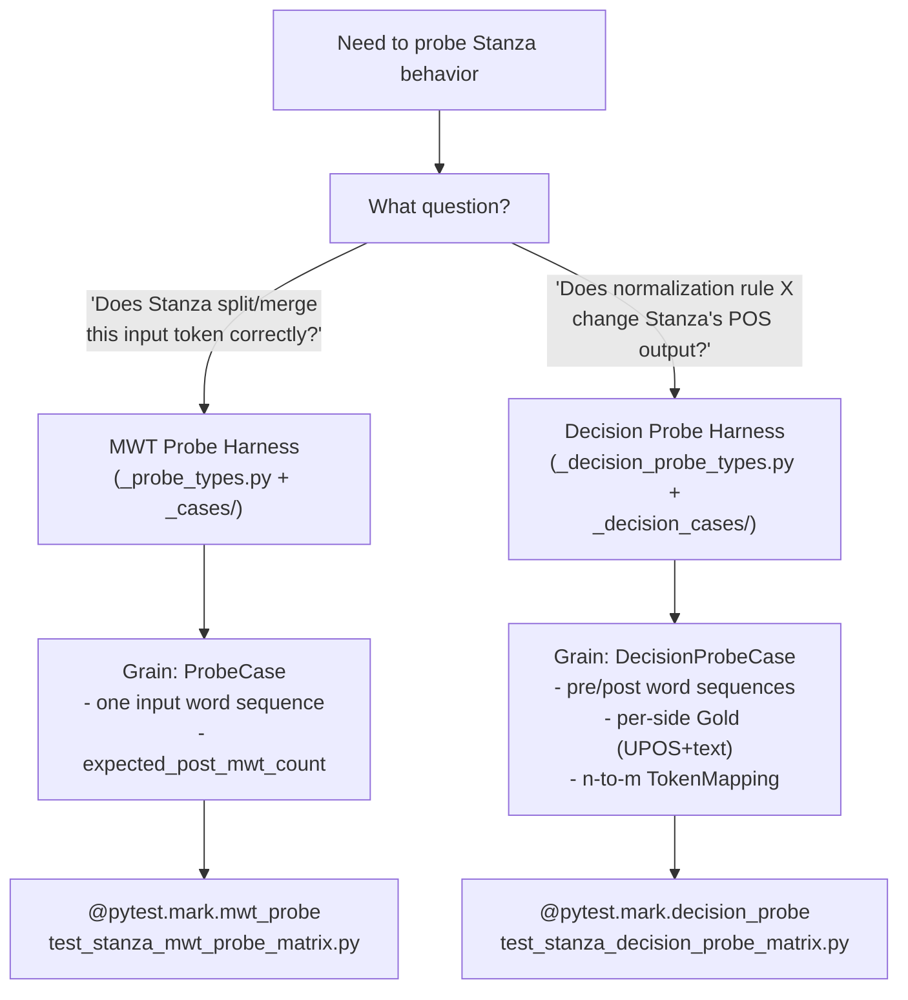
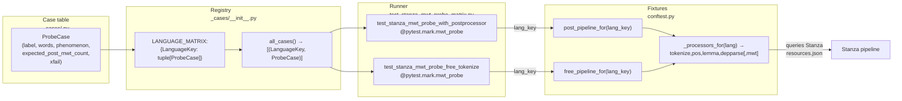
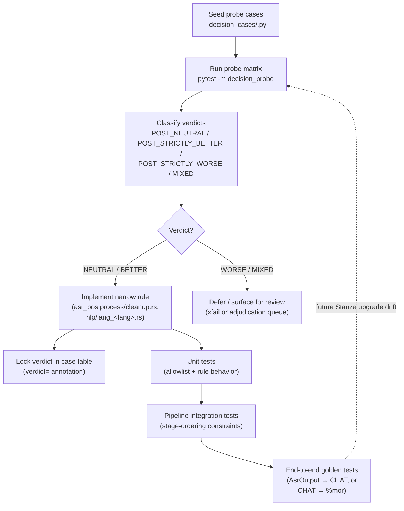

# Investigation Probe Harnesses

**Status:** Current
**Last updated:** 2026-05-01 09:47 EDT

batchalign3 uses Stanza as an oracle for investigation tests —
small, per-case probes that pin Stanza's current behavior so a
future upgrade or regression surfaces as a test failure. This
page is the developer reference for the two probe harnesses,
when to use each, how cases are organized, how to run them, and
how verdicts get locked.

## Why probes, not assertions?

Traditional unit tests assert what code *should* do. Probe tests
assert what an external library (Stanza) *does* — the probe's
job is to bind our pipeline's expectations to the library's
current behavior. If Stanza changes, probes fail in a way that
surfaces the change for re-review.

This pattern matters for batchalign3 because:

1. Stanza's MWT expansion varies per language, per token, per
   version. Hardcoding "Stanza will produce 2 UD words for
   `don't`" in a normal test is fragile — and wrong for
   languages where Stanza's MWT model doesn't fire.
2. Author-written expected POS / count values are biased. The
   author writes the test mirroring their expectation; the test
   passes trivially when code matches intent rather than reality.
3. Stanza drift is invisible. Without probes, a Stanza model
   upgrade that changes tokenization on 5% of Italian inputs
   would be noticed only by users in production, not CI.

See `feedback_empirical_before_assertions` in memory for the
design principle: run real libraries in isolation before baking
RED expectations.

## Two harnesses, two purposes



### MWT probe harness

Lives at:

- `batchalign/tests/investigations/_probe_types.py` — types
  (`ProbeCase`, `Phenomenon`, `XfailMark`).
- `batchalign/tests/investigations/_cases/<lang>.py` — per-language
  case tables.
- `batchalign/tests/investigations/_cases/__init__.py` — the
  `LANGUAGE_MATRIX` registry.
- `batchalign/tests/investigations/test_stanza_mwt_probe_matrix.py`
  — runner, paired (free-tokenize, with-postprocessor) per case.

**Use when**: you need to know "how many UD words does Stanza
produce for this input token sequence?" Typical questions:

- Does Stanza MWT-expand `don't` into two words?
- Does our postprocessor suppress the expansion for Catalan
  `l'home`?
- Does Stanza's Italian tokenizer keep `arancione` as one word
  or mis-split it?

Case shape:

```python
ProbeCase(
    label="dont_alone",
    words=("don't",),
    phenomenon=Phenomenon.CONTRACTION,
    expected_post_mwt_count=2,  # None = observe-only
    xfail=None,                  # or XfailMark(defect_slug, reason)
)
```

### Decision probe harness

Lives at:

- `batchalign/tests/investigations/_decision_probe_types.py` —
  types (`DecisionProbeCase`, `Gold`, `TokenMapping`,
  `DecisionOutcome`, `CandidateClass`, `StanzaTokenOutput`,
  `compare_stanza_outputs`).
- `batchalign/tests/investigations/_decision_cases/<lang>.py` —
  per-language case tables (1 file today: `english.py`).
- `batchalign/tests/investigations/test_stanza_decision_probe_matrix.py`
  — runner.

**Use when**: you need to compare Stanza's output on a
*pre-normalization* form against its output on a
*post-normalization* form, to decide whether a proposed rule
helps, hurts, or is neutral. Typical questions:

- Does capitalizing bare `i` → `I` change Stanza's POS for that
  word? (Answer: no — both tag as PRON.)
- Does stripping the period from `Dr.` → `Dr` produce a
  different POS? (Answer: no — both tag as PROPN.)
- Does stripping the period from `3.14` → `3` change the
  text? (Answer: yes — catches the decimal semantic loss.)

Case shape (v2):

```python
DecisionProbeCase(
    label="dr_before_name",
    utterance_prose="Dr. Matthews is here.",
    pre_words=("Dr.", "Matthews", "is", "here"),
    post_words=("Dr", "Matthews", "is", "here"),
    affected_mappings=(
        TokenMapping(
            pre_token_indices=(0,),
            post_token_indices=(0,),
            gold=Gold(pre_upos=("PROPN",), post_upos=("PROPN",)),
        ),
    ),
    expected_outcome=DecisionOutcome.POST_NEUTRAL,
    rationale="Stanza PROPN both sides.",
    candidate_class=CandidateClass.TITLE_PERIOD,
)
```

## Lifecycle of a probe case

```mermaid
stateDiagram-v2
    [*] --> Seed: Author writes case
    Seed --> Observe: Golden run
    Observe --> Adjudicate: Linguistic review
    Adjudicate --> Locked: expected value set
    Adjudicate --> Observe: Back to observation
    Locked --> [*]: CI enforces
    Locked --> Adjudicate: Library upgrade breaks assertion

    Seed: "Seed\n(OBSERVE_ONLY or expected=None)"
    Observe: "Observe\n(runner prints Stanza output;\nno assertion)"
    Adjudicate: "Adjudicate\n(compare observation with\nexpected linguistic behavior)"
    Locked: "Locked\n(expected_post_mwt_count set\nor expected_outcome non-OBSERVE_ONLY)"
```



## Running probes

Probes are all `@pytest.mark.golden` so they do NOT run in
default CI. Sub-markers allow fine-grained selection:

| Command | Runs |
|---------|------|
| `uv run pytest` | Fast tests only — no probes |
| `uv run pytest -m "golden and mwt_probe"` | All MWT probes (~45s on ming) |
| `uv run pytest -m "golden and decision_probe"` | All decision probes (~4s) |
| `uv run pytest -m "golden and mwt_probe" -k "fra or ita"` | French + Italian MWT only |
| `uv run pytest -m golden` | All golden tests (includes probe matrices + other ML goldens) |

Use `-n0 -s` to serialize and show print output for observation.

## Adding a new language to the MWT matrix

Five mechanical steps:

1. **Add `LanguageKey` in `_cases/__init__.py`.**
   ```python
   CAT = LanguageKey(alpha2="ca", alpha3="cat")
   ```

2. **Add pipeline fixtures in `conftest.py`.** Pattern:
   ```python
   @pytest.fixture(scope="module")
   def catalan_pipeline_with_postprocessor():
       return _pipeline_with_postprocessor("ca", "ca")

   @pytest.fixture(scope="module")
   def catalan_pipeline_free_tokenize():
       return _pipeline_free("ca")
   ```
   `_pipeline_with_postprocessor` / `_pipeline_free` query Stanza's
   runtime resources via `_processors_for(lang)` and include
   `mwt` only if the language has a model. No need to hardcode.

3. **Wire the language key into both resolvers** (`post_pipeline_for`
   and `free_pipeline_for`). Add an entry to each resolver's
   fixture-name dict.

4. **Write `_cases/<lang>.py`** with a tuple of `ProbeCase`. Start
   with observe-only (no `expected_post_mwt_count`) — the golden
   run tells you what Stanza produces; lock afterwards.

5. **Register the language in `LANGUAGE_MATRIX`** in
   `_cases/__init__.py`:
   ```python
   LANGUAGE_MATRIX = {
       ...,
       CAT: catalan.CASES,
   }
   ```

Run `uv run pytest -m "golden and mwt_probe" -k <alpha3>` to
observe Stanza's behavior and lock the expected counts.

## Harness architecture



## Parity-audit pattern

The probe harness has a second lifecycle: comparing BA3 output
against a reference system (e.g., BA2-jan9) to establish parity.
Pattern:

1. Enumerate every rule in the reference system.
2. For each, identify a probe in BA3 that exercises the same
   behavior.
3. If no probe exists, add one.
4. Run the golden matrix. Observe per-rule outcomes.
5. Classify each rule: **full parity**, **parity via alternative
   mechanism**, **rule retired with evidence** (reference rule
   is obsolete — new system handles natively), or **active gap**
   (reference handled; new system doesn't).

The retokenization parity audit applies this pattern across the
morphology tables, tokenization rule families, and native-MWT drift
sentinels. All probed rules achieve parity except one active gap
(Italian Defect 6 family), documented separately.

Use this pattern whenever you need to convince yourself that a
rewrite preserves semantics — don't rely on reading both codebases
side-by-side; probe them both and compare.

## Relation to production

Probe harnesses test **raw Stanza output** — what Stanza's Python
pipeline produces when called directly. Production batchalign3
has additional layers downstream (Rust-side Range reassembly,
`map_ud_sentence` merging MWT components into single `%mor`
entries, etc.) that shape the final CHAT output.

This means:

- Probe `expected_post_mwt_count=2` for `don't` asserts Stanza
  emits 2 UD words, not that the final CHAT %mor has 2 entries.
  (Final CHAT has 1 entry: `verb|do~part|not`.)
- Probe-level regression does not necessarily mean user-visible
  regression — the downstream layers may absorb the change. But
  probe-level regression signals that *something* at the Stanza
  boundary shifted, which warrants investigation.

For end-to-end production behavior, see the `%mor` integration
tests under `crates/batchalign/src/morphosyntax/tests.rs`
and the ML golden tests under `batchalign/tests/golden/`. Those
exercise the full pipeline including reassembly.

## The probe-to-ship feedback loop

Probes are not an end in themselves; they feed a closed loop that
turns empirical Stanza behavior into shipped Rust rules with
regression coverage at every layer. The English transcribe
corrections and the Italian Defect 6/7/8 reconciler both
travelled this loop:



Two concrete instances of this loop:

- **English transcribe rules.** 29 English
  decision-probe cases covered TITLE, PLACE, TIME, INITIALISM,
  DEGREE, TECHNICAL, PRONOUN_I, I_CONTRACTION, UTTERANCE_INITIAL,
  SENTENCE_PERIOD, DECIMAL_CONTROL families. 22 locked
  POST_NEUTRAL, 2 POST_STRICTLY_WORSE (the DECIMAL_CONTROL / period
  exclusions that prove the allowlist design), and the
  `etc.`/`eg`/`ie`/`M.D.` family was Q-B-adjudicated (Stanza POS
  preferred over hand-gold). The rules ship in
  `asr_postprocess/cleanup.rs`; verdicts stay locked in
  `_decision_cases/english.py`.
- **Italian Defect 6/7/8.** Probe matrix
  surfaced `parla → par + la`, `arancione → arancio + ne`, and
  the compound-imperative family (`dammela`, `prendilo`, …). The
  adjudication routed to a Rust-side reconciler in `nlp/lang_it.rs`
  (two allowlists + `map_ud_sentence` plumbing), with synthetic-UD
  tests in `nlp/mapping/mod.rs` and end-to-end golden coverage in
  `test_italian_defect6_end_to_end.py`.

The feedback direction matters: **probes lead, code follows**. We
do not write a rule and then probe to "confirm" it; we probe
first, classify, then ship only when the verdict warrants it. A
future Stanza upgrade that invalidates a locked verdict will
surface as a probe diff, which re-enters the loop at the Classify
node.

## Related docs

- `reference/stanza-limitations.md` — pinned Stanza defects
  (Defect 6, 7, etc.) cross-referenced from probe xfails.
- `reference/retokenization-overview.md` — per-language
  retokenization behavior summary; probe findings drive this doc.
- `reference/languages/<lang>.md` — per-language special
  treatment, with probe citations.
