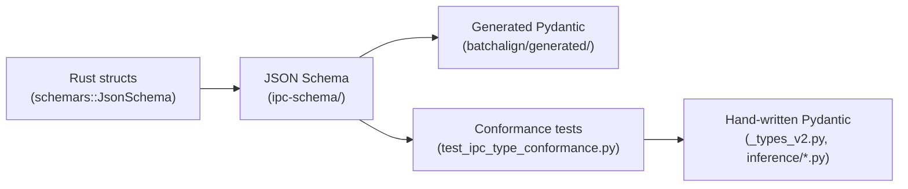

# Rust→Python IPC Type Sync

**Status:** Current
**Last updated:** 2026-05-19 22:53 EDT

## Problem

Rust structs and Python Pydantic models at the worker IPC boundary are
defined independently. Mismatches only surface at runtime — Pydantic
validation errors deep in the pipeline with no indication of which field
changed. This has caused production bugs (e.g., `MorphosyntaxBatchItem.
special_forms` serialization mismatch).

**See also:** [INTERFACE_MAP.md](https://github.com/TalkBank/talkbank-tools/blob/main/INTERFACE_MAP.md) section "10. Worker V2 IPC Schema"
for the unified reference to all schema, generated, and conformance-test locations.

## Solution: One Source of Truth

Rust types are the source of truth. Python types are either **generated**
from Rust schemas or **conformance-tested** against them.



### Pipeline

```bash
# Step 1: Generate JSON Schema from Rust types
cargo run -p batchalign -- ipc-schema --output ipc-schema/

# Step 2: Generate Python Pydantic models + check conformance
bash scripts/generate_ipc_types.sh

# Step 3: Check for drift (CI)
bash scripts/check_ipc_type_drift.sh
```

### What lives where

| Layer | Source of truth | Files |
|-------|----------------|-------|
| Rust types | Canonical definitions | `crates/batchalign-types/src/worker_v2/`, re-exported by `crates/batchalign/src/types/worker_v2.rs`, plus `crates/batchalign/src/morphosyntax/mod.rs` |
| JSON Schema | Generated from Rust | `ipc-schema/worker_v2/*.json`, `ipc-schema/batch_items/*.json` |
| Generated Python | Generated from schema | `batchalign/generated/worker_v2/`, `batchalign/generated/batch_items/` |
| Hand-written Python | Conformance-tested | `batchalign/worker/_types_v2.py`, `batchalign/inference/*.py` |
| Conformance tests | Validates hand-written against schema | `batchalign/tests/test_ipc_type_conformance.py` |

The `worker_v2` layer name is still intentional. V1 remains in-tree as the
frozen `worker` / `_types.py` compatibility surface, so the schema directory,
generated package, and typed Python overlays keep the versioned namespace until
that older contract is retired together.

### Why both generated AND hand-written?

Generated types are structurally correct but lack:

- **Custom validators** — 4 types have `@model_validator` range checks
  (e.g., `end_s >= start_s` on `WhisperChunkSpanV2`)
- **Custom type aliases** — `FiniteNonNegativeFloat`, `WorkerRequestIdV2`
- **`extra="allow"`** on `UdWord` (allows unknown Stanza fields)

The hand-written types keep these behaviors. Conformance tests verify they
match the Rust schema structurally. Over time, generated types can replace
hand-written ones by adding validators as thin subclass overlays.

## Adding a New IPC Type

When you add a Rust type that will cross the Python boundary:

1. **Derive `schemars::JsonSchema`** on the Rust struct/enum:
   ```rust,ignore
   #[derive(Serialize, Deserialize, schemars::JsonSchema)]
   pub struct MyNewPayloadV2 { ... }
   ```

2. **Register it** in `crates/batchalign/src/cli/ipc_schema.rs`
   (the `ipc-schema` CLI subcommand is wired through `cli/mod.rs`
   and `cli/args/commands.rs::IpcSchemaArgs`):
   ```text
   register!(v2, MyNewPayloadV2);
   ```

3. **Add the Python model** in the appropriate file (or use generated):
   ```python
   class MyNewPayloadV2(BaseModel):
       # Fields matching Rust struct
       ...
   ```

4. **Add a conformance test** in `test_ipc_type_conformance.py`:
   ```python
   def test_my_new_payload(self) -> None:
       from batchalign.worker._types_v2 import MyNewPayloadV2
       schema = _load_schema("worker_v2", "MyNewPayloadV2")
       _assert_fields_match(schema, MyNewPayloadV2)
   ```

5. **Regenerate schemas**: `bash scripts/generate_ipc_types.sh`

### For talkbank-model types

Types from `talkbank-model` (e.g., `FormType`, `LanguageResolution`) don't
derive `JsonSchema` because schemars isn't a dependency of talkbank-tools.
Use `#[schemars(with = "...")]` to override the schema with the wire format:

```rust,ignore
#[schemars(with = "String")]
pub lang: talkbank_model::model::LanguageCode,

#[schemars(with = "Vec<(Option<String>, Option<String>)>")]
pub special_forms: Vec<(Option<FormType>, Option<LanguageResolution>)>,
```

### For types with custom serialization

When a field has `#[serde(serialize_with = "...")]`, the schemars derive
won't know the wire format. Always pair it with `#[schemars(with = "...")]`
to describe the JSON shape:

```text
#[serde(serialize_with = "serialize_special_forms")]
#[schemars(with = "Vec<(Option<String>, Option<String>)>")]
pub special_forms: ...
```

## Adding a New Engine

When adding a new ASR/FA/NLP engine to batchalign3, the IPC type sync
system helps ensure the Python worker types match:

1. Define request/result types in Rust with `JsonSchema` derive
2. Register them in `ipc_schema.rs`
3. Generate schemas → see the exact field shapes Python must implement
4. Write the Python Pydantic model matching the schema
5. Add conformance test

This is significantly easier than the previous approach of manually
keeping Rust and Python types in sync by reading both codebases.

## CI Integration

Add to your CI pipeline:

```yaml
- name: Check IPC type drift
  run: bash scripts/check_ipc_type_drift.sh
```

This exits non-zero if any Rust type has changed without regenerating
schemas. The conformance tests catch Python-side drift.

## Future: Full Generation

The end goal is to replace all hand-written Python IPC types with imports
from `batchalign/generated/`. The remaining steps:

1. Add thin subclass overlays for types with validators
2. Replace imports in `_types_v2.py` with re-exports from generated
3. Replace imports in `inference/*.py` with re-exports from generated
4. Remove conformance tests (generated types are correct by construction)
