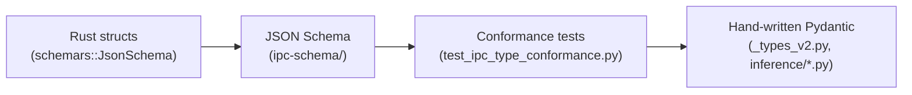

# Rust→Python IPC Type Sync

**Status:** Current
**Last updated:** 2026-05-19 22:53 EDT

## Problem

Rust structs and Python Pydantic models at the worker IPC boundary are
defined independently. Mismatches only surface at runtime, Pydantic
validation errors deep in the pipeline with no indication of which field
changed. This has caused production bugs (e.g., `MorphosyntaxBatchItem.
special_forms` serialization mismatch).

**See also:** [INTERFACE_MAP.md](https://github.com/TalkBank/talkbank-tools/blob/main/INTERFACE_MAP.md) section "10. Worker V2 IPC Schema"
for the unified reference to all schema, generated, and conformance-test locations.

## Solution: One Source of Truth

Rust types are the source of truth. The JSON Schema is generated from them,
and the hand-written Python models are conformance-tested against that schema.


```mermaid
flowchart LR
    rust["Rust structs\n(schemars::JsonSchema)"] --> schema["JSON Schema\n(ipc-schema/)"]
    schema --> test["Conformance tests\n(test_ipc_type_conformance.py)"]
    test --> handwritten["Hand-written Pydantic\n(_types_v2.py, inference/*.py)"]
```

Both arrows are gated. `check_ipc_type_drift.sh` fails when the committed
schema no longer matches the Rust types, and the conformance test fails when a
Python model no longer matches the schema. Neither is optional: they run in
`make batchalign-ci-python` and in CI.

### Pipeline

```bash
# Step 1: Generate JSON Schema from Rust types
cargo run -p batchalign -- ipc-schema --output ipc-schema/

# Or via the script, which is the same command with the paths filled in
bash scripts/generate_ipc_types.sh

# Step 2: Check for drift (runs in `make batchalign-ci-python` and CI)
bash scripts/check_ipc_type_drift.sh

# Step 3: Check the hand-written Python models against the schema
uv run pytest batchalign/tests/test_ipc_type_conformance.py
```

### What lives where

| Layer | Source of truth | Files |
|-------|----------------|-------|
| Rust types | Canonical definitions | `crates/batchalign-types/src/worker_v2/`, re-exported by `crates/batchalign/src/types/worker_v2.rs`, plus `crates/batchalign/src/morphosyntax/mod.rs` |
| JSON Schema | Generated from Rust | `ipc-schema/worker_v2/*.json`, `ipc-schema/batch_items/*.json` |
| Hand-written Python | Conformance-tested | `batchalign/worker/_types_v2.py`, `batchalign/inference/*.py` |
| Conformance tests | Validates hand-written against schema | `batchalign/tests/test_ipc_type_conformance.py` |

The `worker_v2` layer name is still intentional. V1 remains in-tree as the
frozen `worker` / `_types.py` compatibility surface, so the schema directory
and the typed Python overlays keep the versioned namespace until that older
contract is retired together.

### Why the Python models are hand-written

A generated Pydantic layer existed under `batchalign/generated/` until
2026-08-14, produced by `datamodel-codegen` from the same schema, with the
stated plan of replacing the hand-written models by adding validators as thin
subclass overlays. It was removed, having been imported by nothing for three
months, and the plan was abandoned rather than deferred, because carrying it
out would have made the Python boundary WORSE:

- **Domain types would be lost.** Codegen emits `str` and `float`. The
  hand-written models carry `LanguageCode`, `Terminator`, `WorkerRequestIdV2`
  and `FiniteNonNegativeFloat`, and this codebase does not accept a bare
  primitive at a stable boundary.
- **Validators cannot be generated.** Several models enforce relationships a
  schema cannot state, such as `end_s >= start_s` on `WhisperChunkSpanV2` and
  the parallel-array lengths on `FaInferItem`.
- **`extra="allow"`** on `UdWord`, which lets unknown Stanza fields through,
  has no schema expression either.

What the generated layer was for, keeping the two sides in step, is done by
the two gates above, and they are cheaper: one representation per language,
neither of which is a mirror of the other.

## Adding a New IPC Type

When you add a Rust type that will cross the Python boundary:

1. **Derive `schemars::JsonSchema`** on the Rust struct/enum:
   ```rust,ignore
   #[derive(Serialize, Deserialize, schemars::JsonSchema)]
   pub struct MyNewPayloadV2 { ... }
   ```

2. **Register it** in `crates/batchalign/src/cli/ipc_schema.rs`
   (the `ipc-schema` CLI subcommand is wired through `cli/mod.rs`
   and `cli/args/commands.rs::IpcSchemaArgs`):
   ```text
   register!(v2, MyNewPayloadV2);
   ```

3. **Add the Python model** in the appropriate file (or use generated):
   ```python
   class MyNewPayloadV2(BaseModel):
       # Fields matching Rust struct
       ...
   ```

4. **Add a conformance test** in `test_ipc_type_conformance.py`:
   ```python
   def test_my_new_payload(self) -> None:
       from batchalign.worker._types_v2 import MyNewPayloadV2
       schema = _load_schema("worker_v2", "MyNewPayloadV2")
       _assert_fields_match(schema, MyNewPayloadV2)
   ```

5. **Regenerate schemas**: `bash scripts/generate_ipc_types.sh`

### For talkbank-model types

Types from `talkbank-model` (e.g., `FormType`, `LanguageResolution`) don't
derive `JsonSchema` because schemars isn't a dependency of talkbank-tools.
Use `#[schemars(with = "...")]` to override the schema with the wire format:

```rust,ignore
#[schemars(with = "String")]
pub lang: talkbank_model::model::LanguageCode,

#[schemars(with = "Vec<(Option<String>, Option<String>)>")]
pub special_forms: Vec<(Option<FormType>, Option<LanguageResolution>)>,
```

### For types with custom serialization

When a field has `#[serde(serialize_with = "...")]`, the schemars derive
won't know the wire format. Always pair it with `#[schemars(with = "...")]`
to describe the JSON shape:

```text
#[serde(serialize_with = "serialize_special_forms")]
#[schemars(with = "Vec<(Option<String>, Option<String>)>")]
pub special_forms: ...
```

## Adding a New Engine

When adding a new ASR/FA/NLP engine to batchalign3, the IPC type sync
system helps ensure the Python worker types match:

1. Define request/result types in Rust with `JsonSchema` derive
2. Register them in `ipc_schema.rs`
3. Generate schemas → see the exact field shapes Python must implement
4. Write the Python Pydantic model matching the schema
5. Add conformance test

This is significantly easier than the previous approach of manually
keeping Rust and Python types in sync by reading both codebases.

## CI Integration

Wired into CI as:

```yaml
- name: Verify IPC schema matches the Rust types
  run: bash scripts/check_ipc_type_drift.sh
```

This is wired into the `typecheck` job of `batchalign-python.yml` and into
`make batchalign-ci-python`. It exits non-zero if any Rust type has changed
without the schema being regenerated; the conformance tests catch Python-side
drift. Until 2026-08-14 the script existed and ran nowhere, so a schema stale
against its own source could sit in the tree indefinitely, and the conformance
test would go on checking Python against yesterday's contract without a word.

## Retired: full generation

This page used to end with a plan to replace every hand-written Python IPC
type with an import from a generated package, and to delete the conformance
tests as redundant once that landed. The plan is retired; the reasons are in
"Why the Python models are hand-written" above.

What generalises beyond this case: generation removes
drift by removing one of two representations, which is the right instinct. It
was the wrong trade HERE because the representation it would have removed is
the one carrying the domain types and the validators, and the one it would have
kept cannot express either. When the two sides of a boundary are two languages,
a conformance test is not a confession that one representation should not
exist. It is the only thing that can hold two type systems to one contract.
