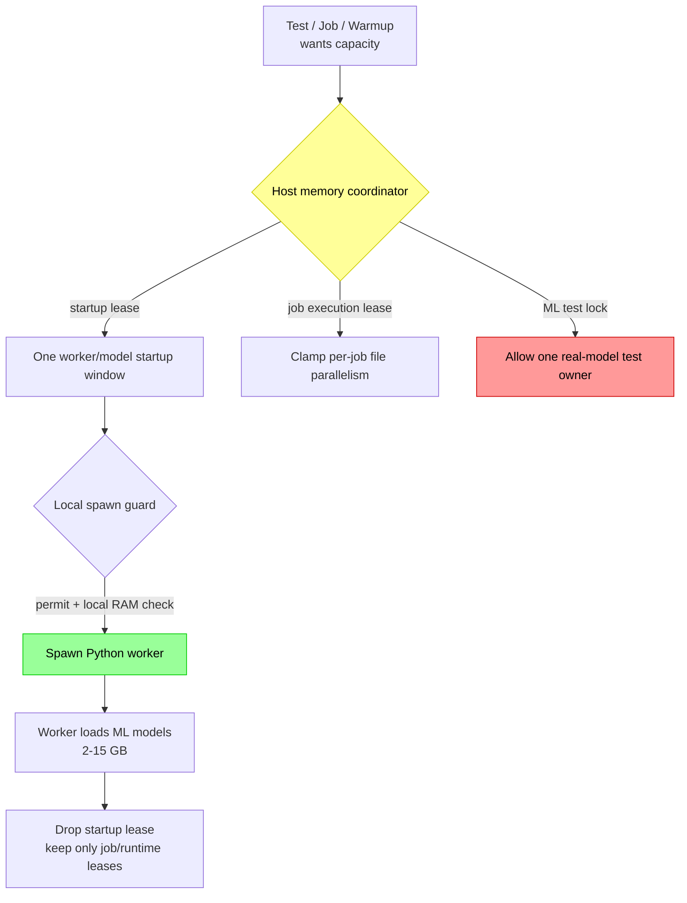
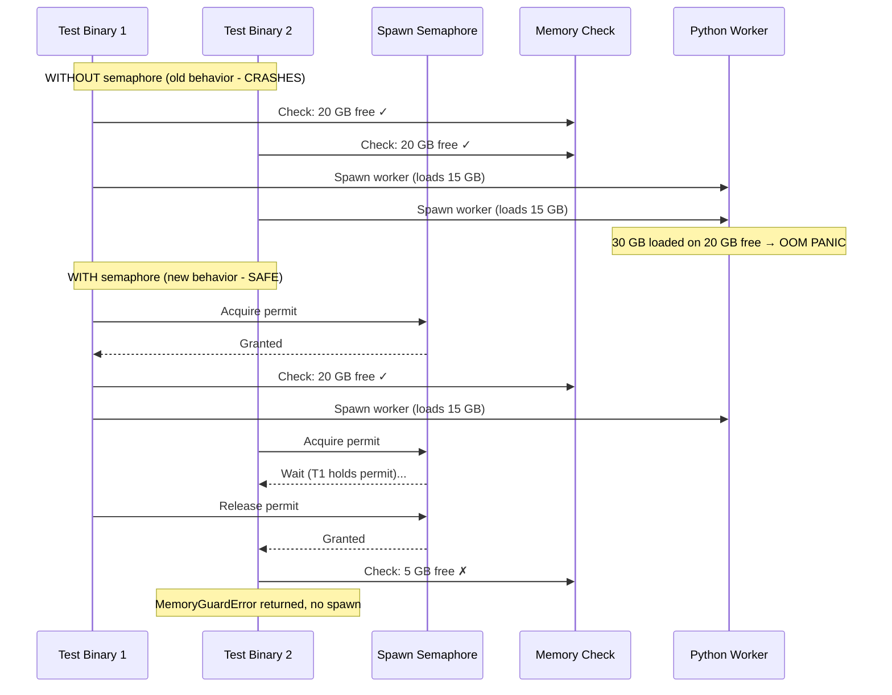

# Memory Safety: Preventing Kernel OOM Crashes

**Status:** Current
**Last updated:** 2026-05-23 22:00 EDT

## The Problem

Each Python ML worker loads 2-15 GB of models (Whisper, Stanza, etc.). When
multiple workers spawn concurrently, from parallel test binaries, warmup, or
job dispatch, they collectively exceed physical RAM and trigger a **kernel-level
OOM panic** that crashes the entire machine. This is not a process-level OOM
kill; it is a Jetsam-triggered kernel panic that requires a hard reboot.

**Sample observed failure modes:**
- 5 python3.12 workers × ~13-15 GB each = ~70 GB on a 64 GB machine
- A multi-file transcription run with the default auto-tuner exhausted
  the machine's 64 GB

## Architecture



## Defense Layers

### Layer 0: Live admission gates at the worker-pool spawn seam

`worker/pool/{cpu_gate,memory_gate}.rs` are the cheapest, earliest
admission predicates. They run inside `try_claim_spawn_slot` before
any permit acquisition or lease reservation, so a saturated host
doesn't burn through the global-permit semaphore on doomed spawns.

The gates run two distinct policies, named explicitly per
`PoolGateState` (derived in `worker/pool/lifecycle.rs`):

- **ColdStart**: first worker for a `(profile, lang, engine)`
  class. Both gates **bypass** unconditionally: back-pressure has
  nothing to push against on an empty pool, and refusing here
  leaves the pool dead-on-arrival on memory-tight hosts (the
  laptop-class failure mode that motivated the split).
- **Warm**: N+1 worker for a class with existing workers. Both
  gates run their projection.

| Gate | Warm predicate | Source |
|---|---|---|
| CPU loadavg | `getloadavg(3).one < available_parallelism()` | `cpu_gate.rs` |
| Memory floor + projection | `available_mb − new_worker_estimate_mb > host_min_free_mb_threshold_for_tier(tier)` | `memory_gate.rs` |

The Warm-gate floor is **tier-scaled**: 1024 MB Small / 2048 MB
Medium / 4096 MB Large / 4096 MB Fleet. The historical fixed
`MIN_FREE_MEMORY_MB = 2048` constant is now the Medium-tier value
and the JobStore-level gate's default; it is no longer the single
admission floor.

The `new_worker_estimate_mb` is the average RSS of same-profile
idle peers (Mode B, `rss_observer.rs`) when peers exist; otherwise
falls back to the canonical per-tier `MemoryTier::*_startup_mb`
(Mode A fallback), `tier.gpu_startup_mb`, `tier.stanza_startup_mb`,
`tier.io_startup_mb`. Per the spec at
`<workspace>/docs/architecture/2026-05-10-tier-aware-memory-consolidation.md`
(Principle 1), `MemoryTier` is the sole canonical source of these
values; an architectural-invariant test in `types/runtime.rs`
prevents reintroduction of parallel constants.

The Mode-A fallback is further **engine-aware** for the IO profile,
via `memory_gate::engine_aware_startup_reservation_mb`. The IO
baseline (`tier.io_startup_mb`: 2 GB Small/Medium, 4 GB Large/Fleet)
is correct for engines that are thin API clients (Google Translate
via `googletrans`) but under-reserves for engines that load large
local models in the worker process, SeamlessM4T (~2.4 GB resident)
and NLLB-200-distilled-1.3B (~5 GB resident). The helper takes the
MAX of the profile baseline and the engine's resident footprint as
declared by `TranslateEngineName::resident_memory_mb`, so the
admission gate refuses to spawn an NLLB worker on a Medium-tier
host that doesn't have ~5 GB of headroom. Workers running the
lightweight Google engine continue to pay the IO baseline.

Admission is back-pressure, not safety (Principle 5). The
correctness floor is `worker/memory_guard.rs` (per-spawn host-memory
reservation + RSS observation + kill on overrun) plus the OS OOM
killer. An over-permissive admission means a worker may die at
spawn, bounded cost. An over-strict admission means the host
can't run at all, unbounded cost (jobs queue forever). The bias
is toward over-permissive; ColdStart bypass implements the bias.

The eviction-side counterpart: `worker/pool/idle_eviction.rs` runs as
a pre-pass in `run_health_check` and evicts idle workers
largest-RSS first when `available_mb` falls at or below
`EVICTION_PRESSURE_THRESHOLD_MB = 4096` MB (= 2× the admission
floor). There is no `idle_timeout_s` knob, eviction is purely
pressure-driven.

The host's available-memory reading is shared across all five
sysinfo-touching paths (admission gate, eviction pre-pass, in-spawn
guard, host-facts probes, info logs) via the TTL-cached
`host_memory::system_memory_snapshot`: at most one
`/proc/meminfo` (Linux) / `host_statistics64` (macOS) read per
second across the whole pool.

### Layer 1: Host-wide coordinator (prevents cross-process overcommit)

A machine-local JSON ledger guarded by an exclusive file lock coordinates memory
across local `batchalign3` processes on the same host. This covers:

- multiple server ports,
- CLI auto-daemons,
- warmup vs foreground jobs,
- independent Rust test binaries.

The coordinator tracks three lease types:

- **worker startup leases** for the model-loading spike,
- **job execution leases** for in-flight file parallelism,
- **machine-wide ML test locks** so real-model test runs do not stampede the host.

The reserve/headroom policy comes from `ServerConfig.memory_gate_mb`, which now
means "keep at least this much RAM free after reservations" rather than a
standalone job gate. The default is `MIN_FREE_MEMORY_MB = 2048` (the
JobStore-gate constant). The previous tier-derived per-host default
(Small=2 GB, Medium=4 GB, Large/Fleet=8 GB) was retired on 2026-05-08
for this knob; workload-sized headroom now comes from Layer 0's
per-process RSS observation. Note: this is independent of the
Layer-0 Warm-gate floor `host_min_free_mb_threshold_for_tier`, which
**is** tier-scaled (1024/2048/4096/4096) and protects the per-spawn
admission decision rather than the per-job admission decision.

### Layer 2: Spawn semaphore (prevents in-process TOCTOU race)

A process-global `tokio::sync::Semaphore` serializes all worker spawns. This
still matters even with the host-wide coordinator because one server process can
otherwise race with itself:



**Location:** `crates/batchalign/src/worker/memory_guard.rs`

### Layer 3: Explicit startup reservations (before every worker spawn)

Worker startup budgets are now **tier-adaptive**, scaled by a `MemoryTier`
derived from total system RAM:

| Tier | Total RAM | GPU Startup | Stanza Startup | IO Startup | Headroom |
|------|-----------|-------------|----------------|------------|----------|
| Small | < 24 GB | 6 GB | 3 GB | 2 GB | 2 GB |
| Medium | 24-48 GB | 3 GB (LazyProfile) | 6 GB | 3 GB | 4 GB |
| Large | 48-128 GB | 16 GB | 12 GB | 4 GB | 8 GB |
| Fleet | ≥ 128 GB | 16 GB | 12 GB | 4 GB | 8 GB |

These values are defined exactly once in
`MemoryTier::from_total_mb()` in `crates/batchalign/src/types/runtime.rs`
, the sole canonical source per Principle 1. Operator overrides
flow in via `RuntimeOverridesConfig.{gpu,stanza,io}_startup_mb`,
which override the tier-derived values. The Medium tier uses
**LazyProfile** for GPU: the worker starts with only process
overhead and loads model weights on demand. They are intentionally
more conservative than the per-command execution budgets. They
protect the model-loading spike where Whisper, Stanza, or related
engines can temporarily consume far more memory than steady-state
request handling.

**Note:** On macOS, `sysinfo::available_memory()` undercounts because it only
reports free + purgeable pages, not inactive pages. The kernel can reclaim
inactive pages, so the real headroom is larger. We use the conservative number.

### Layer 4: Job execution reservations (before a job starts running)

The runner no longer uses a separate `memory_gate()` plus independent
memory-based auto-tune formula. Instead it:

1. computes a **requested** worker count from file count, CPU, and category caps,
2. asks the host coordinator for a **job execution plan**,
3. receives a granted worker count plus a lease held for the job lifetime,
4. re-queues the job if the host cannot safely fit that plan.

This makes worker startup and job execution share one memory story instead of
two unrelated heuristics.

### Layer 5: Machine-wide ML test lock

The live ML fixture now acquires a machine-wide test lock before preparing warm
workers. This prevents concurrent `cargo test`, IDE, or nextest runs from each
building their own model pool on the same machine.

This lock complements, rather than replaces:

- `RUST_TEST_THREADS=1`,
- the nextest ML test group,
- the single-binary `ml_golden` layout.

### Layer 6: SIGKILL Follow-Through in Drop

Both `WorkerHandle::Drop` and `SharedGpuWorker::Drop` now send SIGTERM, wait
200ms, then send SIGKILL if the worker is still alive. This prevents zombie
Python processes when the worker is stuck in a C extension (PyTorch, NumPy)
that ignores SIGTERM.

### Layer 7: Periodic Orphan Reaping

The health check background task now calls `reap_orphaned_workers()` on every
tick (default: 30s). This catches orphaned workers from server crashes without
waiting for the next server restart. Previously, orphans only got cleaned up
when a new server instance started.

### Layer 8: Test-level skip (bail out before any setup)

Every test file that spawns workers has a `require_python!()` macro that checks
available memory BEFORE attempting to spawn:

```rust
macro_rules! require_python {
    () => {{
        let available_mb = batchalign::worker::memory_guard::available_memory_mb();
        if available_mb < 4096 {
            eprintln!("SKIP: insufficient memory ({available_mb} MB)");
            return;
        }
        // ... resolve python path ...
    }};
}
```

### Layer 9: Test isolation (default `make test` skips integration tests)

The Makefile's `test` target runs Rust lib tests (pure Rust, no
Python). Integration tests that spawn workers are opt-in via
`cargo nextest run` filters against specific test binaries; ML
model tests are gated behind their own per-host opt-in flags and
must only be run on a Fleet/Large-tier host with ≥ 256 GB RAM:

```bash
make test                                            # Pure Rust, no Python
cargo nextest run -p batchalign --test worker_integration -- --test-threads=1
# ML golden tests: Fleet/Large-tier hosts only — see docs/runbooks/batchalign3-testing.md
```

## Environment Variables

| Variable | Default | What it does |
|----------|---------|--------------|
| `BATCHALIGN_SPAWN_MIN_MEMORY_MB` | `4096` | Minimum free RAM (MB) to allow a worker spawn |
| `BATCHALIGN_MAX_CONCURRENT_SPAWNS` | `1` | Max concurrent worker spawns (semaphore size) |
| `BATCHALIGN_HOST_MEMORY_LEDGER` | temp-dir path | Override the shared host-memory ledger path |
| `RUST_TEST_THREADS` | `1` | Max parallel test threads (set in `.cargo/config.toml`) |

## Key config knobs

| Setting | Default | What it does |
|---------|---------|--------------|
| `memory_gate_mb` | 2048 MB | Host reserve/headroom preserved after reservations. Same constant the worker-pool admission gate enforces; operator override accepted but rarely needed. |
| `max_concurrent_worker_startups` | `1` | Host-wide limit for simultaneous worker/model startups |
| `gpu_thread_pool_size` | `4` | In-process GPU request concurrency, now forwarded into Python |

## How to Run Tests Safely

### On a developer machine (≤ 64 GB)

```bash
# Always safe — pure Rust, no Python, no ML
make test

# Worker integration tests (test-echo mode, no ML models): safe with
# the memory guard; spawn real Python workers in test-echo mode
# without model loading
cargo nextest run -p batchalign --test worker_integration -- --test-threads=1

# NEVER run ML golden tests on a 64 GB machine — they will OOM.
```

### On a Fleet/Large-tier host (≥ 256 GB RAM, e.g. an M3 Ultra Mac Studio)

```bash
# Pure Rust + worker integration + ML golden tests
make test
cargo nextest run -p batchalign --test worker_integration -- --test-threads=1
cargo nextest run -p batchalign --test ml_golden -- --test-threads=1
```

### Running a specific integration test

```bash
# Single test binary, single thread, memory guard active
cargo test -p batchalign --test worker_integration -- --test-threads=1

# Run only ignored tests (if any)
cargo test -p batchalign --test worker_integration -- --ignored --test-threads=1
```

## What NOT to Do

```bash
# NEVER: runs ALL test binaries in parallel, each spawning workers
cargo test -p batchalign --tests

# NEVER: same problem, workspace-wide
cargo test --workspace

# NEVER: nextest runs binaries in parallel by default
cargo nextest run -p batchalign
```

## Implementation Files

| File | What |
|------|------|
| `crates/batchalign/src/worker/pool/cpu_gate.rs` | Layer 0 admission: `getloadavg(3)` vs `available_parallelism()` |
| `crates/batchalign/src/worker/pool/memory_gate.rs` | Layer 0 admission: `available − reservation > host_min_free_mb_threshold_for_tier(tier)` (Warm); ColdStart bypasses. Tier-scaled floor: 1024/2048/4096/4096 by tier |
| `crates/batchalign/src/worker/pool/rss_observer.rs` | Per-process RSS sampling for the Mode B admission estimate |
| `crates/batchalign/src/worker/pool/idle_eviction.rs` | Pressure-driven idle-worker eviction (largest-RSS first when `available <= 4096 MB`) |
| `crates/batchalign/src/host_memory.rs` | Host-wide ledger, startup leases, job execution leases, ML test lock; TTL-cached `system_memory_snapshot` shared by every memory poll |
| `crates/batchalign/src/worker/memory_guard.rs` | Local spawn semaphore plus host-memory startup reservation |
| `crates/batchalign/src/worker/handle/mod.rs` and `crates/batchalign/src/worker/handle/spawn.rs` | `WorkerHandle::spawn()` (`mod.rs:73`) and `spawn_tcp_daemon()` (`spawn.rs:135`) both call `acquire_spawn_permit()` |
| `crates/batchalign/src/runner/mod.rs` | Coordinator-backed job execution planning and requeue |
| `crates/batchalign/tests/common/mod.rs` | Machine-wide ML fixture lock |
| `crates/batchalign/tests/worker_integration.rs` | `require_python!` macro with memory check |
| `crates/batchalign/tests/gpu_concurrent_dispatch.rs` | Same |
| `crates/batchalign/tests/worker_protocol_matrix.rs` | Same |
| `.cargo/config.toml` | `RUST_TEST_THREADS = "1"` |
| `Makefile` | Tiered test targets: `test-rust`, `test-workers`, `test-ml` |
