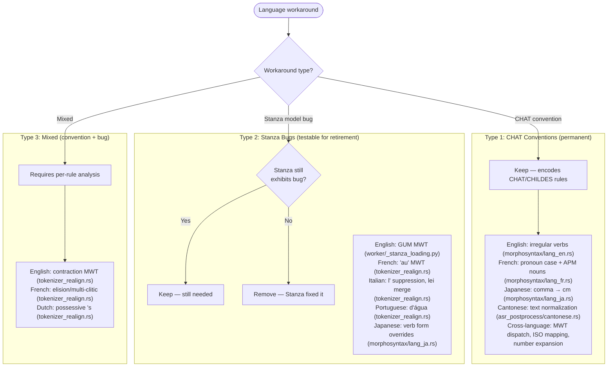

# Non-English Language Workarounds

**Status:** Current
**Last updated:** 2026-05-21 13:20 EDT

This document catalogs every language-specific workaround in batchalign3's
morphosyntax pipeline (morphotag) and related commands. Each entry describes
what the workaround does, why it exists, whether the underlying issue is
likely to persist, and how to verify it is still needed.

---

## Overview

The morphosyntax pipeline relies on Stanza for UD annotation. Stanza's models
have known per-language quirks: mislabeled POS tags, missing features, incorrect
MWT expansion. These workarounds correct systematic errors to produce accurate
CHAT %mor/%gra output.

These entries mix three kinds of behavior:

- CHAT/CHILDES conventions that should remain even if upstream models improve
- Stanza-specific workarounds that may become removable after verification
- architectural requirements such as code mapping or Cantonese FA romanization

**All workarounds were ported from batchalign2** and now live entirely in Rust
(`crates/batchalign-transform/src/morphosyntax/lang_*.rs`). Python workers only
call Stanza and return raw output, all workaround logic is applied
server-side.

### Decision Framework

The following diagram shows how workarounds are categorized and the
keep/retire decision criteria for each type.



A workaround should be **kept** if:
- Stanza still exhibits the bug (test with current Stanza version)
- The workaround encodes a CHAT convention (not just a Stanza fix)
- Removing it breaks golden tests or parity with CLAN manual output

A workaround should be **removed** if:
- Stanza fixed the underlying issue in a newer version
- The workaround's behavior conflicts with CHAT manual specifications
- It was specific to a Stanza version we no longer support

### Verification Method

For each workaround, the recommended verification test is:

1. Feed the workaround's trigger input through Stanza directly (no workaround)
2. Compare output with the workaround applied
3. If they differ, the workaround is still needed
4. If they agree, the workaround can be retired

---

## English (`eng` → `en`)

### E1. Irregular Verb Conjugation Database

| | |
|---|---|
| **File** | `crates/batchalign-transform/src/morphosyntax/lang_en.rs` |
| **Size** | Irregular-form entries (see the file for the active list) |
| **What** | Static lookup of irregular past tense / participle forms (be→was/been, go→went/gone, etc.). Used by `verb_features()` to emit `-PAST` or `-PASTP` suffixes. |
| **Why** | Stanza's lemmatizer doesn't reliably map inflected forms back to base forms for irregular verbs. The lookup confirms whether a surface form is indeed a known irregular conjugation of its lemma. |
| **Origin** | Ported from `batchalign2/pipelines/morphosyntax/en/irr.py` |
| **Still needed?** | **Yes, permanent.** This is a CHAT convention: %mor must show `-PAST`/`-PASTP` suffixes on irregular verbs. Even if Stanza improved, the lookup table is needed to classify forms. |
| **Tests** | `lang_en.rs`: `test_irregular_past`, `test_irregular_participle`, `test_regular_verb`, `test_case_insensitive` |

### E2. English Contraction MWT Handling

| | |
|---|---|
| **File** | `crates/batchalign-transform/src/tokenizer_realign.rs` |
| **What** | Tokens with apostrophes (don't, can't, 've, 'll, etc.) are marked as `(text, true)` MWT hints for Stanza expansion. Exception: "o'clock" and "o'er" (prefix "o" before apostrophe). |
| **Why** | Stanza's neural tokenizer sometimes fails to split contractions. Explicit MWT hints ensure consistent expansion. |
| **Origin** | `batchalign2/ud.py:680-685` |
| **Still needed?** | **Likely yes.** English contractions remain a tokenization edge case. Removing this would require testing every contraction form with current Stanza. |
| **Tests** | tests embedded in `tokenizer_realign.rs` |

### E3. English GUM MWT Package

| | |
|---|---|
| **File** | `batchalign/worker/_stanza_loading.py` |
| **What** | English uses Stanza's "gum" MWT package instead of default. |
| **Why** | The GUM corpus MWT model provides better English contraction handling. |
| **Origin** | batchalign2 Stanza configuration |
| **Still needed?** | **Unknown, testable.** Newer Stanza versions may have improved the default package. Test: run English morphotag with and without "gum" package, compare results on contraction-heavy input. |
| **Tests** | `test_stanza_config_parity.py` |

---

## French (`fra` → `fr`)

### F1. Pronoun Case Lookup

| | |
|---|---|
| **File** | `crates/batchalign-transform/src/morphosyntax/lang_fr.rs` |
| **Size** | Pronoun-case lookup (Nominative + Accusative entries; see the file) |
| **What** | Hardcoded table mapping French pronouns to case (Nom/Acc) by surface form. Applied when UD word has POS=PRON. Handles apostrophes (e.g., "qu'" → check "qu"). |
| **Why** | Stanza's French model often omits or misassigns the `Case` feature on pronouns. The lookup provides correct case for CHAT %mor output. |
| **Origin** | `batchalign2/pipelines/morphosyntax/fr/case.py` |
| **Still needed?** | **Likely yes.** Case assignment is a known weak point of UD French models. Even if Stanza improves, the lookup table is a CHAT-specific convention ensuring consistent output. |
| **Tests** | `lang_fr.rs`: 4 tests covering Nom, Acc, unknown, apostrophe |

### F2. Auditory Plural Marking (APM) Noun Detection

| | |
|---|---|
| **File** | `crates/batchalign-transform/src/morphosyntax/lang_fr.rs` |
| **Size** | Noun form list (see the file for the active set) |
| **What** | List of French nouns that undergo auditory plural marking (e.g., "cheval"/"chevaux"). Used by `noun_features()` to correctly emit plural suffixes in %mor. |
| **Why** | Stanza may not distinguish between regular and APM plurals. CHILDES/CHAT convention requires explicit plural marking for these nouns. |
| **Origin** | `batchalign2/pipelines/morphosyntax/fr/apmn.py` |
| **Still needed?** | **Yes, permanent.** This is a CHAT/CHILDES convention for French child language analysis. The list defines which nouns get special plural treatment regardless of Stanza's output. |
| **Tests** | `lang_fr.rs`: 4 tests; `mapping.rs`: `test_french_noun_apm_plural`, `test_french_noun_non_apm_plural` |

### F3. MWT Overrides (3 rules + elision + multi-clitic)

| | |
|---|---|
| **File** | `crates/batchalign-transform/src/tokenizer_realign.rs` |
| **What** | Three explicit patches plus elision/multi-clitic logic: |
| | **"aujourd'hui"** → plain text (prevent MWT expansion) |
| | **"au"** → force MWT (à + le contraction) |
| | **Elision prefixes** (jusqu', puisqu', quelqu', aujourd') → split on apostrophe |
| | **Multi-clitic** (e.g., "d'l'attraper") → split into individual clitics |
| **Why** | Stanza's French MWT model has known quirks with these forms. |
| **Origin** | `batchalign2/ud.py:671-689` |
| **Still needed?** | **Likely yes for aujourd'hui and elision rules.** These are French orthographic conventions, not Stanza bugs. The "au" forcing could be tested with current Stanza, it may handle it correctly now. |
| **Tests** | French-specific tests embedded in `tokenizer_realign.rs` |

---

## Japanese (`jpn` → `ja`)

### J1. Verb Form Overrides

| | |
|---|---|
| **File** | `crates/batchalign-transform/src/morphosyntax/lang_ja.rs` |
| **Size** | Order-dependent override chain (see the file) |
| **What** | If/elif chain matching substrings in Japanese word text. Can override both POS and lemma. Examples: |
| | "ちゃ" → sconj/"ば", "なきゃ" → sconj/"なきゃ", "れる" → aux/"られる", "はい" → intj/"はい" |
| **Why** | Stanza's Japanese models systematically mislabel auxiliary particles and verbs. The surface form is a reliable signal for the true grammatical function. |
| **Origin** | `batchalign2/pipelines/morphosyntax/ja/verbforms.py` |
| **Still needed?** | **Almost certainly yes.** Japanese auxiliary verb classification is a known challenge for UD models. These are systematic patterns, not isolated bugs. Each rule should be verified individually against current Stanza output, but the overall framework will likely remain necessary. |
| **Order matters** | The if/elif chain is order-dependent, matches Python exactly. |
| **Tests** | `lang_ja.rs`: 4 tests covering sconj, intj, de, and no-override cases |

### J2. Combined Processor Package

| | |
|---|---|
| **File** | `batchalign/worker/_stanza_loading.py` |
| **What** | Japanese uses Stanza's "combined" processor package for all processors instead of default. |
| **Why** | Japanese doesn't use MWT. Combined models provide better accuracy. |
| **Origin** | `batchalign2/ud.py:1048-1052` |
| **Still needed?** | **Likely yes.** Japanese tokenization is fundamentally different from European languages. |
| **Tests** | `test_stanza_config_parity.py` |

### J3. Comma POS Normalization

| | |
|---|---|
| **File** | `crates/batchalign-transform/src/morphosyntax/mor_word.rs` |
| **What** | Japanese PUNCT tokens are remapped to `cm` POS. Japanese commas ("、", ",") specifically get lemma "cm". |
| **Why** | CHAT uses "cm\|cm" for comma punctuation, but Stanza tags these as regular PUNCT. |
| **Origin** | Python master Japanese handling |
| **Still needed?** | **Yes, permanent.** This is a CHAT convention, not a Stanza bug. |
| **Tests** | Covered by morphosyntax round-trip tests |

---

## Italian (`ita` → `it`)

### I1. "l'" MWT Suppression

| | |
|---|---|
| **File** | `crates/batchalign-transform/src/tokenizer_realign.rs` |
| **What** | When Stanza tags "l'" as MWT `(l', true)`, suppress the expansion hint. |
| **Why** | Stanza aggressively expands "l'" which should not always be split. |
| **Origin** | `batchalign2/ud.py:662-668` |
| **Still needed?** | **Testable.** Run Stanza on Italian text with "l'", if it still over-expands, keep. |
| **Tests** | Italian tests embedded in `tokenizer_realign.rs` |

### I2. "lei" Merge (le + i → lei)

| | |
|---|---|
| **File** | `crates/batchalign-transform/src/tokenizer_realign.rs` |
| **What** | If Stanza splits "lei" into "le" + "i", merge them back. |
| **Why** | Known Stanza bug splitting the pronoun "lei" (she/her). |
| **Origin** | `batchalign2/ud.py:668` |
| **Still needed?** | **Testable.** If Stanza no longer splits "lei", can remove. |
| **Tests** | Italian tests embedded in `tokenizer_realign.rs` |

---

## Portuguese (`por` → `pt`)

### P1. "d'água" MWT Forcing

| | |
|---|---|
| **File** | `crates/batchalign-transform/src/tokenizer_realign.rs` |
| **What** | Force MWT expansion on "d'água" (de + água). |
| **Why** | Stanza may not recognize this as a contraction. |
| **Origin** | `batchalign2/ud.py:669-670` |
| **Still needed?** | **Testable.** Run Stanza on "d'água", if it splits correctly, can remove. |
| **Tests** | Portuguese test embedded in `tokenizer_realign.rs` |

---

## Dutch (`nld` → `nl`)

### D1. Possessive "'s" MWT Suppression

| | |
|---|---|
| **File** | `crates/batchalign-transform/src/tokenizer_realign.rs` |
| **What** | Tokens ending with "'s" (e.g., "vader's") get `(text, false)` hint to prevent MWT expansion. |
| **Why** | Dutch possessive 's is not a contraction and should not be split. |
| **Origin** | `batchalign2/ud.py:694-695` |
| **Still needed?** | **Likely yes.** Dutch possessive 's is an orthographic convention that MWT models may mishandle. |
| **Tests** | Dutch tests embedded in `tokenizer_realign.rs` |

---

## Cantonese (`yue`): Engines

### C1. Text Normalization Pipeline

| | |
|---|---|
| **File** | `crates/batchalign-transform/src/asr_postprocess/cantonese.rs` |
| **Size** | `ferrous-opencc` `s2hk` conversion + a domain replacement table (see the file for the active entries) |
| **What** | Two-stage normalization: Simplified→Traditional via `ferrous-opencc`, then a domain replacement table (multi-char first to prevent partial matches). |
| **Why** | Cantonese ASR output uses simplified or colloquial forms that need normalization to standard written Cantonese. |
| **Origin** | Cantonese-specific (new in batchalign3) |
| **Still needed?** | **Yes, permanent.** Regional dialect normalization, not a model bug. |
| **Tests** | `test_common.py` |

### C2. Jyutping Romanization for FA

| | |
|---|---|
| **File** | `batchalign/inference/languages/cantonese/_cantonese_fa.py` |
| **What** | Converts hanzi to jyutping (tone-stripped, apostrophe-joined) before Wave2Vec FA. |
| **Why** | Wave2Vec MMS was trained on romanized text, so hanzi must be romanized for alignment. |
| **Origin** | Cantonese-specific (new in batchalign3) |
| **Still needed?** | **Yes, permanent.** Architectural requirement of the FA model. |
| **Tests** | `test_cantonese_fa.py` |

---

## Cross-Language

### X1. MWT Language Dispatch Table

| | |
|---|---|
| **File** | `batchalign/worker/_stanza_loading.py` |
| **Size** | 39 languages currently enable MWT |
| **What** | Determines which languages use Stanza's MWT processor. CJK, some Slavic languages excluded. |
| **Why** | MWT is not applicable to all languages. CJK languages don't have multi-word tokens. |
| **Origin** | `batchalign2/ud.py:1034-1036` |
| **Still needed?** | **Yes, permanent.** Fundamental to pipeline architecture. |
| **Tests** | `test_stanza_config_parity.py` |

### X2. ISO 639-3 → ISO 639-1 Mapping

| | |
|---|---|
| **File** | `batchalign/worker/_stanza_loading.py` |
| **Size** | 55 explicit mappings |
| **What** | Converts 3-letter codes (batchalign internal) to 2-letter codes (Stanza). Special: yue→zh, cmn→zh. |
| **Why** | Stanza uses 2-letter codes. |
| **Origin** | Essential mapping maintained from batchalign2 |
| **Still needed?** | **Yes, permanent.** Different code systems. |
| **Tests** | Implicit in all morphosyntax tests |

### X3. Number Expansion

| | |
|---|---|
| **File** | `crates/batchalign-transform/src/asr_postprocess/num2text.rs`, `crates/batchalign-transform/src/asr_postprocess/num2chinese.rs` |
| **Size** | Language-specific lookup tables (the authoritative list lives at `crates/batchalign-transform/data/num2lang.json`) plus a Chinese-script converter |
| **What** | Converts digit strings to word forms (5→"five", 5→"五") during ASR post-processing. |
| **Why** | ASR output digit strings need language-appropriate word forms for CHAT transcription. |
| **Origin** | `batchalign2/pipelines/asr/utils.py` |
| **Still needed?** | **Yes, permanent.** Language-specific numeral systems. |
| **Tests** | Parameterized tests for English, Spanish, Chinese |

---

## Retirement Assessment

### Testable with Current Stanza

These workarounds address specific Stanza model bugs that may have been fixed.
Each should be tested by running the trigger input through current Stanza
without the workaround:

| ID | Workaround | Test Method |
|----|-----------|-------------|
| E3 | English GUM MWT package | Compare default vs GUM package on contractions |
| F3 | French "au" MWT forcing | Check if Stanza recognizes "au" as contraction |
| I1 | Italian "l'" suppression | Check if Stanza still over-expands "l'" |
| I2 | Italian "lei" merge | Check if Stanza still splits "lei" → "le" + "i" |
| P1 | Portuguese "d'água" | Check if Stanza recognizes as contraction |
| J1 | Japanese verb form overrides | Test the current rule set against a curated trigger corpus |

### Permanent (CHAT conventions or architectural requirements)

These encode CHAT-specific conventions or language requirements that are
independent of Stanza model quality:

| ID | Workaround | Reason |
|----|-----------|--------|
| E1 | Irregular verb database | CHAT %mor `-PAST`/`-PASTP` convention |
| F1 | French pronoun case | CHAT %mor case feature convention |
| F2 | French APM nouns | CHILDES French plural convention |
| J3 | Japanese comma → cm | CHAT punctuation convention |
| C1 | Cantonese normalization | Regional dialect convention |
| C2 | Jyutping for FA | Model architecture requirement |
| X1 | MWT dispatch table | Pipeline architecture |
| X2 | ISO code mapping | Code system interop |
| X3 | Number expansion | Language-specific numeral systems |

### Mixed (partly convention, partly bug workaround)

| ID | Workaround | Analysis |
|----|-----------|----------|
| E2 | English contraction MWT | Convention (contractions should expand) + bug (Stanza misses some) |
| F3 | French elision/multi-clitic | Convention (elision rules) + patches (Stanza-specific) |
| D1 | Dutch possessive 's | Convention (not a contraction) + bug (MWT over-expands) |

---

## Recommended Verification Tests

To systematically determine which workarounds are still needed, create a test
fixture that:

1. Loads a Stanza pipeline for each language
2. Runs a curated input through Stanza without workarounds
3. Runs the same input with workarounds
4. Asserts they differ (proving the workaround is still needed)

These tests should be **golden model tests** (skipped when models are
unavailable) and re-run whenever Stanza is upgraded. If a test passes
(outputs agree), the workaround can be investigated for retirement.

Example test structure:
```rust
#[test]
#[ignore] // Requires Stanza models
fn verify_italian_lei_split_still_needed() {
    // 1. Run "lei" through Italian Stanza without lei-merge workaround
    // 2. Check if Stanza splits it into "le" + "i"
    // 3. If it does: workaround still needed
    // 4. If it doesn't: mark for retirement
}
```

These tests should be added under `crates/batchalign/tests/` (e.g., the
`ml_golden` test binary) since they require real Stanza inference.
