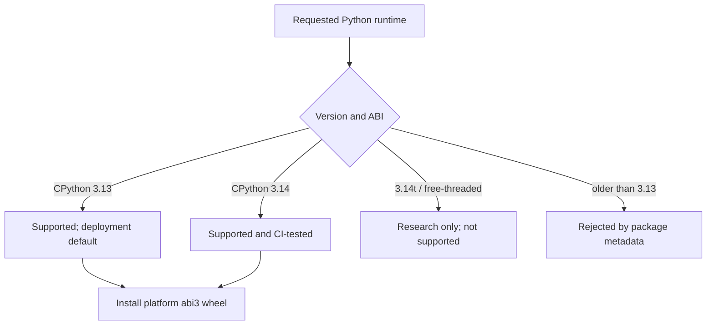

# Python Version Support

**Status:** Current
**Last verified:** 2026-08-30 21:00 EDT

## Current policy

Standard CPython **3.13 and 3.14** are supported. The package declares
`requires-python = ">=3.13"`, uses PyO3's `abi3-py313` boundary, and CI builds
and runs the Python suite on both versions. Installers and current deployments
default to **3.13** because one explicit operational baseline is easier to
reproduce than whichever compatible interpreter happens to be newest.

Free-threaded Python (`3.14t`) is **not** a supported install or deployment
target. Do not infer free-threaded support from the standard 3.14 classifier or
from runtime code that can detect a disabled GIL.

## Why free-threaded Python remains research-only

The attraction is real: shared Stanza models can sharply reduce the memory
cost of parallel morphotag and utseg work. Earlier measurements on the former
pipeline architecture found approximately the same throughput with much less
resident memory:

| Scenario | Peak RSS | Files/hour |
|---|---:|---:|
| GIL enabled, four processes | 13.5 GB | 10,069 |
| GIL disabled, four threads | 3.0 GB | 10,158 |

Those measurements motivate continued research; they do not prove that the
current complete BA3 stack is safe on a free-threaded interpreter. The earlier
soaks did not cover every supported diarization backend, multi-day idle,
interpreter-shutdown stress, signal handling, or the current Rust/Python worker
architecture. A prior production kernel-panic precursor also remains a
counterexample even though later 75-minute VM and bare-metal soaks did not
reproduce it.

The required standard installation includes local Pyannote and its runtime
dependencies as well as the default pyannoteAI path. Free-threaded support must
therefore cover the complete dependency and command surface; a reduced install
is not an alternate supported BA3 edition.

## Historical wheel probes

Older reports recorded missing `onnxruntime` and other ML wheels for then-new
interpreter ABIs. Those tables are historical evidence, not current policy.
The current lock contains ordinary CPython 3.13 and 3.14 artifacts, and CI is
the authority for those two supported interpreter lines. Wheel availability in
a lockfile alone is not enough to promote a free-threaded ABI.

## Groundwork retained in the codebase

The following future-facing pieces intentionally remain:

- runtime detection of a free-threaded interpreter;
- distinct memory-budget tables for process and threaded serving;
- thread-safe tokenizer realignment state; and
- harness cleanup of inherited `PYTHON_GIL` settings.

They let controlled experiments continue without making an installation or
deployment promise.

## Promotion criteria for free-threaded Python

Promote a free-threaded interpreter only when all of these are true:

1. Every required dependency resolves as a wheel on the platforms we support.
2. All released command paths, including local speaker diarization, pass on
   that interpreter.
3. Long-running end-to-end ML soaks show stable memory, shutdown, exception,
   signal, and idle behavior on isolated hosts.
4. The normal CI and release workflows intentionally build, test, and smoke
   that ABI.
5. The deployment runbook selects it explicitly and records the runtime
   identity; no implicit interpreter upgrade is allowed.

Until all five gates pass:

- use standard Python 3.13 or 3.14 for development;
- use 3.13 for canonical installation and deployment; and
- treat free-threaded Python as a separate experiment whose result cannot
  alter supported production state.

The existing
[`freethreaded-danger-probe`](https://github.com/TalkBank/freethreaded-danger-probe)
repository remains the dedicated soak harness for that research.
