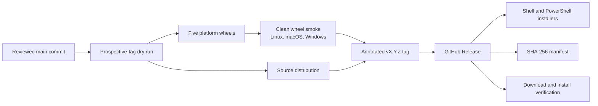

# Release Checklist

**Status:** Current
**Last updated:** 2026-08-30 21:00 EDT

This is the required checklist for a public `batchalign3` release. The
supported distribution channel is a GitHub Release; BA3 is not published to
PyPI. A failed or unknown gate blocks the tag.

## Release artifact topology

The dry run and tagged release use the same workflow. Dry run permits a
prospective version identity but never creates a release. A publishing run
requires the tag to exist and match `pyproject.toml` exactly.

## Pre-release gates

### 1. Release identity

- [ ] `pyproject.toml`, `[workspace.package].version`, and
  `crates/batchalign/Cargo.toml` match the target.
- [ ] `batchalign/version` names the same version. The Python regression test
  compares it with the installed wheel metadata.
- [ ] `batchalign3 version` reports the target from the packaged Rust binary.
- [ ] The release remains below 1.0 unless the release contract and versioning
  policy are promoted in the same reviewed change.
- [ ] Desktop metadata changes only if a desktop release is explicitly in
  scope; the normal BA3 release excludes it.

Internal crates do not all share the product version. Do not mechanically bump
`batchalign-types`, `batchalign-fa-core`, `batchalign-core`, or
`batchalign-pyo3`; their manifests intentionally retain independent internal
versions.

### 2. Source and CI

- [ ] The release commit is on `main`, reviewed, and the worktree is clean.
- [ ] All required GitHub checks for that exact commit pass.
- [ ] `make ci-full` passes locally.
- [ ] The release wheel passes the Python pytest, Ruff, formatting, drift, and
  mypy gates (`make batchalign-ci-python`).
- [ ] `make book-check`, `make lint-shell`, and `make lint-actionlint` pass.
- [ ] Generated IPC, OpenAPI, dashboard, and book artifacts are current.

### 3. Artifact dry run

- [ ] Dispatch `Batchalign Release` manually for prospective `vX.Y.Z` with
  `dry_run=true` against the release commit.
- [ ] Preflight accepts the version identity.
- [ ] Five wheels build: macOS ARM and Intel, Linux x86_64 and ARM64, and
  Windows x86_64.
- [ ] The source distribution builds.
- [ ] Clean-wheel `--help` and `version` smoke tests pass on Linux, macOS, and
  Windows.
- [ ] Packaged server health smoke passes on Linux and macOS.
- [ ] The assembly job stages both installers and computes `sha256.sum` but
  does not create a GitHub Release.

### 4. Product and documentation

- [ ] The README and installation guide describe GitHub Release installation,
  not PyPI.
- [ ] The release contract and platform matrix match the artifacts and tested
  behavior.
- [ ] User and developer documentation cover new commands, flags, cache and
  replay behavior, evidence formats, observability, and limitations without
  overclaiming empirical quality.
- [ ] Mermaid diagrams render and describe the implemented state boundaries.
- [ ] Generated release notes have been reviewed before they are sent to
  collaborators; GitHub may generate the initial notes at publication time.

### 5. Dependencies and security

- [ ] Cargo and uv lockfiles validate and are included when dependencies
  changed.
- [ ] Known advisories are reviewed and recorded. An advisory is a release
  blocker when it is reachable in the shipped product or violates a configured
  CI policy; the checklist does not make the false claim that every ecosystem
  scanner must report zero findings.
- [ ] GitHub Actions and installer changes receive focused security review.
- [ ] License and classifier metadata match the public-preview state.

## Release procedure

1. Complete the gates above on the reviewed `main` commit.
2. Run and verify the prospective-tag dry run.
3. Create an annotated tag: `git tag -a vX.Y.Z -m "batchalign3 vX.Y.Z"`.
4. Push only that tag. The tag-triggered workflow builds, smokes, checksums,
   and creates the GitHub Release.
5. Verify the release contains five wheels, one source distribution, both
   installers, and `sha256.sum`.
6. Download from the published release and perform a clean installer or wheel
   smoke outside the source checkout.
7. Deploy the exact released identity where an operational deployment is in
   scope, then verify `/health` and its build/runtime identities.

No release branch or immediate development-version bump is required. The next
release receives its version when that release is prepared.

## Failed publication and replacement

If a published release is defective:

1. Mark the GitHub Release as a prerelease or remove it from public discovery,
   depending on severity, and record which artifacts are affected.
2. Fix and review the defect on `main`.
3. Choose a new patch version. Never move or reuse a published tag.
4. Repeat the complete dry-run and release process.

There is no PyPI release to yank.
