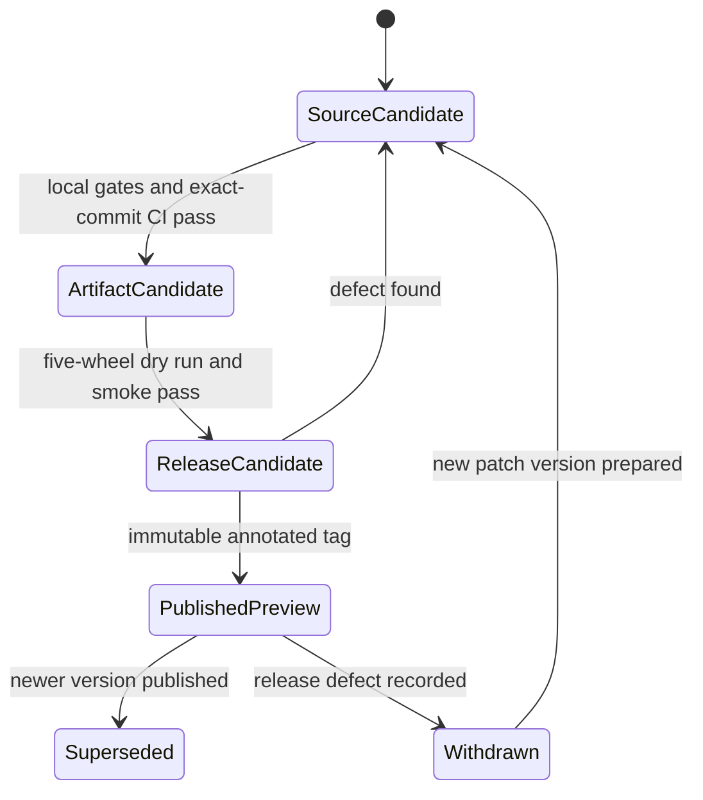

# Release Contract

**Status:** Current
**Last updated:** 2026-08-30 21:00 EDT

This page defines the compatibility promises for the public `batchalign3`
product. It describes the current 0.x public-preview line; it is not a promise
that research-quality output is universally better than another system.

## Release state

**Public preview (0.x).** Releases are usable by external researchers, but CLI,
wire, cache, and evidence schemas may still change between minor versions.
Breaking changes must be described in release notes and migration docs.

## Supported public surfaces

- **CLI (`batchalign3`)**: the documented commands and flags.
- **Local server (`batchalign3 serve`)**: REST/WebSocket execution used by the
  CLI and browser dashboard. Its schema is documented but not frozen during
  preview.
- **Browser dashboard**: the UI embedded in the released CLI/server.
- **GitHub Release installers and wheels**: the supported installation path.
  There is no PyPI distribution.
- **CHAT output and debug/evidence artifacts**: supported as documented for the
  release, but cache, replay-manifest, and evidence schema revisions remain
  preview surfaces unless a page explicitly promises compatibility.

The wheel contains Python model-worker code, the `batchalign_core` extension,
and a platform-specific Rust `batchalign3` executable. It is a distribution
artifact, not a supported import-level Python API. Python integrations should
invoke the CLI or local server.

## Experimental or internal surfaces

- **Batchalign Desktop (Tauri)**: an in-repo shell, not released.
- **Direct Python imports**: internal implementation detail.
- **Internal Rust crates**: workspace implementation details, not separately
  published by the BA3 release workflow.
- **Staged or remote multi-host execution**: experimental.
- **Cache database internals**: replaceable implementation detail. Durable raw
  evidence and fingerprinted replay artifacts have explicit schemas; a cache
  row itself is not a preservation format.

## Evidence and quality claims

Architectural guarantees and empirical quality claims are different:

- Types, validation, fingerprints, and fail-closed writes can guarantee which
  evidence was admitted and which algorithm produced an output.
- They cannot by themselves guarantee optimal words, speakers, utterance
  boundaries, or `%wor` timings.
- Comparative claims about the upstream BA3 fork, earlier BA3, Whisper, Rev, or a
  published corpus require controlled clips, identical inputs and provider
  requests, preserved raw outputs, and recorded human adjudication.

The product may therefore claim replayability and stronger correctness
boundaries when the code proves them, while quality claims remain scoped to
their experiment reports.

## Workspace dependency

BA3 lives in the `talkbank-tools` Cargo workspace and consumes the sibling
TalkBank Rust crates by workspace dependency. That single reviewed repository
is the release source of truth; there is no cross-repository dependency pin to
update for a normal BA3 release.

The BA3 product version appears in `pyproject.toml`, the workspace package
version, and `crates/batchalign/Cargo.toml`. Several internal helper crates keep
independent 0.1.x versions and must not be mechanically changed to match the
product.

## Platform support

The release workflow builds five wheels:

| Platform | Artifact / test promise |
|---|---|
| Linux x86_64 | Wheel build, clean CLI smoke, server-health smoke; full Linux CI elsewhere |
| Linux ARM64 | Native wheel build; no release-workflow execution smoke |
| macOS ARM64 | Wheel build, clean CLI smoke, server-health smoke |
| macOS x86_64 | Wheel build; no release-workflow execution smoke |
| Windows x86_64 | Wheel build and clean CLI smoke; server lifecycle is not supported |

See [Platform Support](../reference/platform-support.md) for operational
limitations.

## Distribution and signing

An immutable `vX.Y.Z` tag triggers the GitHub Release workflow. The release
contains five wheels, one source distribution, shell and PowerShell installers,
and a SHA-256 manifest. Artifacts are not currently code-signed or notarized;
the checksums provide download-integrity evidence, not publisher identity.

## License

BSD-3-Clause.
