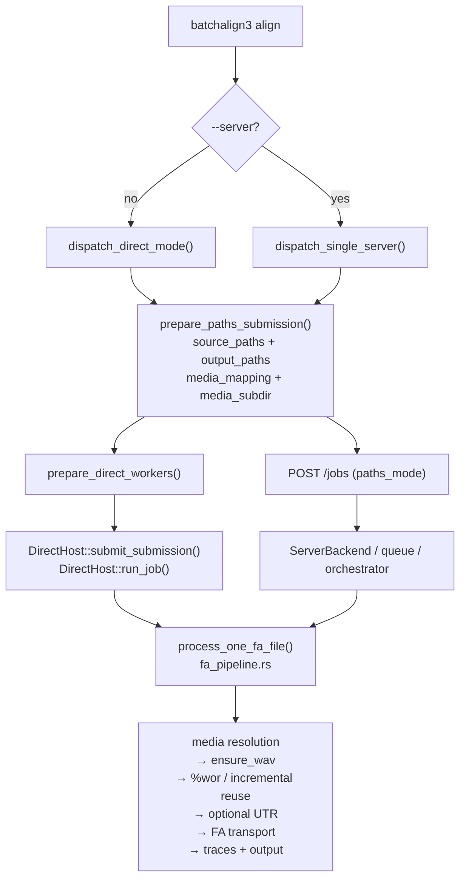

# Rust CLI and Server

**Status:** Current
**Last updated:** 2026-05-20 00:48 EDT

This page covers the Rust control plane that powers `batchalign3`: the CLI
client, the HTTP server, and how to extend them.

The current worker-boundary replacement plan is documented separately in
[Worker Protocol V2](worker-protocol-v2.md). That spec is the source of truth
for replacing the legacy stdio JSON-lines worker contract.

## Crate Map

After the 2026-04-28 monorepo merge, batchalign source lives as a
small set of sibling crates inside this workspace:

| Crate | Role |
|-------|------|
| `crates/batchalign/` | The runtime crate: Clap CLI, dispatch router, direct-host bootstrap, Axum HTTP server, job store, worker pool, cache, and command-owned orchestration. The `chat_ops/` module owns CHAT extraction, injection, validation, ASR post-processing, and DP alignment that is batchalign-specific. |
| `crates/batchalign/src/commands/` | (submodule) released-command definitions, author-facing constructors, and the command catalog |
| `crates/batchalign-types/` | Domain newtypes, worker IPC types (V2), shared between the runtime crate and the PyO3 bridge |
| `crates/batchalign-pyo3/` | PyO3 bridge crate (`batchalign_core`); workspace member, slim dep tree (`batchalign-types` + `talkbank-transform` + pyo3/numpy/serde/tracing) |
| `crates/talkbank-{model,parser,transform,clan,...}` | CHAT data model, parser, pipelines, CLAN tools — shared across the workspace; `batchalign` depends on the first three by workspace path |

## Common Developer Commands

```bash
cargo check --workspace
cargo nextest run --workspace
cargo check --manifest-path crates/batchalign-pyo3/Cargo.toml    # PyO3 crate (separate)
cargo nextest run --manifest-path crates/batchalign-pyo3/Cargo.toml
```

## CLI Command Dispatch (Single Source of Truth)

`batchalign::cli::run_command()` in
`crates/batchalign/src/cli/mod.rs:251` is the
**single canonical command router**. The standalone binary (`main.rs`) calls it.
The installed `batchalign3` console command is a tiny Python wrapper
(`batchalign/_cli.py`) that finds and execs the standalone binary — either
packaged in the wheel at `batchalign/_bin/batchalign3`, or from
`target/debug/batchalign3` in a source checkout.

```rust,ignore
main.rs            → batchalign::cli::run_command(cli)
batchalign/_cli.py → os.execv(batchalign/_bin/batchalign3)  [installed]
                   → os.execv(target/debug/batchalign3)      [dev checkout]
```

`main.rs` and `batchalign/_cli.py` are thin wrappers.
No command-specific logic lives in either of them.

The CLI layer now exposes two contributor-facing named seams:

- `ReleasedCommand` in
  `crates/batchalign-types/src/domain.rs:36` is the closed released
  command vocabulary for contributor-facing Rust code. Parse external
  strings into this enum as early as possible; keep the old
  string-backed `CommandName` only at wire/storage boundaries.
- `CommandProfile` in
  `crates/batchalign/src/cli/args/mod.rs:148` keeps the command
  identity, language, file extensions, and speaker count together as
  a typed profile instead of a positional tuple.
- `DispatchRequest` in
  `crates/batchalign/src/cli/dispatch/mod.rs:42` carries the typed
  command profile, I/O settings, and runtime flags into the
  dispatcher as one named boundary object.

The dispatcher also consults
`batchalign::released_command_uses_local_audio()` and the shared released
command catalog to decide whether a requested command uses the shared-filesystem
audio path under an explicit `--server` submission or can use ordinary
content-mode submission.

On the app side, the current execution split is now:

- `ExecutionEngine` — shared command execution core
- `ServerExecutionHost` — queue/store/server-owned lifecycle behavior
- `DirectHost` / `DirectExecutionHost` — inline local execution without queueing
  or registry discovery
- `ServerBackend` / `EmbeddedServerBackend` / `TemporalServerBackend` —
  route-facing server control-plane seam over persisted jobs, orchestration,
  event subscription, traces, and runtime shutdown
- `prepare_workers*()` vs `prepare_direct_workers()` — explicit separation
  between server worker bootstrap and direct local worker bootstrap

### Align / FA host flow

The part that was easiest to misunderstand during the recent `align` emergency
was **where forced alignment actually runs**.

`align` now has two honest host paths:

- **Direct mode** (no `--server`) does **not** start Axum, an HTTP server, a
  queue, or registry discovery. The CLI prepares local workers and runs the job
  through `DirectHost`.
- **Explicit server mode** (`--server URL`) submits a shared-filesystem
  `paths_mode` job. The server must be able to read the submitted source paths
  and write the requested output paths on the execution host.

Both paths converge on the same FA runner code in
`crates/batchalign/src/runner/dispatch/fa_pipeline.rs`.



That shared convergence is deliberate: direct mode and server mode should differ
in **host/orchestration** behavior, not in the actual forced-alignment logic.

When the CLI is polling or writing file results, `FileErrorDetail`
in `crates/batchalign/src/cli/dispatch/helpers.rs:24` keeps
file-scoped failures as a named record instead of spreading
filename/message pairs through the progress code.

The command-specific logic now starts in
`crates/batchalign/src/commands/`. That layer owns the canonical
`CommandDefinition` catalog plus the family authoring traits/macros that
generate those definitions. For the currently shipped command families, an
ordinary command module now uses a helper such as
`declare_batched_text_command!(...)` or `declare_transcription_command!(...)`
instead of spelling out runtime metadata or even calling the lower-level
constructors directly. The shared runner dispatches by definition/family, so
ordinary command modules no longer need to import store/queue/host plumbing just
to forward into an existing family executor.

That is an intentional contributor contract:

- new commands should be authored direct-first and laptop-friendly
- command authors should not need to understand server internals
- command authors should usually only pick a family helper, not hand-author
  scheduling/runtime metadata
- server mode may opt into a different host/backend, but it should reuse the
  same generated command definition

`command_family.rs` keeps the small family enum used by command metadata,
`text_batch.rs` keeps reusable text-family helpers, and `runner/dispatch/`
keeps shared execution helpers. `crates/batchalign/src/runner/` should stay
focused on job lifecycle, queueing, and policy rather than becoming a second
authoring surface for commands.
HTTP routes, SSE, and WebSocket handlers should prefer `ServerBackend` over
reaching through `AppState` to raw `JobStore`, queue, or runtime internals.

One dependency-graph cleanup already landed here: the standalone binary's OTLP
telemetry stack and update-check helper are now gated behind the
`batchalign` crate's `binary-entry` feature. The PyO3 `cli_entry` path
still shares `run_command()`, but it no longer drags those binary-only
dependencies into the extension build.
The embedded CLI bootstrap path now also lives in `batchalign`
(`run_embedded_cli_from_argv()`), so `pyo3` no longer owns its own `clap`
parsing or Tokio runtime setup.

Under `uv tool install`, the Python wrapper now also primes
`BATCHALIGN_SELF_EXE` before it `exec`s the packaged Rust binary. That gives
Rust server/daemon re-exec paths one explicit source of truth for "which binary
am I?" instead of forcing them to guess from `current_exe()` or PATH.

## Server control-plane replacement guidance

The current recommendation is:

- **Do not replace Axum just to say the server is off the shelf.** The HTTP
  shell is not the main pain source.
- **Do not move the primary CLI or server into Python.** That would re-center
  orchestration around the worker/package layer instead of the typed Rust
  control plane.
- **If we replace something, replace the control-plane backend** behind
  `ServerBackend`: queued-job claims, retries, recovery, runtime supervision,
  persisted progress, and cancellation.

That keeps the architectural split honest:

- `ExecutionEngine` remains the canonical command execution core.
- `DirectHost` remains the BA2-style local/default execution path.
- `ServerBackend` becomes the place where embedded-vs-durable server behavior
  can differ without teaching commands about server internals.

For now the embedded backend should remain the default for local and single-host
installs. If managed/fleet mode eventually needs a durable external backend,
Temporal is the most plausible serious candidate. Python task queues such as
Celery or Dramatiq are a poor primary fit because they would drag the
orchestration boundary back into Python or create awkward split-brain control
plane semantics.

Suggested migration order:

1. keep the embedded backend as the only real backend while more queue claims,
   retries, recovery, and runtime-supervision behavior moves behind
   `ServerBackend`
2. keep direct mode and the shared `ExecutionEngine` unchanged during that move
3. only after the backend boundary is genuinely load-bearing, evaluate one
   optional durable backend for managed/fleet deployments
4. keep local `uv tool install` and BA2-style direct/local CLI behavior as the
   non-negotiable default throughout

That migration is now one step deeper than the first route-facing extraction:
the server factory no longer hand-assembles the embedded queue backend, runtime
supervisor, broadcast bus, and queue dispatcher itself. That bootstrap now lives
behind `bootstrap_embedded_server_backend()`, so `server.rs` asks for one
embedded control plane instead of learning how the in-process backend is wired.

The embedded backend is also now split into a thinner app-facing
`EmbeddedServerBackend` wrapper over a named `EmbeddedJobOrchestrator`. That is
the stronger internal seam where embedded-only queue wakeups, runtime shutdown,
store projections, and future retry/recovery policy can accumulate without
re-expanding the route layer or the server factory.

The shared runner also no longer hardcodes embedded queue wakeups or local
retry-backoff math for host-memory rejection. Queued server execution now asks a
host-owned orchestrator seam to decide what to do when capacity is rejected,
which is the minimum contract a durable backend spike needs in order to replace
embedded requeue behavior cleanly.

### Pre-spike backend contract

Before any Temporal or other durable-backend spike, the architecture contract
should be treated as:

- `ExecutionEngine` owns canonical command execution only.
- `DirectHost` remains fully outside durable orchestration.
- `ServerBackend` owns app-facing job submission, inspection, cancellation,
  traces, event subscription, and runtime shutdown.
- `EmbeddedJobOrchestrator` owns embedded server-only queue wakeups, requeue
  policy, runtime supervision, and other queued-job orchestration details.
- The shared runner may report failures and progress, but it should not know how
  an embedded queue is woken or how a durable backend persists retries.

If a candidate backend cannot satisfy that contract without pulling queue/store
details back into routes, startup glue, or the shared runner, the spike is
happening too early.

### Packaging before a backend spike

Do **not** split the default installation into `uv tool install batchalign3`
plus `uv tool install batchalign3-server` yet.

For now the right default is still one install:

- BA2-style local/direct use stays simple.
- The CLI and server still share too much runtime and orchestration code to
  justify separate distributions.
- A packaging split now would confound backend-spike results with a second
  variable: product/distribution layout.

If a future durable backend creates a real dependency/lifecycle divergence, then
an optional dedicated `batchalign3-server` package can be reconsidered. It is
not the right preparatory step before the spike.

### Temporal assessment

Temporal is still the strongest-looking durable backend candidate, and the first
real spike now exists behind `batchalign3 serve start --backend temporal`.
That spike is intentionally experimental: direct mode remains the trusted
product path, embedded remains the default server backend, and compatibility
with the old embedded server behavior is not the goal.

Current Temporal spike shape:

- one Temporal workflow per Batchalign job (`workflow_id = job_id`)
- one Temporal activity that bridges back into the shared
  `run_server_job_attempt()` engine path
- Temporal-owned retry delay / durable cancellation orchestration
- route-facing reuse of the existing `ServerBackend` seam where that simplifies
  validation
- a dedicated in-process worker thread/runtime for the Temporal SDK worker loop,
  because the current Rust SDK worker is not `Send` and does not fit cleanly
  into the embedded `RuntimeSupervisor`
- `GET /jobs/{id}` and `batchalign3 jobs --server ... <JOB_ID>` now expose a
  Batchalign-owned `control_plane` field that carries Temporal workflow ID, run
  ID, workflow status, task queue, and history length without leaking raw
  Temporal types through the rest of the app
- restart now uses explicit Temporal workflow-ID conflict replacement semantics,
  so a restarted job gets a fresh Temporal run instead of relying on a previous
  run to disappear "soon enough"
- delete now terminates any matching Temporal workflow handle before dropping
  the local store projection

Why it fits:

- Temporal's durable workflow/event-history model matches the parts of the
  current embedded control plane that are genuinely painful: queued-job
  ownership, retries, recovery, long-running execution, and cancellation.
- The Rust client and SDK already expose workflow start/list/cancel/signal/query
  /update semantics, which map naturally to job submission, cancellation,
  inspection, and server-side progress APIs.
- Temporal itself recommends a local dev server (`temporal server start-dev`)
  for development and testing, so it is plausible to spike without standing up a
  full production cluster first.
- The current spike already compiles, boots, answers `/health`, exposes
  Temporal workflow metadata through remote job inspection, and returns a fresh
  Temporal run ID on restart.

Why it is **not** the default answer:

- The Rust client/SDK are still explicitly **prerelease**, so this is not a
  strong foundation for making Temporal mandatory for all users.
- Self-hosting Temporal is still a real operational dependency. That is a poor
  trade for BA2-style local work or for the default `uv tool install` path.
- `DirectHost` should remain outside Temporal. BA2-style local/direct execution
  is valuable precisely because it avoids durable orchestration overhead.
- Host-memory gating and Python worker subprocess ownership are host-local
  concerns. Temporal can coordinate durable job state, but it does not remove
  the need for local machine-level policy around model startup and RAM pressure.
- Progress broadcasts and algorithm traces should remain host-local server
  surfaces. Temporal may own durable orchestration, but it should not become the
  dashboard/event bus for every transient file-progress tick.

So the current recommendation is:

- **keep embedded as the local/default backend**
- **treat Temporal as an optional experimental managed/fleet backend**
- **keep using the current spike to learn what wants to become
  Temporal-native, rather than forcing compatibility with the embedded queue**
- **do not move the shared engine, direct mode, or Python worker packaging
  boundary just to accommodate Temporal**

Validated so far:

```bash
cargo check -p batchalign -p batchalign
cargo test -p batchalign --lib -q
cargo test -p batchalign --test json_compat -q
cargo test -p batchalign --lib -q
batchalign3 serve start --foreground --backend temporal --test-echo --warmup off
batchalign3 jobs --server http://127.0.0.1:8111 <JOB_ID>
curl -X POST http://127.0.0.1:8111/jobs/<JOB_ID>/restart
curl -X DELETE http://127.0.0.1:8111/jobs/<JOB_ID>
```

Important validation caveat: existing e2e coverage already treats text-only
infer-task commands like `morphotag` as expected failures under `--test-echo`.
Use `--test-echo` to validate control-plane behavior, not infer-task success.

### First-class debuggability

Direct mode and server mode should share the **shape of the debugging handles**
they expose, but they should **not** be forced to share one live control-plane
implementation just for symmetry.

What should be shared:

- stable `job_id`
- stable staging/artifact directory
- bug-report identifiers / files
- optional persisted trace artifact file

What should remain mode-specific:

- HTTP polling / WebSocket / dashboard transport
- queue persistence and recovery model
- live event fan-out
- server-only operational state

Direct mode now persists a machine-readable `debug-artifacts.json` file inside
the per-job staging directory and exports `debug-traces.json` when traces were
captured. The CLI also prints the direct job ID and artifact directory up front,
so a human or LLM agent can later inspect a failed local run by job ID instead
of relying on transient terminal output alone.

Opt-in telemetry is still worth considering, but only as an **additive**
debugging aid for fleet/server deployments. It should not replace inspectable
local artifacts. The first-class debugging path must remain: "here is the job
ID and here are the files to inspect."

For day-to-day command work, prefer the command layer first:

1. add or extend `crates/batchalign/src/commands/<name>.rs`
2. choose the existing runner family it should reuse
3. keep the CLI argument plumbing thin
4. let runner/dispatch handle lifecycle and resource policy, not semantics

## Adding a New CLI Command

When adding a new processing command (e.g., `batchalign3 foo`), these files
must be updated:

### 1. CLI argument definition

**`crates/batchalign/src/cli/args/mod.rs`** — Add
`Commands::Foo(FooArgs)` variant to the `Commands` enum.

**`crates/batchalign/src/cli/args/commands.rs`** — Define `FooArgs`
struct with clap attributes. Include `CommonOpts` if the command
processes files.

### 2. CLI dispatch

**`crates/batchalign/src/cli/mod.rs`** — Add the match arm in
`run_command()` (defined at `cli/mod.rs:251`). For processing
commands, this typically falls through to the `cmd =>` wildcard arm
that calls `cli::dispatch::dispatch()`. For utility commands (like
`serve`, `jobs`, `models`), add an explicit arm.

### 3. Typed command options

**`crates/batchalign/src/types/options.rs`** — Add
`CommandOptions::Foo { ... }` variant to the serde-tagged enum. This is the
wire format between CLI and server.

**`crates/batchalign/src/cli/args/options.rs`** — Add the builder in
`build_typed_options()` that converts `FooArgs` → `CommandOptions::Foo`.

### 4. Server-side task routing and capability gate

**`crates/batchalign/src/commands/<name>.rs`** — Add the command's
`CommandDefinition`.

**`crates/batchalign/src/commands/catalog.rs`** — Register/export that definition
in the released-command catalog.

Compatibility helpers in `crates/batchalign/src/runner/policy.rs` still
answer `infer_task_for_command()` and `command_requires_infer()`, but they now
derive directly from the command-owned catalog.

The server's capability gate (`validate_infer_capability_gate()` in
`crates/batchalign/src/state.rs`) cross-checks the worker's
advertised `infer_tasks` against the released-command descriptors in the
command-owned catalog — commands whose descriptor requires an infer task must
have a matching worker capability.

The critical implementation rule is that **startup capability state is not
authoritative for execution**. The current server intentionally allows an
optimistic cold-start snapshot so app creation does not have to spawn a
dedicated probe worker. Execution then resolves a **live capability snapshot**
before it trusts infer-task gating:

- `resolve_worker_capability_snapshot()` in `crates/batchalign/src/state.rs`
  prefers worker-pool detected capabilities over the startup placeholder
- `run_job()` in `crates/batchalign/src/runner/mod.rs` now forces a
  command-appropriate live probe through
  `WorkerPool::ensure_command_capabilities_with_overrides()` before rejecting an
  infer-only command
- `WorkerPool::discover_from_registry()` now also publishes a detected snapshot
  when startup finds healthy TCP registry daemons, so registry-only deployments
  do not start with `infer_tasks = []`
- warmup paths also publish detected capabilities so prepared worker backends
  and reused app instances do not carry stale `infer_tasks = []` snapshots

This split is deliberate. It avoids the old failure mode where lazy startup said
"we will discover capabilities later" but the first real `morphotag` or
`compare` job was still judged by an empty startup snapshot.

One implementation detail matters here: sequential TCP daemons accept one
connection at a time. Registry discovery therefore probes capabilities on the
same `TcpWorkerHandle` it already opened for the discovery health check, instead
of trying to race a second connection.

The registry layer now also carries explicit daemon ownership metadata:

- `external` daemons are preserved on routine shutdown
- `server_owned` daemons are tagged with `server_instance_id` and `server_pid`
- shutdown only retires daemons owned by the current server instance
- discovery skips foreign live owners and reaps stale foreign owned daemons

That ownership model is the durable fix for the old orphan-daemon/kill-all
whackamole around warmup-spawned TCP workers.

On the Python side, you must also add the `InferTask` to `_INFER_TASK_PROBES` in
`batchalign/worker/_handlers.py`. See
[Adding Inference Providers](../developer/adding-engines.md#4-wire-dispatch-and-capability-advertisement)
for details.

### 5. Server-side dispatch shape

Route the command to its orchestrator in the appropriate dispatch module under
`crates/batchalign/src/runner/dispatch/`:
- `infer_batched.rs` — `dispatch_batched_infer()` for text-only commands (cross-file batching)
- `fa_pipeline.rs` — `dispatch_fa_infer()` for per-file forced alignment
- `transcribe_pipeline.rs` — `dispatch_transcribe_infer()` for audio-to-CHAT generation
- `benchmark_pipeline.rs` — `dispatch_benchmark_infer()` for transcribe + compare composition
- `media_analysis_v2.rs` — `dispatch_media_analysis_v2()` for opensmile/avqi

**Recipe-driven execution (new model):** Compare has been migrated from
`runner/dispatch/` to the recipe-driven `execution/` kernel. New commands
should prefer the `execution/` model when they have multi-stage workflows.
See `crates/batchalign/src/execution/` for the `StageExecutor` trait
and `crates/batchalign/src/planning/` for `build_job_plan()`.

### 6. Orchestrator module

**`crates/batchalign/src/commands/foo.rs`** — The command-owned wrapper that
owns the command's semantic shape, shared plan selection, and materialization
policy.

**`crates/batchalign/src/foo.rs`** or `runner/dispatch/*` — Keep shared
algorithmic code and reusable runner families here when it improves clarity, but
do not make them the only obvious home of the released command.

For batch text workflows, prefer the named wrappers in
`crates/batchalign/src/text_batch.rs` over raw tuples:

- `TextBatchFileInput` keeps one file name and one owned CHAT payload together.
- `TextBatchFileResults` keeps the per-file outcome shape explicit.
- `TextWorkflowFileError` keeps file-scoped failure details separate from file
  identity instead of returning `String` error messages.

### 7. Worker support

**`batchalign/worker/_model_loading/`** — Register the dynamic batch-infer
handler for `InferTask.FOO` during worker bootstrap if the task needs loaded
runtime state or engine-specific wiring.

**`batchalign/worker/_infer.py`** — Only update this file if the task is a
pure static route that does not need bootstrap-installed runtime wiring.

**`batchalign/inference/foo.py`** — The Python inference module (pure model
invocation, no CHAT awareness).

### 8. CHAT operations (if needed)

**`crates/batchalign/src/foo.rs`** — Payload collection, cache key
computation, result injection functions used by the orchestrator.

## OpenAPI Workflow

```bash
# Generate OpenAPI schema
cargo run -q -p batchalign -- openapi --output openapi.json

# Verify schema is up to date (CI gate)
cargo run -q -p batchalign -- openapi --check --output openapi.json
```

## Relationship to the PyO3 Layer

The CLI/server workspace and the PyO3 extension are separate build targets:

- **Root workspace** (`crates/`): operational control plane (CLI + server)
- **`crates/batchalign-pyo3/`**: Python extension module (`batchalign_core`)

Both share CHAT operations through `batchalign`. The PyO3 crate
also depends on `batchalign` (for `run_command()`) and `batchalign`
(for OpenAPI types), but it now does so with `default-features = false` so the
extension path does not compile the standalone binary's OTLP stack.

See [Building & Development](building.md) for the recommended fast
local loop (one `cargo build -p batchalign` for the source-checkout
fallback; `uv run maturin develop -m crates/batchalign-pyo3/Cargo.toml
-F pyo3/extension-module` or the
`make batchalign-build-wheel` → `make batchalign-python-prepare`
chain when you need the PyO3 extension installed into the dev env).
