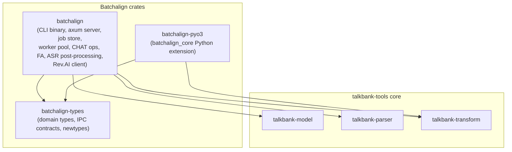

# Rust Workspace Map

**Status:** Current
**Last updated:** 2026-05-20 00:54 EDT

The Batchalign code lives inside the `talkbank-tools` Cargo workspace
as sibling crates under `crates/`. There are no cross-repo path
dependencies: parser, model, transform, and Batchalign all build from
the same workspace.



## Crates

| Crate | Responsibility |
| --- | --- |
| `batchalign` | the `batchalign3` binary plus the axum server, dispatch, daemon lifecycle, worker pool, job store, cache, CHAT extraction/injection/mapping, FA, ASR post-processing, and the Rev.AI client. The bulk of the runtime. |
| `batchalign-types` | shared domain, protocol, and scheduling types (newtypes, worker IPC contracts) — the small low-dependency crate everything else builds on. |
| `batchalign-pyo3` | builds the `batchalign_core` Python extension module via maturin. Workspace deps are `batchalign-types` + `talkbank-transform`; it does NOT depend on the runtime `batchalign` crate. |
| `xtask` | repo-local automation: affected-check selection, install/build smoke tests, repository policy checks. |

## Internal organization of the `batchalign` crate

Top-level modules under `crates/batchalign/src/`:

- `cli/`, `commands/` — CLI argument parsing, released-command specs,
  dispatch.
- `routes/`, `db/`, `pipeline/`, `planning/`, `worker/`, `execution/` —
  axum HTTP server, job store, worker orchestration.
- `chat_ops/` — CHAT extraction and injection.
- `fa/` — forced alignment and review-tier handling.
- `morphosyntax/` — `%mor`/`%gra` injection and Stanza interaction.
- `revai/` — Rev.AI ASR client.
- `host_facts/`, `host_memory.rs`, `host_policy.rs` — host-aware
  runtime configuration.
- `cache/`, `provenance.rs`, `compare.rs`, `benchmark.rs` — caching,
  provenance metadata, and compare/benchmark utilities.

## Typical commands

```bash
cargo build -p batchalign
cargo check --workspace
cargo nextest run --workspace
cargo nextest run -p batchalign --test cli
cargo nextest run -p batchalign --test integration
cargo xtask affected-rust packages

# Python extension build
uv run maturin develop -m crates/batchalign-pyo3/Cargo.toml -F pyo3/extension-module
# or, for a full wheel install into the dev env:
#   make batchalign-build-wheel && make batchalign-python-prepare
cargo nextest run --manifest-path crates/batchalign-pyo3/Cargo.toml
```

## Where to make changes

- CLI behavior, server APIs, job execution, logs, cache handling,
  worker orchestration, CHAT ops, FA, morphosyntax, Rev.AI →
  `crates/batchalign/`.
- Shared newtypes or worker IPC contracts → `crates/batchalign-types/`.
- Python extension surface (`batchalign_core`) →
  `crates/batchalign-pyo3/`.
- Parser, data model, validation, or transform behavior consumed by
  Batchalign → the corresponding `talkbank-*` crate in the same
  workspace.

## First files to read

1. `crates/batchalign/src/cli/mod.rs:251` — `run_command()`, the
   canonical command router.
2. `crates/batchalign/src/cli/` — CLI dispatch (explicit server vs.
   auto-daemon).
3. `crates/batchalign/src/execution/` — server-side task routing and
   dispatch shapes.
4. `crates/batchalign/src/routes/` — Axum HTTP routes.
5. `crates/batchalign/src/worker/` — worker pool and IPC.
6. `crates/batchalign/src/commands/` — released-command specs and
   command-owned wrappers.
7. `crates/batchalign-pyo3/src/lib.rs` — PyO3 module organization and
   entry points.

See also: [Rust CLI and Server](rust-cli-and-server.md) for detailed
dispatch documentation and the checklist for adding new commands.
