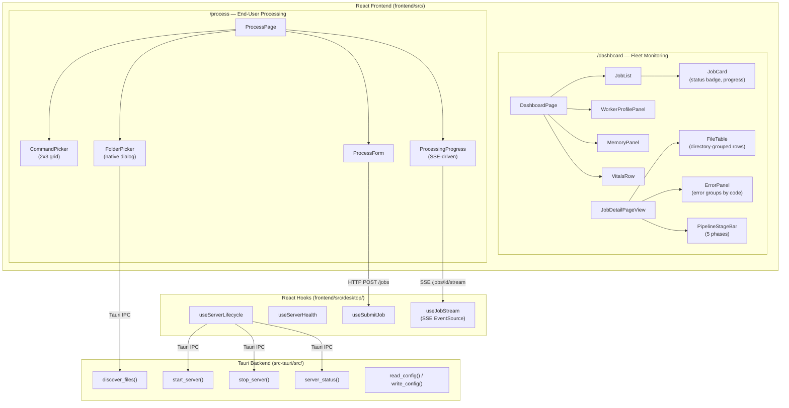

# Tauri + React Dashboard

**Status:** Current
**Last updated:** 2026-05-20 00:57 EDT

## Overview

Batchalign3 dashboard delivery uses:

1. `frontend/` as the canonical React UI.
2. `apps/dashboard-desktop/` as the Tauri desktop shell.

The frontend serves two surfaces:

- **`/process`**: End-user processing flow. Researchers pick a command, choose
  files via native folder picker, and watch SSE-driven progress. Default landing
  page in desktop mode.
- **`/dashboard`**: Fleet monitoring for power users. Real-time job status,
  file progress, error grouping, algorithm visualizations.

The Tauri shell stays thin: a small set of custom commands for file discovery,
config I/O, and local server lifecycle plus two plugins (`dialog` for file
pickers, `shell` for opening folders). All shared UI logic lives in the React
frontend, which now consumes shell-only capabilities through an explicit
desktop runtime seam instead of scattering raw Tauri imports across hooks and
components.

The following diagram shows the component hierarchy across both surfaces
and the Tauri backend IPC boundary.



## Web Dashboard Development

The dashboard is a React SPA that proxies API calls to a running batchalign3
server. You need **two terminals**: one for the Rust server, one for the Vite
dev server.

### Terminal 1: Start the Rust server

```bash
# Debug build (faster compile, slower runtime — fine for dashboard dev)
cargo run -p batchalign -- serve start --foreground --port 8000
```

Or if you already have a release binary:

```bash
./target/release/batchalign3 serve start --foreground --port 8000
```

The server must be on port 8000, the Vite dev config in `frontend/vite.config.ts`
proxies `/jobs`, `/health`, and `/ws` to `localhost:8000`.

### Terminal 2: Start the Vite dev server

```bash
cd frontend
npm ci          # first time only
npm run dev
```

Vite starts on `http://localhost:5173`. Open:

- **`http://localhost:5173/dashboard`**: fleet monitoring (job list, workers,
  memory, pipeline stages)
- **`http://localhost:5173/dashboard/jobs/<id>`**: job detail with file-level
  progress
- **`http://localhost:5173/dashboard/visualizations`**: algorithm trace
  visualizations (DP alignment, retokenization, FA timeline, ASR pipeline)
- **`http://localhost:5173/process`**: end-user processing flow (desktop-oriented,
  but works in browser for layout testing)

Changes to `frontend/src/` hot-reload instantly. Changes to Rust types require
rebuilding the server and regenerating OpenAPI types
(`bash scripts/generate_dashboard_api_types.sh`).

### Production mode (no dev server)

In production, the built SPA is served directly by the Rust server via
`ServeDir` with SPA fallback. After building:

```bash
scripts/build_react_dashboard.sh    # builds to ~/.batchalign3/dashboard/
```

The dashboard is then available at `http://localhost:8000/dashboard` (same
origin as the API, no proxy needed).

### Build production artifact:

```bash
scripts/build_react_dashboard.sh
```

By default, artifacts are copied to:

`~/.batchalign3/dashboard/`

Override target path:

```bash
scripts/build_react_dashboard.sh /tmp/batchalign-dashboard
```

## Desktop Dashboard (Tauri)

Run in development mode:

```bash
cd apps/dashboard-desktop
npm ci
npm run dev
```

This starts the frontend dev server on `:1420` with hot reload and opens the
Tauri webview at `/process?server=http://127.0.0.1:18000`.

The app auto-starts a batchalign3 server on port 18000. If `batchalign3` is not
on PATH, the status bar shows install instructions.

Build desktop bundle:

```bash
cd apps/dashboard-desktop
npm run build
```

Default backend target for desktop mode:

`http://127.0.0.1:18000`

Override backend at runtime using query parameter:

`?server=http://host:port`

### Tauri Commands

| Command | Signature | Purpose |
|---------|-----------|---------|
| `discover_files` | `(dir: String, extensions: Vec<String>) -> Vec<String>` | Walk directory tree, return paths matching extensions. Bridges native folder picker to `POST /jobs` `source_paths`. |
| `start_server` | `() -> ServerStatusInfo` | Spawn `batchalign3 serve start --foreground --port 18000` as managed child and return the resulting `{ running, port, binary_path, pid }` snapshot. |
| `stop_server` | `() -> ServerStatusInfo` | Kill managed server process and return the resulting `{ running, port, binary_path, pid }` snapshot. |
| `server_status` | `() -> ServerStatusInfo` | Return `{ running, port, binary_path, pid }`. |
| `get_batchalign_path` | `() -> Option<String>` | Find `batchalign3` on PATH. |
| `is_first_launch` | `() -> bool` | True if `~/.batchalign.ini` doesn't exist (triggers setup wizard). |
| `read_config` | `() -> UserConfig` | Read `~/.batchalign.ini` (engine + Rev.AI key). |
| `write_config` | `(config: UserConfig) -> DesktopCommandAck` | Write `~/.batchalign.ini`. |

### Tauri Events

| Event | Payload | Purpose |
|-------|---------|---------|
| `desktop://server-status-changed` | `ServerStatusChangedEvent` | Shell-owned server lifecycle updates consumed by the frontend server capability. |

### Server Lifecycle

The Tauri `setup` hook auto-starts the server on app launch. The
`on_window_event(Destroyed)` callback auto-stops it on exit. The `ServerProcess`
managed state holds the child process handle so start/stop/status commands can
inspect and control it.

`ServerProcess` now keeps the raw child handle behind `start()`, `stop()`,
`status()`, and `shutdown()` methods. That keeps the shell-local synchronization
detail out of the architectural surface and gives the Rust tests a stable unit
boundary.

Port 18000 is used (not the default 8000) to avoid conflicts with manually
started development servers.

### Tauri Plugins

| Plugin | Permissions | Purpose |
|--------|------------|---------|
| `dialog` | `dialog:allow-open`, `dialog:allow-save` | Native file/folder picker dialogs |
| `shell` | `shell:allow-open` | Open output folders in Finder/Explorer |

### Desktop-Specific Frontend Code

Low-level Tauri API access remains isolated in `frontend/src/lib/tauri.ts`, but
the React tree now consumes it through a protocol/capability split:

- `frontend/src/desktop/protocol.ts` inventories raw command/event identifiers
  and pairs them with request/response payload types
- `DesktopProvider` wraps the app in `frontend/src/main.tsx`
- `frontend/src/desktop/DesktopContext.tsx` exposes focused hooks:
  `useDesktopEnvironment()`, `useDesktopFiles()`, `useDesktopConfig()`, and
  `useDesktopServer()`
- `lib/tauri.ts` keeps the dynamic imports and browser fallbacks for dialogs,
  config, server lifecycle, event subscription, and shell-open helpers
- `runtime.ts` still owns environment detection only

New desktop-only features should extend one focused capability seam instead of
importing `@tauri-apps/*` or ad hoc command/event names directly in
components/hooks.

### Process Flow Components

Desktop-specific processing UI lives in `frontend/src/components/process/`:

| Component | Role |
|-----------|------|
| `CommandPicker` | 2×3 grid of command cards (transcribe, morphotag, align, translate, utseg, benchmark) |
| `FolderPicker` | Native folder picker wrapping Tauri dialog plugin |
| `OutputModeSelector` | Separate folder vs in-place output toggle |
| `ProcessForm` | Main orchestrator: command → configure → processing |
| `ProcessingProgress` | SSE-driven live file progress with completion actions |
| `RecentJobs` | Compact recent jobs list for home screen |

Supporting hooks:

| Hook | Role |
|------|------|
| `useServerLifecycle` | Auto-start server, subscribe to `desktop://server-status-changed`, track status (starting/running/stopped/not-found), expose start/stop |
| `useServerHealth` | Poll `GET /health` every 5s, expose reachability + capabilities |
| `useSubmitJob` | React Query mutation for `POST /jobs` with `paths_mode: true` |
| `useJobStream` | SSE `EventSource` wrapper for `/jobs/{id}/stream` |

Supporting components:

| Component | Role |
|-----------|------|
| `ServerStatusBar` | Green/yellow/red dot + label + manual start/stop button |
| `ErrorRecovery` | Structured error messages grouped by category with suggested actions |
| `OnboardingOverlay` | First-time 3-step guide (pick task → select files → watch progress) |
| `HelpPanel` | Slide-out panel with command descriptions and FAQ |

### First-Time Setup Wizard

On first launch (no `~/.batchalign.ini`), the desktop app shows a multi-step
setup wizard before the main route tree loads. This matches batchalign2's
behavior where `config_read(interactive=True)` triggers `interactive_setup()`
on first CLI invocation.

The wizard lives in `frontend/src/components/setup/`:

| Component | Role |
|-----------|------|
| `SetupWizard` | Multi-step flow: welcome → engine selection → API key → done |
| `EngineCard` | Rev.AI vs Whisper card with pros/cons |

The CLI has the same gate: processing commands check for `~/.batchalign.ini`
and auto-trigger `batchalign3 setup` if missing (interactive terminal) or
error with instructions (non-interactive).

### Desktop Shell Tests

Run the shell-focused Rust tests with:

```bash
cargo test --manifest-path apps/dashboard-desktop/src-tauri/Cargo.toml
```

These tests intentionally cover the native shell contracts only:

- `src-tauri/src/protocol.rs`: protocol identifier stability and event payload serialization
- `src-tauri/src/main.rs`: `discover_files_in_dir()` recursion/filter/sort
- `src-tauri/src/config.rs`: config roundtrip and Windows home-dir fallbacks
- `src-tauri/src/server.rs`: `ServerProcess` empty/running/exited child states

Keep new shell logic behind pure helpers or small state wrappers so this suite
can stay fast without booting the full webview.

Focused frontend seam checks live in
`frontend/e2e/tests/mock-server.spec.mjs`, which fakes the Tauri runtime to
exercise first-launch config flow, file discovery, and server status event
wiring.

## API Contract Discipline

Rust OpenAPI remains canonical. Regenerate dashboard artifacts with:

```bash
scripts/generate_dashboard_api_types.sh
```

Verify no drift (CI gate):

```bash
scripts/check_dashboard_api_drift.sh
```

## Dashboard Component Map

### Pages

| Route | Component | Purpose |
|-------|-----------|---------|
| `/dashboard` | `DashboardPage` | Two-column: job list + system panels |
| `/dashboard/jobs/:id` | `JobPage` → `JobDetailPageView` | Full job detail with file table |
| `/dashboard/visualizations` | `VisualizationsIndex` | Algorithm trace landing |
| `/dashboard/visualizations/:type` | `DPAlignmentPage`, etc. | Individual visualizations |
| `/process` | `ProcessPage` | Desktop processing flow |

### Job Display Components

| Component | File | Role |
|-----------|------|------|
| `JobList` | `JobList.tsx` | Renders sorted list of `JobCard`s |
| `JobCard` | `JobCard.tsx` | Single job summary: command badge, status, progress bar, metadata |
| `JobDetailPageView` | `JobDetailPageView.tsx` | Full detail: metadata grid, progress, file table, errors |
| `FileTable` | `FileTable.tsx` | Directory-grouped file rows with status, stage, progress |
| `PaginatedFileList` | `PaginatedFileList.tsx` | Wraps `FileTable` with pagination controls |
| `FilterTabs` | `FilterTabs.tsx` | Status filter tabs (All/Processing/Done/Error/Queued) + search |
| `ProgressBar` | `ProgressBar.tsx` | Animated fill bar with striped/indeterminate modes |
| `PipelineStageBar` | `PipelineStageBar.tsx` | 5-segment phase indicator (Read/Transcribe/Align/Analyze/Finalize) |
| `StatusBadge` | `StatusBadge.tsx` | Colored status pill |
| `ErrorPanel` | `ErrorPanel.tsx` | Error groups by code with expandable file lists |
| `ErrorCodeGroup` | `ErrorCodeGroup.tsx` | Single error code bucket |
| `StatusSummaryStrip` | `StatusSummaryStrip.tsx` | Inline done/error/active counts |
| `ActionButtons` | `ActionButtons.tsx` | Cancel/restart/delete controls |

### System Health Components (Right Column)

These panels live in the dashboard right column and consume `HealthResponse`
data from the Zustand `healthMap`:

| Component | File | Data Fields Used |
|-----------|------|-----------------|
| `WorkerProfilePanel` | `WorkerProfilePanel.tsx` | `live_worker_keys`, `live_workers`, `warmup_status` |
| `MemoryPanel` | `MemoryPanel.tsx` | `system_memory_total_mb`, `system_memory_available_mb`, `system_memory_used_mb`, `memory_gate_threshold_mb`, `memory_gate_aborts` |
| `VitalsRow` | `VitalsRow.tsx` | `worker_crashes`, `forced_terminal_errors`, `memory_gate_aborts`, `attempts_started`, `attempts_retried`, `deferred_work_units` |

The `DashboardPage` wires these by reading the first server's health from
`useStore((s) => s.healthMap)`. When a server filter is active, it uses that
server's health.

### Pipeline Phase Mapping

`PipelineStageBar` groups the 23 `FileProgressStage` enum variants into 5
visual phases. The mapping is defined in `PHASES` at the top of the component:

| Phase | Color | Stages |
|-------|-------|--------|
| Read | zinc | `reading`, `resolving_audio`, `checking_cache` |
| Transcribe | emerald | `transcribing`, `recovering_utterance_timing`, `recovering_timing_fallback` |
| Align | indigo | `aligning`, `applying_results` |
| Analyze | violet | `analyzing_morphosyntax`, `segmenting_utterances`, `translating`, `resolving_coreference`, `segmenting`, `analyzing`, `comparing`, `benchmarking` |
| Finalize | amber | `post_processing`, `building_chat`, `finalizing`, `writing` |

When adding a new `FileProgressStage` variant in Rust, add it to the
appropriate phase set in `PipelineStageBar.tsx` and to `PROGRESS_STAGE_LABELS`
in `frontend/src/utils.ts`.

### Worker Key Parsing

`WorkerProfilePanel` parses the `live_worker_keys` strings from the health
endpoint. The format is:

```text
profile:<gpu|stanza|io>:<lang>[:<engine_overrides>] (<N> total, <M> idle|shared)
```

Examples:
- `profile:gpu:eng (1 total, shared)`: one shared GPU worker for English
- `profile:stanza:eng (2 total, 1 idle)`: two Stanza workers, one currently checked out
- `profile:io:fra:{"translate":"seamless"} (1 total, 1 idle)`: IO worker with engine override

The regex parser in `parseWorkerKey()` handles these formats. If the server
changes the key format, the parser must be updated to match.

### Memory Panel Thresholds

`MemoryPanel` uses three proximity levels relative to the gate threshold:

- **safe** (green): `available > threshold × 4`
- **warning** (amber): `threshold × 2 < available ≤ threshold × 4`
- **danger** (red): `available ≤ threshold × 2`

The gate threshold marker on the gauge bar is positioned at
`(total - threshold) / total × 100%`: the point where available memory
equals the threshold.

## Dashboard State Boundary

The current dashboard intentionally splits client state by responsibility:

- Zustand owns fleet summary state such as job rows, health, connection status,
  and filter UI state.
- React Query owns REST-shaped detail payloads such as one fully resolved job
  record or trace download response.

The job detail page should surface the original submitted command options from
the REST payload. That operator-facing context is important for debugging
engine selection, incremental flags, and rerun behavior without reconstructing
the submission from logs.

Per-file progress data now also follows the same typed-boundary rule:

- `progress_stage` is the stable machine-readable stage code from Rust.
- `progress_label` is the derived operator-facing text shown in the UI.

Dashboard code should prefer `progress_stage` for client logic and treat the
label as a rendering convenience rather than a parsing target.

That split matters because the WebSocket reconciliation layer can patch the
same React Query cache entries that the detail route reads, instead of copying
one detailed job payload through a second global store slot.

## Dashboard E2E

Run dashboard Playwright smoke tests:

```bash
cd frontend
npm run e2e:install
npm run test:e2e
```

Run real-server dashboard E2E:

```bash
BATCHALIGN_REAL_SERVER_E2E=1 scripts/run_react_dashboard_smoke.sh
```
