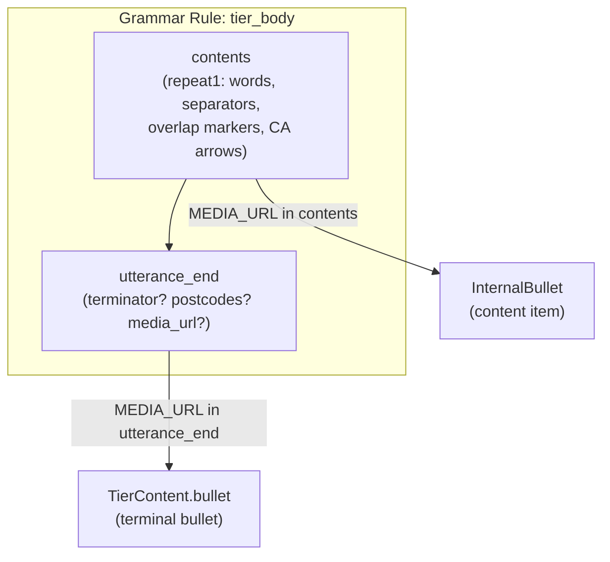

# Terminator Architecture

**Status:** Current
**Last updated:** 2026-05-21 13:15 EDT

This document is a comprehensive reference for how CHAT terminators are created,
stored, defaulted, validated, and propagated through every batchalign3 pipeline.
It also covers the relationship between terminators and bullet placement, the CA
transcript special case, and the differences from batchalign2.

## What Is a Terminator?

A **terminator** is the punctuation mark that ends a CHAT utterance. It indicates
the utterance type (declarative, interrogative, etc.) and in CA transcripts,
the intonation contour.

**CHAT manual reference:** <https://talkbank.org/0info/manuals/CHAT.html#Utterance_Terminators>

In standard CHAT, every main-tier utterance **must** end with a terminator:

```text
*CHI: I want a cookie .           ← Period (declarative)
*MOT: do you want a cookie ?      ← Question (interrogative)
*CHI: give me cookie !             ← Exclamation
```

**In CA transcripts (`@Options: CA`), terminators are optional.** Many
utterances have no terminator at all, and others use CA-specific intonation
markers instead of standard punctuation:

```text
*KE: I like LA the best , LA's quiet -->
*CO: yeah
*KE: I'm gonna make a little tiny
```

The `-->` is a CA level-pitch terminator. The other two utterances have no
terminator at all. This is valid CHAT for CA mode.

## The 20 Terminator Variants

**Source:** `talkbank-model/src/model/content/terminator.rs`

| Category | Variant | CHAT Token | Unicode |
|----------|---------|-----------|---------|
| **Standard** | `Period` | `.` | |
| | `Question` | `?` | |
| | `Exclamation` | `!` | |
| **Interruption** | `TrailingOff` | `+...` | |
| | `Interruption` | `+/.` | |
| | `SelfInterruption` | `+//.` | |
| | `InterruptedQuestion` | `+/?` | |
| | `SelfInterruptedQuestion` | `+//?` | |
| | `BrokenQuestion` | `+!?` | |
| | `TrailingOffQuestion` | `+..?` | |
| | `BreakForCoding` | `+.` | |
| **Quotation** | `QuotedNewLine` | `+"/.` | |
| | `QuotedPeriodSimple` | `+".` | |
| **CA Intonation** | `CaRisingToHigh` | (arrow) | U+21D7 |
| | `CaRisingToMid` | (arrow) | U+2197 |
| | `CaLevel` | (arrow) | U+2192 |
| | `CaFallingToMid` | (arrow) | U+2198 |
| | `CaFallingToLow` | (arrow) | U+21D8 |
| **CA Break** | `CaTechnicalBreak` | (symbol) | U+224B |
| | `CaNoBreak` | (symbol) | U+2248 |

The `Terminator` enum does **not** implement `Default`. An utterance with no
terminator is represented as `Option<Terminator>::None`, never a defaulted
variant.

## Storage in the AST

**Source:** `talkbank-model/src/model/content/tier_content.rs`

```rust,ignore
pub struct TierContent {
    pub linkers: Linkers,
    pub language_code: Option<LanguageCode>,
    pub content: TierItems,           // words, separators, groups, etc.
    pub terminator: Option<Terminator>,  // <-- HERE
    pub postcodes: Vec<Postcode>,
    pub bullet: Option<Bullet>,       // terminal utterance-level bullet
    pub span: Span,
}
```

Serialization order is critical:


When `terminator` is `None`, the serializer skips it entirely. The bullet still
appears at the end, but there is no punctuation mark between content and bullet.

## The Terminator-Bullet Problem

### How the grammar classifies bullets

The tree-sitter grammar defines two positions where `MEDIA_URL` (bullet) nodes
can appear:



A `MEDIA_URL` node in `contents` becomes `UtteranceContent::InternalBullet`.
A `MEDIA_URL` node in `utterance_end` becomes `TierContent.bullet`.

### The CA arrow bug (grammar.js)

**The 5 CA intonation arrows are defined as content separators, NOT as
terminators in the grammar.** The `terminator` rule lists 16 variants but
excludes the arrows. The arrows are in the `ca_intonation` rule inside
`separator`, which is consumed by the greedy `contents` rule.

```text
Grammar:
  terminator = choice(PERIOD, QUESTION, EXCLAMATION, ..., CA_NO_BREAK, CA_TECHNICAL_BREAK)
                                                          ← CA arrows MISSING here

  separator = choice(..., ca_intonation)
                          ← CA arrows consumed here

  contents = repeat1(choice(content_item, separator, ...))
                          ← greedy, eats arrows before utterance_end runs
```

**Result for a CA line with two bullets:**

```text
Input:  *KE: words --> [bullet1] [bullet2]

Grammar parse:
  contents = [words, Separator(-->), InternalBullet(bullet1)]
  utterance_end = [no terminator, terminal bullet(bullet2)]
```

The arrow is eaten by `contents` as a separator. The first bullet after it is
also eaten as an `InternalBullet`. Only the second bullet reaches
`utterance_end` and becomes the terminal `TierContent.bullet`.

### Consequence: double bullets on the main line

When the file is serialized:

1. Content items are written (including `InternalBullet(bullet1)`)
2. Terminator is written (None for CA, so skipped)
3. Terminal bullet is written (`TierContent.bullet = bullet2`)

Output: `*KE: words --> [bullet1] [bullet2]` -- two bullets.

### The corrective direction

The arrows are not terminators. Per CHECK, the five CA intonation
arrows (`→ ↗ ⇗ ↘ ⇘`) are **separators**, not utterance enders, and
the current `Terminator::CaRisingToHigh / CaRisingToMid / CaLevel /
CaFallingToMid / CaFallingToLow` variants are the misclassification.
The corrective direction is to remove those five variants from the
model and grammar — keeping the arrows in the `separator` rule where
they belong — and to fix the double-bullet symptom downstream: bullets
positioned after an arrow on a CA tier should remain a single terminal
`TierContent.bullet`, not split into `InternalBullet` + terminal.
Tracked as BUG-009.

## Where Terminators Are Created

Every code path that creates a `Terminator` value:

### 1. Parser (talkbank-tools)

**File:** `talkbank-parser/.../terminator.rs`

Maps 16 of 20 CST node kinds to `Terminator` variants. The 5 CA intonation
arrows are **not mapped** (they never reach the terminator position due to the
grammar bug above). The 2 CA break variants (`CaTechnicalBreak`, `CaNoBreak`)
and their linker forms are mapped.

### 2. ASR post-processing

**File:** `crates/talkbank-transform/src/asr_postprocess/mod.rs`

When `retokenize()` flushes remaining words without explicit punctuation, it
unconditionally appends a period:

```rust,ignore
buf.push(AsrWord::new(".", None, None));  // HARDCODED PERIOD
```

**Impact:** All ASR-produced utterances get a period terminator. CA transcripts
created from ASR will have periods that should not exist.

### 3. Utterance segmentation (utseg)

**File:** `crates/talkbank-transform/src/utseg.rs`

When splitting an utterance into multiple, every split gets a hardcoded Period:

```rust,ignore
Terminator::Period { span: Span::DUMMY }
```

**Impact:** Running utseg on a CA transcript destroys the original
terminator-less structure.

### 4. CHAT building from ASR

**File:** `crates/talkbank-transform/src/build_chat/mod.rs`

Infers terminator from the last word text. Default is Period:

```rust,ignore
_ => Terminator::Period { span: Span::DUMMY }
```

**Impact:** All build-from-ASR paths produce Period terminators.

## Where Terminators Are Silently Defaulted

### Morphosyntax payload collection

**File:** `crates/talkbank-transform/src/morphosyntax/payload.rs`

```text
.unwrap_or_else(|| ".".to_string())
```

When collecting words for the Python Stanza worker, a missing terminator is
silently replaced with `"."` in the payload string. This affects the NLP model's
sentence-type features.

### MOR tier injection terminator handling

**File:** `crates/talkbank-transform/src/morphosyntax/injection.rs`

The injection layer copies the utterance's terminator into the rebuilt
MOR tier. When the terminator is `None`, the MOR tier gets an empty
string at that position. There is no morphosyntax cache layer to read
from (text NLP runs use a no-op cache).

## Where Terminators Are Validated

### Pre-command validation (CA-aware)

**File:** `crates/talkbank-transform/src/validate.rs`

```rust,ignore
let is_ca = file.options.iter().any(|f| matches!(f, ChatOptionFlag::Ca));
if !is_ca && utt.main.content.terminator.is_none() { /* error */ }
```

Correctly exempts CA files from the missing-terminator check.

### Post-command validation (NOT CA-aware)

**File:** `crates/talkbank-transform/src/validate.rs`

```text
if utt.main.content.terminator.is_none() { /* warning */ }
```

Does **not** check for CA mode. This is why the Sprott output shows "utterance
by *KE lost its terminator" warnings -- the CA utterances legitimately have no
terminator, but post-validation doesn't know that.

### NLP mapping assumptions

**File:** `crates/talkbank-transform/src/morphosyntax/sentence_mapping.rs`

The MOR/GRA coordination code assumes every utterance has a terminator that
maps to a PUNCT relation in GRA:

```rust,ignore
let terminator_idx = mors.iter().map(|m| m.count_chunks()).sum::<usize>() + 1;
```

The `+1` is the terminator. For CA utterances without terminators, this count
may be wrong.

## Single-Parse Pipeline (eliminates serialize→re-parse)

The align pipeline previously serialized the `ChatFile` to text after UTR and
re-parsed it before FA — creating 3 parses and 2 serializations per file. The
re-parse was the mechanism that turned UTR-injected terminal bullets into
`InternalBullet` content items (when CA arrows prevented correct terminal
placement).

As of 2026-03-30, the pipeline uses a **single-parse architecture**:

1. `fa_pipeline.rs` parses CHAT text once → `ChatFile`
2. `run_utr_pass(&mut ChatFile, ...)` mutates the AST in place — no serialization
3. `run_fa_from_ast(ChatFile, ...)` receives the AST directly — no re-parse
4. Final serialization happens once at the end

This eliminates the serialize→re-parse cycle entirely. Combined with the
talkbank-tools CA terminator resolution (which promotes trailing CA arrows
from separator to terminator during CST→AST conversion), the double-bullet
bug cannot occur.

## Where Terminators Are Correctly Preserved

- **FA pipeline** (`fa/injection.rs`, `fa/postprocess.rs`, `fa/orchestrate.rs`):
  FA never touches `TierContent.terminator`. It only modifies word
  `inline_bullet` and `TierContent.bullet`.

- **Retokenize** (`retokenize/parse_helpers.rs`): When Stanza produces a
  different terminator than the original, a warning is logged and the original
  is preserved.

- **Compare** (`compare.rs`): Collects terminators as `Option<String>` -- safe
  for `None`.

## Batchalign2 Comparison

BA2 (Python, baseline commit `84ad500b`) handled terminators very differently:

### BA2 data model

BA2's `Utterance` stores content as a flat `List[Form]` where `Form` has
`text: str` and `time: Optional[Tuple[int, int]]`. The terminator is the
**last Form** in the list whose text is in `ENDING_PUNCT`. There is no separate
`terminator` field -- it's just a regular form.

```python
ENDING_PUNCT = [".", "?", "!", "+//.", "+/.", "+...", "+/?", "+!?", ...]
MOR_PUNCT = ["", "", ","]
```

### BA2 parsing

BA2 regex-matches `\x15\d+_\d+\x15` to find bullets. Terminators are detected
by scanning the last word of the content. If no terminator is found, `.` is
the implicit default via the `delim` property.

### BA2 forced alignment

1. Groups utterances into 20-second windows
2. Strips ALL punctuation (both `ENDING_PUNCT` and `MOR_PUNCT`) from the text
   sent to Whisper
3. Whisper returns timestamped words WITHOUT terminators
4. Character-level DP alignment maps words back
5. Terminators remain in the document but get no timing

### BA2 CA handling

BA2 had **no CA-specific terminator handling**. CA intonation arrows were not
in `ENDING_PUNCT` and would have been treated as regular word content.

### Key differences

| Aspect | BA2 | BA3 |
|--------|-----|-----|
| **Terminator storage** | Last Form in content list | Separate `Option<Terminator>` field |
| **Terminator type** | String from `ENDING_PUNCT` | 20-variant enum |
| **CA arrows** | Not recognized as terminators | Enum variants exist but grammar doesn't wire them |
| **Missing terminator** | Implicit `.` default | Explicit `None` |
| **Bullet model** | Regex on serialized text | AST: `InternalBullet` vs `TierContent.bullet` |
| **FA terminator treatment** | Strip before Whisper | Exclude from word extraction |
| **Grammar-level distinction** | N/A (no grammar) | `contents` vs `utterance_end` position |

### What changed (and what broke)

BA3 introduced a principled AST with separate terminator and bullet fields,
replacing BA2's string manipulation. This is architecturally correct but
exposed a grammar gap: the CA intonation arrows are defined as content
separators in the grammar, not as terminators. BA2 never had this problem
because it never parsed terminators from a grammar -- it just did string
matching.

The double-bullet bug is a consequence of this grammar gap. When the grammar
consumes a CA arrow as a content separator, it also consumes the next bullet as
an `InternalBullet` content item. Then `utterance_end` creates a second
terminal bullet. Both serialize on the main line.

## Exhaustive File Inventory

Every file in batchalign3 that references terminators, classified by behavior:

All paths below are under `crates/`.

| File | Behavior | Notes |
|------|----------|-------|
| `talkbank-transform/src/asr_postprocess/mod.rs` | **DEFAULTS to `.`** | Appends period when no punctuation |
| `talkbank-transform/src/build_chat/mod.rs` | **CREATES from last word** | Defaults to Period for unrecognized |
| `talkbank-transform/src/utseg.rs` | **CREATES Period** | Split utterances always get period |
| `talkbank-transform/src/morphosyntax/payload.rs` | **DEFAULTS to `"."`** | Payload string includes silent default |
| `talkbank-transform/src/morphosyntax/injection.rs` | **READS, patches** | Copies utterance terminator into MOR tier |
| `talkbank-transform/src/inject.rs` | **PRESERVES** | Top-level injection entry; passes through to retokenize |
| `talkbank-transform/src/retokenize/parse_helpers.rs` | **PRESERVES** | Keeps original when Stanza differs |
| `talkbank-transform/src/retokenize/rebuild.rs` | **PRESERVES** | Carries expected_terminator through |
| `batchalign/src/compare.rs` | **READS** | Collects as `Option<String>` |
| `talkbank-transform/src/translate.rs` | **READS** | Lists all variants for spacing |
| `talkbank-transform/src/validate.rs` | **CHECKS (CA-aware)** | Pre-validation exempts CA |
| `talkbank-transform/src/validate.rs` | **CHECKS (NOT CA-aware)** | Post-validation always warns |
| `talkbank-transform/src/morphosyntax/sentence_mapping.rs` | **ASSUMES +1** | GRA index assumes terminator exists |
| `talkbank-transform/src/morphosyntax/gra_validate.rs` | **ASSUMES** | Skips last GRA as terminator PUNCT |
| `batchalign/src/fa/` | **PRESERVES** | Forced-alignment never touches terminator |

## Known Issues

1. **Grammar bug:** CA intonation arrows not in `terminator` rule -- causes
   double bullets and `InternalBullet` misclassification.

2. **Post-validation not CA-aware:** `validate_output()` warns about missing
   terminators even for CA files.

3. **Hardcoded period defaults:** ASR postprocess, utseg, and build_chat all
   default to Period when no terminator is found. CA transcripts processed
   through these paths get incorrect periods.

4. **NLP mapping +1 assumption:** MOR/GRA coordination assumes a terminator
   PUNCT relation exists. CA utterances without terminators may have wrong
   GRA indices.

5. **Morphosyntax silent default:** Cache key computation silently defaults
   missing terminator to `"."`, which could cause cache collisions between
   CA utterances that differ only in terminator presence.
