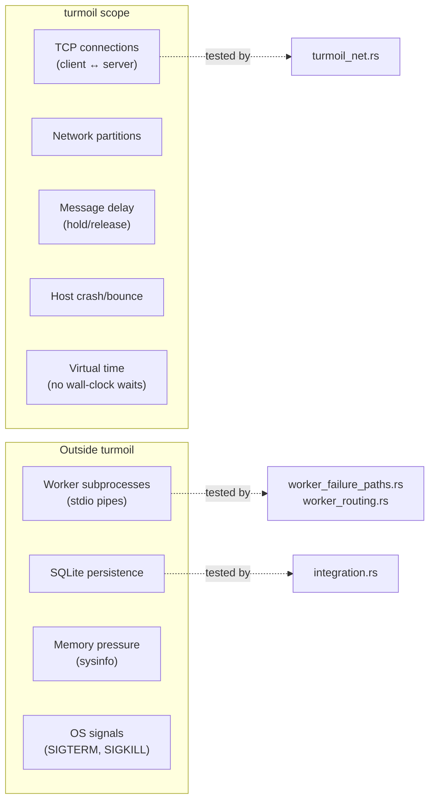
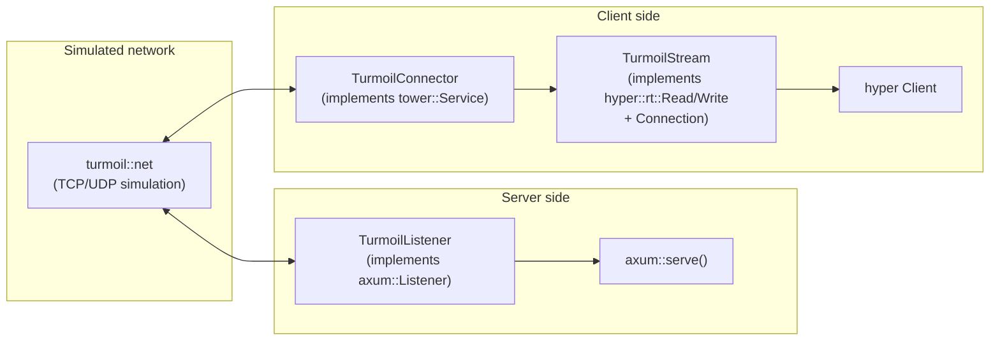

# Deterministic Simulation Testing with turmoil

**Status:** Current
**Last modified:** 2026-05-01 09:47 EDT

## Why we need this

The existing test suite covers worker lifecycle, job dispatch, protocol
correctness, and ML golden outputs well. But it has **no tests for
network-level fault scenarios**: what happens when a client disconnects
mid-stream? When the network partitions and recovers? When the server
crashes and restarts? When multiple clients race against each other?

These gaps are not hypothetical. Several production incidents trace to
network-adjacent behavior:

- Temporal workers that appeared connected but never executed activities
  (a fleet-wide hang)
- Stale batchalign3 processes surviving across deploys because the restart
  sequence didn't verify the new process was actually serving
- Dashboard SSE streams silently dropping events under load

[turmoil](https://github.com/tokio-rs/turmoil) is a deterministic simulation
testing framework from the tokio project. It replaces real TCP with a
simulated network running in a single thread with virtual time. Tests are
fast (~10ms), deterministic (same seed = same result), and can inject
network faults declaratively.

## What turmoil tests vs. what it does not

turmoil controls the **network layer only**. It is complementary to the
existing test tiers, not a replacement.



| What turmoil tests | What it does NOT test |
|---|---|
| HTTP request/response under partition | Worker subprocess crashes (use SIGKILL tests) |
| SSE stream behavior when client disconnects | SQLite WAL corruption or SQLITE_BUSY |
| Server restart and recovery | Memory gate and sysinfo behavior |
| Concurrent client requests | Python model loading failures |
| Message delay and reordering | LaunchAgent restart behavior |
| Health check timeout behavior | Real TCP edge cases (RST, congestion) |

## Architecture

### The key seam

The existing server architecture already provides a clean separation between
**router creation** and **listener binding**:

```rust
// server.rs — production path
let (router, state) = create_app_with_prepared_workers(config, ...).await?;
let listener = tokio::net::TcpListener::bind(&addr).await?;
axum::serve(listener, router.into_make_service_with_connect_info()).await?;
```

turmoil tests reuse the same `Router` but bind it to turmoil's simulated
listener instead. No production code changes are needed.

### Adapter components

Three small adapter types bridge turmoil's simulated network to axum and
hyper. All live in `crates/batchalign/tests/turmoil_net.rs`:



**`TurmoilListener`** — wraps `turmoil::net::TcpListener`, implements
`axum::serve::Listener`. turmoil's `TcpStream` implements tokio's
`AsyncRead + AsyncWrite` directly, satisfying axum's bounds.

**`TurmoilConnector`** — implements `tower::Service<Uri>`, resolves turmoil
hostnames via `turmoil::lookup()`, connects through the simulated network.

**`TurmoilStream`** — newtype around `TokioIo<turmoil::net::TcpStream>` that
additionally implements `hyper_util::client::legacy::connect::Connection`
(required by hyper's legacy client API).

### Test structure

Each test creates a `turmoil::Sim` with named hosts:

```rust
#[test]
fn health_check_under_partition() -> turmoil::Result {
    let mut sim = turmoil::Builder::new()
        .simulation_duration(Duration::from_secs(30))
        .build();

    // Server host — binds turmoil listener, serves axum router
    sim.host("server", || async {
        let listener = turmoil::net::TcpListener::bind("0.0.0.0:8001").await?;
        let router = health_only_router();
        axum::serve(TurmoilListener(listener), router.into_make_service())
            .await
            .map_err(|e| Box::new(e) as Box<dyn std::error::Error>)?;
        Ok(())
    });

    // Client host — makes HTTP requests through turmoil connector
    sim.client("client", async {
        let client = turmoil_http_client();

        // 1. Verify connectivity
        let resp = client.request(/* GET /health */).await?;
        assert_eq!(resp.status(), 200);

        // 2. Partition the network
        turmoil::partition("client", "server");

        // 3. Request should time out
        let result = tokio::time::timeout(
            Duration::from_secs(5),
            client.request(/* GET /health */),
        ).await;
        assert!(result.is_err());

        // 4. Repair and verify recovery
        turmoil::repair("client", "server");
        let resp = client.request(/* GET /health */).await?;
        assert_eq!(resp.status(), 200);

        Ok(())
    });

    sim.run()
}
```

**Virtual time:** `tokio::time::sleep()` advances the simulated clock
instantly. A test that simulates 30 seconds of network behavior runs in
~10ms wall time.

## Running the tests

```bash
# Run all turmoil tests
cargo nextest run -p batchalign --test turmoil_net

# List available turmoil tests
cargo nextest list -p batchalign --test turmoil_net
```

turmoil tests are part of **Tier 1 (fast tests)** — no ML models, no Python,
no GPU. They run in the default `cargo nextest run` and `make test`.

## Current test scenarios

### Infrastructure tests

| Test | What it exercises | Fault injected |
|------|---|---|
| `health_check_basic` | Adapter correctness — server responds over simulated TCP | None (baseline) |
| `health_check_under_partition` | Partition → timeout → repair → recovery | `turmoil::partition()` / `repair()` |
| `health_check_with_message_hold` | Delayed response arrives after messages released | `turmoil::hold()` / `release()` |
| `concurrent_clients_health_check` | 3 clients hit the server simultaneously | Concurrency (no explicit fault) |
| `server_crash_and_recovery` | Server crash, bounce, new client reconnects | `sim.crash()` / `sim.bounce()` |

### an operator/a user scenario tests

These model specific production problems the team experienced:

| Test | Real-world scenario | Fault injected |
|------|---|---|
| `one_way_partition_client_sends_but_no_response` | a user submits jobs but never gets progress updates — responses are dropped | `turmoil::partition_oneway()` |
| `rapid_reconnection_burst_after_restart` | Deploy restarts server, 5 dashboard clients (an operator, a user, fleet monitors) reconnect simultaneously | `sim.crash()` / `sim.bounce()` + concurrent clients |
| `network_flap_rapid_partition_cycles` | Fleet machines on unstable WiFi — Tailscale connection flaps repeatedly | 5x `partition()` / `repair()` cycles |
| `slow_response_eventually_arrives` | a user's machine on slow WiFi — responses take 10+ seconds but eventually arrive intact | `turmoil::hold()` for 10s, then `release()` |

### Real-app tests (require Python test-echo workers)

These use the actual batchalign router with `MockConnectInfo` and
`create_test_app()`. They take ~200-300ms each (real subprocess startup).

| Test | Real-world scenario | Fault injected |
|------|---|---|
| `real_app_submit_and_poll_job` | an operator submits a job from the dashboard, polls for completion | None (baseline lifecycle) |
| `real_app_partition_during_job_processing` | an operator submits a job, Tailscale drops, reconnects later — job completed during outage | `turmoil::partition()` / `repair()` |
| `real_app_sse_nonexistent_job_returns_404` | an operator bookmarks a deleted job URL — should get 404, not a hanging stream | None (error path) |
| `real_app_health_reports_workers` | Health endpoint must report actual worker state | None (accuracy) |

## turmoil fault injection API

The turmoil API for fault injection is declarative and operates on named
host pairs:

```rust
// Network partitions (messages dropped silently)
turmoil::partition("client", "server");          // bidirectional
turmoil::partition_oneway("client", "server");   // one direction only
turmoil::repair("client", "server");             // restore connectivity

// Message buffering (simulates latency, enables reordering)
turmoil::hold("client", "server");    // buffer messages, don't deliver
turmoil::release("client", "server"); // deliver all buffered messages

// Host lifecycle
sim.crash("server");   // stop the host (clean teardown, not SIGKILL)
sim.bounce("server");  // restart the host's future from scratch
```

**Partition behavior:** under partition, TCP SYN packets are dropped silently.
The client's connection attempt hangs (not "connection refused"). Use
`tokio::time::timeout()` to detect this — the virtual clock advances
instantly so the timeout resolves without wall-clock delay.

## Known limitations

### `ConnectInfo` solved via `MockConnectInfo`

axum provides `MockConnectInfo<T>` — a middleware layer that injects a
default `ConnectInfo` for all requests. turmoil tests apply this to the
router so `submit_job`'s `ConnectInfo<SocketAddr>` extractor works without
`into_make_service_with_connect_info`:

```rust
use axum::extract::connect_info::MockConnectInfo;
let router = router.layer(MockConnectInfo(SocketAddr::from(([10, 0, 0, 1], 0))));
```

### AppState actor runtime parity (solved)

The batchalign `AppState` spawns background actors (JobRegistry,
RuntimeSupervisor, health monitors) via `tokio::spawn` during app creation.
turmoil hosts have their own simulated single-threaded runtime. Creating the
app inside turmoil doesn't work because Python subprocess spawning needs real
wall-clock time.

**Solution:** `create_real_test_app_blocking()` creates a **multi-thread tokio
runtime** that hosts the background actors. The `Router` is extracted and
handed to the turmoil host for simulated network serving. The runtime stays
alive (leaked as `&'static`) so its worker threads keep polling the actors:

```rust
let mut app = create_real_test_app_blocking(&python);
let router = app.take_router();
let _app: &'static _ = Box::leak(Box::new(app)); // keep actors alive

sim.host("server", move || {
    async move {
        let listener = turmoil::net::TcpListener::bind("0.0.0.0:8001").await?;
        axum::serve(TurmoilListener(listener), router.into_make_service()).await?;
        Ok(())
    }
});
```

tokio's channels (`UnboundedSender`, `oneshot`) are runtime-agnostic — senders
on turmoil's simulated runtime communicate with receivers on the real runtime's
worker threads without issues.

### Determinism gaps

turmoil intercepts `tokio::net` and `tokio::time` but does **not** intercept:
- `std::time::Instant::now()` — dependencies using this get real wall-clock time
- `getrandom` / `HashMap` randomization — ordering may vary across runs
- Any C library calls (rusqlite, sysinfo)

For our current tests (simple request/response assertions) this is not a
problem. If we add tests that depend on exact scheduling order, consider
adopting [mad-turmoil](https://lib.rs/crates/mad-turmoil) which adds libc
symbol overrides for `clock_gettime` and `getrandom`.

### Simplified TCP model

turmoil's TCP is not RFC-compliant. No congestion control, no segmentation,
no RST packets. Bugs that depend on real TCP behavior (half-open connections,
congestion backoff) will not be caught. This is acceptable — our HTTP layer
sits above TCP and does not interact with transport-level details.

## Future work

### SSE stream disconnect tests

The SSE endpoint (`/jobs/{id}/stream`) uses `tokio::sync::broadcast` to fan
out events. Testing client disconnect behavior requires:
1. Submitting a job (needs `ConnectInfo` workaround or separate router)
2. Connecting to the SSE stream
3. Dropping the client connection mid-stream
4. Verifying the server doesn't panic and other clients are unaffected

### WebSocket resilience

Similar to SSE but using the WebSocket endpoint (`/ws`). The broadcast
subscription and `tokio::select!` loop in `handle_ws()` should handle
client disconnects gracefully.

### Full server with test-echo workers

The current tests use a minimal health-only router. Wiring
`create_test_app()` into the turmoil simulation would enable testing the
full HTTP API (job submission, result download, SSE streaming) under network
faults. This requires either:
- Working around the `ConnectInfo` limitation
- Creating a turmoil-specific app factory that omits `ConnectInfo`

### Shuttle not viable for our concurrency primitives

Shuttle (AWS) was investigated for testing concurrency within the server,
but our highest-value primitives (`tokio::sync::broadcast` — 19 uses,
`tokio::sync::Semaphore` — 7 uses) are not modeled by shuttle (broadcast
is a stub that panics, Semaphore forwards to real tokio with no schedule
exploration). The supported primitives (Mutex, oneshot, mpsc) have
straightforward usage patterns with low race-condition risk. See
`docs/tool-evaluations/shuttle.md` for the full investigation.

## Dependencies

turmoil and its adapter dependencies are **dev-dependencies only** — they do
not appear in the release binary or affect production builds:

```toml
# crates/batchalign/Cargo.toml
[dev-dependencies]
turmoil = "0.7"
hyper = { version = "1", features = ["client", "http1"] }
hyper-util = { version = "0.1", features = ["client-legacy", "tokio"] }
http-body-util = "0.1"
tower = { version = "0.5", features = ["util"] }
```

## References

- [turmoil repo](https://github.com/tokio-rs/turmoil)
- [Announcing turmoil (Tokio blog)](https://tokio.rs/blog/2023-01-03-announcing-turmoil)
- [Deterministic simulation testing for async Rust (S2.dev)](https://s2.dev/blog/dst)
- `Tool evaluation: turmoil` — full
  assessment including comparison to madsim and shuttle
