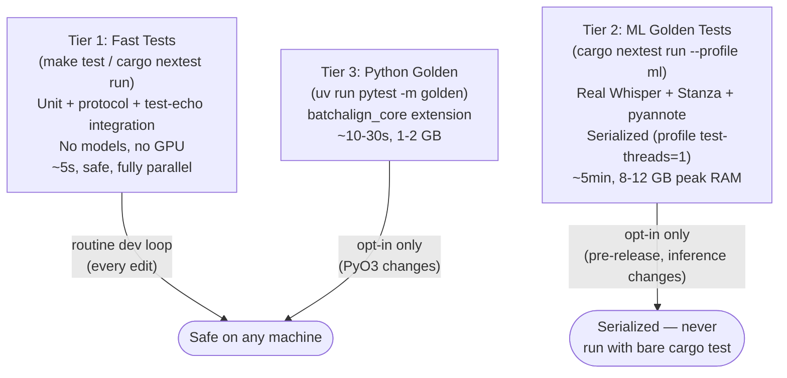

# Testing

**Status:** Current
**Last updated:** 2026-05-20 00:58 EDT

## Philosophy

The test suite is split into tiers by design. The following diagram shows
the tiers, their resource requirements, and how to invoke each.



1. **Fast tests**: unit tests, protocol tests, test-echo integration tests.
   No ML models, no GPU, no multi-GB processes. These run in seconds, fully
   parallel, on every edit. This is the inner development loop. It must stay
   fast and safe, a `cargo nextest run` should never crash your machine.

2. **ML tests**: golden snapshots, audio transcription, parity checks,
   profile verification. These spawn real Python workers that load Whisper,
   Stanza, pyannote, etc. Each worker consumes 2-5 GB RAM. They are slow,
   expensive, and dangerous on developer machines.

**ML tests are excluded by default.** You must opt in explicitly, and only
when you have a reason: a change to worker dispatch, a new language, an
inference module edit, a pre-release check. Never as part of routine
edit-compile-test.

This mirrors the Python side, where `uv run pytest` excludes `golden`,
`slow`, and `integration` markers by default.

## Fast Contributor Loop

For command-workflow edits, the shortest useful loop is usually:

```bash
cargo xtask affected-rust packages
make batchalign-python-prepare
cargo build -p batchalign
cargo nextest run -p batchalign --test workflow_helpers
cargo nextest run -p batchalign --test cli
uv run batchalign3 --help
```

Use the workflow-layer tests when you are changing:

- command semantics
- compare / benchmark behavior
- materializers and typed intermediate bundles
- workflow-family dispatch or composition

Keep the broader ML tests for runtime changes that actually touch workers,
models, or cache behavior.

If you only changed docs or workflow metadata, start with
`cargo xtask affected-rust packages` and the narrow CLI/help checks before
running anything expensive.

### Why this matters

Kernel OOM panics have been caused by ML test binaries spawning
concurrent Whisper workers during `cargo nextest run`. Each golden test
binary was a separate process that started its own server with its own
worker pool. Running them in parallel exhausted machine memory.

A separate kernel OOM panic was caused by running Python
`@pytest.mark.golden` tests repeatedly with the default `-n 3` from
`pytest.ini`. Each xdist worker loaded its own Stanza model instance
(~500 MB). Over multiple invocations combined with cargo builds and a
local batchalign daemon, cumulative memory pressure exceeded the
machine's RAM. This led to the three-layer Python-side OOM guard in
`conftest.py`.

See `docs/postmortems/` for incident details.

### Implemented solution: single binary

All ML tests are consolidated into one binary (`ml_golden`). One binary =
one process = one `LazyLock` = one `PreparedWorkers` = one set of loaded
models. Peak memory is ~8-12 GB (one pool) instead of 7x that.

The `LiveServerSession` fixture within the binary is well-designed:
- **One `PreparedWorkers` backend** shared across all 70 tests
- **Fresh HTTP server per session** (new port, new jobs dir, new SQLite)
- **Semaphore-gated sessions** so tests don't collide on control-plane state
- **Warm model cache** across tests, only the first test pays cold-start

### Defense-in-depth layers

These remain as additional safety nets:

| Layer | What | Catches |
|-------|------|---------|
| **nextest default-filter** | `ml_golden` excluded from `cargo nextest run` | Routine dev runs |
| **`ml` nextest profile** | ML tests serialized via profile `test-threads = 1` | Explicit opt-in |
| **Global worker cap** | `max_total_workers` (RAM / 6GB, clamped to `[2, 32]`) | Multi-key pool explosion |
| **`WorkerPool::Drop`** | Kills idle workers when pool is dropped | Test cleanup on panic/exit |
| **PID file reaper** | `~/.batchalign3/worker-pids/` scanned on startup | Orphans from crashed servers |
| **pytest OOM guard (configure)** | Forces `-n 0` when `-m golden` on < 128 GB machine | Standard golden invocation |
| **pytest OOM guard (collection)** | Aborts if golden tests collected with `-n > 0` on < 128 GB | Overridden addopts |
| **pytest OOM guard (fixture)** | Per-test `_guard_golden_oom` autouse fixture fails in xdist workers on < 128 GB | Belt-and-suspenders; cannot be bypassed |
| **Claude Code guard hook** | Blocks `cargo test`/`cargo nextest` if workers detected | AI assistant sessions |

## Quick reference

```bash
# Fast tests only (default — safe, parallel, no models)
cargo nextest run --workspace
make test

# ML tests only (serialized, one at a time)
cargo nextest run --profile ml

# Specific ML test (filter by submodule name)
cargo nextest run --profile ml -E 'binary_id(batchalign::ml_golden) & test(golden::)'

# Everything (fast + ML)
cargo nextest run --profile ml

# Python (fast only by default)
uv run pytest

# Python golden/integration
uv run pytest -m golden
uv run pytest -m integration
```

## Nextest configuration

The nextest config lives in `.config/nextest.toml`.

**Default profile:** applies a `default-filter` that excludes all ML test
binaries. `cargo nextest run` runs only fast tests. This is the safe
default.

**ML profile (`--profile ml`):** the profile's `default-filter` selects
only `binary(ml_golden)`, and the profile sets `test-threads = 1` so the
suite runs serially, preventing concurrent model loading and the OOMs
that follow.

**Override the default filter for one run:**
```bash
cargo nextest run --ignore-default-filter -E 'binary_id(batchalign::ml_golden)'
```

All ML tests live in one binary (`ml_golden`) with submodules:

| Submodule | What | Models |
|-----------|------|--------|
| `golden` | Text NLP golden snapshots | Stanza |
| `golden_audio` | Audio transcription/alignment | Whisper, Wave2Vec, pyannote |
| `golden_parity` | Batchalign2 output parity | Stanza |
| `live_server_fixture` | Full server with live workers | Mixed |
| `profile_verification` | Worker pool profile grouping | Wave2Vec, Stanza |
| `option_receipt` | Option propagation differential tests | Stanza, Wave2Vec |
| `error_paths` | Graceful failure under live server | Mixed |

## Test categories

| Category | Tool | Command | Models | Runtime | Default |
|----------|------|---------|--------|---------|---------|
| Rust unit tests | cargo | `cargo nextest run --workspace` | None | ~5s | Yes |
| PyO3 unit tests | cargo | `cargo nextest run --manifest-path crates/batchalign-pyo3/Cargo.toml` | None | ~3s | Yes |
| Python unit tests | pytest | `uv run pytest` | None | ~2s | Yes |
| Worker protocol | cargo | `cargo nextest run --test worker_protocol_matrix` | None (test-echo) | ~5s | Yes |
| Server integration | cargo | `cargo nextest run --test integration` | None (test-echo) | ~5s | Yes |
| Network fault (turmoil) | cargo | `cargo nextest run --test turmoil_net` | None | <1s | Yes |
| Workflow helpers | cargo | `cargo nextest run -p batchalign --test workflow_helpers` | None | ~2s | Yes |
| JSON compat | cargo | `cargo nextest run --test json_compat` | None | ~1s | Yes |
| ML tests (all) | cargo | `cargo nextest run --profile ml` | Mixed | ~5min | **No** |
| Python golden | pytest | `uv run pytest -m golden` | batchalign_core | ~10s | **No** |
| Python integration | pytest | `uv run pytest -m integration` | Worker | ~5s | **No** |
| Cantonese ASR engines | pytest | `uv run pytest batchalign/tests/languages/cantonese/` | FunASR+ | ~2min | **No** |

## When to run ML tests

Run ML tests based on what changed, not as a habit:

| What you changed | Run |
|-----------------|-----|
| Rust unit logic (parser, DP, postprocess) | Fast tests only |
| Workflow-family modules or compare/benchmark materializers | `workflow_helpers` + focused CLI tests |
| Python inference module | `--profile ml` |
| Worker protocol or IPC types | `worker_protocol_matrix` (fast) + `--profile ml` |
| Worker pool, dispatch, or lifecycle | `--profile ml` |
| FA pipeline or UTR | `--profile ml` |
| Morphosyntax injection or retokenization | `--profile ml` |
| Pre-release or large refactor | Full `--profile ml` |
| Adding a new language | `--profile ml` |

## Python tests

```bash
uv run pytest                                           # Fast only
uv run pytest -m golden -v                              # Golden snapshots
uv run pytest -m integration -v                         # Integration
uv run pytest -m "golden or integration" -v             # Both
uv run pytest batchalign/tests/test_batch_infer_dispatch.py -v  # Specific file
```

If you changed `crates/batchalign-pyo3/` or shared Rust crates that feed `batchalign_core`,
rebuild the extension before running Python tests that import it. The
maturin build backend declared in `pyproject.toml` (`build-backend =
"maturin"`, `[tool.maturin]` block) means `uv run <anything>` does an
incremental rebuild on demand. For a clean wheel install of the freshly
built extension into the dev environment:

```bash
make batchalign-python-prepare
```

### Test doubles

Prefer explicit fake seams over `monkeypatch` when touching production code.
If a test needs to replace runtime behavior, the first question should be
whether the production boundary wants a typed injected dependency instead.

### Worker protocol V2 drift suite

```bash
uv run pytest batchalign/tests/test_worker_protocol_v2_types.py -q
uv run pytest batchalign/tests/test_worker_protocol_v2_artifacts.py -q
uv run pytest batchalign/tests/test_worker_fa_v2.py -q
cargo nextest run -p batchalign --test worker_protocol_v2_compat
cargo nextest run -p batchalign -E 'test(fa_result_v2)'
cargo nextest run -p batchalign --test worker_v2_fa_roundtrip
```

These tests read fixture files under `tests/fixtures/worker_protocol_v2/`
so the Rust and Python schema models stay aligned.

### Cross-language contract tests

Several test pairs look redundant but exist **intentionally**: Rust and Python
must independently verify the shared wire format. If only one side is tested, a
serialization change in the other language could silently break IPC.

| Python test | Rust counterpart | What they verify |
|-------------|------------------|-----------------|
| `test_ipc_type_conformance.py` | `scripts/check_ipc_type_drift.sh` (CI gate) | Schema field parity between Rust and Python models |
| `test_worker_ipc.py` | `worker_protocol_v2_compat.rs` | JSON roundtrip through both language's serializers |
| `test_worker_protocol_v2_types.py` | `worker_protocol_matrix.rs` | V2 protocol envelope parsing on both sides |

**Do not consolidate these pairs.** A passing Rust test does not prove the Python
side deserializes correctly, and vice versa.

## Rust tests

```bash
# PyO3 extension
cargo nextest run --manifest-path crates/batchalign-pyo3/Cargo.toml

# Root workspace (fast tests only)
cargo nextest run --workspace

# Workflow layer
cargo nextest run -p batchalign --test workflow_helpers

# Focused suites
cargo nextest run -p batchalign --test cli
cargo nextest run -p batchalign --test e2e
cargo nextest run -p batchalign --test integration
cargo nextest run -p batchalign --test json_compat
```

### Profile verification tests

`ml_golden/profile_verification.rs` exercises the worker profile architecture
under real model inference. Unlike golden tests (which verify output
correctness), these tests verify resource usage:

- **GPU profile sharing**: multi-file align uses a single `SharedGpuWorker`
- **Stanza profile grouping**: morphotag and utseg share one Stanza worker
- **Label regression guard**: all worker keys use `profile:*` prefix

Run with `cargo nextest run --profile ml`.

### ML test skip behavior

Model-gated tests use `require_live_server(InferTask::Xxx, "message")`:

1. Tries to acquire a `LiveServerSession` with a warm worker pool
2. Checks if the required InferTask is available (model installed)
3. Returns `None` (test silently skips) if models are unavailable

Python uses `@pytest.mark.skipif` or `pytest.skip()` for similar gating.

Even under `--profile ml`, tests skip gracefully if models are not
installed. You won't get false failures, just silent skips.

## Worker process safety

ML tests spawn Python worker subprocesses that load multi-GB models.
Several safeguards prevent runaway resource consumption:

**Global worker cap:** The `WorkerPool` enforces a hard ceiling on total
workers across all `(profile, lang, engine)` keys. The production
formula `ram_total_mb / 6GB`, clamped to `[2, 32]` (with a fallback
of 4 if `sysinfo` reports 0, e.g. macOS undercounts), lives in
`recommend_max_total_workers()` at
`crates/batchalign/src/host_facts/recommendations.rs:244`. The
runtime value is exposed via `EffectiveConfig::max_total_workers`
and consumed by `PoolConfig` (see comments at
`crates/batchalign/src/worker/pool/mod.rs:157`). Configurable via
`max_total_workers` in `server.yaml`.

**Pool Drop:** `WorkerPool` implements `Drop` to kill all idle workers
synchronously, even when tests exit without calling `pool.shutdown()`.

**PID file reaper:** Each spawned worker writes a PID file to
`~/.batchalign3/worker-pids/{pid}` recording its parent server PID. On
pool startup, stale files (dead workers) are cleaned up and orphans
(live workers whose parent server is dead) are killed via
SIGTERM → 2s wait → SIGKILL.

## Dashboard Playwright tests

```bash
cd frontend
npm run e2e:install
npm run test:e2e
```

If Chromium has not been installed:

```bash
cd frontend
npm run test:e2e:setup
```

## Type checking

```bash
uv run mypy                       # mypy only
make batchalign-typecheck-python  # mypy under the batchalign-* target group
make lint-affected                # affected-Rust clippy + affected Python mypy
```

## CI hygiene

Release-facing CI checks cover:

- CLI/package version sync (`make ci-local` + xtask `lint-ci-hygiene`)
- Stale legacy-term detection (xtask `lint-ci-hygiene`)
- Retired package/path checks (xtask `lint-ci-hygiene`)
- Command execution path integration coverage (focused tests under
  `crates/batchalign/tests/`)

```bash
cargo xtask lint-ci-hygiene
make ci-local
```

## Coverage

There is a coverage workflow in `.github/workflows/test.yml` (manual
`workflow_dispatch`, not a release gate).

- Python: full inference adapter surface covered
- Remaining low-coverage areas: training, worker bootstrap, test helpers

```bash
# Python coverage (non-integration)
uv run --no-sync pytest -n0 --cov=batchalign --cov-report=term \
  --disable-pytest-warnings -m 'not integration' -q batchalign/tests

# Rust coverage
cargo llvm-cov nextest --manifest-path crates/batchalign-pyo3/Cargo.toml \
  --lcov --output-path lcov-rust.info
cargo llvm-cov nextest --workspace \
  --lcov --output-path lcov-rust-workspace.info
```

## Structural lints (xtask)

Two lints run as xtask subcommands rather than test binaries to avoid
unnecessary integration test binary compilation:

```bash
cargo xtask lint-wide-structs     # Enforces reviewed field caps on wide structs
cargo xtask lint-ci-hygiene       # Version sync, legacy terms, retired packages
```

Both are included in `make ci-local`. Thin test proxies in
`crates/batchalign/tests/` invoke them so `cargo nextest run` still catches
regressions.

## Deterministic simulation testing (turmoil)

Network fault testing uses [turmoil](https://github.com/tokio-rs/turmoil) to
simulate partitions, message delays, server crashes, and concurrent clients
under virtual time. Tests run in <1s with no Python or ML dependencies.

See [Deterministic Simulation (turmoil)](testing-turmoil.md) for architecture,
adapter details, and the full test catalog.

```bash
cargo nextest run -p batchalign --test turmoil_net
```

## Known gaps

1. **No concurrent dispatch stress tests.** The worker pool, job registry, and
   media walker have complex concurrency paths exercised only by `test-echo`
   integration tests. A dedicated stress harness (multiple concurrent jobs with
   real server lifecycle) would catch race conditions earlier.
   Shuttle was evaluated but can't test our Semaphore/broadcast
   primitives (broadcast is a stub that panics, Semaphore forwards
   to real tokio with no schedule exploration); the full
   tool-evaluation note lives outside this public repo.

2. **No negative-path ML tests.** Golden tests verify happy paths. There are no
   tests for graceful degradation when models are unavailable, corrupt, or
   return malformed output under real inference.

3. **No cross-platform CI.** Tests run only on macOS (local) and Linux (CI).
   Windows is a supported platform but has no automated test coverage.

4. **Dashboard Playwright tests are opt-in.** The React frontend E2E suite
   requires manual Chromium setup and is not part of the default CI gate.

## Background test runner (`make test-bg`)

The cost function for test runs is wall-clock time spent *waiting*,
not just time spent running. `scripts/test-bg.sh` wraps any command,
runs it detached, writes structured logs, and posts a macOS desktop
notification on completion. The developer keeps working; failures
ping loudly, successes ping quietly (or silently with `--quiet`).

```bash
scripts/test-bg.sh -- cargo nextest run --workspace
scripts/test-bg.sh -- uv run pytest -m 'golden and mwt_probe' -k fra
```

Log layout per run (under `~/.batchalign3/bg-test/<slug>/`):

| File | Meaning |
|------|---------|
| `<ts>.log` | Full stdout+stderr. Ends with `=== TEST-BG COMPLETED: exit=N duration=Ns ===`. |
| `<ts>.status` | Exit code. File's presence is the unambiguous "done" signal. |
| `<ts>.meta` | cmd, pid, ts_start, ts_end, duration_s, exit. |

The COMPLETED sentinel line lets a watcher (tail, `Monitor` tool,
etc.) detect completion without polling the filesystem. The
`.status` file is the authoritative done signal.

A Makefile glue layer (`make test-bg` / `test-bg-status` /
`test-bg-smoke`) was discussed but is not landed; `scripts/test-bg.sh`
is the current entry point.
