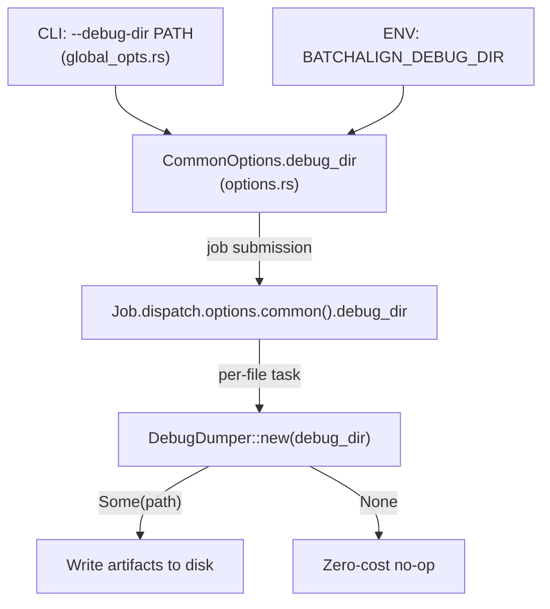
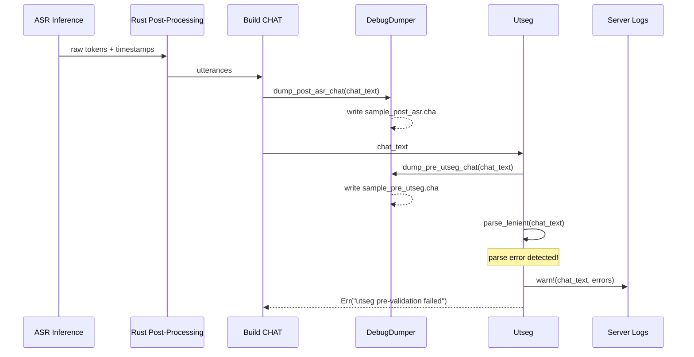

# Tracing and Debugging

**Status:** Current
**Last modified:** 2026-03-29 11:32 EDT

This document describes the tracing and debugging strategy across the
batchalign3 stack: Rust (batchalign-core PyO3 bridge), Rust (CLI and server
control plane), and Python (pipeline engines and worker process).

## Server Log File

The server writes its own log file directly, like Nginx or Apache.
When running in `--foreground` mode (which is how both the daemon
spawn and Ansible start the server), stderr is redirected to
`~/.batchalign3/server.log` via `dup2(2)`. All `tracing` output
(WARN and above by default) is captured in this file regardless of
how the process was started.

**Log location:** `~/.batchalign3/server.log` (append mode)

**Default level:** `WARN` — captures pipeline timing, cache metrics,
heartbeat warnings, worker crashes, slow queries. Does NOT capture
per-file progress, worker spawn/ready, or routine lifecycle events.

**For debugging:** Run with `-v` to get `INFO` level (worker spawns,
job lifecycle, per-file progress) or `-vv` for `DEBUG` (full payload
details). Or set `RUST_LOG=info` environment variable.

```bash
# Normal operation (WARN only):
batchalign3 serve start

# Debugging session (INFO — shows worker spawns, job lifecycle):
batchalign3 -v serve start --foreground

# Deep debugging (DEBUG — shows payloads, IPC):
batchalign3 -vv serve start --foreground

# Override per-module:
RUST_LOG=batchalign::morphosyntax=debug batchalign3 serve start
```

**Log rotation:** Not implemented. The log file grows unbounded.
For long-running production servers, periodically truncate:
```bash
: > ~/.batchalign3/server.log  # truncate without restarting
```

## Verbosity Levels

A single `-v` / `-vv` / `-vvv` flag on the CLI controls both Rust tracing and
Python logging across the entire stack.

| Level | Rust (`tracing`) | Python (`logging`) | When to use |
|-------|-------------------|--------------------|-------------|
| 0 (default) | `WARN` | `WARNING` | Normal operation |
| 1 (`-v`) | `INFO` | `INFO` | Server start/stop, job lifecycle |
| 2 (`-vv`) | `DEBUG` | `DEBUG` | Per-file progress, engine boundary data |
| 3 (`-vvv`) | `TRACE` | `DEBUG` | Full payload dumps (truncated) |

### How verbosity propagates

```
CLI (main.rs)
  │
  ├─ init_tracing(verbose)          ← sets Rust filter level
  │
  └─ serve_cmd::start(args, verbose)
       │
       └─ PoolConfig { verbose, .. }
            │
            └─ WorkerConfig { verbose, .. }
                 │
                 └─ python3 ... --verbose N   ← forwarded to batchalign.worker
                      │
                      └─ logging.basicConfig(level=...)
```

In background mode (`batchalign3 serve start` without `--foreground`), the
`-v` flags are forwarded to the re-exec'd background process.

## Engine Boundary Tracing

The highest-risk surface in the stack is the Rust-Python boundary where data
crosses serialization layers. This boundary is instrumented at three points:

### 1. Morphosyntax batch callback (`crates/batchalign-pyo3/src/morphosyntax_ops.rs`)

The `add_morphosyntax_batched_inner` function has three phases:

- **Phase 1** (pure Rust — extract words): `debug!` logs utterance and word
  counts extracted from the AST.
- **Phase 2** (GIL — Python callback): `debug!` logs response item count.
- **Phase 3** (pure Rust — inject results): `debug!` logs completion.

### 2. Python inference module (`batchalign/inference/morphosyntax.py`)

The `batch_infer_morphosyntax` function logs:

- Item count and elapsed time at `INFO` level on completion
- Sentence count mismatch warnings at `WARNING` level
- Stanza batch failure warnings at `WARNING` level

### 3. Worker IPC (`handle.rs`)

Worker spawn, shutdown, health checks, and IPC dispatch are logged at `info!`
and `debug!` levels. Worker stderr is captured for crash diagnostics.

## Performance

The `tracing` crate's `debug!` and `trace!` macros cost **~1–5 ns** when the
corresponding level is filtered out (the default level is `WARN`). All
instrumented functions are per-file or per-utterance, never per-word. There is
no measurable performance impact during normal operation.

Python `logging.debug()` calls are similarly inexpensive when the logger level
is `WARNING`.

## Safe AST Construction

### The problem

Raw text from NLP engines (Stanza, Whisper) must be converted to CHAT AST
nodes. Directly constructing AST nodes with `Word::new_unchecked` bypasses the
lexical validation that the parser would normally enforce, allowing malformed
words into the AST. These silently propagate until pre-serialization validation,
at which point the error is far from the root cause.

### Policy

1. **Always try `DirectParser::parse_word()` first** — if the text is valid
   CHAT syntax, the parser returns a properly validated `Word`.
2. **Only fall back to `new_unchecked` when the input is genuinely unparseable**
   (e.g., ASR returned non-CHAT characters). Log a `warn!` when this happens.
3. **Never fall back to `new_unchecked` in retokenization** — if a Stanza-split
   token can't be parsed, keep the original CHAT word unchanged.

### Implementation

Three categories of `new_unchecked` usage have been addressed:

**A. ASR transcript construction** (`lib.rs` / `build_chat_inner`):
ASR engines return raw text that must become CHAT words. The code now tries
`DirectParser::parse_word()` first and only falls back to `new_unchecked` with
a `warn!` if parsing fails.

**B. Retokenization fallback** (`retokenize.rs`):
When Stanza splits a CHAT word into MWT sub-tokens, each sub-token must be
parsed back into a CHAT `Word`. The `try_parse_token_as_word()` family of
functions return `Option<Word>` instead of always succeeding. On parse failure,
the original word is preserved (no invalid content enters the AST).

**C. Temporary scaffolding** (`lib.rs:1323`):
A temporary word used only as input to `resolve_word_language()` — never
injected into the AST. This is a documented acceptable use of `new_unchecked`.

### Injection-time alignment check (`inject.rs`)

Before injecting MOR/GRA tiers into an utterance, the code now validates that
the number of MOR items matches the number of alignable words extracted from
the AST. A mismatch is a bug — it means the extraction or NLP mapping is wrong.

```rust
// inject.rs — count alignment check
let word_count = extracted.len();
let mor_count = mors.len();
if word_count != mor_count {
    tracing::warn!(word_count, mor_count, ...);
    return Err(format!("MOR item count ({mor_count}) does not match ..."));
}
```

This catches problems at the point of injection (close to root cause) rather
than deferring to the pre-serialization validation pass.

## Debugging Workflows

### Diagnosing a morphosyntax failure

1. Run with `-vv` to see per-utterance word counts and Stanza I/O:
   ```bash
   batchalign3 -vv morphotag input/ output/
   ```

2. If a specific utterance fails, the `warn!` from `inject.rs` will report the
   exact word count mismatch and utterance text.

3. Run with `-vvv` (trace) to see the full JSON payload sent to Stanza and the
   JSON response (truncated to 500 chars).

### Diagnosing a retokenization issue

When Stanza splits a word into MWT sub-tokens and one sub-token is
unparseable:

1. A `warn!` is logged: `"Token is not valid CHAT syntax; keeping original word"`.
2. The original word is preserved in the AST.
3. The MOR cursor advances past the sub-token indices to stay in sync.

### Diagnosing an ASR construction issue

When ASR returns text that isn't valid CHAT:

1. A `warn!` is logged: `"ASR word is not valid CHAT syntax; using unchecked fallback"`.
2. The unchecked word enters the AST — this is expected for non-CHAT characters.
3. Pre-serialization validation will catch any downstream issues.

### Checking worker verbosity

To verify that verbosity reaches Python workers:

```bash
batchalign3 -vv serve start --foreground
```

Worker stderr will show `DEBUG`-level messages from `batchalign.worker` and
`batchalign.inference.morphosyntax`.

## Debug Artifact Pipeline (`--debug-dir`)

The `--debug-dir PATH` flag (or `BATCHALIGN_DEBUG_DIR` env var) writes
structured CHAT/JSON artifacts at each pipeline stage. All commands support it.
When `--debug-dir` is not set, all dump operations are zero-cost no-ops.

```bash
# Alignment with debug artifacts
batchalign3 align input/ output/ --lang eng --debug-dir /tmp/ba3-debug

# Transcription with debug artifacts
batchalign3 transcribe audio/ output/ --lang eng --debug-dir /tmp/ba3-debug

# Via environment variable (useful for server-side debugging)
BATCHALIGN_DEBUG_DIR=/tmp/ba3-debug batchalign3 transcribe audio/ output/
```

### Architecture

The debug artifact pipeline is built around the `DebugDumper` struct in
`crates/batchalign/src/runner/debug_dumper.rs`. It follows a zero-cost
abstraction pattern: when constructed without a directory, every method is an
immediate no-op. When constructed with a directory, methods write artifacts to
disk at each pipeline stage.



### How DebugDumper threads through each pipeline

Each pipeline creates its own `DebugDumper` at the per-file dispatch level,
extracting `debug_dir` from the job options. The dumper is then threaded through
the pipeline context and called at stage boundaries.

```mermaid
flowchart TB
    subgraph "Align Pipeline (fa_pipeline.rs)"
        FA_DISPATCH["dispatch_fa_infer()"] --> FA_CTX["FaFileContext { dumper }"]
        FA_CTX --> FA1["dump_utr_input()"]
        FA1 --> FA2["dump_utr_tokens()"]
        FA2 --> FA3["dump_utr_output()"]
        FA3 --> FA4["dump_fa_grouping()"]
        FA4 --> FA5["dump_fa_group_result() x N"]
        FA5 --> FA6["dump_fa_output()"]
    end

    subgraph "Transcribe Pipeline (pipeline/transcribe.rs)"
        TX_DISPATCH["dispatch_transcribe_infer()"] --> TX_CTX["TranscribePipelineContext { dumper }"]
        TX_CTX --> TX1["stage_asr_infer → dump_asr_response()"]
        TX1 --> TX2["stage_build_chat → dump_post_asr_chat()"]
        TX2 --> TX3["stage_run_utseg → dump_pre_utseg_chat()"]
        TX3 --> TX4["stage_run_utseg → dump_post_utseg_chat()"]
        TX4 --> TX5["stage_run_morphosyntax → dump_pre_morphosyntax_chat()"]
    end
```



### Artifact directory layout

For a transcribe job on `sample.wav` with `--debug-dir /tmp/debug`:

```
/tmp/debug/
  # Transcribe pipeline artifacts
  sample_asr_response.json       # Raw ASR tokens + timestamps from Whisper/Rev.AI
  sample_post_asr.cha            # CHAT after assembly (before utseg)
  sample_pre_utseg.cha           # CHAT entering utterance segmentation
  sample_post_utseg.cha          # CHAT after utterance segmentation
  sample_pre_morphosyntax.cha    # CHAT entering morphosyntax

  # Align pipeline artifacts (for a file sample.cha)
  sample_utr_input.cha           # CHAT before UTR injection
  sample_utr_tokens.json         # ASR timing tokens fed to UTR
  sample_utr_output.cha          # CHAT after UTR injection
  sample_utr_result.json         # UTR injection statistics
  sample_fa_input.cha            # CHAT before FA (after UTR)
  sample_fa_grouping.json        # FA group plan (time windows, words)
  sample_fa_group_0.json         # Per-group words + timings
  sample_fa_group_1.json
  sample_fa_output.cha           # Final aligned CHAT
```

### Always-on error logging (no `--debug-dir` needed)

Even without `--debug-dir`, certain failure modes automatically log diagnostic
data at `WARN` level. These are zero-cost in the happy path and fire only when
something goes wrong:

| Failure | What is logged | Where |
|---------|---------------|-------|
| Utseg pre-validation fails (parse error in CHAT) | Full CHAT text + error details | `utseg.rs` |
| Whisper returns inverted timestamps | Warning with start/end values | `inference/asr.py` |
| MOR item count mismatch | Word count + MOR count + utterance text | `inject.rs` |
| Stanza sentence count mismatch | Expected vs actual sentence counts | `morphosyntax.py` |

The utseg CHAT dump is particularly important for transcribe pipelines: if ASR
post-processing produces CHAT that doesn't parse cleanly, the full CHAT text is
logged so you can see exactly which token caused the parse error — without
needing to reproduce the run.

### Example: Diagnosing a transcribe-to-utseg failure

This workflow illustrates the debugging path for a job where transcription
succeeds but utseg rejects the CHAT output (like job `696870c7-02b`,
maria18.wav).



**Without `--debug-dir`:** check server logs for the `warn!` containing the
full CHAT text and error details.

**With `--debug-dir`:** inspect `sample_post_asr.cha` to see the exact CHAT
that was produced by the transcribe stage. Feed it to the parser locally:

```bash
# Reproduce the parse error offline
cargo run -p talkbank-cli -- validate /tmp/debug/sample_post_asr.cha
```

### Example: Diagnosing an FA grouping issue

```bash
# 1. Run alignment with debug artifacts
batchalign3 align input/ output/ --lang eng --debug-dir /tmp/ba3-debug

# 2. Inspect the UTR input and tokens
cat /tmp/ba3-debug/sample_utr_input.cha
jq . /tmp/ba3-debug/sample_utr_tokens.json

# 3. Write a test that loads the fixtures and calls inject_utr_timing directly
# (no ML model needed — the tokens are already captured)
```

### Implementation details

**`DebugDumper` struct** (`runner/debug_dumper.rs`):

- `new(dir: Option<&Path>)` — enabled dumper or zero-cost no-op
- `disabled()` — test helper, always no-op
- `ensure_dir()` — lazily creates the directory on first write
- `stem(filename)` — extracts file stem for artifact naming
- Each dump method follows the pattern: check `ensure_dir()` → serialize →
  `fs::write()` → log on failure (never panics)

**Threading pattern:**

1. Job options carry `debug_dir: Option<String>` in `CommonOptions`
2. Per-file dispatch extracts it: `job.dispatch.options.common().debug_dir`
3. Creates `DebugDumper::new(debug_dir.as_deref().map(Path::new))`
4. Passes the dumper into the pipeline context struct
5. Stage functions call dump methods at transition points

## Fine-Grained Cache Overrides (`--override-media-cache-tasks`)

For experiment-grade control, `--override-media-cache-tasks` bypasses cache only for
specific NLP tasks:

```bash
# Skip UTR ASR cache but keep morphosyntax and FA caches
batchalign3 align input/ output/ --override-media-cache-tasks utr_asr

# Skip multiple tasks (comma-separated)
batchalign3 morphotag input/ output/ --override-media-cache-tasks morphosyntax,translation
```

Valid task names: `morphosyntax`, `utr_asr`, `forced_alignment`,
`utterance_segmentation`, `translation`.

The existing `--override-media-cache` continues to skip all cache domains.
Internally, `CacheOverrides::Tasks(BTreeSet<CacheTaskName>)` resolves per-task
at each cache call site via `policy_for(CacheTaskName)`.

## Stanza Anomaly Detection

The morphosyntax inference module (`batchalign/inference/morphosyntax.py`)
detects several classes of Stanza misbehavior:

| Anomaly | Detection |
|---------|-----------|
| Bogus lemma | Lemma is pure punctuation for a word with letters (e.g. 哎呀 → 》) |
| Sentence count mismatch | Stanza returned a different number of sentences than input utterances |
| Batch failure | Stanza raised an exception on a batch of items |

When detected, these are logged at `WARNING` level. The bogus-lemma check is
in `_is_bogus_lemma()` and triggers substitution with a `"?"` lemma rather
than propagating the bad value.
