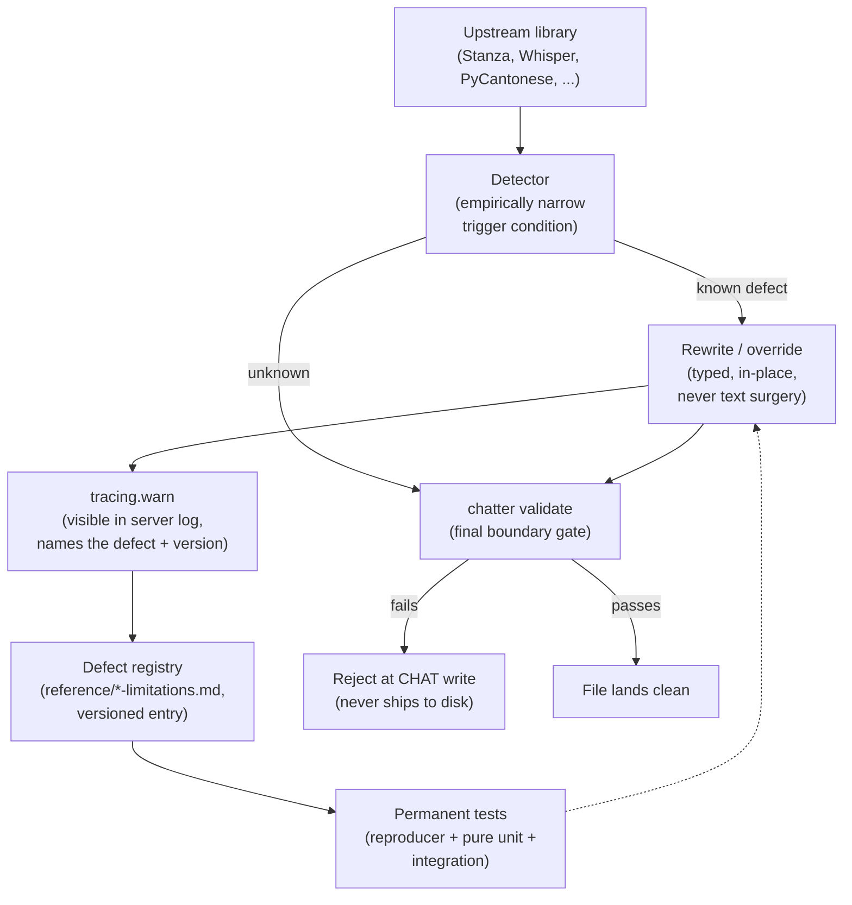

# Coping with Upstream Bugs and Limitations — Policy and Workflow

**Status:** Current
**Last updated:** 2026-05-20 01:09 EDT

Batchalign integrates several third-party NLP libraries — Stanza,
Whisper, PyCantonese, Pyannote/NeMo, Rev.AI, Apple MPS, OpenSMILE,
and others. Each is a working piece of software with real bugs,
surprising edge cases, and version-to-version behavior changes. This
document explains our policy for dealing with upstream defects and
the workflow every contributor follows when one is discovered.

## Core principle

> Batchalign targets **linguistic and data correctness**, not
> upstream-library parity. When an upstream library is wrong on a
> specific input, we override with a principled rewrite. When the
> upstream fixes the issue, we retire our override. Both directions
> are driven by permanent tests that pin the observed behavior.

This principle is how we reconcile two real constraints:

1. Users depend on batchalign to produce correct CHAT output. "The
   library we use is broken" is not an acceptable excuse when the
   CHAT on disk is wrong.
2. Every override is technical debt we carry. We don't override
   blindly — each rewrite is narrow, registered, and has a clear
   retirement condition.

## Three layers of defense

Every upstream call site has three layers that together ensure
corrupt output never ships silently:

1. **Targeted rewrite at the data boundary.** The detector fires
   only on a named defect with empirically narrowed trigger
   conditions. The rewrite operates on the typed intermediate
   representation (UD `Document.to_dict()` before crossing into
   Rust, `UdSentence` in Rust), never on serialized CHAT text.
2. **Ops-visible logging.** Every rewrite emits a `tracing::warn`
   naming the defect, the upstream library version, the affected
   input, and the rewrite applied. An operator monitoring the fleet
   can see that the workaround fired.
3. **Final validation gate.** `chatter validate` checks every file
   produced against CHAT-manual semantics. If a defect variant
   escapes our detector, validation catches the malformed output
   at the write boundary — the file doesn't land on disk in a
   corrupt state without a loud signal.

## Why rewrite-and-log, not fail-hard

Early versions of this policy considered failing the whole language
group on any defect detection. That approach was rejected because:

- Library bugs are common. Failing hard would turn any defect into
  a fleet-wide outage class.
- Batchalign already handles library imperfection on every language
  (Stanza scores below CHAT-quality on Cantonese, MWT hints are
  fragile, Apple MPS has kernel deadlocks on certain FA shapes,
  etc.). A uniform fail-hard policy would make the tool unusable.
- The validation gate (`chatter validate`) is the correctness
  boundary, not the rewrite layer. If our detector ever misses a
  defect variant, validation still catches the bad CHAT.
- A loud **log** is enough observability for an operator. A loud
  **error** mislocates the problem — the file's data quality is fine
  after rewrite; the only thing "wrong" is the upstream library.

The one rule from this calculus: **every rewrite MUST be logged.**
Silent rewrites would hide the defect from ops monitoring and make
retirement impossible.

## Workflow: adding a new workaround

When a new upstream defect is discovered, every contributor follows
the same five-step pattern. The pattern is mechanical: fill in the
six files below, link them together, commit.

### 1. Write a standalone reproducer

A pure test, no batchalign imports, safe to copy into the upstream
library's issue tracker. Calls the library directly on the minimum
input that reproduces the defect. Asserts the CORRECT behavior, so
the test is RED on the current upstream version.

Location: next to the workaround tests, file-named for the defect.
Example: `batchalign/tests/pipelines/morphosyntax/test_stanza_fi_mwt_sos_leak.py`.

The reproducer serves two audiences:

- The upstream maintainer who receives your bug report.
- The next batchalign contributor who runs it after a library
  upgrade to see if the defect has been fixed.

### 2. Empirically narrow the trigger

Don't rewrite everything that looks suspicious. Bisect the input
until you find the minimum conditions under which the defect fires.
A narrow trigger is a narrow compatibility surface and is cheap to
retire when the upstream fixes it.

Example from Defect 4 (Stanza 1.11.1 Finnish `<SOS>` leak): we
bisected from an 8-word Finnish sentence down to `"a tollei b"` —
three ASCII tokens, no domain knowledge of Finnish required to
reproduce.

### 3. Implement the workaround at the typed layer

Operate on the typed intermediate representation, not on serialized
CHAT text. For Stanza leaks that's the Python `doc.to_dict()`
boundary in `batchalign/inference/*.py`. For Stanza UD misanalyses
that's the `UdSentence` layer at
`crates/talkbank-transform/src/morphosyntax/invariants.rs` (with
per-rule modules under `crates/talkbank-transform/src/morphosyntax/invariants/`,
e.g. `finite_verb_main_clause.rs`). For MPS GPU deadlocks that's the
device selection layer. Never rewrite serialized output — that's the
batchalign2 anti-pattern we deliberately avoid.

The workaround emits a `tracing::warn` per rewrite. The message
names the defect, the upstream version, the rewritten value, and the
affected language or input so ops monitoring is useful.

### 4. Pin behavior with permanent tests

Three levels are the standard:

- **Pure unit tests** — exercise the detector/rewriter on fabricated
  inputs without the real library. Fast, run on every `make test`.
- **Integration test** — runs the full handler with the real
  upstream library loaded. Marked `@pytest.mark.golden` (Python) or
  gated behind the `ml_golden` nextest profile (Rust). Asserts the
  rewrite fires and the output is clean.
- **Standalone reproducer** from step 1 — remains as the
  upgrade-time probe.

### 5. Register in the versioned defect doc

Each upstream library has its own registry in `book/src/reference/`:

| Library | Registry |
|---|---|
| Stanza | [`reference/stanza-limitations.md`](../reference/stanza-limitations.md) |
| Apple MPS | [`developer/apple-mps-workarounds.md`](apple-mps-workarounds.md) |
| Per-language Stanza specifics | [`developer/non-english-workarounds.md`](non-english-workarounds.md) |

A new registry is warranted only for an upstream dependency that
accumulates several distinct defects over time. Before creating one,
prefer extending a related document.

Every registry entry answers these questions:

- **Nature:** what is wrong, in the defect's own terms (not "our
  code fails").
- **Upstream version:** which version of the library was the defect
  observed in.
- **Input examples:** the minimum and a real-corpus example.
- **Trigger conditions:** empirically narrowed.
- **Correct output:** what a fixed upstream would produce.
- **Batchalign mitigation:** code pointer + date the workaround
  landed.
- **Tests:** links to the three levels from step 4.
- **Re-evaluation criteria:** specific steps to run after the next
  upstream upgrade to check whether the defect is fixed.
- **Upstream reporting:** issue URL once filed, or "not yet" if
  the reproducer is prepared but not submitted.

### 6. Link everything together

The tests, the mitigation code, and the registry entry all
cross-reference each other by path. A contributor investigating a
warning in a server log should be able to go from the log line →
registry entry → code pointer → test file in two hops, without
spelunking.

## Retirement: the upgrade checklist

When an upstream library is upgraded:

1. Open the registry for that library.
2. For each active defect entry, run the standalone reproducer.
3. If the reproducer is GREEN on the new upstream version, the
   defect is fixed. The workaround's detector should now fire
   zero times on normal input — confirm by re-running the
   integration test. If it still passes without the workaround
   running, the workaround is retireable.
4. Retire the workaround: delete the detect+rewrite code, remove
   the `tracing::warn` call, delete the pure unit tests and the
   integration test, update the registry entry from "ACTIVE" to
   "RETIRED (upstream fixed in version X.Y.Z)".
5. Keep the standalone reproducer as a historical reference. It
   becomes documentation of a past defect rather than a regression
   guard.

## Anti-patterns

Things this policy explicitly rejects:

- **Silent rewrites without a log.** No visibility → no way to
  track when the defect fixes upstream.
- **Rewrites on serialized CHAT text.** String surgery over emitted
  output is the BA2 approach we deliberately avoid. Work on typed
  models.
- **Fail-hard on library defects.** Turns operational workarounds
  into outage classes.
- **Surface-pattern rewrites without a named defect.** If you can't
  name the invariant being violated, you're hacking, not fixing.
- **Permanently-disabled workarounds (feature flag "off by default").**
  Either the defect is real and the workaround is on, or the
  workaround is retired. No gray zone.
- **Unregistered workarounds.** A workaround that doesn't appear in
  any registry is technical debt nobody knows about. Dead code
  waiting to surprise a future contributor.

## See also

- [`reference/stanza-limitations.md`](../reference/stanza-limitations.md)
  — Stanza defect registry (currently 4 entries).
- [`developer/non-english-workarounds.md`](non-english-workarounds.md)
  — Per-language workaround catalog.
- [`developer/apple-mps-workarounds.md`](apple-mps-workarounds.md)
  — MPS-specific defect registry.
- `crates/talkbank-transform/src/morphosyntax/invariants.rs` — the
  Rust-side typed UD rewrite module that anchors this pattern for
  morphosyntax; per-rule sub-modules live under
  `crates/talkbank-transform/src/morphosyntax/invariants/`.
- Stanza Defect 4 (Finnish `<SOS>` leak) was retired in Stanza 1.12.0;
  the historical Python-side workaround
  `batchalign/inference/_control_token_filter.py` is no longer in-tree.
  See [Stanza Defect Mitigation Map](../architecture/stanza-defect-mitigation-map.md)
  for the current per-defect patch-point inventory.
