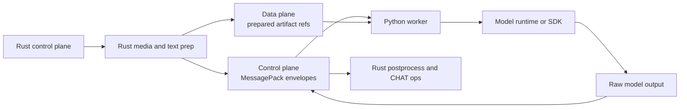
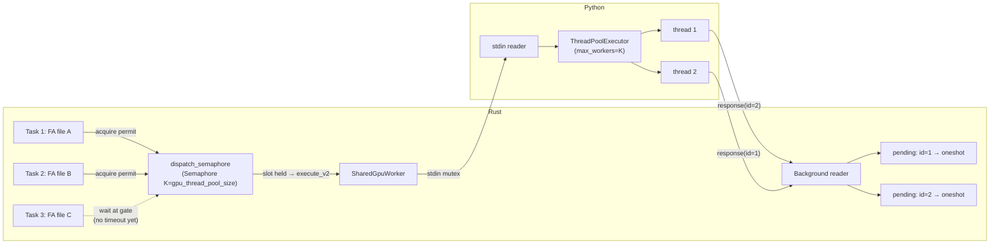

# Worker Protocol V2

**Status:** Current
**Last verified:** 2026-04-02 20:47 EDT
**Last updated:** 2026-04-29 08:30 EDT

This document is the implementation spec for the live typed worker boundary
currently named `worker_v2`.

**For protocol ownership, responsibility boundaries, and the migration plan, see:**
**[Worker Protocol Ownership and Boundaries](https://github.com/TalkBank/talkbank-tools/blob/main/docs/worker-protocol-ownership.md)**

**See also:** [INTERFACE_MAP.md](https://github.com/TalkBank/talkbank-tools/blob/main/INTERFACE_MAP.md) section "1. Worker Protocol Dispatch"
for the unified reference to all protocol-related files, Python implementations, and
shared schema definitions.

The `v2` suffix is still intentional. The older JSON-lines `worker` /
`batchalign/worker/_types.py` surface remains in-tree as a frozen compatibility
contract, so the Rust module (`crates/batchalign-types/src/worker_v2/`), schema
directory (`ipc-schema/worker_v2/`), generated Python package
(`batchalign/generated/worker_v2/`), and hand-written models
(`batchalign/worker/_types_v2.py`) stay versioned together until V1 is removed
as a whole.

The Python cutover is complete. Audio tasks and text-only NLP tasks
(`morphotag`, `utseg`, `translate`, `coref`) now use typed V2 requests. Text
commands preserve cross-file batching by freezing one prepared-text artifact per
miss batch and sending one batched `execute_v2` request per task.

The goal is simple:

- Python should be only a thin model host.
- Rust should own preprocessing, postprocessing, caching, incremental logic,
  document mutation, and workflow orchestration.

That requires replacing the current worker protocol, not just trimming more
helper code.

## Why V1 Is No Longer Enough

The current worker protocol in:

- `types/worker.rs` (re-exports from `batchalign-types/src/worker.rs`)
- `\_types.py`
- `\_protocol.py`
- `\_protocol_ops.py`

is a good fit for small JSON payloads. It is not a good fit for the target
architecture where Rust should own local audio preparation and Python should
receive only model-ready inputs.

Current V1 problems:

- it is JSON-lines over stdio, which is convenient but weak for large and
  structured binary-heavy inputs
- local-model tasks still encourage Python-side audio loading/chunking because
  the easiest payload is a file path
- request shapes are task-level (`InferTask`) but not engine-input-level
- the direct Python pipeline path still exists as a separate conceptual surface
- the control plane and data plane are conflated

The redesign should therefore replace:

- the old process-path worker orchestration model that used to be primary
- JSON-shaped local-model payloads as the canonical boundary
- Python-owned preprocessing

## Design Principles

1. Rust owns all workflow semantics.
2. Python owns only irreducible runtime/model semantics.
3. Large binary inputs must not ride inside generic JSON request bodies.
4. The protocol should describe model-ready inputs, not CLI commands.
5. Cache formats may change freely; old cache compatibility is not required.
6. The legacy config file remains important.
   Provider credentials in `~/.batchalign.ini` still matter until specific
   providers move fully into Rust.

## Target Shape



The boundary becomes two-plane:

- control plane: typed envelopes over stdio
- data plane: explicit references to prepared artifacts owned by Rust

## Protocol V2 Overview

### Transport

Control-plane transport:

- length-prefixed MessagePack frames over stdio
- one request, one response, no JSON-lines framing
- request/response/event envelopes carry a stable `request_id`

Data-plane transport:

- explicit artifact descriptors
- first implementation: file-backed prepared artifacts in a per-worker temp
  directory, designed so Rust can later switch specific paths to shared memory
  without changing the logical request schema

This keeps the first migration practical and cross-platform while still
stopping the abuse of JSON payloads for local-model inputs.

### Phase 1 Status

The staged schema and drift-test guardrails now exist:

- Rust schema: `crates/batchalign-types/src/worker_v2/` (re-exported by `crates/batchalign/src/types/worker_v2.rs`)
- Python schema: `batchalign/worker/_types_v2.py`
- shared fixtures: `tests/fixtures/worker_protocol_v2/`
- Rust drift test:
  `crates/batchalign/tests/worker_protocol_v2_compat.rs`
- Python drift test:
  `batchalign/tests/test_worker_protocol_v2_types.py`

Those fixtures are still JSON because the current task is schema drift
prevention, not transport rollout. The production transport can move to
MessagePack framing later without losing the shared logical contract.

## Envelope Types

### Boot and Metadata

`HelloRequest`

```text
{
  protocol_version: 2,
  worker_kind: "infer"
}
```

`HelloResponse`

```text
{
  protocol_version: 2,
  worker_pid: u32,
  runtime: {
    python_version: string,
    free_threaded: bool
  }
}
```

`CapabilitiesRequest`

```text
{
  request_id: string
}
```

`CapabilitiesResponse`

```text
{
  request_id: string,
  tasks: [TaskCapability],
  engine_versions: map<string, string>
}
```

### Execution

`ExecuteRequest`

```text
{
  request_id: string,
  task: InferenceTask,
  payload: TaskRequest,
  attachments: [ArtifactRef]
}
```

`ExecuteResponse`

```text
{
  request_id: string,
  outcome: Success | Error,
  result: TaskResult | null,
  elapsed_s: float
}
```

`ProgressEvent`

```text
{
  request_id: string,
  completed: u32,
  total: u32,
  stage: string
}
```

`ShutdownRequest`

```text
{
  request_id: string
}
```

### Error Contract

Worker protocol errors should be typed, not free-form strings:

```text
ProtocolErrorCode =
  unsupported_protocol
  invalid_payload
  missing_attachment
  attachment_unreadable
  model_unavailable
  runtime_failure
```

Domain/model errors can still carry human-readable detail, but the top-level
category should be machine-stable.

Current classification on the live `execute_v2` path is intentionally split:

- `invalid_payload` means the request or prepared artifact metadata was invalid
  before the model host could do useful work
- `missing_attachment` / `attachment_unreadable` mean the referenced prepared
  artifact was absent or unreadable
- `model_unavailable` means the selected backend is not loaded in this worker
- `runtime_failure` means the model host accepted the request but then crashed
  or returned malformed result data (for example non-finite metrics, reversed
  timing ranges, wrong per-item result shapes, or host/result count drift)

## Artifact References

The data plane is the critical change.

`ArtifactRef` should be a tagged union:

```text
ArtifactRef =
  PreparedAudioRef
  PreparedTextRef
  InlineJsonRef
```

### PreparedAudioRef

This is the main local-model boundary.

```text
PreparedAudioRef {
  id: string,
  kind: "prepared_audio",
  path: string,
  encoding: "pcm_f32le",
  channels: 1,
  sample_rate_hz: u32,
  frame_count: u64,
  byte_offset: u64,
  byte_len: u64
}
```

Rules:

- Rust creates the artifact.
- Rust owns decode, mixdown, resample, chunk extraction, and hashing.
- Python only memory-maps or reads the prepared PCM window.
- Python must treat the descriptor as immutable input.

### PreparedTextRef

Used when the request needs large normalized text or token arrays without
stuffing them into the main envelope.

```text
PreparedTextRef {
  id: string,
  kind: "prepared_text",
  path: string,
  encoding: "utf8_json",
  byte_offset: u64,
  byte_len: u64
}
```

### InlineJsonRef

Kept only for small structured payloads.

```text
InlineJsonRef {
  id: string,
  kind: "inline_json",
  value: object
}
```

## Task Model

The current `InferTask` enum is too coarse for the next boundary. V2 should
keep a top-level task enum, but the request/response shape should be explicit
per task family.

### Task Families

```text
InferenceTask =
  Morphosyntax
  Utseg
  Translate
  Coref
  Asr
  ForcedAlignment
  Speaker
  Opensmile
  Avqi
```

> **Removed 2026-04-26: `ExpandNumbers`.** Number expansion was migrated
> entirely into Rust (`asr_postprocess::expand_number` +
> `ordinal_year_eng`); the IPC types `ExpandNumbersRequestV2`,
> `ExpandNumbersResultV2`, `NumberExpansionModeV2`, and the
> `InferenceTaskV2::ExpandNumbers` enum variant no longer exist.
> See [Number Expansion](../architecture/number-expansion.md).

### ASR

#### Request

```text
AsrRequest {
  lang: iso639_3,
  backend: AsrBackend,
  input: AsrInput
}
```

```text
AsrBackend =
  local_whisper
  hk_tencent
  hk_aliyun
  hk_funaudio
  revai
```

```text
AsrInput =
  PreparedAudioInput { audio_ref_id: string }
  ProviderMediaInput { media_path: string, num_speakers: u16 }
  SubmittedJobInput { provider_job_id: string }
```

Rules:

- `local_whisper` must use `PreparedAudioInput`
- cloud providers may keep `ProviderMediaInput` temporarily if Rust has not
  replaced their transport yet
- `revai` is expected to stay Rust-owned in production and should eventually
  disappear from the Python protocol

#### Result

Python should return only raw provider/model output, not shared normalized ASR.

```text
AsrResult =
  WhisperChunkResult
  HkMonologueResult
  ProviderTranscriptResult
```

Rust remains responsible for:

- shared normalization
- timestamp harmonization
- Cantonese postprocessing
- utterance segmentation
- CHAT generation

### Forced Alignment

This is the first major migration target because it still depends on
Python-side audio chunk loading.

#### Request

```text
ForcedAlignmentRequest {
  backend: FaBackend,
  payload_ref_id: string,
  audio_ref_id: string,
  text_mode: "space_joined" | "char_joined",
  pauses: bool
}
```

Rules:

- Rust writes the word arrays into a prepared JSON payload artifact
- Rust prepares the audio span before the request
- Python receives only model-ready PCM plus token text
- worker code should not call `load_audio_file()` for FA

#### Result

```text
ForcedAlignmentResult =
  WhisperTokenTimingResult
  IndexedWordTimingResult
```

Rust still owns:

- token-to-word reconciliation
- retry/fallback policy
- injection into CHAT
- incremental eligibility

### Speaker

```text
SpeakerRequest {
  backend: SpeakerBackend,
  input: SpeakerInput,
  expected_speakers: u16 | null
}
```

```text
SpeakerInput =
  PreparedAudioInput { audio_ref_id: string }
```

Current implementation status:

- `batchalign/worker/_speaker_v2.py` now executes live speaker requests through
  `execute_v2(task="speaker")` using Rust-prepared audio attachments only
- `crates/batchalign/src/worker/speaker_request_v2.rs` now builds typed
  speaker requests on the Rust side from prepared audio artifacts
- speaker results now round-trip as typed raw segment payloads rather than
  generic JSON bags
- the old legacy `batch_infer(task="speaker")` route is no longer part of the
  live worker dispatch table
- batchalign3 continues the batchalign2 product surface here: diarization is a
  capability used by `transcribe_s`, not a standalone CLI `speaker` command
- `opensmile` and `avqi` now use the same `execute_v2(...)` envelope family with
  Rust-owned prepared-audio attachments and dedicated Rust request builders

### Morphosyntax, Utseg, Translate, Coref

These tasks now share one batched text-V2 pattern:

- Rust normalizes the whole cross-file miss set into one `PreparedTextRef`
- the request payload carries `payload_ref_id` plus `item_count`
- Python reads the artifact, runs the model batch, and returns one typed batched
  result with per-item success/error slots
- Rust keeps preprocessing, postprocessing, caching, repartitioning, and CHAT
  mutation

`InlineJsonRef` still exists for small metadata payloads, but the live text NLP
tasks no longer use inline JSON as their primary boundary.

## Why File-Backed Prepared Artifacts First

The ideal long-term design may use shared memory for the hottest local-model
paths. The first implementation should still use file-backed prepared
artifacts because:

- it is cross-platform
- it is easy to inspect and debug
- it keeps the protocol migration tractable
- it still removes Python-owned audio decoding and chunking

Once that design is stable, specific high-throughput paths can swap
`PreparedAudioRef.path` to a shared-memory handle model without changing task
semantics.

## What Gets Deleted

The redesign is intentionally not compatibility-first.

The following surfaces should be treated as disposable:

- the current JSON-lines worker framing
- process-path worker orchestration as an architectural center
- Python-side local-model audio preparation
- the old Python-owned pipeline orchestration that used to live in `pipeline_api.py`
- old cache formats that depend on Python-shaped intermediate results

## Incremental Processing Impact

Incremental processing does **not** justify a wider Python boundary.

Incremental logic remains Rust-owned:

- cache-key computation
- change detection
- reusable chunk selection
- per-command invalidation rules
- partial reinjection

Python workers should see only the final narrowed subset that Rust chooses to
recompute.

## Cross-crate implications

This redesign may justify additional Rust-side changes outside the
worker-pyo3 crate layout. Likely implications:

- the `batchalign` crate will want a dedicated prepared-artifact
  subsystem rather than ad-hoc temp-file helpers
- the `batchalign` crate may gain more raw provider normalization
  helpers
- the `talkbank-*` core crates (model / parser / transform) may need
  ergonomic Rust-side hooks if `batchalign` benefits from shared
  document or audio-domain utilities there

No current internal API should be treated as fixed.

## Rollout Plan

### Phase 1. Protocol spec and fixtures

Deliverables:

- this document
- canonical request/response examples
- Rust and Python golden fixtures for V2 envelopes
- drift tests that compare fixture decoding on both sides

Status:

- implemented

### Phase 2. Rust prepared-artifact subsystem

Deliverables:

- file-backed prepared-audio writer/reader
- lifecycle cleanup policy
- worker-facing descriptor types

Current implementation status:

- the first file-backed store exists in
  `crates/batchalign/src/worker/artifacts_v2.rs`
- it can write prepared PCM audio descriptors, prepared text descriptors, and
  inline JSON attachments
- production dispatch does not use it yet

### Phase 3. Forced alignment migration

Deliverables:

- FA requests use `PreparedAudioRef`
- FA requests use a Rust-owned prepared text payload artifact
- Python FA no longer loads audio from file paths
- Rust owns all chunk extraction before worker dispatch

Current implementation status:

- `crates/batchalign/src/fa/transport.rs` now narrows full-file and
  incremental FA orchestration behind a shared transport adapter instead of
  letting each path assemble legacy `batch_infer(task="fa")` payloads inline
- `crates/batchalign/src/worker/request_builder_v2.rs` now builds staged
  V2 FA requests from existing `FaInferItem` values
- that builder writes the transcript arrays into a prepared text artifact
- that builder extracts the model-ready PCM window into a prepared audio
  artifact
- `batchalign/worker/_artifact_inputs_v2.py` now provides the thin Python
  wrapper over Rust-owned prepared text JSON and prepared PCM audio readers
- `crates/batchalign-pyo3/src/worker_fa_exec.rs` now owns the live V2 FA executor control plane,
  while `batchalign/worker/_fa_v2.py` stays as a thin Python host wrapper
- `crates/batchalign/src/worker/fa_result_v2.rs` now maps those typed V2
  FA results straight back into the established Rust FA alignment domain
- `crates/batchalign/tests/worker_v2_fa_roundtrip.rs` now proves the
  staged Rust request builder, Rust-owned FA executor control plane, and
  staged Rust result adapter already form one coherent cross-language seam
- `batchalign/worker/_execute_v2.py` now exposes a live `execute_v2` stdio
  handler that routes forced-alignment requests into the typed V2 executor
- `crates/batchalign/src/worker/handle.rs` and
  `crates/batchalign/src/worker/pool/mod.rs` now carry that `execute_v2`
  op across the long-lived worker process boundary
- live full-file FA and incremental FA now use the V2 execute path in
  production, with the legacy V1 transport retained only as a narrow fallback
  seam

### Phase 4. ASR migration

Deliverables:

- local Whisper requests use `PreparedAudioRef`
- Cantonese provider ASR requests use typed `provider_media` inputs instead of the
  legacy batch-infer bag
- no Python-side local audio loading/chunking
- shared raw-result schema remains Rust-normalized after return

Current implementation status:

- `crates/batchalign/src/worker/asr_request_v2.rs` now builds typed ASR
  V2 requests with either Rust-owned prepared full-file audio artifacts or
  typed provider-media inputs
- `crates/batchalign-pyo3/src/worker_asr_exec.rs` now owns the live V2 ASR executor control
  plane, while `batchalign/worker/_asr_v2.py` stays as a thin Python host
  wrapper for local Whisper, Tencent, Aliyun, and FunASR
- `crates/batchalign/src/worker/asr_result_v2.rs` now maps typed V2 ASR
  responses back into the established Rust `AsrResponse` domain
- `batchalign/worker/_execute_v2.py` now routes all live Python-hosted ASR
  through the `execute_v2` stdio boundary
- `crates/batchalign/src/transcribe.rs` now uses that live V2 path for all
  Python-hosted ASR; only Rev.AI bypasses Python and stays Rust-owned

### Phase 5. Speaker migration

Deliverables:

- complete the move from transitional media-path input to prepared audio once
  the speaker backends can consume Rust-prepared artifacts directly
- remove or isolate remaining global runtime overrides

### Phase 6. Remove legacy orchestration

Deliverables:

- keep the released worker surface infer/execute-only; no generic process-path runtime remains
- do not regrow a Python-side document-orchestration layer; the previous
  `pipeline_api.py` facade was removed and stays removed
- remove V1 worker protocol once all production tasks are migrated

## Acceptance Criteria

The redesign is successful when all of the following are true:

- Python no longer decodes, resamples, or chunks local audio for ASR or FA
- Python no longer owns shared result normalization or document-facing shaping
- the worker boundary is typed per task family, not a generic JSON bag
- the remaining Python code is mostly model loading, runtime calls, and thin
  transport adapters
- old cache compatibility is not preserved just for its own sake

## Immediate Next Implementation Step

The next concrete step after the live FA migration should be:

1. move the remaining Cantonese provider ASR engines onto typed V2 request shapes
   instead of the legacy batch-infer bag
2. stop sending one FA request per miss group once the typed path is stable;
   add a batched or multiplexed V2 execute shape if profiling shows the
   per-group roundtrips matter
3. remove the legacy FA transport once the V2 path has soaked

## Concurrent dispatch (GPU profile)

GPU profile workers support multiple in-flight V2 requests via request_id
multiplexing. This restores the model-sharing throughput of batchalign-next's
`ThreadPoolExecutor` while keeping the subprocess boundary.

### Python side

GPU workers run `_serve_stdio_concurrent(max_threads=4)` instead of the
sequential `_serve_stdio()`. The main thread reads stdin and submits each
request to a `ThreadPoolExecutor`. PyTorch releases the GIL during CUDA
kernels, enabling real concurrent GPU inference across threads sharing the
same loaded model weights.

```python
# Simplified concurrent serving loop
pool = ThreadPoolExecutor(max_workers=4)
stdout_lock = threading.Lock()

for line in sys.stdin:
    message = json.loads(line)
    pool.submit(_handle_and_respond, message, stdout_lock)
```

Responses are written under a stdout lock so JSON lines never interleave.

### Rust side

The `SharedGpuWorker` type (in `pool/shared_gpu.rs`) replaces the exclusive
`CheckedOutWorker` for GPU profile dispatch:



Key components:
- **`dispatch_semaphore: Arc<Semaphore>`** (`shared_gpu/stdio.rs`,
  `shared_gpu/tcp.rs`) — caps in-flight `execute_v2` calls per worker at
  `gpu_thread_pool_size` so Rust dispatch concurrency matches Python's
  `ThreadPoolExecutor` capacity. **Permit is acquired before
  `pending.insert()` and before the `tokio::time::timeout` wrap**, so a
  caller waiting for a slot does not consume its per-request timeout
  budget on queue-wait. Without this gate, late callers would register
  pending oneshots and start their timers while their request sat in the
  Python executor's queue, and the timer would expire ahead of the
  response — see "Why the dispatch semaphore exists" below.
- **`stdin: Mutex<ChildStdin>`** — serialized writes so JSON lines don't interleave
- **`pending: Mutex<HashMap<String, oneshot::Sender>>`** — maps request_id to response channel
- **Background reader task** — continuously reads stdout, parses responses, routes by request_id
- **Control channel** — sequential non-V2 ops (health, capabilities, shutdown) via a separate oneshot

### The dispatch semaphore contract

**Architectural rule: Rust-side dispatch concurrency matches Python-side
serving capacity.** Python serves V2 requests through a
`ThreadPoolExecutor(max_workers=gpu_thread_pool_size)`. The Rust
`dispatch_semaphore` carries the same `K = gpu_thread_pool_size` permit
count, so at most `K` `execute_v2` calls are in flight per worker on
either side. The two sides are kept in sync by a single config knob.

The permit is acquired before `pending.insert()` and before the
`tokio::time::timeout` wrap, so each caller's timer ticks only during
the work that has been issued to the worker. A caller waiting for a
permit holds no timer.

Tuning rule by underlying device:

| Device | `gpu_thread_pool_size` | Why |
|---|---|---|
| CUDA / real GPU (releases GIL on native calls) | 2-4 | True parallel inference inside one Python process |
| Apple Silicon CPU (MPS excluded for batchalign3) | 1 | GIL-bound CPU Whisper inference; higher values cause core contention |

The regression test for the contract:
`tests/gpu_concurrent_dispatch.rs::gpu_concurrent_dispatch_does_not_charge_queue_wait_against_per_request_timeout`
uses `test_delay_ms = 200`, `gpu_thread_pool_size = 1`, and
`audio_task_timeout_s = 1` to assert that N=8 concurrent callers all
succeed: each caller's per-request budget governs work-time only,
never queue-wait.

Verified source files:
`crates/batchalign/src/worker/pool/shared_gpu/stdio.rs`,
`crates/batchalign/src/worker/pool/shared_gpu/tcp.rs`,
`crates/batchalign/src/worker/tcp_handle.rs` (carries
`gpu_thread_pool_size` on `TcpWorkerInfo`),
`batchalign/worker/_protocol.py` (`_serve_stdio_concurrent`).

### Request/response correlation

`ExecuteRequestV2.request_id` and `ExecuteResponseV2.request_id` are the
multiplexing key. The background reader extracts the request_id from each
response and sends it to the matching pending oneshot channel.

Orphaned responses (the response arrives after the pending entry has been
removed) are logged at `WARN` level. The expected steady-state rate is
zero; the typical cause is a shutdown race where the worker drained a
request while the orchestrator tore down. A burst of orphaned-response
warnings during normal operation indicates the in-flight cap is wrong —
e.g., a `gpu_thread_pool_size` mismatch between Rust pool config and the
daemon's spawn arguments.

### Profile routing

`WorkerPool::dispatch_execute_v2()` checks `WorkerProfile::is_concurrent()`:
- GPU profile → `dispatch_gpu_execute_v2()` → `SharedGpuWorker::execute_v2()`
- Stanza/IO profile → `checkout()` → `CheckedOutWorker::execute_v2()`

Stanza and IO profiles keep the existing sequential checkout model.
