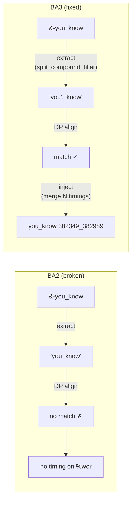
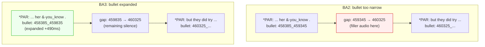

# Algorithms, Language, and Alignment Migration

**Status:** Current
**Last updated:** 2026-05-19 13:34 EDT

Comparison anchors:

- `batchalign2` baseline `84ad500b09e52a82aca982c41a8ccd46b01f4f2c`
- later released `batchalign2` master-branch point
  `e8f8bfada6170aa0558a638e5b73bf2c3675fe6d` where relevant
- current `batchalign3`

This page documents durable algorithmic and data-structure changes only.
Temporary migration-branch experiments do not belong here.

For user-facing command and output consequences, start with
[User Workflow Migration](user-migration.md). This page explains the mechanism
behind those differences.

## Comparison discipline

Algorithmic/output parity claims in this page are anchored to the correct Jan 9
baseline for the material under test:

- core / non-HK claims: Jan 9 `batchalign2-master`
- HK / Cantonese claims: Jan 9 `BatchalignHK`

- Later Feb 9 BA2 behavior can still be useful secondary evidence when the
  question is specifically about the last released BA2 master branch.
- later Python operational builds are not the migration baseline for the
  algorithmic claims documented here.

Use the repo comparison harnesses with the historically correct
`84ad500...`-pinned runner when validating these deltas in practice. For HK
material, that means `batchalignhk`, not stock `batchalign`.

## 1) CHAT parser/validator/AST/serialization as the central algorithmic change

The most important migration is architectural and algorithmic: parsing and
validating CHAT is now a typed, structured pipeline. This reduces failure modes
caused by line-oriented text surgery and makes downstream alignment and `%mor`/`%gra`
operations operate on stable structure.

Implication for contributors: if a change can be expressed as AST transform, do
that first; avoid direct string hacking.

## 1.1) Why this changed correctness, not just implementation language

The main gain is not "Rust is faster." The gain is that parsing, validation,
injection, and serialization now operate on stable typed structure.

That directly changes user-visible correctness:

- fewer opportunities for `%mor`/`%gra` drift from line-oriented text surgery,
- fewer silent remap choices after tokenization/alignment divergence,
- stronger validation before invalid CHAT is written back out.

This is a fundamental redesign, not incremental cleanup: ad-hoc string
manipulation and parallel-array patching are replaced by principled typed
structure with explicit provenance — and that structural shift is what drives
both the correctness and efficiency gains throughout the migration.

That pattern shows up repeatedly across the migration:

- UTR uses global Hirschberg DP alignment (the same proven approach as old
  batchalign, now in Rust),
- FA now carries explicit word identity and timing-mode metadata,
- retokenization uses deterministic range/index mapping and AST rebuilds,
- `%gra` generation uses explicit chunk/head validation rather than positional
  guesswork.
- `utseg` now treats constituency parsing and assignment computation as separate
  steps instead of flattening subtree leaves and DP-aligning them back to forms.
- `coref` now carries typed sentence/chain structure instead of detokenized text
  plus DP remap back to utterance positions.

For migration purposes, separate:

| Stage | Algorithm/data-structure shift |
|---|---|
| Jan 9 BA2 -> Feb 9 BA2 | released BA2 already improved DP behavior, caching boundaries, and a number of robustness/performance details inside the Python architecture |
| Feb 9 BA2 -> current BA3 | current code goes further by moving key remap/injection/validation logic into Rust-owned chat-ops and typed orchestration |

## 2) Dynamic programming: what was removed, what remains

### Narrowed or removed from runtime remap paths

- Retokenize char-level DP fallback mapping path was removed, replaced by
  deterministic interval/index mapping with length-aware monotonic fallback.
- FA response handling uses indexed word timings or deterministic token
  stitching in `fa/alignment.rs` — no DP.

For FA, the precise current claim is narrower:

- current Rust FA response handling uses indexed word timings or
  deterministic token stitching in `fa/alignment.rs`;
- it does not use the Jan 9 / Feb 9 BA2 broad transcript-wide remap policy;
- a shared Hirschberg DP library still exists in-tree, so the accurate migration
  claim is that runtime remap policy was narrowed, not that every DP use
  disappeared.

### UTR: global DP is the steady-state correctness boundary

UTR timing recovery (`fa/utr.rs`) uses a single global Hirschberg DP alignment
of all document words against all ASR tokens.

This is the correct steady-state algorithm for the hand-edited transcript
case (see the `407 trimmed fixture` regression test in
`crates/batchalign/src/chat_ops/fa/utr.rs`): transcript words and ASR
tokens are two independent full-document sequences, so the matcher must
reason globally rather than utterance by utterance. The Rust Hirschberg
implementation in `crates/talkbank-transform/src/dp_align/mod.rs` is
O(mn) time and linear space (`min(m,n)` working memory). No published
benchmark currently anchors a specific speedup multiplier against the
old Python implementation; the practical effect is fast enough that UTR
on full transcripts is no longer a wall-clock concern.

This fixes token-starvation failures where local matching consumed tokens too
early. It does not solve every alignment pathology: dense `&*` overlap and
larger text/audio order divergence still remain a limitation of any monotonic
aligner.

### Intentionally retained

- model-internal alignment/decoding internals (e.g., CTC/Whisper internals)
- evaluation/edit-distance style metrics (WER and similar analysis tooling)

Policy: runtime user-output remap should not silently reintroduce global DP tie
ambiguity in paths where deterministic mapping is available.

This is a durable migration boundary. DP is legitimate when aligning two
genuinely independent sequences (UTR: transcript words vs ASR tokens; WER:
hypothesis vs reference). It is a regression when runtime output reconstruction
uses global DP to paper over mismatches that should be handled by deterministic
identity/index mapping (retokenization, FA injection, `%mor`/`%gra` attachment).

## 3) Realign-after-edit consequences

When transcript edits occur after initial alignment:

- deterministic ID/index matching preserves timing slots where provenance remains,
- bounded window policies prevent cross-utterance remap jumps,
- unresolved ambiguity yields explicit unassigned outcomes (not hidden remap).

This is the intended operational tradeoff: transparent uncertainty over unstable
auto-corrections.

For migrators, this means some BA2-to-BA3 output differences are expected:

- Jan 9 / Feb 9 BA2 output may have looked "more complete" because ambiguous words were forced
  into a global remap anyway;
- current BA3 output may leave some timing/provenance unresolved explicitly;
- that is a correctness choice, not a missing feature.

### 3.1) `align` improvements

Feb 9 BA2 already improved cache use, DP edge cases, and FA failure handling.
BA3 goes further by moving FA grouping, timing injection, `%wor`,
monotonicity, and overlap cleanup into Rust orchestration with typed FA
payloads and deterministic transfer rules.

One especially important `align` sub-change is UTR:

- released BA2 recovered utterance timing via a single global Hirschberg DP
  alignment of all transcript words against all ASR tokens;
- BA3 now uses the same global Hirschberg approach (in Rust), preserving the
  correct full-document alignment model while moving the implementation onto
  the typed Rust chat-ops boundary.
- This fixes the 407-style token-starvation regression class, but it does not
  make UTR non-monotonic. Files with dense overlap and text/audio reordering
  can still remain only partially recoverable.

#### Fuzzy UTR matching (new in BA3)

BA2 used exact string matching between transcript words and ASR tokens.
BA3 adds fuzzy matching via Jaro-Winkler similarity (threshold 0.85,
configurable via `--utr-fuzzy`). This improves UTR coverage on files
with ASR substitutions, dialectal variants, and backchannel
normalizations (e.g., transcript "mhm" matching ASR "mm-hmm").

Validated on 6 corpora (59 files):
- SBCSAE: 76.8% coverage (vs lower with exact), 140ms median precision
- APROCSA, TaiwanHakka, Welsh, German: identical to exact matching
- No regressions on any corpus

Fuzzy matching is now the default. Exact matching remains available
via `--utr-fuzzy 1.0`.

#### Two-pass overlap-aware UTR (BA3 mechanism, currently opt-in only)

BA2 had no overlap awareness in UTR — overlap markers (`+<`, `&*`)
were treated the same as regular words. BA3 ships a two-pass strategy
for conversation-analysis data:

1. **Pass 1 (global):** Align all non-overlap words against ASR tokens
   to establish the timing backbone. Overlap markers are excluded so
   they don't consume ASR tokens that belong to the primary speaker.

2. **Pass 2 (targeted):** For each unresolved overlap utterance, search
   for its ASR timing using index-aware onset matching — multiple `⌊`
   respondents match the correct `⌈` by overlap index with
   speaker-aware fallback.

The two-pass mechanism currently runs only when the user explicitly
passes `--utr-strategy two-pass`. The default (`--utr-strategy auto`)
unconditionally returns `GlobalUtr` since the auto-routing was disabled
on 2026-03-30 — see `resolve_strategy()` in
`crates/batchalign/src/runner/dispatch/utr.rs`. The library function
`select_strategy()` in `crates/batchalign/src/chat_ops/fa/utr.rs`
(language-agnostic content inspection that picks `TwoPassOverlapUtr`
when `+<` or `⌊` markers are present) still exists, but is no longer
reached from the Auto path.

#### Density-aware overlap exclusion (inside the two-pass mechanism)

When the two-pass strategy is selected (currently only via explicit
override), the exclusion behavior is itself density-aware: when more
than 30% of utterances carry overlap markers (dense CA data like
Jefferson NB at 47% overlap), excluding all overlap words from pass-1
would starve the aligner of context, so two-pass falls back to global
alignment for that file. The threshold lives on `TwoPassConfig` as the
`max_exclusion_density` field (default `0.30`) — see
`crates/batchalign/src/chat_ops/fa/utr/two_pass.rs`.

Empirical result on Jefferson NB during the original tuning: pass-1
exclusion alone recovered 8.8% at 1491ms error; with density detection,
recovered 10.7% at 691ms error.

#### Language-aware UTR strategy selection (disabled mechanism)

There was an earlier auto-routing layer that gated `TwoPassOverlapUtr`
on language: non-English files always used `GlobalUtr` (avoiding the
two-pass regression from noisier non-English ASR); English files fell
through to overlap-inspecting auto-selection. That gate was disabled
2026-03-30 (alignment regressions reported by an operator;
`enforce_monotonicity()` only checks start times) and is not currently
reachable. The previously-measured gains under the gate (English:
+4.3pp SBCSAE, +3.8pp Jefferson; non-English on Hakka, Welsh, German,
Serbian: `GlobalUtr` matched or beat `TwoPassOverlapUtr`) are retained
here as the historical benchmark that motivated the gate, not as a
description of current default behavior.

#### `@Options: CA` handling

BA3 detects `@Options: CA` at FA entry and **suppresses `%wor`
generation** for that file — see `crates/batchalign/src/fa/mod.rs::run`
where the option is consulted and `info!("@Options: CA detected —
suppressing %wor generation")` fires. The motivation is that CA
transcripts use prosodic notation (`⌈⌉⌊⌋`, arrows, lengthening marks)
that `%wor` cannot represent, so generating it adds noise that CA
researchers have to manually remove. CA terminator resolution itself
lives in the parser layer (the parser correctly promotes CA-style
terminators), not in an FA-side validation skip.

#### `--media-dir` flag (new in BA3)

`batchalign3 align input/ -o output/ --media-dir /path/to/audio/` allows
specifying a separate directory for audio files. BA2 required audio files
to be alongside the `.cha` files. This supports workflows where media
is stored separately from transcripts (common in corpus archives).

#### Align improvement summary

| Feature | BA2 Jan 9 | BA3 |
|---|---|---|
| UTR matching | Exact only | Fuzzy (Jaro-Winkler 0.85) default inside `TwoPassConfig` |
| Overlap awareness | None | `TwoPassOverlapUtr` with index-aware onset matching, currently reachable only via explicit `--utr-strategy two-pass` |
| Dense overlap handling | None (all words treated equally) | Density detection inside two-pass (`max_exclusion_density = 0.30`, falls back to global when exceeded) |
| Language-aware UTR | None (same strategy for all langs) | Mechanism implemented but auto-routing disabled 2026-03-30; default `--utr-strategy auto` returns `GlobalUtr` for all languages |
| CA handling in FA | None | `@Options: CA` suppresses `%wor` generation in `fa/mod.rs::run` |
| Custom media directory | Not supported | `--media-dir` flag |
| FA orchestration | Python string surgery | Rust typed payloads + deterministic transfer |

## 4) Retokenization and Stanza multi-token outputs

Batchalign3 accounts for multi-word token expansion and tokenization divergence
with deterministic interval/index mapping logic, preserving monotonic ordering.

Practical outcomes:

- one source token yielding multiple UD tokens is handled through explicit mapping,
- merged/split forms are attached by deterministic policy rather than global
  string-level DP reconciliation,
- divergence remains visible and testable in golden fixtures.

This directly addresses the "multiple tokens from Stanza" migration concern:
token expansion is treated as structured provenance mapping, not as text that
must later be globally realigned by DP.

## 4.1) Morphotag and `%gra` correctness consequences

Durable migration-relevant correctness changes include:

- `%gra` root attachment now follows standard root-head semantics instead of
  self-referential root indices;
- reflexive pronoun suffix handling was corrected;
- MWT chunk mapping avoids brittle positional assumptions;
- tokenizer-generated divergence is either deterministically mapped back or left
  explicit, rather than silently "fixed" by a global text remap.

Concrete currently tested consequences include:

- ROOT must attach to virtual root `0`, not to itself;
- invalid root/head/chunk-count combinations are rejected;
- MWT expansions produce per-component `%gra` relations;
- `@c` and `@s` special forms are mapped explicitly rather than relying on
  placeholder leakage;
- `xbxxx` placeholders are restored back to the original form in retokenized
  output;
- reflexive pronouns explicitly emit `reflx`;
- retokenization can split contractions structurally, while `retokenize=false`
  preserves original tokenization.

Important comparison nuance:

- reflexive `reflx`, special-form handling, and `xbxxx` restoration were not
  invented only in current BA3; older BA2 already had versions of those
  behaviors in Python `ud.py`;
- the more durable current shift is that ROOT/head/chunk semantics and
  retokenization behavior are now enforced through explicit mapping logic and
  tests rather than left to positional array repair.

For corpus maintainers, this means BA3 `%mor`/`%gra` diffs against BA2 should be
reviewed as likely corrections first.

## 4.2) From positional repair to principled indexing

The durable algorithmic shift is away from workflows like:

- flatten text,
- keep parallel arrays,
- patch indices after skips/merges,
- run broad DP when the arrays drift.

Toward workflows like:

- carry stable word identity,
- maintain explicit utterance/word/chunk indices,
- iterate AST content directly,
- use deterministic local fallback only where provenance is missing.

Concrete command-level examples:

- `transcribe`:
  - BA2 Python built transcript structure while it was still normalizing token
    strings and punctuation;
  - BA3 separates tagged raw ASR payloads from Rust normalization, Rust
    postprocess, and Rust CHAT assembly.
- `translate`:
  - BA2 translated utterance strings and then relied on Python generation to
    materialize output tiers;
  - BA3 extracts utterance payloads from the AST and injects `%xtra` back by
    line index.
- `utseg`:
  - BA2 flattened constituency subtrees to strings, aligned them back to form
    arrays, then rebuilt utterances;
  - BA3 returns raw tree strings, computes assignment vectors, then splits AST
    utterances by index.
- `coref`:
  - BA2 flattened the document to one detokenized string and DP-mapped chain
    payloads back to `(utterance, form)` slots;
  - BA3 uses sentence arrays and typed chain refs, then injects sparse
    `%xcoref` by validated sentence/line mapping.

This matters because it reduces accidental correctness:

- fewer outputs that "look plausible" only because a later repair pass guessed
  the intended alignment,
- more outputs whose correctness follows from preserved structure and validated
  index relationships.

## 4.3) Cantonese / HK ASR tokenization

HK / Cantonese parity has one additional algorithmic wrinkle that deserves to
be called out explicitly.

- Cantonese material must be compared against the Jan 9 `BatchalignHK` baseline.
- The relevant preserved legacy command is `batchalignhk`.
- For `yue`, semantically correct ASR text can still benchmark badly if the
  runtime keeps long Han-script chunks as one giant token instead of splitting
  them into character tokens before retokenization and scoring.

Current `batchalign3` now handles this in the Rust-owned ASR post-process path:

- Cantonese text is normalized to HK traditional form,
- Han-script `yue` ASR chunks are split with the shared
  `cantonese_char_tokens()` helper,
- ASCII/code-switched tokens are left intact,
- punctuation-based utterance retokenization then runs on those normalized
  tokens.

This matters because WER/compare behavior for Cantonese is sensitive to token
granularity. A transcript can be visibly "close" while still scoring as a large
regression if the main path presents only a few giant tokens to the scorer.

## 5) Japanese preprocessing/postprocessing

### Japanese verb-form and POS overrides

`crates/talkbank-transform/src/morphosyntax/lang_ja.rs` (~440 lines,
ported from BA2's Python `ja/verbforms.py`) applies 50+ ordered override
rules that run before UD→CHAT POS mapping. These correct Stanza outputs
for colloquial Japanese forms that the model frequently misclassifies:

- **Subordinating conjunctions:** contracted conditionals (ちゃ→ば, なきゃ,
  じゃ→ちゃ, たら, たっ, で) reclassified from VERB/AUX to SCONJ.
- **Auxiliary verbs:** colloquial endings (れる→られる, よう→おう, だら→たら,
  だ→た, 無い→ない, せる→させる, なさい→為さい) with corrected lemmas.
- **Interjections:** backchannels and fillers (はい, うん, おっ, ほら, ヤッホー,
  ただいま) reclassified from NOUN/VERB to INTJ.
- **Verb lemma corrections:** specific kanji verbs (撮る, 貼る, 混ぜる, 釣る,
  降りる/降る, 載せる, 帰る, 舐める, etc.) that Stanza assigns wrong lemmas.
- **Noun/pronoun fixes:** colloquial forms (あたし→PRON, バツ, ブラシ,
  引き出し, クシャミ) and onomatopoeia (ゴロンっ, モチーンっ).

### Japanese Stanza processor configuration

Japanese requires the `combined` Stanza processor package (tokenize+pos+lemma+depparse
in one model), not separate processors. This is enforced in
`test_stanza_config_parity.py` to prevent misconfiguration that causes silent
accuracy degradation.

## 5.1) Performance consequences of the algorithm shift

The performance wins that belong in migration documentation are the durable ones:

- deterministic mapping avoids some expensive reconstruction work that used to
  happen after engine calls;
- better cache boundaries mean repeated morphosyntax/alignment work is skipped
  more often;
- batching and warm workers reduce per-file startup overhead.

Point-in-time benchmark spikes do not belong here unless they became a durable
property of the released architecture.

## 6) Overlap and rapid interleaving speech

A known limit remains: rapidly overlapping/interleaving speaker turns are still
hard for perfect automatic assignment. The migration improves this by local
window constraints and deterministic fallback, but does not claim complete
disambiguation in all overlap-heavy audio.

Mitigation strategy:

- preserve all candidate structure and timings,
- avoid global crossing remaps,
- expose unresolved slots for explicit review tools.

## 7) Regression governance

Algorithmic migrations are now defended by:

- golden test matrices (`batchalign/tests/golden/`),
- no-DP-runtime allowlist tests at
  `batchalign/tests/test_dp_allowlist.py::test_chat_ops_dp_calls_are_allowlisted`,
  which fingerprints every `dp_align::align(...)` call site against an
  explicit allowlist so unintended DP-on-runtime regressions are caught
  in CI,
- tracing instrumentation for mapping-mode divergence: the `warn!` at
  `crates/talkbank-transform/src/retokenize.rs:75` (`"retokenize text
  diverged; using length-aware monotonic fallback without DP"`) fires
  whenever `build_word_token_mapping()` cannot use a deterministic
  word-token mapping and falls back to length-aware monotonic.

That governance change is itself part of the migration: the codebase is less
willing to accept "looks plausible on a few files" as evidence that an
algorithmic rewrite is safe.

## Language handling: no silent fallbacks, early validation

### Policy: hard-error on unknown languages, never silent fallback

batchalign3 deliberately rejects unknown or unsupported language codes
**at the earliest possible point** with a clear, actionable diagnostic.
This is an improvement over both BA2 and early BA3:

| Scenario | BA2 | BA3 (initial) | BA3 (current) |
|---|---|---|---|
| Unknown code → Rev.AI | `pycountry` crash (uncaught `AttributeError`) | Silent wrong code via `&other[..2]` truncation | Hard error at job submission with alternatives |
| Unknown code → Whisper | `pycountry` crash | Silent English fallback (`return "english"`) | Hard `ValueError` with message |
| Unsupported Rev.AI language | HTTP 400 deep in pipeline | HTTP 400 deep in pipeline | Rejected at submission: "use `--asr-engine whisper`" |

BA2's behavior was accidentally strict — it crashed because nobody added a
None check, not because someone designed early validation. BA3's initial
migration introduced two regressions by trying to be "helpful":

1. **Rev.AI truncation fallback** — `&other[..2]` silently produced wrong
   codes (e.g., `hak` → `ha`, `pol` → `po`). Replaced with a ~78-entry
   explicit mapping table (`revai/preflight.rs::try_revai_language_hint`)
   + `"auto"` fallback with `tracing::warn`.

2. **Whisper English fallback** — `return "english"` when `pycountry` found
   no match. This meant unknown languages were silently transcribed in
   English — the worst possible outcome, since the user gets output that
   looks plausible but is completely wrong. Replaced with
   `raise ValueError(...)`.

**Design principle:** A clear error message is always better than silently
wrong results. Users can recover from "language not supported — try
`--asr-engine whisper`" but cannot recover from a transcript that looks
English but should have been Welsh.

### Per-file `@Languages:` resolution (morphotag, translate, coref)

For text-NLP commands that operate on existing CHAT files —
`morphotag`, `translate`, `coref` — the processing language is
**read per-file from each file's own `@Languages:` header**. None of
these commands accept a `--lang` flag at the CLI; the wire-level
`LanguageSpec` is `PerFile`, distinct from `Auto`.

| Scenario | BA2 | BA3 (current) |
|---|---|---|
| Missing `@Languages:` header | Silent `["eng"]` default applied to non-English files | Hard error: file is recorded as failed in the job's `file_statuses` with a typed message asking the operator to fix the header and re-run. No silent eng fallback. |
| Malformed `@Languages:` (non-ISO code) | First entry passed through to Stanza, which then crashed deep in inference | Hard error at parse with the offending value quoted in the diagnostic. |
| Bilingual file (`@Languages: spa, eng`) | Primary language used | Primary language used (unchanged). Secondary languages routed per-utterance via `[- xxx]` precodes; `@s` words routed to L2 dispatch by default. |
| Job-level `--lang` flag | Sentinel that silently overrode per-file headers — the 2026-05-03 morphotag incident: every Czech/Spanish/Polish/French file in a heterogeneous corpus was tagged with English Stanza and stamped with `lang=eng` provenance | Removed. The CLI surface rejects `--lang` for these commands. The job record carries `lang=per-file` and the dashboard displays it as such. |

**BA2 source for the silent `["eng"]` default:**

```python
# pipelines/morphosyntax/ud.py:1104
lang = doc.langs[0] if doc.langs else "eng"

# pipelines/utterance/ud_utterance.py:253
primary_lang = doc.langs[0] if doc.langs else "eng"
```

The pattern was repeated at ten-plus sites across BA2 — every text-NLP
pipeline carried its own `if doc.langs else "eng"` clause. BA3 inherited
it as parity scaffolding (`CommandProfile.lang = "eng"` for the three
no-`--lang` commands) until 2026-05-06, when the placeholder was killed
in favor of `LanguageSpec::PerFile` and `resolve_per_file_lang` was made
fallible.

**Why BA2 used a silent default at all** is unclear from the source. BA2
predates the project's broader push toward strict CHAT validation; the eng
default is consistent with a "produce some output rather than fail"
stance that was reasonable when the corpus was overwhelmingly English
CHILDES data. With heterogeneous data — Cantonese, Polish, Czech,
Spanish, Hong Kong bilingual — the default is unsafe: it falsifies the
output's `@Languages:` provenance and tags the wrong morphology onto
the wrong text. BA3 deliberately diverges.

### UTR strategy selection (current: GlobalUtr always; two-pass gated)

The UTR (Utterance Timing Recovery) overlap strategy options are
`auto`, `global`, and `two-pass`, controlled by `--utr-strategy`.

**Current behavior** (`runner/dispatch/utr.rs::resolve_strategy`):

- `--utr-strategy auto` (default) — always uses `GlobalUtr`. The
  language-aware / overlap-inspecting branch was disabled
  2026-03-30 after operator-reported alignment regressions on real
  files, uncorrected end-time overlap
  (`enforce_monotonicity` only checks start times), and insufficient
  broad validation of the two-pass algorithm beyond the original four
  corpora.
- `--utr-strategy global` — `GlobalUtr` (explicit; same as auto today).
- `--utr-strategy two-pass` — `TwoPassOverlapUtr` (experimental;
  opt-in). The lower-level `select_strategy()` in
  `chat_ops/fa/utr.rs` inspects the file for `+<` linkers or `⌊` CA
  markers and returns `TwoPassOverlapUtr` if either is present, but
  this function is currently unreachable from Auto.

**Historical data** (now-disabled auto-selection): an internal
benchmark on 7 non-English files across 4 languages plus the SBCSAE
and Jefferson English corpora measured +4.3pp on SBCSAE and +3.8pp
on Jefferson for the auto-selected two-pass strategy on English,
with regressions on non-English eliminated. These numbers describe
the disabled mechanism, not what `auto` delivers today.

The companion architecture page
[Command Flowcharts](../architecture/command-flowcharts.md#utr-detail-language-aware-strategy-selection)
still shows a "Language == eng?" decision diamond for the older
auto-selection behavior; that page needs the same correction.

### Per-utterance language routing: improvement over BA2

**Status:** Implemented in BA3. An improvement over both BA2 and
batchalign-next's eager-loading approach.

BA3 implements full per-utterance language routing for morphosyntax:
utterances with `[- fra]` precodes are routed to the French Stanza
pipeline, `[- spa]` to Spanish, etc. The full chain:

1. **Rust** (`morphosyntax/batch.rs`): extracts per-utterance `language_code`
   from `[- lang]` precodes (falls back to `@Languages` header, then to
   primary `--lang`), groups all cache-miss items by language
2. **Rust** (`morphosyntax/batch.rs`): dispatches language groups via
   `futures::future::join_all`, gated by a `tokio::sync::Semaphore` of
   `max_concurrent_groups = max_total_workers / max_workers_per_key`.
   Each language group goes to a separate worker process; concurrency
   is bounded so the global cap can't be exceeded.
3. **Rust** (`morphosyntax/worker.rs`): within each language group, splits
   large batches into chunks across up to `max_workers_per_key` (default 4)
   workers of the same language, also via `join_all`.
4. **Python worker**: receives one chunk, runs Stanza on it, returns raw UD
   annotations — Python has zero language-routing logic.

Language grouping and dispatch are entirely Rust-owned. Python workers are
stateless single-language inference endpoints.

| Behavior | BA2 | BA3 |
|---|---|---|
| `[- lang]` precode parsed | Yes | Yes |
| Per-utterance Stanza routing | **No** (always primary lang) | **Yes** (Rust groups by language) |
| Cross-language parallelism | No | **Yes** (concurrent language groups, semaphore-bounded) |
| Intra-language parallelism | No | **Yes** (chunked across multiple workers) |
| `@s:lang` per-word routing | No | **Yes** (L2 dispatch, default-on; opt out via `--no-l2-morphotag`) |

BA2 parsed the `[- lang]` precode into `override_lang` but **never used it
for routing** — it always called `nlp(line_cut)` with the single primary
pipeline, and `parse_sentence(..., lang[0])` always used the first
declared language. When `skipmultilang=True`, BA2 skipped non-primary
utterances entirely; when `False` (default), it processed them with the
wrong language model.

BA3's `@s:lang` per-word routing (L2 dispatch) is implemented in
`crates/talkbank-transform/src/morphosyntax/l2/`: the L2 extractor
identifies `@s`-marked words, groups them into per-utterance
`DispatchSpan`s by target language, dispatches each span to its
secondary-language Stanza model, and merges the secondary lexical
output back with the primary-language structural info before
splicing the merged `Mor` items in place of the primary pass's
`L2|xxx` placeholders. Default-on; the `--no-l2-morphotag` flag opts
out and falls back to placeholder-only output. `--skipmultilang`
remains the utterance-level `[- lang]` skip control, not the per-word
L2 switch.

BA3's two-level parallelism caps total active Stanza workers at
`max_total_workers` (computed from RAM, default ~28 on a fleet
machine). The cross-language semaphore allows up to
`max_total_workers / max_workers_per_key` language groups to dispatch
at once, and within each group up to `max_workers_per_key` (default 4)
chunks run in parallel. A 5-language batch with `max_workers_per_key=4`
on a 28-worker host can dispatch all 5 groups simultaneously
(5 ≤ 28/4 = 7) and use up to 20 concurrent Stanza workers; for
N > `max_total_workers / max_workers_per_key` the language groups
queue rather than all dispatching at once.

### Unsupported languages

Not all ISO 639-3 codes have Stanza models. The TalkBank corpus includes
files with secondary languages like Quechua (`que`), Jamaican Creole
(`jam`), Min Nan Chinese (`nan`), Tamasheq (`taq`), and `und`
(undetermined). BA2 and BA3 handle these differently:

| Behavior | BA2 | BA3 |
|---|---|---|
| Unsupported secondary language | **Silently processed with wrong model** (MultilingualPipeline falls back to primary language) | **Detected at preflight, skipped with warning** — utterances get empty `%mor`/`%gra` |
| Worker crash on unsupported code | Never (MultilingualPipeline absorbs it) | Never (Rust filters before dispatch) |
| POS accuracy for unsupported langs | **Wrong** (primary-language model applied to foreign text) | **Honest** (empty rather than wrong) |

BA2's `stanza.MultilingualPipeline` was convenient but dishonest: it
silently applied the wrong language model to unsupported languages,
producing POS tags and dependency parses that looked plausible but were
linguistically invalid. BA3's approach is to fail honestly — an empty
`%mor` tier is better than a wrong one, because it signals to the user
that the language needs attention rather than hiding the problem behind
plausible-looking garbage.

The supported language set is maintained in
`crates/talkbank-transform/src/morphosyntax/pos_hints.rs::is_stanza_supported`
(Rust-side gate, called before dispatch in `crates/batchalign/src/morphosyntax/batch.rs`)
and `batchalign/worker/_stanza_loading.py` (Python-side mapping). Both
must stay in sync.

### Processor capability discovery

BA2 and early BA3 both hardcoded assumptions about which Stanza
processors are available per language. This caused runtime crashes
when a language lacked an assumed processor.

| Behavior | BA2 | BA3 (before registry) | BA3 (with registry) |
|----------|-----|----------------------|---------------------|
| Capability source | Hardcoded in code | Hardcoded in 7 tables | Stanza `resources.json` (authoritative) |
| Dutch utseg | **Crash** ("constituency not known for nl") | **Crash** (same bug) | Graceful (constituency omitted, sentence-boundary fallback) |
| MWT detection | BA2 exclusion-list inversion | Copy of BA2 exclusion list (`MWT_LANGS`) | Per-language from `resources.json` |
| Unsupported language | Wrong model (MultilingualPipeline fallback) | Reject/skip at dispatch | Reject at submission with clear error |
| iso3→alpha2 mapping | Hardcoded dict (56 codes) | Hardcoded dict (3 copies: Python + 2 Rust) | Derived from `pycountry` + `resources.json` |
| Constituency availability | Always requested (crashed for 180+ languages) | Always requested (same) | Per-language check (~11 languages have it) |

The capability table (`batchalign/worker/_stanza_capabilities.py`) reads
Stanza's `resources.json` once at worker startup and reports per-language
processor availability.  This eliminates the manual sync burden between
Python and Rust and prevents runtime crashes from missing processors.

See [Language Routing](../../architecture/language-and-multilingual/language-routing.md) for
the remaining gaps (per-word `@s:` routing, per-utterance ASR engine
selection).

### Transcribe: language auto-detection and code-switching (new in BA3)

**Status:** Implemented in BA3. Not available in BA2.

BA3 adds full `--lang auto` support for `transcribe` with two-stage language
detection and automatic code-switching precode generation. This is entirely
new functionality — BA2 had no equivalent.

| Capability | BA2 Jan 9 | BA3 |
|---|---|---|
| `--lang auto` CLI flag | Not explicitly supported; Whisper auto-detect worked implicitly by omitting the `language` kwarg | Fully supported with Rev.AI Language ID pre-pass |
| Primary language detection | None — always used user-specified language | Rev.AI Language ID API (audio-based, ~5-30s, high accuracy); whatlang trigram fallback for Whisper |
| `[- lang]` code-switching precodes | **Never generated during transcribe** | Generated per-utterance via whatlang trigram detection |
| Multi-language `@Languages` header | Single language only | Multiple languages, frequency-ordered, primary first |
| Rev.AI Language Identification API | Not used | Used as pre-pass to detect dominant language from audio features before transcription |

#### How it works

When `--lang auto` is passed with the Rev.AI ASR backend (production path):

1. **Rev.AI Language ID API** (~5-30s): submits audio to a dedicated
   language identification endpoint. Returns `top_language` (e.g., `"es"`)
   with confidence score (e.g., 0.907). This uses audio/phonetic features,
   not text analysis, so it correctly identifies Spanish even in heavily
   code-switched English/Spanish audio.

2. **Transcription with concrete language**: the detected language is used
   as the language hint for the transcription job, which enables
   `speakers_count` and `skip_postprocessing` to be set correctly.

3. **Per-utterance language detection**: after ASR post-processing, each
   utterance is analyzed by `whatlang` (Rust trigram-based detector,
   ~1ms per utterance). Utterances confidently detected as a different
   language than the primary get `[- lang]` precodes in the CHAT output.

4. **Multi-language `@Languages` header**: the primary language is always
   listed first; secondary languages are added if they appear in
   `MIN_UTTERANCES_FOR_SECONDARY` (= 3) or more utterances, in
   descending-frequency order. The constant lives in
   `crates/talkbank-transform/src/asr_postprocess/lang_detect.rs`.

#### Accuracy on bilingual audio

On Spanish-primary heavily code-switched audio (e.g. Miami/Bangor
spa-eng samples), the two backends behave differently:

- **Rev.AI + Language ID** typically identifies the primary language
  correctly because the Language ID API is audio/phonetic-based, so
  `@Languages` comes out `spa, eng` and the primary stays `spa`.
- **Whisper + whatlang** frequently inverts the order to `eng, spa`
  with the wrong primary, because whatlang's trigram majority vote on
  ASR text is biased by English content embedded in Spanish utterances.
- Per-utterance `[- eng]` precode coverage is much lower than
  ground-truth in either backend, because trigram detection requires
  `MIN_CHARS_FOR_DETECTION` (= 40 alphabetic chars) and
  `UTTERANCE_CONFIDENCE_THRESHOLD` (= 0.5) to fire — short or
  code-mixed utterances fall below those thresholds. Quantitative
  per-corpus numbers depend on input characteristics; see the
  [language-routing limitations](../../architecture/language-and-multilingual/language-routing.md#known-limitations)
  for the full design discussion.

#### Why Whisper gets the primary language wrong

Whisper auto-detects language internally per 30-second chunk, but the
HuggingFace pipeline does not expose which language was detected. The
pipeline returns text with `lang="auto"` echoed back, forcing fallback
to whatlang trigram detection on the ASR text output. On code-switched
bilingual text, whatlang frequently misclassifies the primary language
because Spanish utterances containing English words generate enough
English trigrams to tip the majority vote.

Rev.AI's Language ID API avoids this by using audio-level phonetic
features rather than text trigrams.

### Transcribe: ASR post-processing improvements

BA3 ports all 8 BA2 ASR post-processing stages to Rust with provenance
newtypes that prevent mixing text at different pipeline stages:

| Stage | BA2 Jan 9 | BA3 |
|---|---|---|
| Compound merging | Python, wordlist-driven merge (`compounds` list, O(n) `in` membership) | Rust, 3,584 pairs in `LazyLock<HashSet<(&str, &str)>>` (O(1) lookup) |
| Multi-word splitting | Python, timestamp interpolation | Rust, same algorithm |
| Number expansion | Python, 12 language tables (`deu, ell, eng, eus, fra, hrv, ind, jpn, nld, por, spa, tha`) | Rust, same 12 tables + Malayalam (`mal`) added 2026-04-26 for the Whisper-Hub digit-emission bug — 13 total |
| Cantonese normalization | Python (OpenCC dependency) | Rust (`ferrous-opencc` crate, no Python OpenCC needed) |
| Long-turn splitting | Python, 300-word threshold | Rust, same threshold |
| Retokenization | Python, punctuation-based | Rust, same algorithm |
| Disfluency replacement | Python, string matching | Rust, same wordlists |
| N-gram retrace detection | Python, ad-hoc grouping | Rust, `WordKind::Retrace` enum + CHAT AST annotation |

**Key correctness improvement:** BA3's retrace detection marks words with
`WordKind::Retrace` in the token pipeline, then `build_chat.rs` wraps them
in proper CHAT `<...> [/]` AST nodes (`AnnotatedWord` / `AnnotatedGroup`).

### Text Cleaning Divergences from BA2

| Operation | BA2 | BA3 | Rationale |
|-----------|-----|-----|-----------|
| Pre-Stanza paren stripping | `line_cut.replace("(","")` / `replace(")","")` strips parens from input before Stanza | No pre-Stanza stripping; `Word::cleaned_text()` handles CHAT notation at extraction time | BA2 silently dropped bare paren words, causing word count mismatches. BA3 still strips parens from MOR lemma output (`mor_word.rs:119`), same operation as BA2's lemma post-processing — different stage. |
| MOR lemma hyphen normalization (post-Stanza) | Strip leading/trailing dash, collapse `--`→`-`, replace `-`→`–` (en-dash) on Stanza lemma output | **Same operations**, ported line-by-line in `mor_word.rs:107-129` | Not a real BA2-vs-BA3 divergence — BA3 preserves the BA2 lemma-cleanup logic by design. The cleaned MOR is the migration contract. |
| Cantonese word segmentation | None | PyCantonese `segment()` via `--retokenize` | BA2 had no word segmentation for CJK per-character ASR output. |
| Cantonese POS accuracy on core vocabulary | Stanza `zh` (Mandarin model) — internal benchmarks scored ~50% on core Cantonese; ~63% Mandarin baseline on the UD held-out test set | PyCantonese POS override scores ~95% on core Cantonese vocabulary; a trained Cantonese Stanza model on UD held-out reaches 93.5% (not yet deployed) | BA2 used the same Mandarin model. The exact baseline number depends on the test set used; see [Cantonese / CJK Architecture: POS limitations](../../architecture/language-and-multilingual/cantonese-and-cjk.md#known-limitations) for the cross-test-set picture. |

These divergences mean BA3 morphotag output for Cantonese will differ from
BA2 output. The differences are improvements — BA2's text stripping was lossy
and its POS model was wrong for Cantonese.
BA2 did string-level wrapping that could produce malformed CHAT when
retraces crossed word boundaries or contained special characters.

**Provenance newtypes:** The token pipeline uses distinct types at each
stage (`AsrRawText` → `AsrNormalizedText` → `ChatWordText`) that prevent
accidentally passing text from one stage to another without the required
transformation. BA2 used bare `str` throughout.

### Transcribe: Rev.AI language code mapping

BA2 used `pycountry.languages.get(alpha_3=lang).alpha_2` for ISO 639-3
to Rev.AI code conversion. When `pycountry` returned `None` for an unknown
language code, BA2 crashed with an uncaught `AttributeError` (no fallback
at all). Early BA3 Rust code introduced a silent truncation fallback
(`&other[..2]`) that produced wrong codes for many languages:
- `pol` → `po` (should be `pl`)
- `hak` → `ha` (not a valid ISO 639-1 code)
- `ces` → `ce` (should be `cs`)

BA3 replaces this with an explicit ~78-entry ISO 639-3 → Rev.AI
mapping table in `revai/preflight.rs::try_revai_language_hint`, with
an `"auto"` fallback for unmapped languages (logged as a
`tracing::warn` recommending the operator add an explicit mapping for
the language). The reverse mapping (`revai_code_to_iso639_3` in
`revai/asr.rs`) returns `Option<LanguageCode3>` rather than panicking
on unknown codes.

## 8) Forced alignment: compound filler handling (new in BA3)

Three algorithmic improvements to FA that did not exist in BA2 (verified
against `batchalign2-jan9` baseline `84ad500b`):

### 8.1) Compound filler splitting for FA extraction

CHAT fillers like `&-you_know`, `&-sort_of`, `&-I_mean` are single tokens
with underscores joining multi-word discourse markers. ASR engines (Whisper,
wav2vec) tokenize these as separate words ("you", "know"). The Hirschberg
DP aligner could not match the compound token against the split ASR output.

BA3 splits compound fillers at underscores during FA word extraction, then
merges the N timings back into one span during injection.



**Source:** `crates/batchalign/src/chat_ops/fa/extraction.rs::push_fa_word`,
`crates/batchalign/src/chat_ops/fa/injection.rs::inject_timing_on_word`, shared
helper `crates/batchalign/src/chat_ops/fa/mod.rs::split_compound_filler`.

### 8.2) Edge filler bullet expansion

UTR-assigned utterance bullets are computed from ASR token matching. ASR
engines don't transcribe fillers, so bullets exclude filler audio at
utterance boundaries. A trailing `&-you_know` whose audio lives in the
gap between utterances gets no FA coverage.

BA3 adds a pre-FA pass that expands utterance bullets into adjacent
inter-utterance gaps when edge words are fillers.



**Algorithm:** For each utterance with a leading or trailing filler, expand
the bullet into the gap by `min(gap/2, 1500ms)`. This ensures the FA audio
window includes the filler without stealing from the neighbor.

**Source:** `crates/batchalign/src/chat_ops/fa/expand_for_fillers.rs::expand_bullets_for_edge_fillers`.

### 8.3) FA group trailing gap extension

In addition to per-utterance bullet expansion, FA group audio windows are
extended into the gap after the last utterance in a group. This catches
trailing fillers at group boundaries where per-utterance expansion alone
is insufficient.

**Source:** `crates/batchalign/src/chat_ops/fa/grouping.rs::extend_into_trailing_gap`.

### Verification

Tested on a user's `17-3.cha` (`<corpus>/<group>`):

| Utterance | BA2 / BA3 pre-fix | BA3 post-fix |
|-----------|-------------------|-------------|
| `... her &-you_know .` (trailing) | `you_know` — no timing | `you_know 459652_459835` ✓ |
| `&-you_know well , ...` (leading) | `you_know 454055_454130` (75ms) | `you_know 453680_454127` (447ms) ✓ |
| `... about &-you_know having ...` (mid) | `you_know 382349_382989` ✓ | `you_know 382349_382989` ✓ (unchanged) |

Mid-utterance fillers were already handled correctly — only edge fillers
needed the fix.
