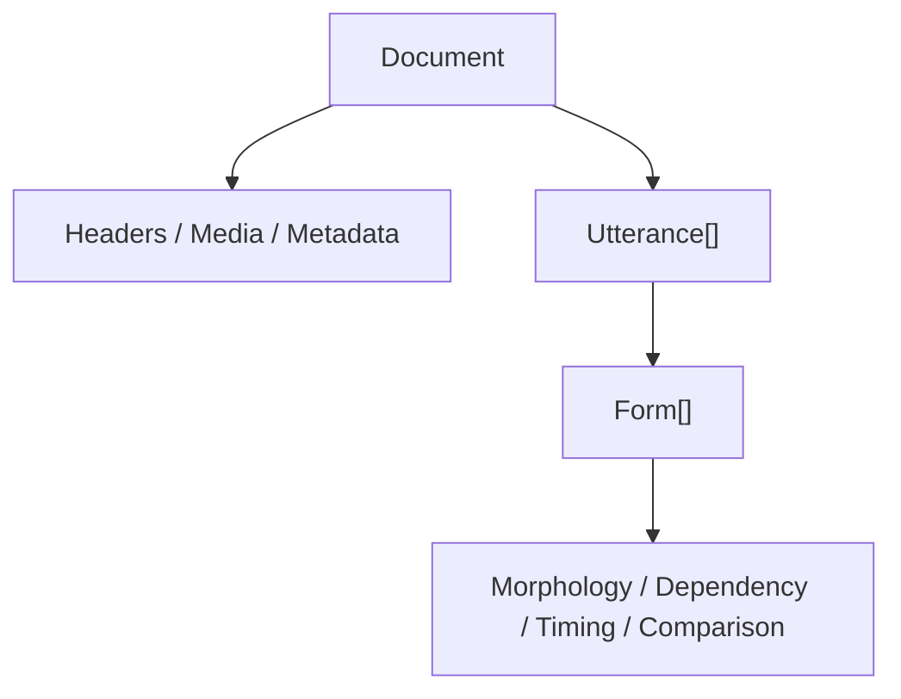
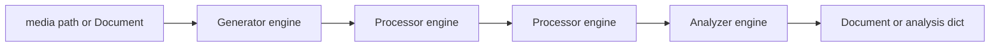
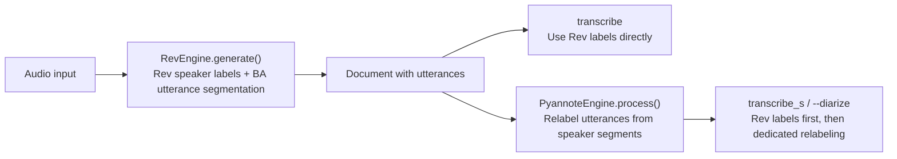
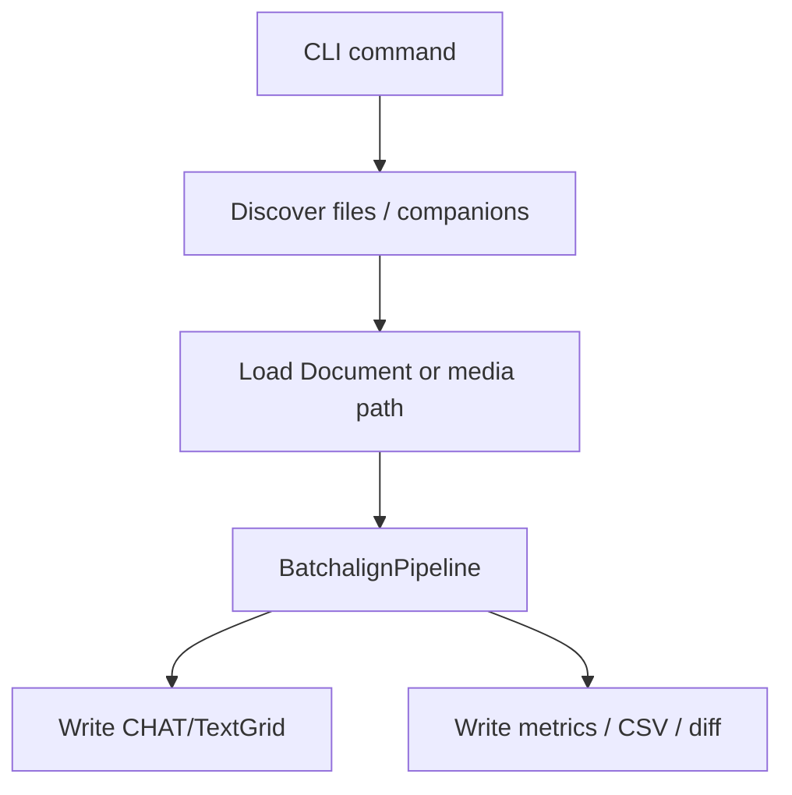

# BA2 Architecture Reference

**Status:** Frozen reference
**Last updated:** 2026-05-19 17:18 EDT
**Baseline:** `batchalign2-jan9` (`84ad500b09e52a82aca982c41a8ccd46b01f4f2c`)
**Supplement:** later `batchalign2-master` compare redesign (`1f224df346c2ec590d45afa31136a3b878db622b`) as a forward-looking stress test

This page records the architecture of the frozen Jan 9 batchalign2 codebase so
contributors have a stable comparison target while redesigning batchalign3.

It is not a nostalgia document. The point is to preserve the useful ideas from
BA2 without re-importing the parts that made BA1 and BA2 hard to evolve.

## Why This Matters

The Jan 9 BA2 baseline still expresses some architectural ideas more clearly
than current BA3 implementation code:

- a central document abstraction
- a visible engine/pipeline split
- straightforward multi-step workflow composition
- a simple read -> transform -> write mental model

At the same time, BA2 also shows the limits of that model:

- sequential assumptions
- stringly dispatch
- implicit task ordering
- weak typing at workflow boundaries
- analyzers returning ad hoc dictionaries instead of typed artifacts

Those strengths and limits should both inform BA3.

## Core Abstractions

### Document

BA2 has one clear internal representation: `Document`.

- `Document` owns transcript structure, metadata, media references, and
  utterances.
- `Utterance` owns ordered `Form` content plus dependent information such as
  timing, morphology, dependency, comparison tokens, and comments.
- Most engines mutate or analyze `Document` directly.

This is BA2's strongest idea. The codebase has one obvious semantic center.

## Engine and Pipeline Model

BA2 splits work between engines and pipelines.

- `BatchalignEngine` is the unit of work.
- Engines advertise `tasks`.
- Engines implement one of:
  - `generate`
  - `process`
  - `analyze`
- `BatchalignPipeline` sequences one generator, zero or more processors, and an
  optional analyzer.

That model made it easy to reason about workflows like:

- transcribe = ASR generation
- morphotag = document processing
- compare = morphosyntax processing -> compare processing -> compare analysis

## Transcribe / diarization shape worth preserving

The Jan 9 BA2 transcribe path matters because later help text drifted away from
what the code actually did.

- `transcribe` with Rev.AI: BA2 used Rev speaker labels directly and still ran
  BA-side utterance segmentation through `process_generation(..., utterance_engine=...)`.
- `transcribe_s` / `--diarize`: CLI dispatch mapped to `asr,speaker`, so the
  Pyannote speaker processor ran after ASR and relabeled already-built
  utterances from diarization segments.
- That means BA2's explicit diarization path was **not** ignored on Rev.AI; the
  stale help string was wrong, the pipeline wiring was not.

## Read / Write / Read-Write Model

BA2 effectively has three workflow shapes even though it never formalizes them
as first-class architecture concepts:

- read-write: load a document, mutate it, write it back
- read-analyze-write-sidecar: load a document, analyze it, write CSV or metrics
- generate-then-read-write: create a document from media, then continue through
  document processing

The implementation lives mostly in CLI glue rather than inside a typed workflow
layer:

- format adapters load or save `Document`
- CLI dispatch discovers files and companions
- `_dispatch(...)` decides per-file handling
- `dispatch_pipeline()` turns command names into engine lists

This model is simple and effective for sequential workflows, but it leaves too
much policy in per-command closures and ad hoc dispatch code.

## Strengths Worth Reviving

### 1. One semantic center

BA2's best architectural property is that almost everything converges on one
document model. Contributors can usually answer "what are we operating on?"
without hunting across the codebase.

### 2. Visible multi-step composition

BA2 makes it obvious when one command is actually a sequence:

- morphosyntax first
- compare second
- metrics third

That clarity is still valuable even if the runtime implementation becomes more
concurrent or more distributed.

### 3. Shared normalization seams

Some of BA2's strongest code is not the pipeline shell itself but the shared
normalization utilities around it. The architecture benefited whenever
provider-specific weirdness was absorbed before the rest of the pipeline saw it.

### 4. Easy experimental evolution

Because the sequential document pipeline is easy to understand, major changes
like the later compare redesign could land by rewriting one engine plus a small
amount of CLI glue.

That developer ergonomics is exactly what batchalign3 needs to recover without
throwing away its runtime strengths.

## Limits That Should Not Return

### 1. Implicit task ordering

Processor order is not described by an explicit workflow graph. It is inferred
through task ordering conventions. That is brittle and hard to extend.

### 2. Stringly dispatch

Command composition relies on string names and large `if/elif` registries. That
works at small scale and then becomes a change-management tax.

### 3. Weak output contracts

Processors return `Document`, analyzers return dictionaries, and callers need
out-of-band knowledge to know what shape they got back. That is a real
architectural limit for future multi-artifact workflows.

### 4. Sequential assumptions

BA2 does not model:

- cross-file batching as a first-class workflow concern (Note: BA3 originally implemented this for morphotag but later migrated to per-file parallel dispatch for better reliability and incremental feedback)
- persistent worker pools
- shared GPU inference hosts
- job lifecycles
- memory gating and runtime scheduling

Those concerns are not small add-ons in BA3. They shape the architecture.

### 5. Document/rendering coupling

The BA2 document model sometimes mixes transcript semantics with CHAT-specific
serialization behavior. That makes it harder to reuse the model as a pure IR.

## Later Compare Redesign As A Harbinger

The later `compare` redesign on `batchalign2-master`
(`1f224df346c2ec590d45afa31136a3b878db622b`) is valuable not because it is part
of the frozen Jan 9 baseline, but because it shows what future architectural
pressure looks like.

That change turns `compare` from:

- one flat hypothesis-vs-gold alignment
- output anchored to the hypothesis document

into:

- per-gold-utterance window selection
- local alignment inside each selected window
- projection of timing, morphology, and dependency from hypothesis onto gold
- output anchored to the gold document

In other words, it is not merely "better WER." It is a new workflow kind:

- two input documents
- one comparison bundle
- one projected output document
- one metrics sidecar

That is the key lesson for BA3:

batchalign needs architecture for workflow families and typed intermediate
artifacts, not just architecture for commands.

## Bottom Line

The right BA3 inheritance from BA2 is:

- keep a strong document/artifact center
- keep explicit multi-step workflow composition
- keep provider normalization at stable seams

The wrong inheritance is:

- string registries
- implicit ordering
- sequential-only pipeline assumptions
- ambiguous return types

See [Dispatch and Execution](../../architecture/runtime/dispatch.md)
for the current BA3 architecture (command model, planning,
recipe-driven execution kernel) that preserves BA2's good ideas while
keeping BA3's concurrency, worker reuse, and typed runtime boundaries.
