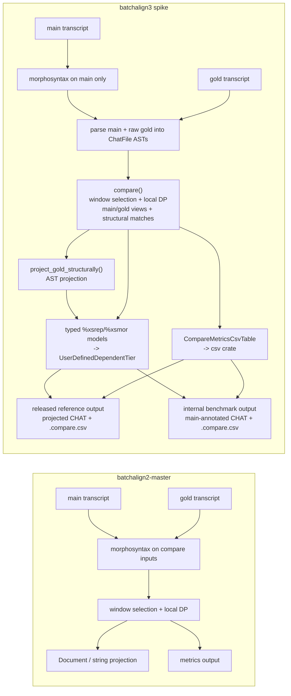

# BA2 Compare Migration

**Status:** Current
**Last updated:** 2026-05-01 22:47 EDT

This page is for contributors who know `batchalign2-master` compare and want to
judge the BA3 Rust reimplementation on its real semantics rather than on
superficial output shape.

The shortest summary is:

- BA3 keeps the important `batchalign2-master` compare behavior: per-gold local
  window selection, local DP alignment, `%xsrep`, `%xsmor`, and `.compare.csv`.
- BA3 intentionally changes *how* projection and serialization are implemented:
  the reimplementation keeps CHAT in a Rust AST, carries typed alignment
  metadata, materializes compare tiers through explicit typed content models,
  and emits `.compare.csv` from a structured table model instead of
  reconstructing structure from strings or a Python `Document` shell.

## Source map

Use these as the primary files when reviewing the rewrite:

- BA2 reference (the local `~/batchalign2-master` archive is checked out
  at the Jan 9 baseline `84ad500b...`, where `compare.py` does **not**
  yet exist; use the post-redesign commit
  `1f224df346c2ec590d45afa31136a3b878db622b` to see the file referenced
  here, e.g. `git -C ~/batchalign2-master show 1f224df:batchalign/pipelines/analysis/compare.py`):
  - `batchalign/pipelines/analysis/compare.py` (`CompareEngine` /
    `_find_best_segment`)
  - `~/batchalign2-master/batchalign/pipelines/analysis/eval.py`
  - `~/batchalign2-master/batchalign/cli/dispatch.py`
- BA3 reimplementation:
  - `crates/batchalign/src/compare.rs` (orchestration entry: the runner
    calls `compare()` and `project_gold_structurally()` from
    talkbank-transform and writes the projected CHAT and `.compare.csv`)
  - `crates/talkbank-transform/src/compare/engine.rs`
    (`find_best_segment`, `compare()` — the local-window search and
    DP-alignment core)
  - `crates/talkbank-transform/src/compare/materialize.rs`
    (`project_gold_structurally`, `inject_comparison`,
    `clear_comparison`)
  - `crates/talkbank-transform/src/compare/metrics.rs`
    (`CompareMetricsCsvTable`, `format_metrics_csv`)
  - `crates/batchalign/src/execution/` (recipe-driven dispatch;
    replaces old `compare_pipeline.rs`)

## BA2 compare shape vs BA3 compare shape

## Semantics intentionally carried over

These points were treated as the `batchalign2-master` compare semantics worth
preserving:

- gold companions still use the `FILE.gold.cha` convention
- each gold utterance still selects a best local main window before DP runs
- alignment is still local to that selected window, not one global flat pass
- compare still produces `%xsrep`, `%xsmor`, and `.compare.csv`
- skipped main tokens outside the selected window do **not** count as insertions
- deleted gold tokens stay untagged (`?`) unless the reference side already has
  tags that can be reused structurally

## Semantics intentionally changed

These are the deliberate architectural differences from the Python compare path:

1. **Main is morphotagged, gold stays raw during artifact construction.**
   BA3 no longer morphotags the gold transcript just to make compare work. This
   preserves reference-side deletion semantics and avoids inventing tags that
   were never present in the gold file.

2. **Projection is AST-first and serializer-owned.**
    BA3 compare carries explicit structural word-match metadata
    (`gold_word_matches`) out of alignment and uses that to project onto the
    gold `ChatFile`. It does not infer projection by reparsing `%xsrep` or by
    patching reconstructed strings. `%xsrep` / `%xsmor` are emitted from typed
    compare-tier models, and `.compare.csv` is emitted from a structured table
    model via the standard Rust `csv` crate.

3. **Tier projection is conservative by design.**
   Exact structural matches may copy `%mor`, `%gra`, and `%wor` wholesale.
   Full gold-word coverage without exact structural identity may still project
   `%mor`. Partial `%gra` / `%wor` projection is intentionally withheld until
   there is a chunk-safe mapping, because "close enough" projection is exactly
   how BA2-style structural drift happens.

4. **Released output now follows the BA2 compare command shape.**
   The public command writes the projected reference transcript at the main
   file's output path, together with `%xsrep` / `%xsmor` and `.compare.csv`.
   The internal main-annotated materializer remains available for
   benchmark-style flows, but it is no longer the compare command contract.

5. **One explicit bug-exception policy is in force.**
   `batchalign2-master` can emit structurally lossy partial `%mor` / `%gra`
   projection on gold output. BA3 does not reproduce that when it would make the
   CHAT AST inconsistent. Unsafe partial projection stays conservative.

## BA2-to-BA3 code map

| Concern | BA2 | BA3 |
|---|---|---|
| Gold pairing | CLI / dispatch filename logic | compare planner + dispatch pairing |
| Best-window search | `_find_best_segment()` | `find_best_segment()` |
| Local alignment core | `CompareEngine.process()` | `compare()` |
| Metrics output | `CompareAnalysisEngine` | `CompareMetricsCsvTable` / `format_metrics_csv()` |
| Gold-side projection | Python `Document` / serializer path | `project_gold_structurally()` |
| Output selection | command path decides output form | materializer decides output form |

## What parity work actually proved

The parity work on this branch proved **BA3 drift fixes**, not a new
courtroom-grade BA2 bug report.

Specifically, live `batchalign2-master` oracles let us fix these BA3
mismatches:

- BA3 had been counting skipped main tokens outside the chosen local window as
  insertions; `batchalign2-master` did not
- BA3 had been morphotagging raw gold during compare artifact construction,
  causing deleted gold tokens to pick up invented POS tags instead of staying
  `?`
- BA3 gold-projected `%xsrep` / `%xsmor` was missing the gold utterance
  terminator as `PUNCT`

What the rewrite did **not** prove:

- a new, sharply isolated BA2 compare bug

The direct evidence here is "BA3 was wrong relative to `batchalign2-master` in
these places" plus "BA2's projection architecture is structurally lossy." That
is enough to justify the AST-first reimplementation, but not enough to claim a
fresh BA2 defect report.

## Rules for future compare work

If compare keeps evolving in BA3, the safe rules are:

1. extend `ComparisonBundle` and `project_gold_structurally()`, not the
   serialized `%xsrep` / `%xsmor` text
2. use AST walkers and dependent-tier helpers before inventing new string glue
3. extend the typed compare-tier / CSV models before widening serializer output
   strings
4. do not project partial `%gra` / `%wor` without explicit chunk-safe mapping
5. treat BA2 as a semantic reference, not a bug-for-bug target

## Acceptance checklist for the rewrite

If the question is "should we accept this Rust reimplementation instead of
starting over?", the most useful review checklist is:

- does `compare()` preserve the `batchalign2-master` local-window behavior?
- does the workflow keep gold raw and main morphotagged on purpose?
- does projection stay on the CHAT AST instead of text reconstruction?
- are `%xsrep`, `%xsmor`, and `.compare.csv` all driven from the same bundle and
  lowered through typed serializer models instead of raw string assembly?
- are partial `%gra` / `%wor` projections still blocked behind explicit safety
  rules?

Those are the design commitments that matter more than byte-for-byte loyalty to
the Python implementation shell.
