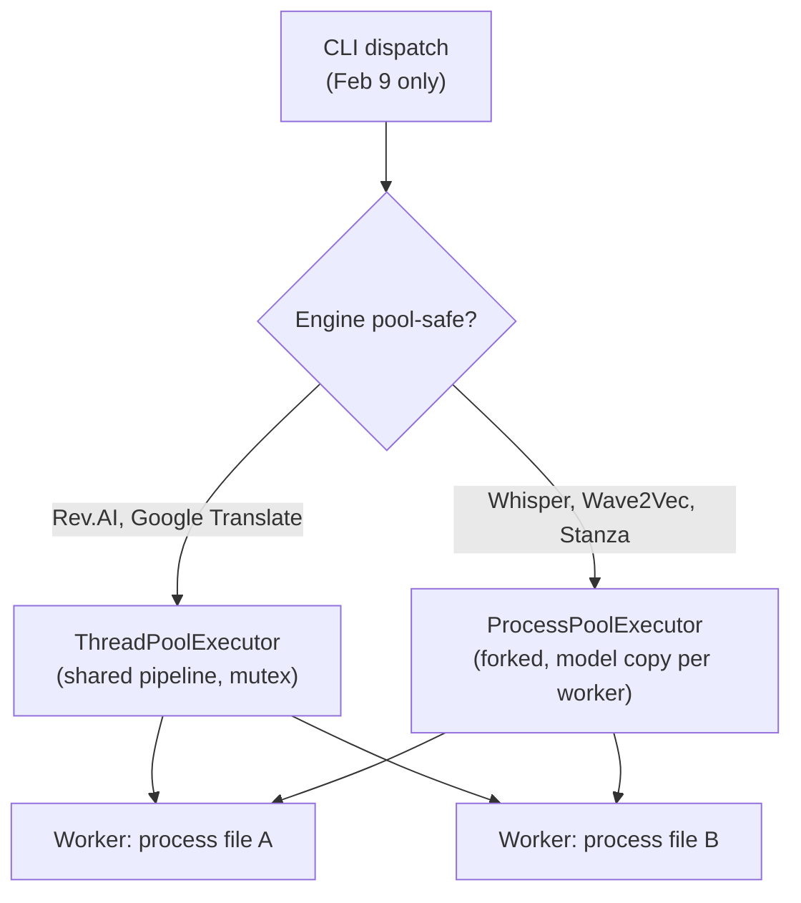
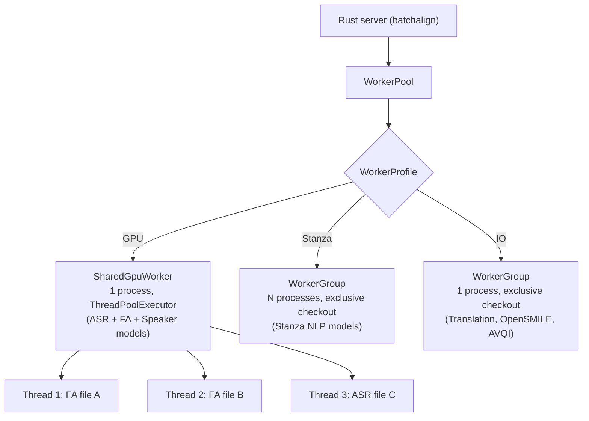

# Developer Architecture Migration (batchalign2 -> batchalign3)

**Status:** Current
**Last updated:** 2026-05-05 13:54 EDT

Comparison anchors for this page:

- `batchalign2-master` `84ad500b09e52a82aca982c41a8ccd46b01f4f2c` for
  core / non-HK behavior
- `BatchalignHK` `84ad500b09e52a82aca982c41a8ccd46b01f4f2c` for HK /
  Cantonese behavior
- later released `batchalign2` master-branch point
  `e8f8bfada6170aa0558a638e5b73bf2c3675fe6d` where needed
- current `batchalign3`

This page excludes transient unreleased migration-branch states.

See also:

- [BA2 Architecture Reference](ba2-architecture-reference.md) for the frozen Jan
  9 baseline architecture
- [BA2 Compare Migration](ba2-compare-migration.md) for the dedicated
  `batchalign2-master compare` to BA3 compare rewrite map
- [Dispatch and Execution](../../architecture/runtime/dispatch.md)
  for the current contributor-facing command architecture (command
  model, planning, recipe-driven execution kernel)

## Comparison discipline for contributors

Contributor-facing parity and regression checks should anchor to the correct
Jan 9 preserved baseline:

- core / non-HK: Jan 9 `batchalign2-master`
- HK / Cantonese: Jan 9 `BatchalignHK`

- The later Feb 9 BA2 point is secondary context only.
- later Python operational installs are deployment references, not migration
  baselines.

Use the repo-local comparison tools accordingly:

- `scripts/stock_batchalign_harness.py` for curated `benchmark` cases
- `scripts/compare_stock_batchalign.py` for raw side-by-side output diffs

Both should be pointed at the historically correct executable explicitly pinned
to `84ad500...`.

- For HK material, that means `batchalignhk`, not stock `batchalign`.
- Preserved Jan 9 legacy runners should keep their native CLI shape:
  `command inputfolder outputfolder`.
- When older legacy `benchmark` runs emit `.asr.cha`/`.wer.txt`/`.diff` rather
  than modern `.compare.csv`, the curated harness should normalize them by
  rescoring the emitted `.asr.cha` through current `batchalign3 compare`.

## 1) Core architecture shift

### batchalign2 mental model

- Python-centric runtime and pipeline composition.
- CHAT parsing/manipulation through ad-hoc string transforms and parallel arrays.
- Every command flattened structured data to strings for engine calls, then
  attempted to reconstruct structure from engine output — an architecturally
  lossy round-trip that produced silent drift whenever tokenizers disagreed.

### current batchalign3 mental model

- Rust-first CHAT core (parser, validator, AST, serializer).
- Python and the Rust control plane integrate via explicit typed contracts.
- identity-preserving data flow (word IDs, utterance/index metadata, spans).
- service-oriented operations (daemon/server/job lifecycle).

The key contributor shift is: **preserve structure, do not reconstruct it later
from flattened strings**.

## 1.1) Durable engineering deltas

The durable contributor-facing changes since the Jan 9 BA2 baseline are:

- data structures moved from Python object/string surgery toward typed Rust AST
  ownership and explicit worker payloads;
- command internals moved away from array-position repair and flatten-then-fix
  workflows toward stable IDs, explicit indices, chunk maps, and AST walks;
- orchestration moved from monolithic local dispatch toward daemon/server/job
  routing with explicit boundaries;
- morphosyntax, FA, and related passes now favor deterministic provenance
  mapping over runtime remap heuristics;
- regression defense is stronger: more golden cases, tighter invariants, and
  explicit policy against reintroducing runtime DP remap paths.

See [comparison states](index.md#comparison-states-and-policy) for the
Jan 9 BA2 → Feb 9 BA2 → BA3 framing. Feb 9 BA2 already gained cache,
dispatch, and morphotag/alignment cleanup; BA3 moves orchestration, typed
contracts, and CHAT ownership into Rust.

## 2) Concurrency and worker model

### batchalign2 model

**Jan 9 baseline (`84ad500b`):** Purely sequential. `dispatch.py` (196 lines)
processes files one at a time in a simple for-loop — no `ProcessPoolExecutor`,
no `ThreadPoolExecutor`, no adaptive workers, no file sorting, no shared-models
mode. The pipeline is created once and called on each file sequentially.

**Feb 9 master (`e8f8bfad`):** Adds full concurrent dispatch (1,044 lines in
`dispatch.py`). Uses Python's `concurrent.futures`:



Key characteristics (Feb 9 only — none of these exist in Jan 9):

- **Pool-safe engines** (Rev.AI, Google Translate): `ThreadPoolExecutor` — one
  pipeline loaded in the main process, threads share models via a mutex.
  Memory-efficient but limited to API-backed or thread-safe engines.
- **Pool-unsafe engines** (Whisper, Wave2Vec, Stanza, Pyannote): `ProcessPoolExecutor`
  — each worker is a forked subprocess with its own model copies. N workers = N×
  model memory.
- **Adaptive worker capping**: monitors RSS peaks and throttles new submissions
  when available memory drops below a reserve (10% of system RAM).
- **File sorting**: largest files dispatched first to prevent straggler effects.
- **No persistent workers**: executors are job-scoped — all workers die after
  each job completes. Next job reloads models from scratch.
- **Optional shared-models mode** (`--shared-models`): uses `fork()` to inherit
  parent's loaded models. Linux-only, disabled on macOS+MPS, crash-prone.

Memory characteristics (from Feb 9 BA2 benchmarks):

| Workload | Per-worker peak | Workers | Total |
|----------|----------------|---------|-------|
| `align` (Whisper+Wave2Vec) | 3.0–4.2 GB | 4 | ~16 GB |
| `morphotag` (Stanza) | 1.1–2.5 GB | 4 | ~10 GB |

### batchalign3 model

batchalign3 uses a Rust control plane with persistent Python worker
subprocesses:



Key differences from BA2:

| Dimension | BA2 | BA3 |
|-----------|-----|-----|
| **Worker lifetime** | Job-scoped (die after each job) | Persistent (idle timeout 10 min) |
| **Model loading** | Fresh per worker per job | Load once at startup, reused |
| **GPU model sharing** | Fork-based (crash-prone) or none | ThreadPoolExecutor inside one process (GIL-release) |
| **CPU parallelism** | ProcessPoolExecutor (N copies) | Stanza profile: N persistent subprocesses, two-level parallelism (cross-language + intra-language chunking) |
| **Concurrency control** | Adaptive RSS monitoring | Auto-tuned + memory gate + per-profile limits |
| **Worker health** | None | Health checks every 30s, auto-restart |
| **Warmup** | None (cold start every job) | Concurrent background warmup at server start |
| **File ordering** | Largest-first sorting | Submission order (largest-first planned) |

Memory comparison (mixed English workload — align + morphotag):

| System | GPU workers | Stanza workers | Total |
|--------|------------|----------------|-------|
| BA2 (4 process workers) | 4 × ~4 GB = ~16 GB | 4 × ~2.5 GB = ~10 GB | ~26 GB |
| BA3 (profiles) | 1 × ~5 GB (shared) | 2 × ~2 GB = ~4 GB | ~9 GB |

The ~3× memory reduction comes from two sources:
1. GPU profile shares ASR, FA, and Speaker models in one process (vs 3 separate)
2. Persistent workers eliminate per-job model reloading overhead

## 3) Codebase crosswalk for contributors

| Legacy concern (BA2) | Current concern (BA3) |
|---|---|
| `batchalign/cli/cli.py` command wiring | Rust CLI argument tree + command router (`crates/batchalign`) |
| local dispatch in `batchalign/cli/dispatch.py` | server + local-daemon dispatch + job APIs (`crates/batchalign`) |
| Python CHAT parser/generator modules | Rust CHAT crates + serializer/validator path in core |
| ad-hoc alignment remap glue | contract-driven UTR/FA handlers with deterministic fallback policies |
| monolithic Python command pipelines | task-local Python inference + Rust orchestration/injection/postprocess |
| provider-specific modifications in forks | in-tree provider modules under `batchalign/inference/`; CHAT-aware orchestration lives in the Rust runtime, not Python |

Baseline anchors used for this crosswalk:

- BA2 CLI commands: `batchalign/cli/cli.py` @ `84ad500`
- BA2 dispatch/runtime bridge: `batchalign/cli/dispatch.py` @ `84ad500`
- BA2 morphosyntax surface: `batchalign/pipelines/morphosyntax/ud.py` @ `84ad500`
- later released BA2 master-branch CLI/dispatch: `batchalign/cli/{cli,dispatch}.py`
  @ `e8f8bfa`
- BA3 Rust CLI args/command tree: `crates/batchalign/src/cli/args/mod.rs`

## 3.1) Data-structure shift: what changed and why it matters

The largest durable implementation change is the move from reconstructive
pipelines to identity-preserving pipelines. This matters more than the
language change from Python to Rust: BA2's correctness failures came from
losing structure and trying to recover it, not from Python being slow.

In BA2, major stages frequently crossed these boundaries:

- parse text into Python objects,
- flatten or normalize text for engine calls,
- run external NLP/ASR,
- rebuild higher-level structure from token strings afterward.

In BA3, the preferred pattern is:

- parse CHAT once into a typed structure,
- extract explicit payloads for inference,
- return typed or schema-constrained results,
- inject back into the original structure without losing provenance.

That change directly explains many correctness improvements in morphotag,
retokenization, timing writeback, and validation.

In practical contributor terms:

- prefer stable identifiers over "find the same token again later",
- prefer explicit index maps over positional guesswork,
- prefer AST iteration over flatten/split/reparse loops,
- prefer narrow deterministic fallback over broad DP recovery on flattened text.

This is not abstract guidance. Current morphotag/alignment code now enforces it
in concrete ways:

- `%gra` construction validates root/head/chunk invariants before writeback,
- special-form handling is explicit (`@c`, `@s`, `xbxxx`) instead of being
  recovered indirectly from placeholder strings,
- whole-utterance same-language all-`@s` is now a validation concern (E255),
  while explicit undeclared `@s:LANG` is warn-only (E254) and still routes to
  the named language,
- retokenization rebuilds AST content directly rather than patching flattened
  string output,
- UTR and FA use explicit IDs/indices where available before any fallback.

## 3.2) Command-by-command orchestration shift

The same principle shows up across the command surface:

- `transcribe`:
  - Jan 9 / Feb 9 BA2: Python owned ASR output processing, retokenization, and
    CHAT construction in one pipeline
  - current BA3:
    Python worker: raw ASR only
    Rust: post-process tokens, assemble CHAT, optionally run `utseg` and
    `morphotag`
- `translate`:
  - Jan 9 / Feb 9 BA2: Python translated utterance text and wrote translation
    tiers through Python-side CHAT generation
  - current BA3:
    Python worker: raw text translation only
    Rust: extract text payloads and inject translated results back into CHAT
- `utseg`:
  - Jan 9 / Feb 9 BA2: Python owned constituency parsing, phrase extraction,
    DP reconciliation, and utterance rebuilding
  - current BA3:
    Python worker: constituency trees
    Rust: assignment computation and CHAT mutation
- `coref`:
  - Jan 9 / Feb 9 BA2: Python already ran document-level coref, detokenized the
    document, and DP-remapped chains back onto forms
  - current BA3:
    Python worker: structured chain data
    Rust: document-level payload collection, sparse `%xcoref` injection, and
    validation
- `compare`:
  - later `batchalign2-master`: Python owned `morphosyntax -> compare ->
    compare_analysis`, projected through the Python `Document` model, and relied
    on string/document regeneration as the projection mechanism
  - current BA3:
    Rust: morphotag main only, keep gold raw, build a `ComparisonBundle` with
    local-window alignment plus structural word matches, and materialize either
    the released main output or an internal AST-first gold projection
- `benchmark`:
  - Jan 9 / Feb 9 BA2: Python command path around ASR + gold transcript + WER
    output files
  - current BA3:
    Rust: typed command options and per-file infer dispatch
    Rust core: WER computation exposed through `batchalign_core`
    Python package: optional convenience wrapper only, not worker infer logic
- `opensmile` / `avqi`:
  - Jan 9 / Feb 9 BA2: Python feature-analysis commands with local library calls
  - current BA3:
    Rust: typed command options and prepared-audio V2 dispatch
    Python worker: pure analysis tasks with structured request/response payloads

This is the durable architectural pattern to preserve:

- inference workers should do inference,
- orchestration and CHAT ownership should stay on the Rust side.

## 3.3) Utility-command control-plane shift

The utility command story also changed in code-meaningful ways:

- `setup`:
  - Jan 9 / Feb 9 BA2: Python Click flow writing `~/.batchalign.ini`
  - current BA3: Rust-owned prompt/validation/write path preserving the same
    compatibility file
- `models`:
  - Jan 9 / Feb 9 BA2: Python command tree directly exposed training runtime
  - current BA3: Rust CLI still delegates to the Python training module; this
    is a control-plane wrapper change, not a training-stack rewrite
- `version`:
  - Jan 9 / Feb 9 BA2: root-command version metadata
  - current BA3: explicit subcommand plus build-hash reporting, useful for
    support and stale-binary diagnosis
- `cache`:
  - Feb 9 BA2 introduced Python cache stats/clear/warm around Python-side cache
    state
  - current BA3 redefines that command around the Rust runtime cache boundary:
    SQLite analysis cache plus media cache inspection/clearing
- `bench`:
  - Feb 9 BA2 introduced a Python repeated-dispatch timing helper
  - current BA3 keeps the same basic purpose but moves dispatch/control into
    Rust typed options and structured benchmark output
- `serve`, `jobs`, `logs`, `openapi`:
  - These are the clearest BA3-only utility additions.
  - They exist because the runtime model itself changed: once jobs, server
    health, logs, and API schema became first-class control-plane concerns, the
    CLI needed explicit ops commands instead of assuming one-shot local runs.

User-facing command/history detail belongs in [user-migration.md](user-migration.md).
This page keeps the developer-facing architectural consequence: the control
plane is now explicit, typed, and operationally observable.

## 4) Concurrency and orchestration differences

Batchalign3 makes concurrency explicit at architecture boundaries:

- command routing to local/remote execution backends,
- queueable jobs with durable status and logs,
- explicit server health, job status, and observable daemon/server boundaries.

Jan 9 BA2 had no concurrency: it processed files sequentially in the main
process, loaded all models fresh each time, and had no mechanism to share state
across runs. Feb 9 BA2 added concurrent dispatch (see Section 2), but workers
were still job-scoped and models were reloaded from scratch per job.
In BA3, contributors should model command execution as staged orchestration
across explicit runtime boundaries.

This requires contributors to design for:

- idempotent work units,
- resumable/observable processing stages,
- strict input/output schema validation between boundaries.

## 4.1) Performance model shift

The durable performance improvement story is architectural:

- repeated one-file/one-process startup is no longer the only execution model;
- the daemon/server path keeps heavyweight engines warm across runs;
- cache misses can be batched across files instead of paying per-file setup
  overhead repeatedly;
- cache ownership and job state are explicit rather than incidental.

This is the kind of performance change that should remain in the migration book.
Short-lived benchmark spikes or temporary regressions should not.

## 5) Data model and API boundary implications

For recent DP-migration work, no additional core CHAT AST augmentation was
required because existing model identity/timing surfaces were sufficient.

Guideline for future work:

- do not enlarge the core AST for editor-only derived views,
- expose sidecar APIs for high-churn UI metadata,
- keep AST focused on durable linguistic source-of-truth structures.

Related rule for migration documentation: explain changes in algorithm choice,
data structures, and public behavior; do not preserve branch-by-branch
implementation churn.

## 6) Testing posture for contributors

Migration-era quality now depends on layered tests:

- golden tests for edge corpora (repeat/retrace/overlap/multilingual),
- no-DP-runtime allowlist tests
  (`batchalign/tests/test_dp_allowlist.py` — Rust PyO3 call sites, chat-ops
  call sites, Python inference zero-DP),
- Stanza configuration parity checks
  (`batchalign/tests/pipelines/morphosyntax/test_stanza_config_parity.py` —
  MWT exclusion parity, Japanese processor parity, English gum package parity).

## 7) Python API migration

### BA2 Python API — all removed

BA2 exposed a rich Python API: `Document`, `CHATFile`, `BatchalignPipeline`,
and 23+ individual engine classes (`WhisperEngine`, `StanzaEngine`, etc.).

**All of these have been removed.** BA3 is CLI-first. The Rust server owns all
CHAT manipulation. There is no Python API for parsing, mutating, or serializing
CHAT files.

**External usage was minimal.** A pre-release audit found that
existing PyPI downloads were essentially all CLI usage; no downstream
packages depended on the Python API, no academic papers referenced
it. Removing the Python surface affects no observed external user.

### BA3 equivalents for each BA2 pattern

**Running pipeline operations:**

```python
# BA2
from batchalign import BatchalignPipeline
nlp = BatchalignPipeline.new("morphosyntax", lang="eng")
result = nlp("input.cha")

# BA3 — CLI is the only entry point
# Note: morphotag has no `--lang`; per-file `@Languages:` headers drive routing.
import subprocess
subprocess.run(["batchalign3", "morphotag", "input/", "-o", "output/"])
```

**Reading CHAT files:** Use standard file I/O. BA3 does not provide a Python
CHAT parser — use the CLI for processing.

**Validation:** Use `batchalign3 validate input/` or the `chatter` TUI.

### Removed surfaces

| Removed | Replacement |
|---------|-------------|
| `batchalign.compat` (`CHATFile`, `Document`, `BatchalignPipeline`) | CLI via `subprocess` |
| `batchalign.pipeline_api` (`run_pipeline`, `LocalProviderInvoker`) | CLI via `subprocess` |
| `batchalign_core.ParsedChat` (parse, serialize, add_*, callbacks) | Rust server handles directly |
| `batchalign.inference.benchmark` (`compute_wer`) | `batchalign3 compare` CLI command |
| Individual engine classes (`WhisperEngine`, `StanzaEngine`, etc.) | CLI commands (`transcribe`, `morphotag`, `align`) |

### What's genuinely lost

**Engine composition** (`BatchalignPipeline.new("asr,morphosyntax,fa")` with
specific engine instances): BA3 uses the CLI command surface. Multi-step
pipelines run as sequential CLI commands.

**Direct AST mutation** (`doc[0][0].text = "modified"`): The CHAT AST is
Rust-owned. Edit CHAT files as text or use the `chatter` TUI.

Neither limitation affects any known external user.

## 8) Onboarding plan for legacy contributors

1. Start with the command/runtime crosswalk plus the current HK engine and
   extension-layer chapters.
2. Pick one existing BA2 customization and re-implement it as either a built-in
   engine module or a CLI extension, not a long-lived source fork.
3. Add/extend golden cases before behavior changes.
4. For alignment/morphology changes, route through core AST/validator contracts
   and keep side effects deterministic and observable.
