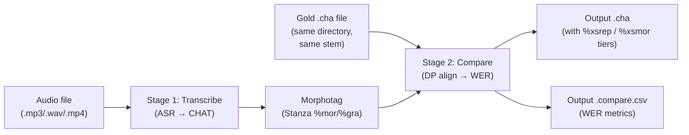

# Benchmarks

**Status:** Current
**Last updated:** 2026-05-20 01:14 EDT

Batchalign provides a `benchmark` command to evaluate ASR accuracy against
gold transcripts. It transcribes each audio file, compares the result
against the corresponding gold `.cha` transcript, and reports word error
rate (WER).

## What is WER?

Word Error Rate measures how many words the ASR system got wrong compared
to a human-verified reference transcript. Lower is better — 0% means
perfect, 100% means every word was wrong or missing.

```text
WER = (insertions + deletions) / total_gold_words
Accuracy = 1.0 − WER  (clamped to [0, 1])
```

Word normalization is applied before comparison: compound splitting
(`airplane` → `air plane`), contraction expansion (`he's` → `he is`),
filler normalization (all fillers → `um`), abbreviation expansion
(`FBI` → `F B I`), and proper name replacement (all names → `name`).
The normalization logic lives in `crates/talkbank-transform/src/wer_conform.rs`.

## Pipeline

`benchmark` is a **two-stage composition**, not a simple diff:



**Stage 1 — Transcribe:** Runs the full ASR pipeline (`process_transcribe()`)
to produce a CHAT transcript from the audio. This includes all standard
ASR post-processing (compound merging, number expansion, disfluency
detection).

**Stage 2 — Compare:** Runs morphosyntax on the transcribed CHAT (to generate
`%mor`/`%gra`), then DP-aligns the transcribed words against the gold
transcript words (Hirschberg case-insensitive alignment). Produces `%xsrep` /
`%xsmor` tiers and CSV metrics.

## Gold File Discovery

For each audio file, benchmark looks for a `.cha` file with the **same
basename in the same directory**:

| Audio file | Expected gold file |
|---|---|
| `interview.wav` | `interview.cha` |
| `sample.mp3` | `sample.cha` |
| `/data/recording.mp4` | `/data/recording.cha` |

**Important:** Benchmark resolves symlinks before looking for the gold file.
If you symlink `audio.mp3` → `/real/path/audio.mp3`, benchmark will look for
`/real/path/audio.cha`, not the symlink's directory. **Copy audio files**
into the working directory rather than symlinking them.

If no gold file is found, the file is skipped with an `InputMissing` error.

## Input Requirements

The gold `.cha` file must be parseable by batchalign3's tree-sitter grammar.
Files with parse errors (tree-sitter ERROR nodes) will fail at the
morphotag pre-validation gate with:

```text
morphotag pre-validation failed: [L0] File has N parse error(s); input may be malformed
```

Note that `chatter validate` (from talkbank-tools) and batchalign3 use the
same tree-sitter grammar, but batchalign3's pre-validation is stricter —
it rejects files with **any** parse errors at L0, whereas `chatter validate`
may report these as warnings.

## Example

```bash
batchalign3 benchmark ~/ba_data/input -o ~/ba_data/output --lang eng
```

## Options

| Option | Meaning |
| --- | --- |
| `--asr-engine {rev,whisper,whisper-oai}` | ASR engine (default: rev) |
| `--asr-engine-custom NAME` | Explicit custom ASR engine name |
| `--lang CODE` | 3-letter ISO language code (default: `eng`) |
| `-n`, `--num-speakers N` | Number of speakers (default: `2`) |
| `--wor` / `--nowor` | Toggle `%wor` tier output |
| `--merge-abbrev` | Merge abbreviations in output |
| `--bank NAME` | Legacy remote media selector (unsupported in the current CLI; pass filesystem paths instead) |
| `--subdir PATH` | Legacy remote media selector subdirectory (unsupported in the current CLI) |

## Output

Two files are produced per input audio file:

### 1. Hypothesis CHAT file (`{stem}.cha`)

A full CHAT transcript with ASR results plus `%xsrep` / `%xsmor` comparison
tiers. Each utterance gets a `%xsrep` dependent tier showing the word
alignment and a matching `%xsmor` tier showing the POS alignment:

```text
*PAR:   hello big world today .
%xsrep: hello [+ main]big world [- gold]today .
%xsmor: INTJ  +ADJ      NOUN  -?            PUNCT
```

- Unmarked words = match (in both hypothesis and gold)
- `[+ main]` = insertion (in hypothesis but not gold)
- `[- gold]` = deletion (in gold but not hypothesis)

### 2. Metrics CSV file (`{stem}.compare.csv`)

```csv
metric,value
wer,0.2500
accuracy,0.7500
matches,3
insertions,1
deletions,0
total_gold_words,3
total_main_words,4
```

**WER is NOT printed to stdout.** The CLI shows only success/failure per file.
To extract WER programmatically, read the `.compare.csv` from the output
directory.

## Language Considerations

The `--lang` flag affects ASR engine behavior:

- **Rev.AI:** ISO 639-3 codes are translated to Rev.AI codes. Some languages
  (e.g., Hakka `hak`) are not supported by Rev.AI — see
  [Language Code Resolution](language-code-resolution.md) for the mapping table.
- **Whisper:** Uses `pycountry` to resolve language names. Unknown codes
  raise `ValueError`.
- Benchmark does **not** run utterance segmentation or forced alignment — it
  only transcribes and compares.

## Implementation Details

| Component | File | Key function |
|---|---|---|
| Orchestrator | `crates/batchalign/src/benchmark.rs` | `process_benchmark()` (line 44) |
| Per-file dispatcher | `crates/batchalign/src/runner/dispatch/benchmark_pipeline.rs` | `process_one_benchmark_file()` (line 185) |
| Gold file resolution | `crates/batchalign/src/benchmark.rs` | `gold_chat_path_for_audio()` (line 72) |
| WER computation | `crates/talkbank-transform/src/compare/engine.rs` | `compare()` (line 173) |
| Word normalization | `crates/talkbank-transform/src/wer_conform.rs` | `conform_words()` (line 96) |
| CSV output | `crates/talkbank-transform/src/compare/metrics.rs` | `format_metrics_csv()` (line 284) |
| %xsrep / %xsmor injection | `crates/talkbank-transform/src/compare/materialize.rs` | `inject_comparison()` (line 266) |

## See also

- [Command I/O Parity](command-io.md) — section 9 for full benchmark dispatch details
- [CLI Reference](../user-guide/cli-reference.md) — benchmark entry in the CLI docs
- [Language Code Resolution](language-code-resolution.md) — how `--lang` maps to engine codes
