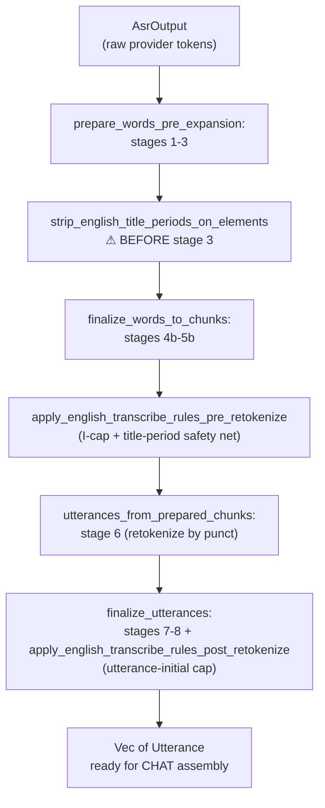

# English Transcribe Corrections

**Status:** Current
**Last updated:** 2026-05-01 09:47 EDT

BA3 applies three orthographic corrections to English ASR output
before CHAT assembly. Each rule ships silent-mutation (no
`[: replacement]` annotation, per the provenance-policy resolution)
and is gated to `lang == "eng"` so other languages are untouched.

## The three rules

### 1. I-cap

Bare English pronoun `i` and its contractions are rewritten to
uppercase `I`:

| Input | Output |
|-------|--------|
| `i` | `I` |
| `i'll` | `I'll` |
| `i'm` | `I'm` |
| `i've` | `I've` |
| `i'd` | `I'd` |

Implementation: `crates/batchalign-transform/src/asr_postprocess/cleanup.rs::EN_I_CAP_REWRITES`.
Idempotent (already-capitalized `I` passes through unchanged).

**Probe-verdict lock**: `batchalign/tests/investigations/_decision_cases/english.py::_PRONOUN_I_CASES`
(POST_NEUTRAL × 2) and `_I_CONTRACTION_CASES` (POST_NEUTRAL × 3).
Stanza's POS tagging is case-invariant for these surfaces, the
rewrite is orthographic policy, not morphotag improvement.

### 2. Title-period strip

Trailing period(s) on a closed allowlist of English abbreviation
surfaces are stripped:

| Family | Surfaces |
|--------|----------|
| Title | `Dr.`, `Mr.`, `Mrs.`, `Prof.` |
| Place | `St.`, `Mt.`, `Ave.` |
| Time | `a.m.`, `p.m.` |
| Initialism | `U.S.`, `J.F.K.` |
| Degree | `Ph.D.`, `M.D.` |
| Technical | `etc.`, `e.g.`, `i.e.` |

Implementation: `crates/batchalign-transform/src/asr_postprocess/cleanup.rs::EN_TITLE_PERIOD_SURFACES`.
Matching is case-insensitive; the non-period characters preserve
their original casing (`DR.` → `DR`, `dr.` → `dr`, `Mr.` → `Mr`).

**Probe-verdict lock**: six CandidateClass families in
`_decision_cases/english.py`: `_TITLE_CASES`, `_PLACE_CASES`,
`_TIME_CASES`, `_INITIALISM_CASES`, `_DEGREE_CASES`,
`_TECHNICAL_CASES`. All locked POST_NEUTRAL except Q-B-adjudicated
`etc.`/`eg`/`ie`/`M.D.` which are POST_NEUTRAL per the Q-B
Stanza-POS-over-UD-EWT adjudication.

**Closed-set design**: the allowlist explicitly excludes
DECIMAL_CONTROL (`3.14`, `2.50`) and SENTENCE_PERIOD (utterance-
final `.`) cases, which are locked POST_STRICTLY_WORSE in the
probe matrix, those would corrupt the output if the rule fired.

**Pipeline hook position (critical)**: the period-strip fires
early in `prepare_words_pre_expansion`, before
`split_multiword_tokens` (stage 3). Stage 3's
`normalized_split_separator` treats `.` as a word separator and
would slice `Dr.` into `Dr` + `.` before the allowlist could
match. Stripping on the raw `AsrElement` text keeps `Dr` as a
single token through every subsequent stage.

### 3. Utterance-initial cap

The first non-retrace, non-marker, non-empty word of every
English utterance has its initial letter uppercased:

| Input utterance | Output utterance |
|-----------------|------------------|
| `hello world .` | `Hello world .` |
| `xxx said something .` | `xxx Said something .` |
| `&-um &+go &~uh hello .` | `&-um &+go &~uh Hello .` |
| `a [/] a [/] a .` | `a [/] a [/] A .` (retrace chain) |

Implementation: `crates/batchalign-transform/src/asr_postprocess/cleanup.rs::apply_utterance_initial_capitalization`.

**Exclusions** (walked past to find the first "real" word):

- Untranscribed markers: `xxx`, `yyy`, `www`.
- `&`-prefixed tokens: fillers (`&-um`), fragments (`&+go`),
  nonwords (`&~uh`).
- Retrace copies (`WordKind::Retrace`), the "real" word is at
  the end of the retrace chain, so the initial cap lands on it
  rather than on a false-start repetition.
- Empty strings and pure-punctuation tokens.

Idempotent (already-capitalized first words pass through).

**Probe-verdict lock**: `_UTTERANCE_INITIAL_CASES` (POST_NEUTRAL × 3)
, `hello`, `the`, `what` all show case-invariant Stanza POS.

## Pipeline integration

The position of each hook is deliberate:

1. **Title-period strip on elements** (before stage 3), stage 3
   splits on `.` and would fragment `Dr.`. Must run first.
2. **I-cap on words** (in `finalize_words_to_chunks`), runs
   after number expansion and before retokenize. Per-word
   rewrite.
3. **Utterance-initial cap** (in `finalize_utterances`), runs
   after utterances are formed and after retrace detection, so
   it can skip retrace copies to find the "real" first word.

## Non-English languages

All three rules return immediately for `lang != "eng"`. The
language gate is tested explicitly in
`apply_english_transcribe_rules_skip_other_languages`: an Italian
fixture `ho visto i bambini .` passes through untouched (Italian
`i` is the plural masculine article, which must NOT be uppercased
by the English rule).

## Tests

- **Unit tests** in `crates/batchalign-transform/src/asr_postprocess/cleanup.rs::tests`
  cover each rule's contract and combined-rule interactions.
- **Pipeline integration tests** in the same module
  (`period_strip_prevents_retokenize_mid_utterance_split`,
  `combined_rules_fire_per_utterance`) verify the per-stage hook
  positions.
- **End-to-end transcribe tests** in
  `crates/batchalign-transform/src/build_chat/tests.rs`
  (`english_transcribe_rules_fire_end_to_end`,
  `english_transcribe_rules_skip_other_languages`) exercise the
  full in-process pipeline from `AsrOutput` through `build_chat`.

## Cross-references

- `_decision_cases/english.py`: probe-verdict locks authorizing
  each rule.
- `reference/retokenization-overview.md`: how the three rules
  interact with the two "retokenization" meanings (ASR-stream
  retokenize at stage 6 vs morphosyntax retokenize at morphotag
  time).
