# Forced Alignment Design

**Status:** Current
**Last updated:** 2026-06-15 13:21 EDT

## Overview

The `align` command adds word-level timestamps to CHAT files. Given a transcript
and an audio file, it determines exactly where each word appears in the recording.

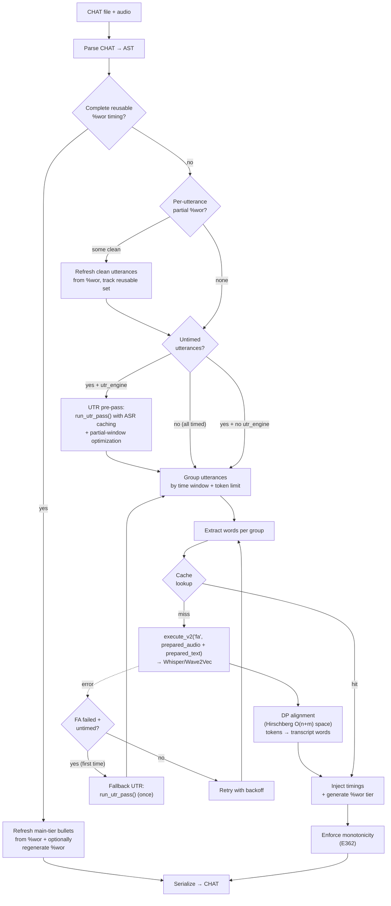

## Prerequisites

Before alignment can begin, two steps must succeed:

1. **Media resolution**: The server locates the audio file for the CHAT
   file from server-visible local paths, either alongside it (paths mode),
   through a shared `source_dir`, via local `media_mappings`, or via an
   explicit `--media-dir`. See
   [Media Conversion](media-conversion.md#media-resolution).
2. **Media conversion**: If the audio is in a container format that
   `soundfile` cannot read (MP4, M4A, WebM, WMA), it is automatically
   converted to 16 kHz mono WAV via ffmpeg and cached at
   `~/.batchalign3/media_cache/`. See [ensure_wav](media-conversion.md#ensure_wav--conversion-cache).

Both steps happen in the Rust server before any Python worker is invoked.

## Execution flow and ownership

The most important architectural fact is that **direct mode and explicit server
mode share the same FA pipeline**.

- Without `--server`, the CLI runs `align` through `DirectHost`. No HTTP server
  or daemon is spawned for that path.
- With `--server`, `align` submits a shared-filesystem `paths_mode` job. The
  execution host must be able to read the submitted source path, resolve media
  from that host's local filesystem view, and write the requested output path.

Both routes end up in `process_one_fa_file()` in
`crates/batchalign/src/runner/dispatch/fa_pipeline.rs`.

### Single-parse architecture

The CHAT file is parsed **once** into a `ChatFile` AST. UTR mutates the AST in
place (no serialization). FA receives the same AST directly via
`run_fa_from_ast()` (no re-parse). The file is serialized **once** at the end.

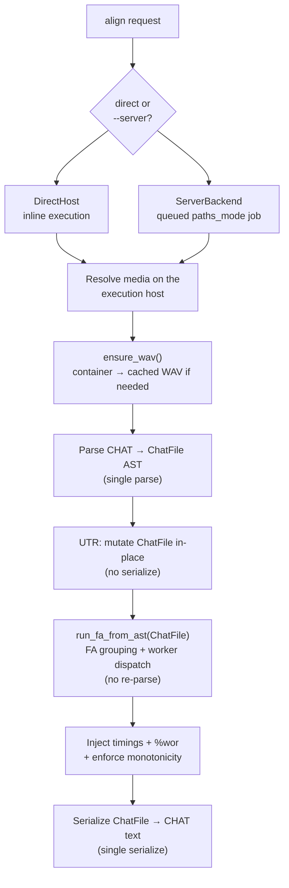

**Key functions:**
- `run_utr_pass(&mut ChatFile, ...)`: mutates AST, returns `UtrResult`
- `run_fa_from_ast(ChatFile, ...)`: accepts AST directly, returns `FaResult`
- `process_fa(&str, ...)`: parse-then-delegate wrapper for callers that only have text (transcribe, incremental)

## Pipeline: UTR then FA

Alignment runs as a two-step pipeline:

1. **UTR (Utterance Timing Recovery)**: Assigns utterance-level timing boundaries.
2. **FA (Forced Alignment)**: Assigns word-level timing within those boundaries.

### Step 0: Cheap reuse for already word-timed files

Before UTR or FA grouping, `align` now checks whether the parsed file already
contains a complete reusable `%wor` tier. This is the cheapest safe rerun path
for files that have already been aligned once and are being passed through
`align` again.

The important detail is that this check is **not** based only on
`main`-tier `Word.inline_bullet`. After a CHAT parse roundtrip, main-tier word
timing may be represented as `InternalBullet` tokens while `%wor` carries the
durable first-class timing bullets. The server therefore:

1. verifies that every alignable main-tier word has a clean main↔`%wor`
   positional mapping,
2. verifies that every mapped `%wor` word has a timing bullet,
3. copies those timings back onto main-tier words,
4. removes parsed `InternalBullet` tokens, and
5. refreshes utterance bullets and optionally regenerates `%wor`.

If that verifier succeeds, `align` skips FA entirely for the file.

When the whole-file check fails, a per-utterance check
(`find_reusable_utterance_indices`) identifies which utterances still have
clean `%wor`. Those are refreshed in place; the rest proceed through normal
FA grouping. During the group partition step, groups where **all** utterances
are in the reusable set have their timings collected directly from the
refreshed main tier (no cache lookup or worker call needed).

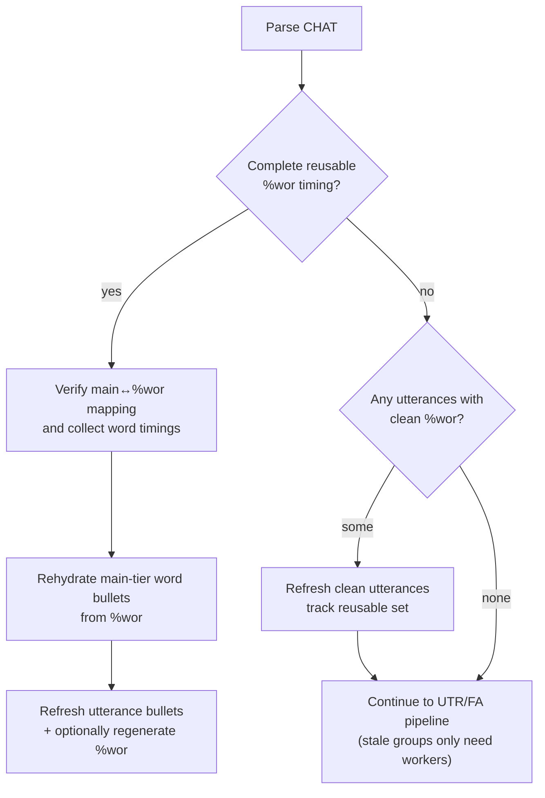

### Step 1: UTR (detect-and-skip)

UTR mutates the `ChatFile` AST **in place** via `run_utr_pass(&mut ChatFile, ...)`.
No serialization occurs, the same AST flows directly to FA. The orchestration
lives in `crates/batchalign/src/runner/dispatch/utr.rs`; the core injection
algorithm lives in `crates/batchalign/src/chat_ops/fa/utr.rs`.

**Detection:** `count_utterance_timing()` counts timed vs untimed utterances.
If all utterances are timed, UTR is skipped entirely (the common case for
production CHAT files from CLAN).

**Recovery:** When untimed utterances exist and a UTR engine is configured
(`--utr`, the default), the `run_utr_pass()` helper:

1. Checks the **ASR cache** for a prior result (key includes audio identity + lang).
   On hit, skips inference entirely, repeat runs are instant.
2. Chooses **partial-window** or **full-file** mode:
   - **Partial-window** (when >50% timed and audio >60s): `find_untimed_windows()`
     identifies time regions covering only the untimed utterances (with 500ms
     padding). Each window is extracted via `extract_audio_segment()` (ffmpeg
     `-ss`/`-to` → cached WAV) and ASR runs only on those segments. Token
     timestamps are offset by the window start time. Each segment's result is
     cached independently.
   - **Full-file** (mostly-untimed or short audio): ASR runs on the full audio
     and the result is cached as a single entry.
3. Converts ASR response tokens to `AsrTimingToken` (text + start_ms + end_ms).
4. Calls `inject_utr_timing()`. That function first tries a cheap exact
   monotonic subsequence match for the whole document word list against the ASR
   word list. If that match is unique, timing assignment is linear-time and no
   DP is needed. If the match is missing or ambiguous, UTR falls back to a
   **single global Hirschberg DP alignment** of all document words (timed +
   untimed) against all ASR tokens, using **fuzzy matching** (Jaro-Winkler
   similarity at threshold 0.85 by default) to tolerate ASR substitutions
   like "gonna"/"gona" and "mhm"/"mmhm". Timed utterances participate in
   the alignment to anchor their neighbors but their bullets are left
   unchanged. For each untimed utterance, the min/max matched ASR token
   indices determine the utterance bullet's time span. The global alignment
   avoids the token-exhaustion problem that per-utterance windowed approaches
   suffer from. It is still a monotonic aligner, so dense overlap /
   text-audio reordering remains a known limitation.

   **Configurable via:** `--utr-fuzzy <threshold>` (default 0.85; set to 1.0
   for exact-only matching).
5. Re-serializes the CHAT with recovered bullets.

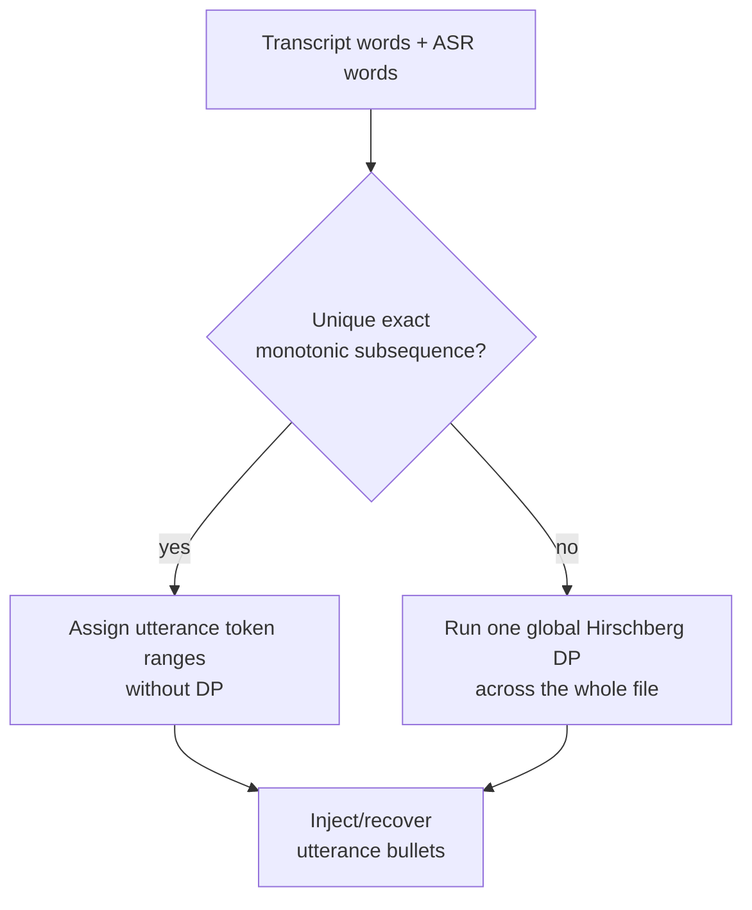

#### Overlap Strategy Selection

When a CHAT file contains overlapping speech (`+<` linkers or `⌊` CA markers),
the standard global UTR alignment degrades because the monotonic matcher cannot
represent the temporal crossing of overlapping speakers.

**Current default:** `auto` always uses `GlobalUtr`. The experimental
two-pass strategy is available via `--utr-strategy two-pass` but is not
production-ready, it has not been validated on enough corpora and can
regress alignment on real files.

The two strategies are:

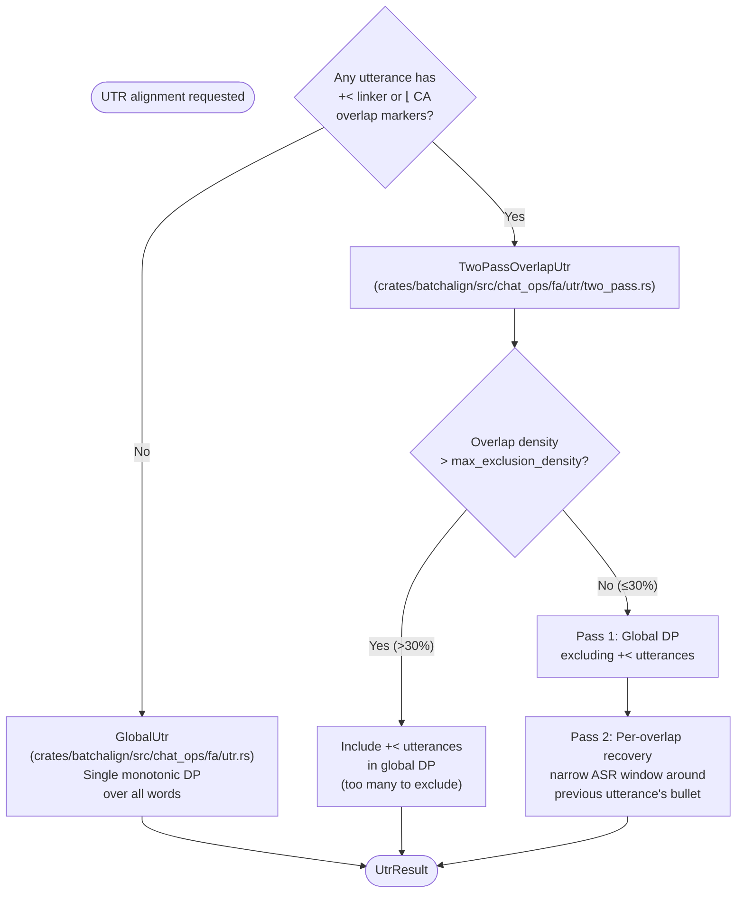

**Strategy selection** (`select_strategy()` in `crates/batchalign/src/chat_ops/fa/utr.rs`):

| Strategy | When selected | Behavior |
|----------|--------------|----------|
| `GlobalUtr` | No `+<` or `⌊` markers in file | Single monotonic DP over all words (original algorithm) |
| `TwoPassOverlapUtr` | Any utterance has `+<` or `⌊` | Pass 1 excludes overlap utterances from global DP; Pass 2 recovers their timing from a narrow ASR window around the previous utterance |

The two-pass approach prevents overlap utterances from desynchronizing the
global alignment. Pass 2 uses CA markers (`⌈⌉⌊⌋`) when present to narrow the
search window further (±`tight_buffer_ms` around the CA onset position).

When overlap density exceeds `max_exclusion_density` (default 30%), excluding
overlaps would starve the global DP of context, so all utterances are included
in a single pass instead.

**CLI flags for overlap control:**

| Flag | Default | Effect |
|------|---------|--------|
| `--utr-strategy auto\|global\|two-pass` | `auto` | Override automatic strategy selection |
| `--utr-ca-markers enabled\|disabled` | `enabled` | Whether Pass 2 uses CA markers for window narrowing |
| `--utr-density-threshold <0.0-1.0>` | `0.30` | Overlap fraction above which two-pass falls back to global |
| `--utr-tight-buffer <ms>` | `500` | Buffer around previous utterance for Pass 2 recovery window |
| `--utr-fuzzy <threshold>` | `0.85` | Jaro-Winkler similarity threshold for fuzzy word matching |

The two-pass defaults were tuned on SBCSAE, Jefferson NB, TaiwanHakka, and
APROCSA corpora but have not been broadly validated. Use `--utr-strategy
two-pass` to opt in for experimentation.

#### %wor Suppression for CA Transcripts

When `@Options: CA` is set, `align` automatically suppresses `%wor` tier
generation. Conversation Analysis transcripts use prosodic notation
(`⌈⌉⌊⌋`, arrows, lengthening marks) that `%wor` cannot represent, so
generating it adds noise that CA researchers must manually remove. The
`--nowor` flag achieves the same effect for non-CA files.

#### End-Time Overlap Clamping

After alignment, `enforce_monotonicity()` clamps utterance end times so
that utterance N's end never exceeds utterance N+1's start. Without this,
UTR's independent per-utterance token range assignment produces systematic
~1000ms overlaps where adjacent utterances claim overlapping ASR token
ranges from the global DP alignment.

Source: strategy selection in `crates/batchalign/src/chat_ops/fa/utr.rs`,
two-pass config and algorithm in `crates/batchalign/src/chat_ops/fa/utr/two_pass.rs`.

**Current debugging hook:** When `$BATCHALIGN_DEBUG_DIR` is set, UTR writes the
pre-injection CHAT and the ASR timing tokens that fed `inject_utr_timing()`.
That is enough to reproduce token-starvation failures offline. It is not yet a
full stage-by-stage trace: normalized word lists, DP match pairs, unmatched
utterance reports, interpolation windows, and post-monotonicity stripping still
need richer tracing support.

**Fallback UTR:** When the initial UTR pre-pass fails (ASR error) or is skipped
(`--no-utr`) and FA subsequently fails with a retryable error, the retry handler
attempts UTR once before the next retry. This recovers files where bad
interpolated timing caused FA failure. The `utr_fallback_attempted` flag ensures
at most one extra ASR call across all retries.

**No engine fallback:** When no UTR engine is configured (`--no-utr`), untimed
utterances fall back to proportional interpolation (see
[Proportional FA Estimation](../../architecture/alignment/proportional-fa-estimation.md)).

UTR injects **utterance-level bullets only**: it does not set word-level
timing. FA handles word-level alignment after UTR provides the boundaries.

### Step 2: FA

FA takes the utterance boundaries (from UTR or from the original CHAT) and
groups them into segments. For each segment, it extracts the corresponding audio
chunk and runs the FA model (Whisper cross-attention DTW or Wave2Vec CTC
alignment) to get precise word-level timestamps.

The FA model returns timestamps **relative to the chunk start** (0-based). These
must be converted to absolute timestamps by adding the group's `audio_start_ms`
offset before injection into the AST.

#### FA grouping strategy

Groups are formed by `group_utterances()` (at
`crates/batchalign/src/chat_ops/fa/grouping.rs:42`). Each group maps
to one FA worker call.
Grouping is driven by two independent constraints, a group is flushed and a new
one started when either is exceeded:

| Constraint | Default | Rationale |
|------------|---------|-----------|
| **Time window** (`max_group_ms`) | 20 000 ms | Caps audio segment length sent to the FA worker. Larger windows give the model more context but increase latency and memory. |
| **Character-token limit** (`WHISPER_FA_MAX_LABEL_TOKENS = 448`) | 448 chars | Whisper's CTC forced-alignment backend (`ctc_loss` / `ctc_best_path`) counts each character of each word as one label token. The maximum allowed sequence length is exactly 448. Exceeding it produces a hard `ValueError: Labels' sequence length N cannot exceed the maximum allowed length of 448 tokens`. |

The char-token limit exists because the time window alone is insufficient. Dense
speech (fast talkers, long-word languages like Spanish) can accumulate hundreds
of words, and thus thousands of characters, inside a normal 20-second window.
The first time this was observed in production was on the `biling-data` corpus
(`DiazCollazos/09.cha`, Spanish), where group 0 carried 2043 chars in 10.97
seconds, and `DiazCollazos/01.cha` group 14 carried 2523 chars in 14.56 seconds.
Both crashed Whisper FA.

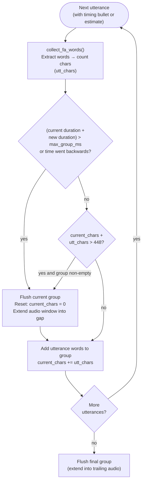

**Edge case, single utterance exceeds 448 chars:** If one utterance alone
exceeds the limit, the flush guard is skipped (`!current_words.is_empty()` is
false) and the utterance is included in its own group regardless. The worker
will fail for that group, but the error is scoped to that group alone. The
alternative, silently dropping the utterance, would corrupt injection by
skewing the word-cursor alignment for every subsequent group.

**Character count vs. actual tokens:** The 448-char limit is a conservative
proxy. Whisper's CTC vocabulary has some multi-byte characters and some
characters that map to the CTC blank token (contributing a wildcard instead of
themselves). In practice, the character count is a safe upper bound: the actual
label sequence is never longer than the sum of word character lengths.

**Implementation note, why the word count is computed before the split
decision:** The split must know the new utterance's char count before deciding
whether to flush, so `collect_fa_words()` is called at the top of the loop
(before the flush check) and the words are held in `extracted` until after the
flush decision. This avoids calling `collect_fa_words()` twice.

Source: `crates/batchalign/src/chat_ops/fa/grouping.rs`,
constant `WHISPER_FA_MAX_LABEL_TOKENS` (line 15).

### Failure points, recovery, and what the user sees

`align` has two distinct error scopes: **group-level** failures (affect one audio
window; other groups continue) and **file-level** failures (abort the whole
file).  The diagrams below show every fallback path.

#### Full fallback map

The outermost loop is the file-level retry loop in
`fa_pipeline.rs:process_one_fa_file()`.  The inner loop is the per-group
dispatch in `fa/transport.rs:infer_groups_v2()`.  These two loops share one
entry arrow in the diagram: `run_fa_from_ast()` / `process_fa_incremental()`.

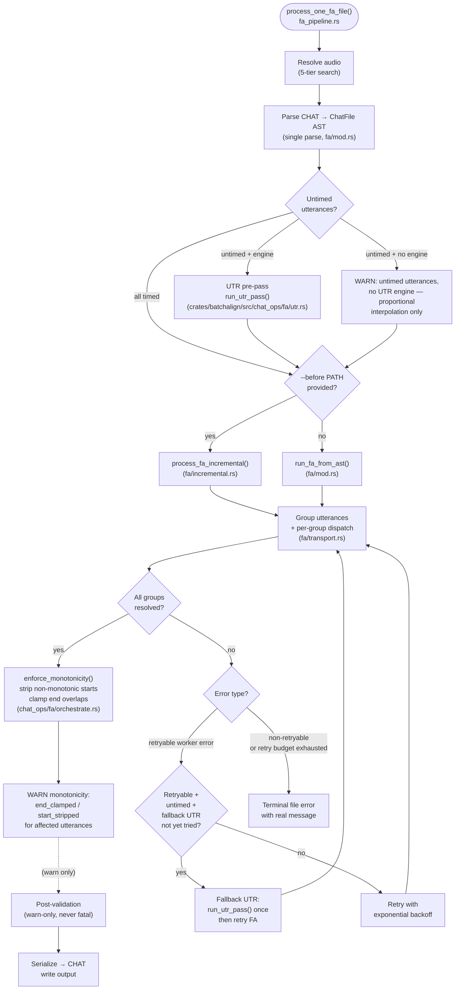

> Source files: `crates/batchalign/src/runner/dispatch/fa_pipeline.rs`,
> `crates/batchalign/src/fa/mod.rs`, `crates/batchalign/src/fa/transport.rs`,
> `crates/batchalign/src/chat_ops/fa/orchestrate.rs` (enforce_monotonicity, strip_e704_same_speaker_overlaps)

#### Per-group fallback detail

Each FA group goes through its own dispatch in `infer_groups_v2()`.
Group-level failures either resolve silently (leaving words unaligned) or
propagate upward as a file-level failure.

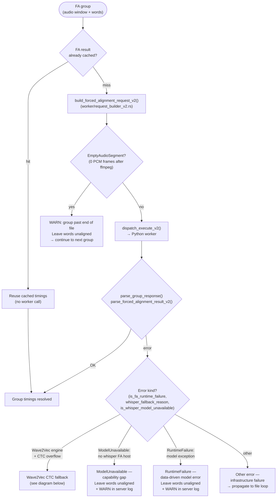

#### Wave2Vec → Whisper CTC fallback

When the FA engine is Wave2Vec and the worker returns one of three specific
PyTorch CTC errors, `infer_groups_v2` retries **that single group** with Whisper
FA.  No other error triggers this retry.

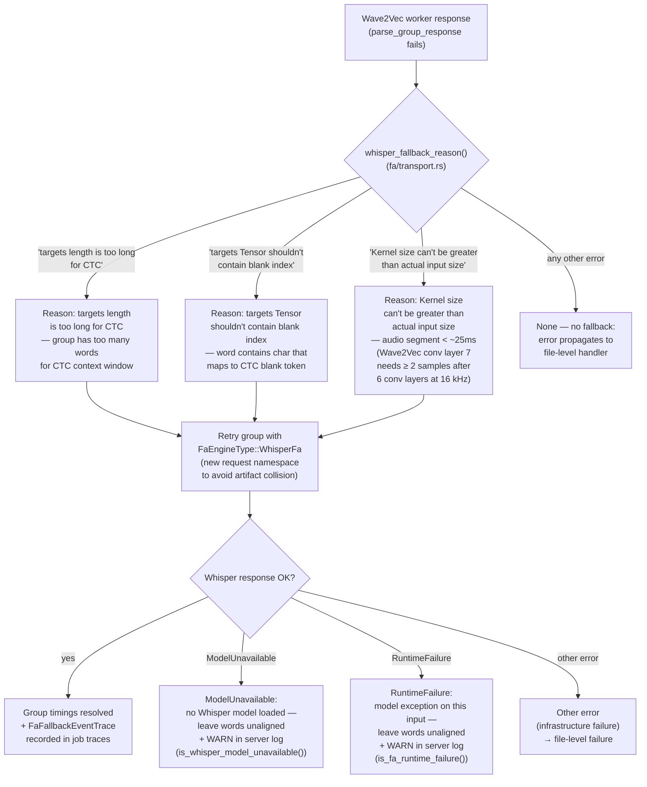

The `WARN` log line for a successful fallback:

```text
WARN fa_transport: Wave2Vec FA hit recoverable target constraint; retrying group with Whisper FA
     group=24 start_ms=379515 end_ms=381395 reason="targets length is too long for CTC"
```

A successful fallback appends a `FaFallbackEventTrace` to the job's trace
payload.  Inspect it with:

```bash
curl http://127.0.0.1:8001/jobs/JOB_ID/traces | python3 -m json.tool
```

#### Whisper fallback when worker has no Whisper model

The Python worker loads **exactly one** FA model at startup, controlled by
`engine_overrides["fa"]` in the worker bootstrap.  When Wave2Vec is the primary
engine, `whisper_fa_model` in `_WorkerState` is `None`.  If Wave2Vec hits a CTC
overflow and `infer_groups_v2` dispatches the Whisper fallback, the worker
returns `ExecuteOutcomeV2::Error { code: ModelUnavailable }`.

`is_whisper_model_unavailable()` in `crates/batchalign/src/fa/transport.rs`
detects the distinctive `"ModelUnavailable: no whisper FA host loaded"` substring
and treats this as a **worker capability gap**, not a data error.  The group's
words are left unaligned (same treatment as an empty audio segment) and the
server logs:

```text
WARN fa_transport: Whisper FA unavailable (worker has no Whisper model loaded);
     leaving group words unaligned
     group=24 start_ms=379515 end_ms=381395
```

The file is written with all other groups aligned normally.

To diagnose whether a worker has Whisper loaded, check the `health` endpoint:
if `loaded_pipelines` contains only `profile:gpu:eng`, Whisper FA is not
available and CTC-overflow groups will be left unaligned.

When Wave2Vec is the primary engine and CTC overflow occurs, the affected
utterances lose word-level timing.  Use the default Whisper FA engine
(`--fa-engine whisper` or omit `--fa-engine`) to avoid this entirely.

#### RuntimeFailure errors are always group-local

Any `RuntimeFailure` from the FA worker, regardless of the specific Python
exception, is treated as a group-level skip. This is an architectural
invariant, not a special case for known patterns.

**Why:** A `RuntimeFailure` means the Python worker successfully received and
parsed the request, then the model raised an exception while processing
*this group's specific words and audio*. The failure is data-driven. Other
groups have different content; they will not trigger the same exception. There
is no value in aborting the file, the remaining groups can and should be
aligned normally.

**Contrast:** Infrastructure failures (`ProcessExited` = worker crash,
`Protocol` = IPC deserialization failure) indicate that the worker or channel
is broken. Every subsequent call would also fail. Those errors remain
file-level so the retry loop and fallback UTR path can attempt recovery.

**Detection:** `is_fa_runtime_failure()` in `transport.rs` matches any
`ServerError::Validation` message containing `"RuntimeFailure:"`. This
substring is inserted by `parse_forced_alignment_result_v2()` when formatting
a `ProtocolErrorCodeV2::RuntimeFailure` response. It does not appear in
`ModelUnavailable`, `Protocol`, or IPC parse errors.

**Ordering in `infer_groups_v2()`:**

1. `whisper_fallback_reason()` is checked first, Wave2Vec CTC patterns still
   trigger the Whisper retry (which may produce timings). `is_fa_runtime_failure`
   is only reached when the fallback logic has already decided no retry is
   possible.
2. `is_whisper_model_unavailable()` is checked before `is_fa_runtime_failure`
   in the Whisper fallback path, the capability-gap path emits a more specific
   warning message.

**Log lines:**
```text
WARN fa_transport: FA group failed with model RuntimeFailure (data-driven);
     leaving words unaligned
     group=0 start_ms=0 end_ms=10970 error="..."

WARN fa_transport: Whisper FA fallback also failed with model RuntimeFailure;
     leaving group words unaligned
     group=7 start_ms=100000 end_ms=111000 error="..."
```

#### Summary: all recovery behaviors for a single group

| Condition | Scope | Outcome | Log |
|-----------|-------|---------|-----|
| FA cache hit | Group | Reuse cached timings silently | — |
| Audio segment past EOF | Group | Leave words unaligned; continue | `WARN: group past end of file` |
| Wave2Vec CTC target overflow (3 patterns) | Group | Retry with Whisper; record fallback trace | `WARN: retrying group with Whisper FA` |
| Whisper retry succeeds | Group | Group timings resolved | — |
| Whisper retry: `ModelUnavailable` (worker has no Whisper model) | Group | Leave words unaligned; continue | `WARN: Whisper FA unavailable … leaving group words unaligned` |
| Worker `RuntimeFailure` (any model exception: token overflow, shape error, OOM, etc.) | Group | Leave words unaligned; continue, `is_fa_runtime_failure()` demotes to group-level | `WARN: FA group failed with model RuntimeFailure` |
| Whisper fallback also hits `RuntimeFailure` | Group | Leave words unaligned; continue | `WARN: Whisper FA fallback also failed with model RuntimeFailure` |
| Other worker error (retryable) | File | Retry with backoff; fallback UTR if untimed | `WARN: FA error (raw)` |
| Retry budget exhausted | File | Terminal failure with real error message | — |

#### Monotonicity warnings

After all groups are resolved, `enforce_monotonicity()` makes two passes over
the utterance list.  Each stripping or clamping decision is always recorded
and emits a `WARN` log line; whether it *also* lands as a `%xalign` decision
tier in the output CHAT depends on the run's review level, which defaults to
`none` (no tiers written; see
[Review Tiers](../user-guide/review-tiers-guide.md)). The `%xrev` column
below applies when review tiers are enabled (`--review-level low-confidence`
or `all`). The two decision types have **different severity and different
`%xrev` behavior**:

| Decision | Cause | `%xrev` written? | Action needed? |
|----------|-------|:---:|---|
| `end_clamped` | Utterance N's end overlapped N+1's start by a few ms, trimmed to avoid CLAN player seek regression | **No** | No, routine housekeeping, BA2 made these silently |
| `start_stripped` | Utterance start precedes previous accepted start, full timing removed | **Yes** | Review utterance; may indicate transcript/audio reordering |

```text
WARN monotonicity: strategy="end_clamped" speaker=PAR line_idx=59
     reason="end_truncated_by=2160ms original_end=138165 clamped_to=136005
             cause=utr_token_range_overlap"

WARN monotonicity: strategy="start_stripped" speaker=INV line_idx=23
     reason="start_before_previous=130000 previous_start=131500"
```

`end_clamped` is a **routine post-processing step**, not an alignment defect.
UTR's per-utterance token-range assignment systematically produces small
end-time overlaps between adjacent utterances (typically 500-2000 ms) because
both utterances can claim the same ASR tokens at their boundary.
`enforce_monotonicity()` trims utterance N's end to utterance N+1's start.
BA2 (`batchalign2`) made identical adjustments silently; BA3 logs them for
observability but does not flag them for human review.

`start_stripped` is a genuine alignment concern, the utterance's start
timestamp precedes the previous accepted start, which means time went backwards
in the file. This happens when text and audio order diverge (overlapping speech,
post-hoc transcript restructuring). The utterance's timing is completely removed
and `%xrev: [?]` is written to prompt manual review.

These warnings are **not errors**: they indicate normal behavior on overlapping
or densely-annotated speech.  High volumes of `start_stripped` warnings on a
file that previously aligned cleanly are a signal that the transcript was
restructured after the last alignment run.

See the [Monotonicity Invariant](#monotonicity-invariant) section for full detail.

### Post-processing

After FA injects raw word timings into the AST, three post-processing steps run
**in this order** for each utterance:

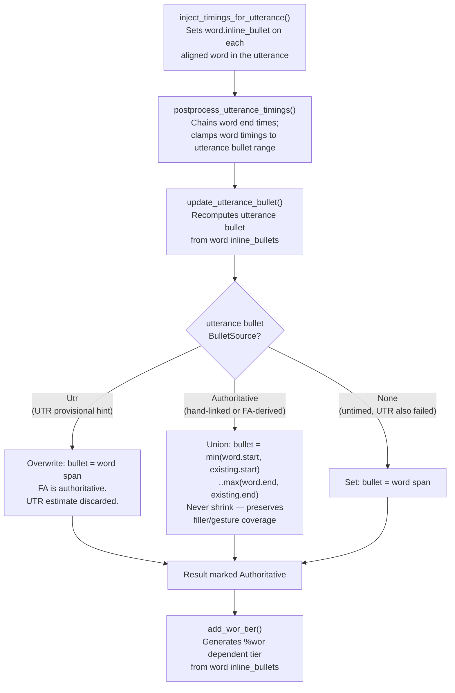

**Why `BulletSource` matters:** utterance bullets can come from two very
different origins with opposite desired behaviors after FA:

- **Authoritative bullets** (hand-linked by the researcher, or set by a
  previous FA run) may cover content that FA cannot align, a leading filler
  (`&-uh`) that FA returns `None` for, or a trailing gesture (`&=laughs`) that
  has no alignable word. Overwriting these bullets with the FA word span would
  silently shrink them and lose the hand-annotated timing context. The **union**
  ensures the bullet covers at least as much as before.

- **UTR hint bullets** (`BulletSource::Utr`) are rough grouping estimates
  derived from ASR token streams. They are provisional, their purpose is to
  give FA a window to work in, not to define the final timing. Once FA produces
  precise per-word timings, the hint should be discarded and the bullet set
  directly from the FA word span. This is the **self-healing property**: valid
  FA word timings always produce a valid utterance bullet, independent of how
  accurate the UTR estimate was.

`BulletSource` is a non-serialized field (`#[serde(skip)]`), it never appears
in CHAT output and has no effect on the file format. The distinction lives only
in memory during the align pipeline.

**Order matters:** `postprocess_utterance_timings` runs first so it can use the
UTR bullet for bounding word end times. If `update_utterance_bullet` ran first,
it would recompute from raw onset-only timings (Whisper FA gives only start
times), producing a bullet too tight for proper end-time chaining.

#### Word end times (non-pauses mode)

Whisper FA returns onset times only, each token has a start time but no end
time. In non-pauses mode (the default), the pipeline assigns end times by
chaining: each word's end = next word's start.

The **last word** of each utterance has no next word to chain to. Its end is
extended to the utterance bullet end (from UTR or original CHAT). If no bullet
exists, a fallback of `start + 500ms` is used (matching Python master's
behavior).

#### Word timing clamping policy

After end-time chaining, `postprocess_utterance_timings()` optionally clamps
word timings to the utterance bullet range. This clamping is intentionally
**restricted** because two very different sources can produce an utterance
bullet, with opposite implications for whether clamping is safe.

**The two bullet sources:**

- **`BulletSource::Authoritative`**: the bullet was parsed from CHAT text.
  After a previous FA run (or after a researcher links audio manually in CLAN),
  the bullet covers the full speech span for that utterance. Clamping FA word
  timings to it is safe and desirable: it prevents a freshly-aligned word from
  wandering outside the known boundary.

- **`BulletSource::Utr`**: the bullet was injected by UTR at runtime
  (never serialized to disk). UTR's estimates are rough grouping hints, not
  confirmed boundaries. A UTR bullet may be far narrower than the actual speech.
  Rev.AI, for example, can produce a 220 ms hint for a 3-second utterance when
  it only matched the first word. Clamping FA word timings to a UTR hint would
  discard every correctly-aligned word beyond the first.

**The `BulletSource` persistence problem.**  `BulletSource` is a runtime-only
field, it is not serialized to CHAT text. When a file goes through the
`transcribe` + `utseg` pipeline, UTR injects utterance bullets, those bullets
are serialized to CHAT text, and then on the next `align` run they are parsed
back as `BulletSource::Authoritative`. Even though they originated from UTR
timestamps, there is no record of that fact after re-parsing.

After `transcribe` + `utseg`, ASR-derived bullets may be as narrow as the ASR
engine's first-word match, a systematic property of Rev.AI and similar engines
that emit short tokens only for the words they are confident about. If `align`
clamped FA word timings to these narrow ASR-derived bullets, it would silently
drop timings for every word after the first, producing output that appeared
aligned but missed most of the utterance.

**The `%wor` discriminator.** The presence of a `%wor` tier distinguishes
first-time alignment (post-transcribe, no `%wor`) from re-alignment (previous
FA run, `%wor` present). `%wor` is generated only by FA, so its presence
guarantees:

1. A previous FA run already aligned this utterance correctly, and
2. The utterance bullet was set from FA word timings and is wide enough to cover
   the full speech span.

Clamping is therefore **only applied when BOTH conditions hold**:

1. `bullet.source == BulletSource::Authoritative`: not a runtime UTR hint, AND
2. `utterance.wor_tier().is_some()`: this is a re-alignment, not a first-time alignment.

When either condition fails, FA word timings are injected as-is. The
`update_utterance_bullet()` call that follows then overwrites the narrow bullet
with the actual FA word span, the self-healing property described above. This
means valid FA timings always produce a valid utterance bullet, regardless of how
accurate or narrow the prior estimate was.

**Practical consequence.** On the `transcribe` → `align` workflow (the most
common first-time alignment case), clamping is never applied. All FA word
timings are accepted. The utterance bullet is widened to cover them. On
subsequent `align` re-runs (e.g., after transcript editing), clamping is
applied using the now-authoritative FA-derived bullet, preventing edited words
from being placed outside the established audio window.

**Source:** `crates/batchalign/src/chat_ops/fa/postprocess.rs:37`,
`postprocess_utterance_timings()`.

## What is fast today vs later

Today the implemented fast paths are:

- skip FA entirely when `%wor` already provides complete reusable word timing
- **per-utterance partial `%wor` reuse on plain reruns**: when the whole-file
  check fails (e.g. a user edited a few utterances), detect which utterances
  still have clean `%wor`, refresh those, and only send stale FA groups through
  workers. Groups where all utterances are reusable are preserved without cache
  lookup or worker call (3-tier partition: reused → cached → miss).
- skip UTR when every utterance already has timing
- use a unique exact-subsequence UTR match when the transcript and ASR word
  streams line up without ambiguity

The next possible optimization is more selective escalation inside UTR:
identify local divergence regions ("trouble windows") and run global DP only
there. That is **not** implemented yet. The current global-DP path remains the
correctness baseline for difficult files.

## Why Two Steps

FA models (both Whisper and Wave2Vec) work best on short audio segments. Feeding
a 30-minute recording directly into the model produces poor alignment because
the attention/emission matrix gets too large and diluted. Chunking is necessary.

To chunk correctly, you need to know where each utterance sits in the audio.
That is what UTR provides. For already-timed input, the existing bullets serve
the same purpose.

## Untimed Utterance Handling

Four tiers of coverage for untimed utterances, in order of preference:

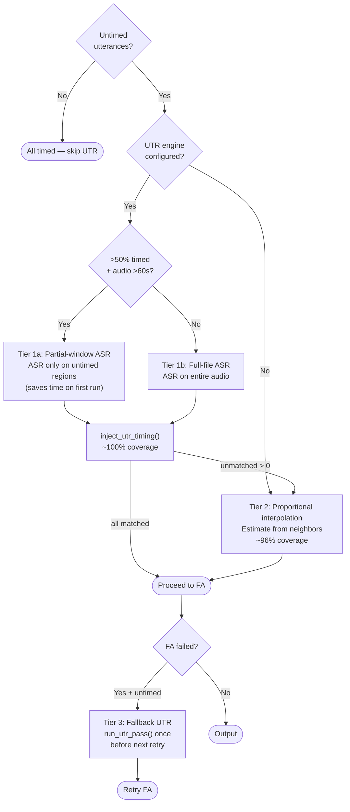

1. **UTR with partial-window (default, mostly-timed files):** When >50% of
   utterances are timed and audio exceeds 60 seconds, ASR runs only on the
   untimed windows. Each window is extracted via ffmpeg and cached independently.
   First run saves time proportional to the untimed fraction; repeat runs hit
   cache.
2. **UTR full-file (default, mostly-untimed files):** ASR runs on the full
   audio. The result is cached for instant repeat runs.
3. **Proportional interpolation:** When UTR is disabled (`--no-utr`) or when
   UTR's ASR inference fails, the grouping algorithm interpolates untimed
   utterances between neighboring timed utterances by word count, with a
   2-second buffer. Achieves ~96% coverage.
4. **Fallback UTR:** When FA fails with a retryable error and untimed
   utterances were not recovered, UTR is attempted once before the next retry.
   This can recover files where bad interpolated timing caused the FA failure.
5. **Skip:** When `total_audio_ms` is unavailable and no timed neighbors exist,
   untimed utterances are excluded from FA grouping.

This is **smarter than ba2's skip logic**: ba2 skipped UTR for the entire file
if *any* utterance had timing (potentially missing untimed ones). ba3 skips
UTR only if *all* utterances are timed, and when UTR can't match a specific
utterance, proportional interpolation provides a fallback.

## Engine Selection

| Engine | Model | Response format | Default? |
|--------|-------|-----------------|----------|
| `whisper_fa` | Whisper large-v2 cross-attention DTW | `TokenLevel` (token text + onset seconds) | Yes |
| `wav2vec_fa` | MMS_FA CTC forced alignment | `WordLevel` (word text + start/end ms) | No |

Both return chunk-relative timestamps. The Rust orchestration (`parse_fa_response`)
handles offset addition for both formats.

## Offset Handling

This is the most critical correctness invariant in the pipeline.

Every FA model receives an audio chunk extracted from position `audio_start_ms`
to `audio_end_ms` in the full recording. The model returns timestamps relative
to the chunk start (time 0 = `audio_start_ms` in the full recording).

Before injecting timestamps into the CHAT AST, the offset must be added:

- **TokenLevel** (Whisper): `absolute_ms = time_s * 1000 + audio_start_ms`
- **WordLevel** (Wave2Vec): `absolute_ms = start_ms + audio_start_ms`

Failing to add the offset produces timestamps that are internally consistent
(words are correctly spaced relative to each other) but placed at the wrong
absolute position in the recording.

## Caching

Two independent cache layers affect alignment:

### UTR ASR cache

UTR ASR results are cached in the analysis cache (`CacheTaskName::UtrAsr`).
Two cache key schemes are used:

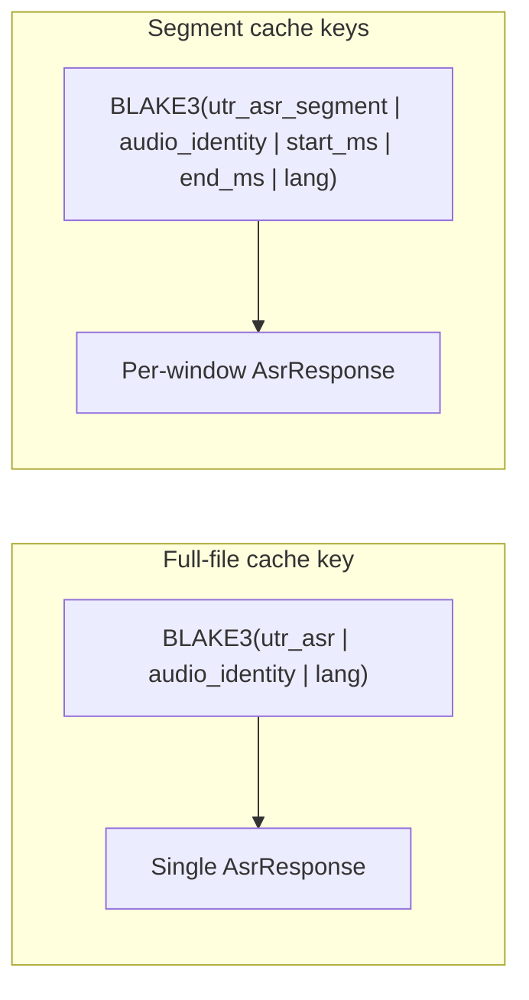

Full-file keys are used for mostly-untimed files. Segment keys are used when
partial-window mode activates (>50% timed, audio >60s). Once the full-file
result is cached (after the first run), subsequent runs always hit the cache
regardless of which mode was used initially.

`--override-media-cache` bypasses lookups but still stores results for future use.

### FA cache

FA caches raw model responses per-group (keyed by audio chunk fingerprint + text
\+ pauses flag). The `--override-media-cache` flag bypasses this cache.

Both caches use the same SQLite database (the analysis cache, see [Filesystem Paths](../reference/filesystem-paths.md#analysis-cache-sqlite)).

### What invalidates alignment cache?

| Change | UTR cache | FA cache |
|--------|-----------|----------|
| Edit transcript text | Stays cached (audio unchanged) | Groups with changed words re-run |
| Re-record audio | Re-runs (audio identity changed) | Re-runs (audio identity changed) |
| Change `--fa-engine` | Stays cached (engine not in UTR key) | Misses (engine is part of FA key) |
| Change `--lang` | Re-runs (lang is part of UTR key) | Re-runs (lang is part of FA key) |
| Second run, nothing changed | Hits cache | Hits cache, instant output |

**Audio identity** is computed from the file's path, modification time, and size, not
a content hash. If you move or rename the audio file, the cache will miss even if the
content is identical. Conversely, overwriting a file in place with different content
will miss only if the modification time or size changes (which the OS updates on write).

### Why fallback traces may appear empty on a successful rerun

The new fallback telemetry is attached to the **actual worker inference pass**.
If the FA cache already contains timings for the relevant group, the rerun may
succeed without dispatching Wave2Vec at all, so no fallback event will be
recorded for that run.

When you need to confirm that a real worker pass hit the fallback path, bypass
FA cache for that run:

```bash
batchalign3 align \
  --override-media-cache-tasks forced_alignment \
  --debug-dir /tmp/ba-debug \
  -o output/ \
  file.cha
```

That forces a new FA inference pass and makes the fallback event observable in
the trace payload if the condition is reproduced.

## Diagnostics and trace inspection

`align` now has two useful diagnostic layers:

1. **Better terminal/server errors**: per-group FA parse failures are surfaced
   with group index and audio window instead of being swallowed and only
   appearing later as a generic missing-timings failure.
2. **Optional trace capture**: `--debug-dir PATH` enables `debug_traces`, which
   stores FA timeline traces including fallback events.

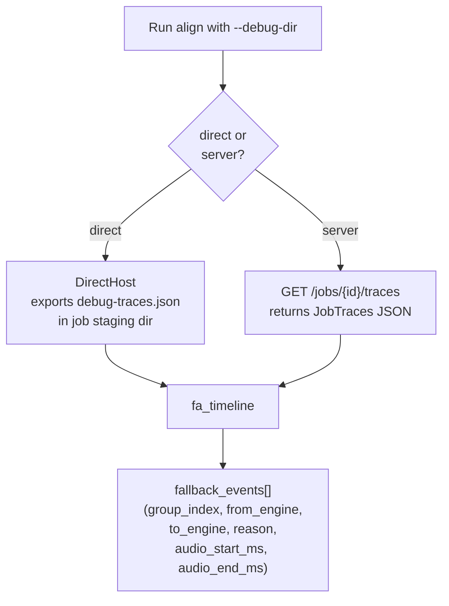

For explicit server mode:

```bash
curl http://127.0.0.1:8001/jobs/JOB_ID/traces | python3 -m json.tool
```

For direct mode, the CLI prints stable debug handles after submission; the trace
payload is exported as `debug-traces.json` in the job staging directory.

This is especially useful for confirming:

- whether a file succeeded entirely from cache,
- whether a Wave2Vec group retried with Whisper,
- which group/audio window triggered the fallback,
- whether the final output was produced after fallback or after a plain cache hit.

## Known Pitfalls

### Audio timestamps past end of file

**Symptom if the empty-segment check is absent:** One or more files fail alignment with:

```text
FA processing failed: validation error: failed to parse worker protocol V2 FA
response for group N (Xms..Yms): worker protocol V2 forced-alignment request
failed with RuntimeFailure: RuntimeError: Calculated padded input size per
channel: (0). Kernel size: (10). Kernel size can't be greater than actual
input size
```

**Root cause:** The FA grouping algorithm assigns timestamps to groups using
utterance bullets already present in the CHAT file.  When the last few
utterances carry timestamps that extend past the actual end of the audio (a
common occurrence in PWA/aphasia corpora where utterance-end times are
hand-estimated or interpolated beyond the recording), the corresponding FA
group contains no real audio samples.

`ffmpeg` exits with code 0 in this case but writes an empty PCM file.  Without
an explicit check, the 0-frame PCM is passed to Wave2Vec, which crashes with the
PyTorch convolution error above because its kernel is larger than the input
tensor.

`extract_prepared_audio_segment_f32le` checks `frame_count == 0` after ffmpeg
and returns `PreparedArtifactErrorV2::EmptyAudioSegment` instead of a 0-frame
descriptor.  The transport layer (`infer_groups_v2`) catches this before
dispatching to the worker, skips the group with all-`None` timings, and logs:

```text
WARN fa_transport: FA group has no audio (segment past end of file); leaving words unaligned
     group=N start_ms=X end_ms=Y path=<audio file>
```

The affected words in the CHAT output have no bullets but the file is otherwise
complete.  This is the correct conservative outcome: the words exist in the
transcript but their timing is unknown.

**Affected corpora:** Typically aphasia/PWA corpora where post-session
annotation extends utterance times beyond the recorded audio.  The Croatian
PWA corpus (APROCSA) triggered this in production (job `6795bfbe-467`,
`1-ZH-76-1.cha`, group 62, 908154-909196 ms).

**Implementation:** `crates/batchalign/src/worker/artifacts_v2.rs`
(`EmptyAudioSegment` variant), `request_builder_v2.rs` (build-error mapping),
`fa/transport.rs` (skip logic in `infer_groups_v2`).

### Whisper pipeline chunking

The HuggingFace Whisper pipeline processes long audio in 25-second chunks with
3-second overlap (`chunk_length_s=25, stride_length_s=3`). The pipeline is
responsible for converting chunk-relative timestamps to absolute. However, this
conversion has been unreliable in some configurations, notably when `batch_size`
is passed to the pipeline constructor. The `batch_size` parameter was removed
from the constructor to avoid this issue (inference uses `batch_size=1`
regardless).

### Untimed input vs timed input

For **timed input** (production CHAT from CLAN): UTR is skipped, FA uses the
existing bullets directly. This path is well-tested and reliable.

For **untimed input** (raw transcripts without timing): UTR must first discover
where each utterance lives in the audio. This depends on Whisper ASR producing
correct absolute timestamps, which depends on the HF pipeline's chunking
working correctly. This path is more fragile.

## Warning reference

All `WARN` lines emitted to the server log during `align`.  None of these are
fatal by themselves; a `WARN` on a group or a post-processing pass does not
prevent output from being written.  Only file-level errors prevent output.

| Log source | Message pattern | When it fires | Action needed? |
|------------|----------------|--------------|---------------|
| `fa_pipeline` | `untimed utterances present but no UTR engine configured` | `--no-utr` and file has untimed utterances | No, proportional interpolation runs instead |
| `crates/batchalign/src/chat_ops/fa/utr.rs` | `no timing bullet and no estimate, skipping from FA grouping` | Utterance has no bullet and no timed neighbors for interpolation | Inspect file; utterance will be left unaligned |
| `crates/batchalign/src/chat_ops/fa/transport.rs` | `FA group has no audio (segment past end of file)` | Group's time window exceeds audio duration | Check audio file length and CHAT bullets |
| `crates/batchalign/src/chat_ops/fa/transport.rs` | `Wave2Vec FA hit recoverable target constraint; retrying group with Whisper FA` | Wave2Vec CTC overflow on one group | Informational; Whisper retry follows automatically |
| `crates/batchalign/src/chat_ops/fa/transport.rs` | `Whisper FA unavailable … leaving group words unaligned` | Wave2Vec overflow AND worker has no Whisper model | Informational; affected utterances lose word timing but file completes |
| `crates/batchalign/src/chat_ops/fa/transport.rs` | `FA error (raw) … category=validation` | Group failed worker inference for a non-CTC reason | Check server log for root cause; file may fail |
| `crates/batchalign/src/chat_ops/fa/mod.rs` | `FA cache batch lookup failed` | SQLite cache read error (non-fatal; misses treated as cache misses) | Check disk space and cache file permissions |
| `crates/batchalign/src/chat_ops/fa/mod.rs` | `Failed to deserialize cached FA timings` | Cache entry written by a different schema version | Wipe FA cache: `rm ~/Library/Caches/batchalign3/cache.db*` |
| `fa/mod.rs` | `Failed to cache FA result` | SQLite cache write error (non-fatal; inference result still used) | Check disk space |
| `fa/mod.rs` | `Post-validation warnings` | CHAT structural issues after injection | Review `%xalign` decision tiers in output |
| `fa/orchestrate.rs` | `monotonicity: strategy="end_clamped"` | Utterance end time trimmed to avoid CLAN seek regression; routine UTR overlap correction | No, no `%xrev` written; BA2 made these silently |
| `fa/orchestrate.rs` | `monotonicity: strategy="start_stripped"` | Utterance start precedes previous accepted start, full timing stripped | Review utterance, `%xrev: [?]` written; may indicate text/audio reordering |
| `fa_pipeline` | `FA failed with untimed utterances; attempting fallback UTR` | FA error on file that still has untimed utterances | Informational; fallback UTR retry follows |
| `fa_pipeline` | `Fallback UTR recovered timing` | Fallback UTR succeeded before retry | Informational; timing injected, FA retry queued |

## Comparison with BA2

Understanding what BA2 did is useful context for why the fallback machinery
exists and why it is currently incomplete.

### BA2 forced alignment

BA2 was a pure-Python pipeline.  Forced alignment used **separate, mutually
exclusive engine classes**: `WhisperFAEngine` and `Wave2VecFAEngine` in
`batchalign/pipelines/fa/`.  The dispatcher chose one engine at pipeline
creation time based on the user's `--engine` flag.  **There was no fallback.**
If the chosen engine failed on a group, the file failed.

| Aspect | BA2 (Jan 2026) | BA3 (current) |
|--------|---------------|---------------|
| Default FA engine | Whisper (cross-attention DTW) | Whisper (same) |
| Wave2Vec available | Yes, via `--engine wave2vec_fa` | Yes, via `--fa-engine wav2vec` |
| Both models loaded simultaneously | No, one at a time by design | No, one at a time, same reason |
| Wave2Vec CTC overflow → fallback | **None**: file failed | Retry that group with Whisper |
| CTC overflow handling | User had to rerun with `--engine whisper_fa` | Automatic per-group retry |
| Silent file drop on CTC overflow | No, file errored visibly | No, affected groups leave words unaligned; file completes |
| Fallback telemetry | None | `FaFallbackEventTrace` in job traces |
| FA result caching | Per-file Python shelve | Per-group BLAKE3 SQLite cache |

### What BA3 improved

The Wave2Vec CTC fallback (added March 2026) handles three real-world failure
modes that BA2 users had to manually work around: groups with very long word
sequences, groups with characters that map to the CTC blank token (typically
hyphenated or cross-linguistic tokens), and groups shorter than ~25 ms that
crash Wave2Vec's convolutional feature extractor.

BA3's per-group Whisper retry means a single difficult utterance no longer
aborts an entire file, 90+% of a file that previously failed can now complete.

### What BA3 regressed

The fallback implementation has a critical gap: it assumes Whisper is always
available as a fallback model, but the worker loads only one FA model at
startup.  When Wave2Vec is the primary engine and CTC overflow occurs, the
Whisper fallback dispatch returns `ModelUnavailable`, which currently propagates
as a file-level failure.  BA2 users who selected Wave2Vec would see an explicit
error; BA3 users see a silent file drop, a regression in observability.

`is_whisper_model_unavailable()` in `fa/transport.rs` provides the
graceful-degradation behavior BA2 had via its explicit-error path: the affected
utterances lose word-level timing, but the file completes.

## Design Rationale

We evaluated simpler alternatives:

- **Single-pass full-audio FA**: Would avoid the UTR dependency, but FA models
  degrade on long audio. Not viable for recordings over ~30 seconds.
- **Lightweight boundary detection (VAD + text alignment)**: Would be cheaper
  than full Whisper ASR for UTR, but more complex to implement and less
  accurate. The current design works correctly for production data (which is
  already timed), and UTR only runs on the uncommon untimed case.
- **Single Whisper pass for both timing and alignment**: Would halve compute
  time, but Whisper ASR output has different characteristics than Whisper FA
  output (ASR may hallucinate or miss words; FA is constrained to the known
  transcript).

The current two-step design (UTR for boundaries, FA for word timing) is the
standard approach in the field. It works correctly when both steps produce valid
absolute timestamps.

## Monotonicity Invariant

CHAT requires that utterance-level timing bullets increase monotonically through
the file (E362).  CLAN players seek into the audio by bullet position; a
regression means the player would seek backwards, which is undefined behavior.

### The fundamental limitation

The alignment engine is a **monotonic matcher**: it assumes that words appearing
later in the transcript also appear later in the audio.  This assumption holds
for most CHAT files, but breaks down when the transcript's text order diverges
from the audio's temporal order.

The most common cause is **overlapping speech** annotated with `&*` markers.
CHAT convention embeds one speaker's words inside another's utterance:

```text
*PAR:  I'm hoping to play here &*INV:yeah in a month or two .
```

In the audio, INV's "yeah" occurs *between* PAR's words.  But in the text,
INV's word is interleaved into PAR's utterance.  When the monotonic matcher
tries to align this against the ASR's flat temporal word sequence, it cannot
represent the crossing -- INV's word in the ASR sits between PAR's words that
are on the same text line.  The matcher must either skip the interleaved word
or lose sync with subsequent words.

When this happens across many utterances in a dense overlapping region, the
matcher loses sync entirely and leaves whole blocks of utterances untimed.

### What `align` does about it

UTR's DP alignment preserves LCS ordering: if CHAT word at reference
position *i* matches ASR word at payload position *p*, then reference position
*j > i* can only match payload position *q > p*.  When text and audio order
diverge, some utterances get no UTR timing.  FA's proportional estimation can
then assign a correct-but-earlier timestamp to those untimed utterances, breaking
monotonicity.

**Post-FA enforcement pass**: After all utterances have been
force-aligned, `enforce_monotonicity()` (at
`crates/batchalign/src/chat_ops/fa/orchestrate.rs:213`) walks
utterances in text order, tracking the last accepted start
timestamp. Any utterance whose start precedes the previous accepted
start has its timing stripped entirely, utterance bullet, inline
word bullets, and the `%wor` tier are all removed (the
`start_stripped` decision in the `%xalign` decision tier; see the
[Monotonicity warnings table](#monotonicity-warnings)). The
utterance is left as plain untimed text, identical to how it would
look before alignment.

This is the conservative choice: no information is corrupted, only
alignment coverage is reduced. The correctly-timed surrounding
utterances retain their full word-level alignment.

**Pre-serialization validation gate**: As an additional safety net,
the post-validation walk at the end of
`process_one_fa_file()` (in
`crates/batchalign/src/runner/dispatch/fa_pipeline.rs`) checks the
full output against the talkbank-model validators (including E362
monotonicity) before serialization. The walk is warn-only, output
is always serialized so it can be inspected, but the warnings are
the early signal that the post-FA enforcement layer above missed
something.

### Real-world impact

In testing on hand-edited APROCSA aphasia protocol files with dense overlapping
speech, alignment loss reached 36.5% of utterances (232 of 636), clustered in
large contiguous blocks of up to 25 consecutive untimed utterances.  The
severity scales with the density of `&*` markers and the degree of
text/audio order divergence.

Files most affected:

- Aphasia protocols with frequent backchannels and completions from
  investigators and relatives
- Conversation analysis transcripts with dense turn overlap annotation
- Any file where a reviewer has restructured utterance order after ASR

Files least affected:

- Single-speaker or low-overlap recordings
- Transcripts in temporal order (most CLAN-produced files)
- Files re-run through `align` without structural editing

### What users should do

See the [troubleshooting guide](../user-guide/troubleshooting.md#some-utterances-lose-timing-after-align)
for practical guidance on identifying and working around untimed utterances.

### Roadmap

Two improvements are under consideration:

1. **Backbone extraction**: stripping `&*` segments before UTR alignment and
   interpolating their timing afterward.  This is cheap to implement and helps
   for moderate-overlap files, but does not solve the worst cases where
   transcript restructuring (not just `&*` markers) is the dominant divergence.

2. **Per-speaker UTR**: running ASR per speaker channel and matching each
   speaker's utterances independently.  This is the correct solution for
   heavily restructured transcripts but requires diarization infrastructure
   and is more complex to implement.

See [Overlap-Aware Alignment Improvements](../developer/backchannel-aware-alignment.md)
for the design proposals and honest impact estimates. A complementary
unimplemented "trouble-window" approach would preserve existing
timing during re-runs on hand-edited files; today, that workflow is
covered by `align --before` (incremental alignment that reuses
unchanged utterances).

## Known limitations

- **FA cannot recover utterances under ~200 ms of audio.** The Whisper
  and Wave2Vec FA models need a minimum number of frames to produce
  reliable timing. Utterances narrower than ~200 ms (single short
  backchannels, brief interjections) are left untimed by FA. The
  proportional-FA-estimation fallback may still place an estimated
  bullet on them when `total_audio_ms` is available; otherwise they
  remain untimed.
- **Audio timestamps past end of file leave words unaligned.** When an
  FA group's utterance timestamps extend past the actual end of the
  audio file (common in PWA corpora where end-times are
  hand-estimated), the prepared-audio extractor returns
  `EmptyAudioSegment` and the group is skipped with all-`None`
  timings. The rest of the file aligns normally. Workaround: trim the
  audio or correct end-times before re-running.
- **Same-speaker overlap windows can lose timing.** If two utterances
  from the same speaker overlap (E704), `strip_e704_same_speaker_overlaps()`
  drops the earlier one's timing rather than emit a contradiction.
  The later utterance keeps its timing.
