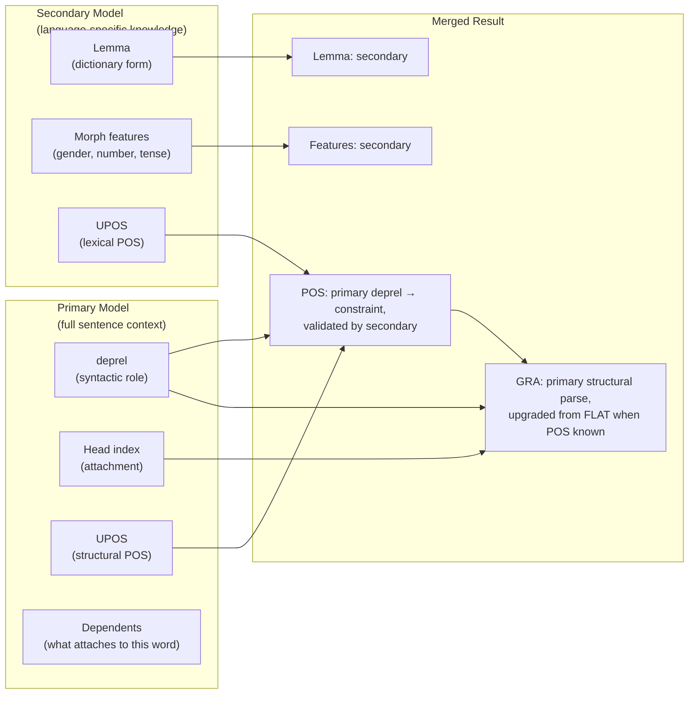
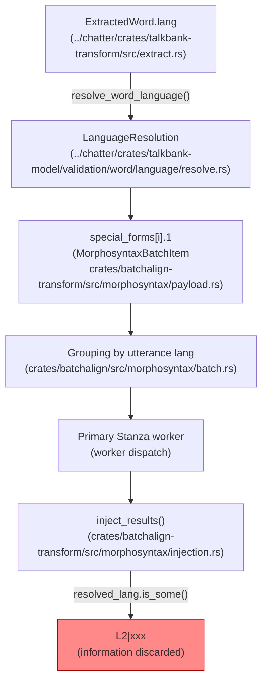
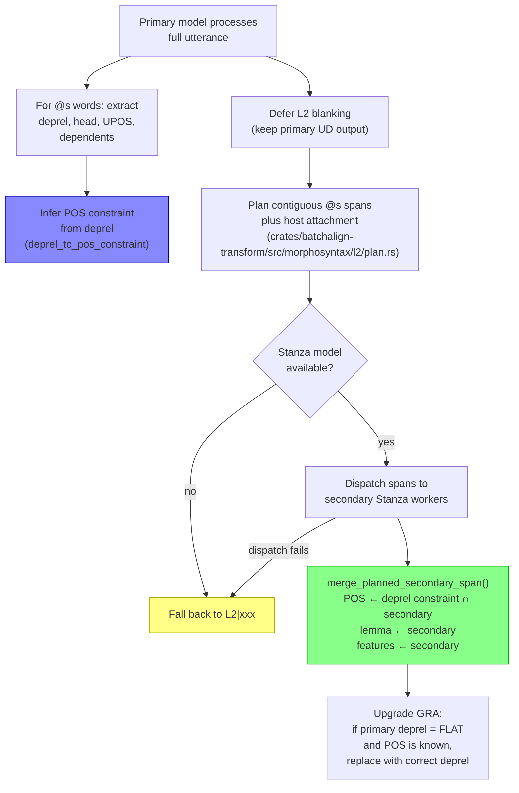
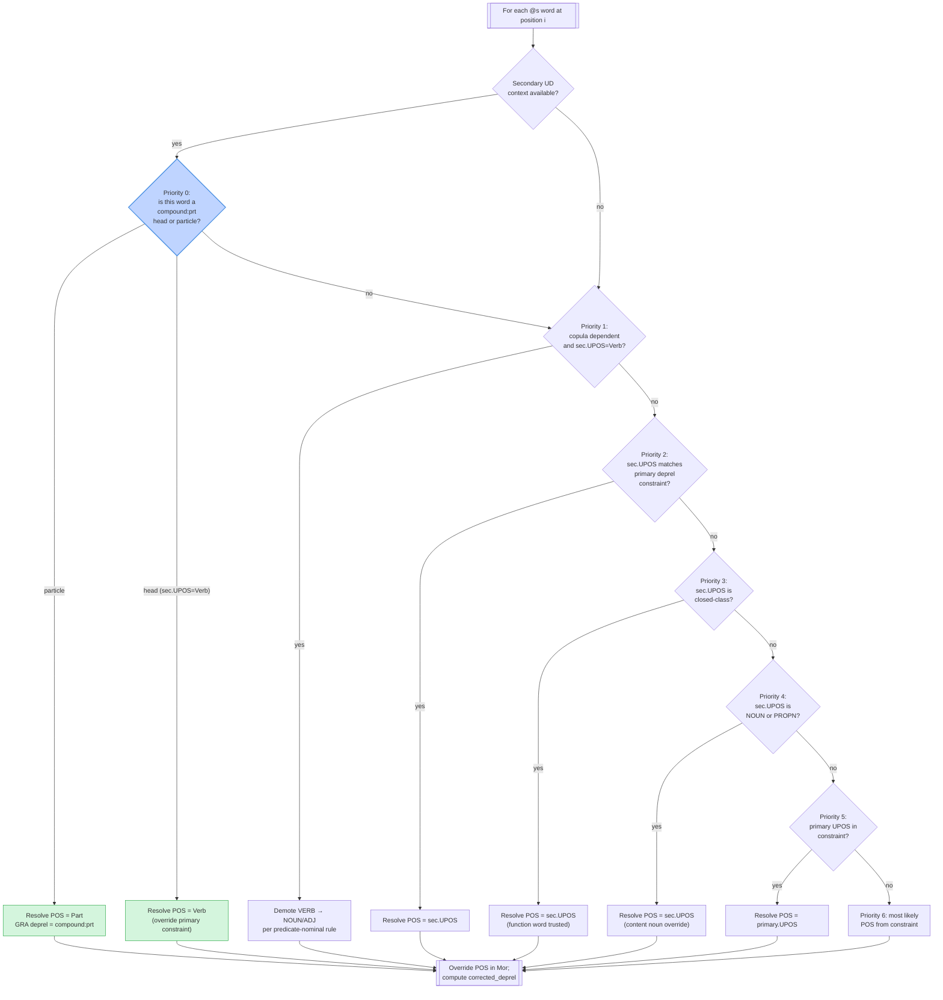

# L2 Morphotag: Per-Word Code-Switching Analysis

**Status:** Current
**Last updated:** 2026-05-20 10:25 EDT

> **L2 dispatch is now on by default.** After
> evaluation across 19 language pairs and 17,352 `@s` words yielded
> aggregate dispatch rate is high enough (well above 99% across
> 19 evaluated language pairs), the `--experimental-l2-morphotag`
> flag was removed and replaced with `--no-l2-morphotag` (opt-out
> for legacy `L2|xxx` behavior). This design doc is maintained for
> implementers; users should read the
> [user guide](../user-guide/commands/morphotag.md).

## Problem

CHAT transcripts use `@s` markers for word-level code-switching — a word
spoken in a different language than the utterance's primary language:

```chat
*EVA: was ich jetzt machen möchte ist , dass ich von der
      Linguistik ein bisschen umsattele auf (.) film@s studies@s .
```

Here `film` and `studies` are English words in a German utterance, marked
with bare `@s` (shortcut for the secondary language declared in
`@Languages`).

Historically, batchalign3 blanked all `@s` words to `L2|xxx` in the `%mor`
tier — discarding morphological information entirely. This document starts
from that original failure mode because it motivated the current design:

```chat
%mor: ... adp|auf L2|xxx L2|xxx .
```

This is the **safe conservative** choice: the primary language's Stanza
model (German, in this example) produces wrong morphology for foreign
words, and presenting that wrong morphology as valid analysis would be
worse than admitting ignorance.

But `L2|xxx` is a loss. The word `studies` is a perfectly regular English
plural noun. If we could route it to the English Stanza model, we'd get
`noun|study-Pl` — real, useful morphological analysis.

## Scale

Across TalkBank's 24 data repos:

- **12,450** `.cha` files contain `@s` markers
- **Top languages:** eng (32K occurrences), spa (7.5K), fra (2.5K),
  dan (1.8K), ita (1.6K), nan (1.3K), zho (1.2K), deu (1.1K)
- **Top repos:** childes-other-data (4,225 files), slabank-data (3,517),
  phon-other-data (1,005), childes-romance-germanic-data (781)

### @s Marker Variants

| Form | Meaning | Frequency | Example |
|------|---------|-----------|---------|
| `@s` | Bare shortcut — toggles to secondary language from `@Languages` | ~74% of uses | `film@s` |
| `@s:CODE` | Explicit language code (ISO 639-3) | ~25% | `tienda@s:spa` |
| `@s:CODE+CODE` | Multiple languages (code-mixing at sub-word level) | 229 files | `ripiado@s:eng+spa` |
| `@s:CODE&CODE` | Ambiguous between languages | 290 files | `wrap_o@s:eng&cym` |

### Common Code-Switching Patterns

1. **Single isolated word:** `the tienda@s:spa is close .` — one foreign
   word embedded in primary-language sentence
2. **Contiguous span:** `los@s:spa niños@s:spa` — multi-word foreign
   phrase (a noun phrase, in this case)
3. **Utterance-initial:** `time@s out@s , kenne ich nicht .` — English
   phrase at start of German utterance
4. **Mixed secondary languages:** `ok@s:eng damelo@s:spa` in a
   Tzutujil utterance — two different foreign languages
5. **Morphologically integrated:** `tagueé@s:eng+spa` — English verb
   root with Spanish past participle morphology

## Key Insight: Cross-Linguistic Information from the Primary Model

The primary model's analysis of @s words is wrong *as morphology* — but
it contains **structurally valid cross-linguistic information** that can
be combined with the secondary model's language-specific knowledge.

Universal Dependencies is explicitly designed to be cross-linguistic.
The UD dependency relations, UPOS tags, and structural attachments have
the same meaning in all languages by definition. When the German Stanza
model parses `she was muy@s:spa nice .` and attaches `muy` as `advmod`
of `nice`, it is making a **structural claim** that is valid regardless
of language: this word is an adverbial modifier of an adjective.

### What Each Model Contributes



### Primary Model Outputs and Cross-Linguistic Validity

| Output | Cross-linguistic? | Rationale |
|--------|:-:|-----------|
| **deprel** (dependency relation) | **Yes** | UD relations are language-universal by design. `advmod` means "adverbial modifier" in every language. |
| **Head index** | **Yes** | Syntactic attachment is structural. `muy` attaching to `nice` is valid in any language. |
| **UPOS** (universal POS tag) | **Mostly** | Defined cross-linguistically. Contextual models derive UPOS partly from position, which is language-independent. Risk: OOV heuristics may misfire (e.g., defaulting to PROPN). |
| **Dependents** (words attaching to this word) | **Yes** | If `the` is `det` of `tienda`, then `tienda` is definitively a noun head. |
| **XPOS** (language-specific POS) | No | English Penn Treebank tags are meaningless for Spanish words. |
| **Lemma** | No | Unknown words get identity-lemmatized. |
| **Morphological features** | No | Gender, number, tense require word-form recognition. |

### Deprel → POS Constraint Mapping

The dependency relation alone strongly constrains the part-of-speech.
This mapping is a **pure function** — no ML involved, exhaustively
testable:

```text
deprel        → POS constraint set
───────────────────────────────────────────
det           → {DET}                        ← unambiguous
amod          → {ADJ}                        ← unambiguous
advmod        → {ADV}                        ← unambiguous
case          → {ADP}                        ← unambiguous
mark          → {SCONJ}                      ← unambiguous
cc            → {CCONJ}                      ← unambiguous
nsubj         → {NOUN, PRON, PROPN}          ← narrow
obj           → {NOUN, PRON, PROPN}          ← narrow
iobj          → {NOUN, PRON, PROPN}          ← narrow
obl           → {NOUN, PRON}                 ← narrow
nmod          → {NOUN, PROPN}                ← narrow
xcomp         → {VERB, ADJ}                  ← narrow
ccomp         → {VERB}                       ← unambiguous
advcl         → {VERB}                       ← unambiguous
acl           → {VERB, ADJ}                  ← narrow
appos         → {NOUN, PROPN}                ← narrow
flat          → {NOUN, PROPN, ADJ, ADV}      ← broadest
root          → {VERB, NOUN, ADJ}            ← broad
conj          → (inherit from conjunct head)
```

For most UD relations, the constraint set is 1–3 POS tags. Even for the
broadest cases (`flat`, `root`), the secondary model's lexical knowledge
can disambiguate within the small set.

### Dependent-Based Evidence

A word's dependents provide additional POS evidence:

- If a word has a `det` dependent → it is a **noun** (definitively)
- If a word has an `nsubj` dependent → it is a **verb** or **adjective**
- If a word has an `advmod` dependent → it is a **verb**, **adjective**, or **adverb**
- If a word has a `case` dependent → it is a **noun** (in an oblique/prepositional phrase)

Combined with the deprel constraint, this often narrows POS to exactly
one candidate — even when the deprel itself is broad (like `flat`).

### Worked Example

```chat
*PAR: she was muy@s:spa nice .
```

Primary model (English Stanza) produces for `muy`:

| Field | Value | Cross-lingually valid? |
|-------|-------|:---------------------:|
| UPOS | `ADJ` (wrong as English morphology) | Partly — position suggests ADV |
| deprel | `amod` or `advmod` | **Yes** |
| head | 4 (`nice`) | **Yes** |
| lemma | `muy` (identity) | No |
| feats | — | No |

**Deprel constraint:** `advmod → {ADV}` — exactly one candidate.

Secondary model (Spanish Stanza) on isolated word `"muy"`:
- UPOS: `ADV` ← matches constraint ✓
- lemma: `muy`
- feats: (none for Spanish adverbs)

**Merged result:** `adv|muy` with deprel `ADVMOD` (upgraded from `FLAT`).

Without the primary model's structural information, the secondary model
seeing just `"muy"` would still likely get `ADV` (since `muy` is almost
always an adverb). But for genuinely ambiguous words like `bajo` (noun
"bass" / adjective "short" / preposition "under" / verb "I descend"),
the deprel constraint from the primary model is decisive.

## Architecture

### Historical Baseline (L2|xxx blanking)

The pipeline already parses, resolves, and carries per-word language
information through every stage. It is discarded only at injection time.



### Default: Structural Merge with Secondary Dispatch

The default pipeline preserves the primary model's structural analysis
and combines it with the secondary model's lexical knowledge (pass
`--no-l2-morphotag` to opt out and return to the legacy `L2|xxx`
behavior shown above):



The current implementation places deterministic span planning and host
attachment in `talkbank-transform`; `batchalign` is only the worker-dispatch
adapter for those planned spans.

### Merge Algorithm

For each @s word, the merge operates on three inputs: the primary
model's structural analysis of that word, the secondary model's
lexical analysis, and the **full secondary UD
sentence** so the merge can see `compound:prt` relations for
phrasal-verb recognition.



**Priority 0** handles phrasal verbs. It runs
BEFORE the primary-constraint priority chain because the secondary
model's sentence-level `compound:prt` analysis is more reliable than
either the primary's deprel (which misclassifies foreign verbs as
`advmod`) or Priority 3's blind trust of `ADP` as closed-class. See
[Phrasal-verb recognition](#phrasal-verb-recognition) for the worked
example.

Concretely, the algorithm in pseudocode:

```text
1. primary_deprel   ← primary model's deprel for word i
2. primary_upos     ← primary model's UPOS for word i
3. primary_head     ← primary model's head index for word i
4. constraint_set   ← deprel_to_pos_constraint(primary_deprel)
5. dependents       ← words whose head = i (from primary parse)
   refine constraint_set with dependent evidence

6. secondary_sentence ← Stanza UD response for the @s span
7. secondary_upos   ← secondary[i].upos
8. secondary_lemma  ← secondary[i].lemma
9. secondary_feats  ← secondary[i].feats

   // Priority 0 (phrasal-verb structural recognition):
10. if secondary[i].deprel == "compound:prt":
        final_pos ← Part
        final_deprel ← compound:prt
        skip to 20
    if some other word has head == i and deprel == "compound:prt"
       AND secondary_upos == Verb:
        final_pos ← Verb
        skip constraint-based resolution

   // Priorities 1-6 (existing constraint-based chain):
11. if has_copula and secondary_upos == Verb: final_pos ← NOUN or ADJ
12. if secondary_upos ∈ constraint_set: final_pos ← secondary_upos
13. if is_closed_class(secondary_upos): final_pos ← secondary_upos
14. if secondary_upos ∈ {NOUN, PROPN}: final_pos ← secondary_upos
15. if primary_upos ∈ constraint_set: final_pos ← primary_upos
16. else: final_pos ← most_likely(constraint_set)

   // Merge lemma and features
17. final_lemma ← secondary_lemma
18. final_feats ← secondary_feats

   // Merge GRA (outside Priority 0's explicit deprel)
19. if primary_deprel = "flat" or constraint mismatch with final_pos:
        final_deprel ← infer_deprel(final_pos, head_upos)
    else:
        final_deprel ← primary_deprel
20. emit MergedL2Morphology { mor, corrected_deprel }
```

### Phrasal-verb recognition

Stanza returns `compound:prt` for true verb-particle constructions
(`wake up`, `give up`, `pick up`, `figure out`). Before the
earlier behavior had the L2 merge processing each `@s` word in isolation
and could not see that structural evidence, so:

- The **head** (`wake`) could be downgraded to `adv|wake` when the
  primary parser tagged it as `advmod` (common for German parsing
  English roots).
- The **particle** (`up`) was always tagged `adp|up` because
  Priority 3 (closed-class trusted) returned ADP blindly.

The fix threads the full secondary UD sentence into
`merge_primary_secondary_with_context()`
(`crates/batchalign-transform/src/morphosyntax/l2/merge.rs:542`), which
delegates to the inner `resolve_merged_pos_with_context()` at `:152`
where Priority 0 is implemented. Result on German-English input:

| Main | `%mor` (before fix) | `%mor` (after fix) |
|------|---------------------|--------------------|
| `ich möchte wake@s up@s jetzt .` | `... verb\|wake adp\|up adv\|jetzt .` | `... verb\|wake-Fin-Imp-S part\|up adv\|jetzt .` |
| `die kinder give@s up@s immer .` | `... adv\|give adp\|up adv\|immer .` | `... verb\|give-Fin-Imp-S part\|up adv\|immer .` |
| `die zeit ist time@s out@s .` | `... noun\|time adp\|out .` | `... noun\|time adp\|out .` (unchanged — correctly a compound noun, not a phrasal verb) |

The particle's `%gra` deprel is `COMPOUND-PRT`. Test coverage for the fix:

- `crates/batchalign/src/chat_ops/morphosyntax_ops/l2/tests.rs` — 4 unit
  tests (particle promotion, head promotion, non-phrasal ADP
  regression, non-VERB-secondary safety).
- `crates/batchalign/tests/ml_golden/morphotag/golden_l2.rs::golden_l2_morphotag_phrasal_verbs`
  — end-to-end ML golden locking in the table above.

### Contiguous Span Grouping

Consecutive `@s` words with the same resolved target language are merged
into a single span and sent as a mini-sentence to the secondary model.
This gives the model useful context:

```text
Input:   we talked about los@s:spa niños@s:spa .
Span:    ─────────────── ^^^^^^^^^^^^^^^^^^^^^^^^
                         "los niños" → Spanish Stanza

Result:  det|el-Masc-Def-Art-Pl  noun|niño-Masc-Pl
```

For contiguous spans, the secondary model has enough context to produce
both correct POS and correct features. The deprel constraint from the
primary model serves as validation rather than correction in these cases.

### LanguageResolution Policy

| Variant | Policy | Rationale |
|---------|--------|-----------|
| `Single(lang)` | Dispatch to `lang` | Unambiguous target |
| `Multiple(langs)` | Fall back to `L2|xxx` | No single trustworthy target |
| `Ambiguous(langs)` | Fall back to `L2|xxx` | No single trustworthy target |
| `Unresolved` | Fall back to `L2|xxx` | No language to dispatch to |

### Validation and normalization policy

Per-word L2 dispatch and transcript repair are intentionally separate concerns:

- explicit `@s:LANG` still dispatches to `LANG` when possible, even if `LANG` is
  missing from `@Languages`, but validation emits warn-only E254 so the header
  drift is visible
- whole-utterance same-language all-`@s` runs are rejected as E255; the
  canonical CHAT representation is utterance-level `[- lang]`
- `chatter debug fix-s` is the normalization tool: it rewrites
  qualifying whole-utterance `@s` runs, clears the matching per-word
  shortcuts on fillers and nonwords as well as on regular words (a
  bare `@s` resolves relative to the surrounding tier language, so the
  new `[- LANG]` precode would otherwise flip filler resolution),
  appends missing explicit languages to `@Languages`, and skips
  already-correct files

### Unsupported non-primary language handling

`morphotag` requires only the **primary** `@Languages` code to be
Stanza-supported. Non-primary content targeting an unsupported language
— whether via `[- UNSUPPORTEDLANG]` precode or `@s:UNSUPPORTEDLANG`
per-word marker — is partitioned out of Stanza dispatch by
`partition_groups_by_stanza_support` in
`crates/batchalign/src/morphosyntax/worker.rs` and emitted as `L2|xxx`
rather than crashing the worker. Supported-language utterances and
spans in the same file continue to receive real morphology.

### GRA Upgrade: From FLAT to Correct Deprel

The primary model currently produces `FLAT` for most @s words because
it doesn't recognize them. With a resolved POS, we can upgrade to the
correct UD relation:

| Resolved POS | Head's POS | Upgraded deprel |
|-------------|------------|-----------------|
| ADV | ADJ | `ADVMOD` |
| ADV | VERB | `ADVMOD` |
| ADJ | NOUN | `AMOD` |
| DET | NOUN | `DET` |
| NOUN | VERB (with case dep) | `OBL` |
| NOUN | VERB (no case dep) | `OBJ` |
| NOUN | NOUN | `NMOD` |

This upgrade is conservative — only applied when the primary deprel is
`FLAT` (indicating the model gave up). Non-FLAT deprels from the primary
model are kept as-is, since they already carry correct structural
information.

## Design Alternatives Considered

### Alternative 1: Secondary Model Only (naive approach)

Send @s words to secondary model in isolation, discard all primary
model output for those positions.

**Rejected because:** Throws away the primary model's sentence-level
structural understanding — the hardest information to recover from
isolated words. POS accuracy degrades significantly for ambiguous
words without sentence context.

### Alternative 2: Full Utterance to Secondary Model

Send the entire utterance text to both primary and secondary models.
Cherry-pick secondary results only at @s positions.

**Deferred because:** Tokenization mismatch between models makes
position alignment fragile. The secondary model may split/merge words
differently, creating the same retokenization problem we already know
is complex. Worth investigating later but too fragile for v1.

### Alternative 3: Multilingual Model

Use a single multilingual Stanza model (XLM-R based) that handles
mixed-language input natively.

**Rejected because:** Multilingual models trade language-specific
accuracy for breadth. For TalkBank's morphological detail requirements
(full CHAT features, language-specific POS subcategories), dedicated
per-language models produce significantly better output.

### Alternative 4: Dictionary Lookup

Use morphological dictionaries (UniMorph, Wiktionary) to look up @s
words by form + deprel-constrained POS.

**Not rejected, but deferred:** Could serve as a fast fallback when
no secondary Stanza model is available. The deprel constraint makes
dictionary lookup much more reliable (since the POS is known). Worth
adding as a future enhancement.

### Alternative 5: Direct UPOS Transfer (no secondary model)

Use the primary model's UPOS directly for POS. Only dispatch to the
secondary model for lemma and features.

**Partially incorporated:** The merge algorithm uses primary UPOS as
a fallback when the secondary model's POS is outside the deprel
constraint set. This avoids loading a secondary model when POS is all
that's needed — but lemma and features are the main value, so the
secondary dispatch is still necessary.

## Flag surface

L2 dispatch is the default. The `--experimental-l2-morphotag` flag
has been removed and replaced with `--no-l2-morphotag` (opt-out).

```bash
batchalign3 morphotag input/ -o output/                    # L2 on (default)
batchalign3 morphotag input/ -o output/ --no-l2-morphotag  # L2 off (legacy)
```

Morphotag has no `--lang` flag — every file's primary language is read
from its own `@Languages:` header. The L2 dispatch path applies to
secondary-language tagged words (`@s`, `@s:fra`, etc.) inside any file
regardless of the primary.

Why keep an opt-out? Two legitimate users: researchers reproducing
older analyses exactly, and data producers who prefer the honest
`L2|xxx` to a silently-wrong analysis in cases where the secondary
Stanza model is known to be weak (the five `L2|xxx` survivors in
the `cym,eng` eval run fall into that category).

## MWT Contraction Expansion

L2 secondary dispatch now sends `retokenize=true` to the worker. For
MWT-capable languages (English, French, Italian, etc.), Stanza's free
tokenizer expands contractions into Range tokens:

| @s word | Without retokenize | With retokenize |
|---------|-------------------|-----------------|
| `it's@s:eng` | `L2\|xxx` or `pron\|its` | `pron\|it~aux\|be` |
| `don't@s:eng` | `L2\|xxx` or `adv\|dont` | `aux\|do~part\|not` |
| `working@s:eng` | `noun\|working` | `noun\|work-Part-Pres-S` |

The L2 path uses `map_ud_sentence()` (merged clitics), which collapses
Range token components into a single clitic MOR matching the original
@s word on the main tier.

## Limitations

1. **Isolated word POS ambiguity partially mitigated.** The deprel
   constraint narrows POS for most words, but `flat` and `root` deprels
   leave the constraint set broad.
2. **Memory cost.** Secondary models must be loaded alongside the
   primary model. Each Stanza model adds ~200-500 MB.
3. **Not all languages supported.** Stanza covers ~70 languages, but
   some `@s` targets (e.g., `@s:nan` Taiwanese, `@s:sun` Sundanese
   — possibly mistagged in some corpora) have no model. In those
   cases the dispatcher falls back to `L2|xxx`; there is no silent
   wrong-analysis failure mode.
4. **GRA upgrade is heuristic.** The FLAT→correct-deprel upgrade covers
   common cases but may miss language-specific constructions.
5. **MWT coverage inherits Stanza's per-language MWT support.**
   Contractions in `@s` words expand via the same mechanism as non-`@s`
   contractions (`retokenize=true` to the secondary model). Languages
   with Stanza MWT processors (English, French, Italian, Spanish, plus
   ~45 others) expand correctly; Swedish and a few others don't.
6. **Phrasal-verb coverage is Stanza-model-dependent.** The merge
   honors Stanza's `compound:prt` analysis whenever the secondary
   model emits it. Stanza recognizes common English phrasal verbs
   (`wake up`, `give up`, `pick up`, `figure out`) but disagrees on
   borderline cases (`look after`, `hang around`) — those return
   `advmod`, so the merge produces `verb|look adv|after` rather than
   `verb|look part|after`. Fixing these requires either a curated
   phrasal-verb lexicon or Stanza model improvements.

## Implementation history

The implementation landed in four chunks:

| Date | Commit scope | What |
|------|--------------|------|
| (initial) | `feat: experimental L2 morphotag for @s code-switched words` | Core merge algorithm with POS priority chain and contiguous span dispatch. Feature gated behind `--experimental-l2-morphotag` (now removed). |
| (later) | `feat: L2 morphotag + retokenize MWT fix — full contraction expansion` | Three MWT bug fixes (English added to `MWT_LANGS`, Rust Range-token filter, expanded mapping for Retokenize path). L2 dispatch flipped to `retokenize=true` so clitics expand. |
| (later) | `feat(l2): phrasal-verb merge via compound:prt` | Priority 0 added to `resolve_merged_pos_with_context`. Secondary UD sentence threaded through merge. `compound:prt` head promotes to VERB; particle promotes to PART with correct GRA deprel. |
| (later) | `feat(l2): flip L2 dispatch to default-on` | Renamed `--experimental-l2-morphotag` to `--no-l2-morphotag` (inverted semantic). Default behavior is now L2 dispatch on. |

Aggregate evaluation validated the feature across 19 language pairs
and triggered the ungating.

## Related

- [L2 Morphotag Literature Review](l2-morphotag-literature.md) — prior art survey
- [Transcriber `$POS` Hints](pos-hints.md) — complementary post-pass that overrides `%mor` POS with transcriber annotations (default on; opt out via `--no-pos-hints`). Attacks the same `FeaturePosMismatch` error class on embedded-language words that `$POS`-annotating transcribers have already labeled correctly.
- [L2 & Language Switching](l2-handling.md) — current behavior reference
- [Language Routing](../../architecture/language-and-multilingual/language-routing.md) — full per-utterance + per-word routing, auto-detection, and the per-word routing gap
