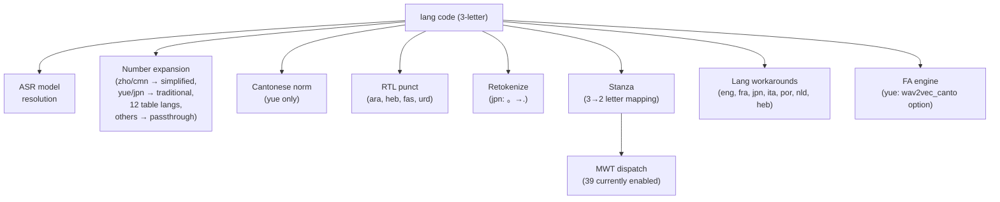
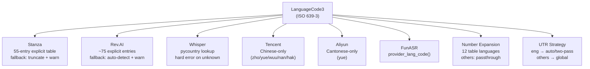

# Language Code Resolution

**Status:** Current
**Last updated:** 2026-05-20 20:15 EDT

This page documents how batchalign3 maps language codes to models, Stanza
pipelines, and processing behavior.

## Design Principle: No Silent Fallbacks

batchalign3 **never silently substitutes a different language** when the
requested language is unsupported. Every engine boundary must either:

1. **Succeed**: map the code correctly and proceed, or
2. **Fail explicitly**: return a clear error naming the unsupported language,
   the engine that rejected it, and suggested alternatives

Silent fallbacks (e.g., defaulting to English when a language is unknown)
produce output that looks plausible but is completely wrong. A clear error
is always better, users can recover from "language not supported" but
cannot recover from a transcript in the wrong language.

This policy applies to all engine boundaries: Rev.AI, Whisper, Stanza,
Tencent, Aliyun, and any future engines. See the
[migration book](../migration/algorithms-and-language.md) for the history
of how this policy was established after finding and fixing two silent
fallback regressions.

## Internal Representation: ISO 639-3

batchalign3 uses **3-letter ISO 639-3 codes** everywhere internally:

- CLI: `--lang=eng`, `--lang=yue`, `--lang=heb`
- CHAT headers: `@Languages: eng`, `@Languages: yue`
- Cache keys, IPC payloads, batch items
- Worker task bootstrap: `python -m batchalign.worker --task morphosyntax --lang eng`

The 3-letter code is the source of truth. Conversion to other formats happens
only at external boundaries.

## ISO 639-3 → ISO 639-1 (Stanza)

Stanza uses ISO 639-1 alpha-2 codes (with a few non-standard variants
like `zh-hans`/`zh-hant`/`nb`). Batchalign uses ISO 639-3 internally,
so the worker has to map one to the other before handing a `lang`
argument to `stanza.Pipeline`. The conversion lives in
`batchalign/worker/_stanza_loading.py::iso3_to_alpha2()` and resolves
in three layers:

1. **Stanza-specific overrides**: `_ISO3_OVERRIDES` in
   `_stanza_capabilities.py`. The single source of truth for codes
   where the standard ISO-1 mapping does **not** correspond to a
   Stanza catalog key. `iso3_to_alpha2()` imports this dict (it does
   not redefine its own copy, see "Drift hazard" below).

   | ISO-639-3 | Stanza key | Why not the standard alpha-2 |
   |-----------|------------|------------------------------|
   | `yue`     | `zh-hans`  | Cantonese routes through Stanza's Chinese model; `zh-hans` is the catalog key. |
   | `cmn`     | `zh-hans`  | Mandarin. Same target. |
   | `zho`     | `zh-hans`  | Chinese (generic). |
   | `nor`     | `nb`       | Norwegian. pycountry says `no`; Stanza ships `nb` (Bokmål) only. |
   | `msa`     | `ms`       | Malay. pinned for stability. |

2. **`pycountry`**: for every other code with a standard ISO-639-3 ↔
   ISO-639-1 counterpart (`mar` → `mr`, `swa` → `sw`, `eng` → `en`,
   etc.). This must be the fallback rather than a duplicate hardcoded
   dict, see "Drift hazard."

3. **Pass-through with warning**: for codes that have no standard
   alpha-2 (genuinely missing from pycountry). Length-2 codes are
   assumed to already be alpha-2 and pass through silently; everything
   else logs a warning before being handed to Stanza.

### Drift hazard

A previous version of this function had its own hardcoded mapping
dict instead of using `pycountry`. That dict was missing many codes
(notably Marathi `mar` → `mr`). The capability table built via
pycountry correctly recognized `mar` as supported, but `iso3_to_alpha2`
returned `"mar"` verbatim, and `stanza.Pipeline(lang="mar", ...)`
crashed with "Language mar is currently unsupported" because Stanza's
catalog is keyed by alpha-2.

This was a **two-table-drift bug**: two independent pieces of code
had to agree on the iso3 → alpha-2 mapping but didn't. The fix is
structural, not data-driven: there is now one override dict
(`_ISO3_OVERRIDES`), and `iso3_to_alpha2` imports it rather than
maintaining a parallel copy. Adding a new Stanza-specific override
means editing one dict in one place.

**Do not reintroduce a second override dict here.** If a new
Stanza-specific iso3 case comes up (e.g. a future Stanza release
labels Catalan differently), add it to `_ISO3_OVERRIDES` only.

For full architecture and incident history see
[Stanza Capability Registry](../architecture/stanza-capability-registry.md).

## Model Resolution (ASR)

The default HuggingFace Whisper engine (`--asr-engine whisper`) loads
`openai/whisper-large-v3` across every language, see
`batchalign/inference/asr.py::_infer_whisper` and the default in
`batchalign/inference/asr.py:120`. There is no per-language fine-tune
table on this engine.

Per-language fine-tunes are opt-in via the separate `--asr-engine
whisper_hub` engine, whose resolver lives at
`batchalign/models/resolve.py::_RESOLVER["whisper_hub"]`. The resolver
is seeded reactively from empirical evaluation, entries are added one
at a time with dated provenance, not speculatively. As of this writing
the only seeded entry is `mal → thennal/whisper-medium-ml`; absent
languages raise `WhisperHubModelNotFoundError` directing the user to
pass an explicit `model_id` via `--engine-overrides`. See
[Whisper Hub ASR](whisper-hub-asr.md) for the engine, its evidence, and
the recommendation to add new entries.

Other ASR engines ignore language for model selection:
- `--asr-engine whisper-oai`: always `whisper-turbo`
- `--asr-engine whisperx`: always `whisper-large-v2`
- Rev.AI: cloud API, handles language internally

## Model Resolution (UTR)

UTR (Utterance Timing Recovery) is **engine-based, not
language-keyed**. The CLI selects a UTR backend with `--utr-engine
{rev,whisper,...}` (plus `--utr-engine-custom NAME` for cloud
backends). Each engine carries its own model identity:

| Engine | Model / Backend |
|--------|-----------------|
| `--utr-engine whisper` | `openai/whisper-large-v2` (stock Whisper) |
| `--utr-engine rev` | Rev.AI cloud API |
| `--utr-engine-custom tencent_utr` | Tencent Cloud UTR backend |

There is no per-language UTR-model resolver, `--utr-engine whisper`
loads the same checkpoint regardless of `--lang`. See
[Whisper ASR](whisper-asr.md) §"Utterance Timing Recovery" for the
full picture.

## Model Resolution (Utterance Segmentation)

| Language | Code | Model |
|----------|------|-------|
| English | eng | `talkbank/CHATUtterance-en` |
| Mandarin | cmn/zho | `talkbank/CHATUtterance-zh_CN` |
| Cantonese | yue | `PolyU-AngelChanLab/Cantonese-Utterance-Segmentation` |
| All others | * | None (punctuation-based fallback) |

## Pipeline Stage Dispatch

The 3-letter code drives behavior at multiple pipeline stages:



## MWT Language Dispatch

Multi-Word Token (MWT) processing is **capability-driven**. The
loader at `batchalign/worker/_stanza_loading.py:40::should_request_mwt`
consults the Stanza catalog table built at worker startup from
`stanza.resources.common.load_resources_json()` (see
`batchalign/worker/_stanza_capabilities.py`) and requests the `mwt`
processor only when that table reports `has_mwt=True` for the
language. The earlier hardcoded `MWT_LANGS` set was deleted, see
[Stanza Limitations Defect 5](stanza-limitations.md) for the full
rewrite rationale, and `test_stanza_config_parity.py:82` for the AST
scan that prevents reintroduction.

See [Non-English Workarounds](../developer/non-english-workarounds.md) §X1 for the
per-language consequences.

## Rev.AI Language Codes

Rev.AI uses a mix of ISO 639-1 and specific codes. The translation lives in
`crates/batchalign/src/revai/preflight.rs`:

The translation now uses ~75 explicit entries in `try_revai_language_hint()`
with a fallback to `"auto"` (Rev.AI auto-detection) + warning log for
unknown codes. See `crates/batchalign/src/revai/preflight.rs`.

### Truncation fallback: not used

A truncation fallback (`&other[..2]`) for unknown ISO 639-3 codes is
not used; it produces wrong codes for many languages (e.g., `pol` → `po`
instead of `pl`, `hak` → `ha` which doesn't exist). The current
behavior is:

1. A **comprehensive explicit mapping table** (~75 entries covering all
   Rev.AI-supported languages) in `revai/preflight.rs`
2. A **`try_revai_language_hint()`** function that returns `None` for
   unsupported languages (enabling callers to report clear diagnostics)
3. A **fallback to `"auto"`** (Rev.AI's auto-detection) with a warning log
   for unknown codes, rather than silently submitting a wrong code

## Whisper Language Strings

Some engines use human-readable language names rather than ISO codes.
The mapping in the worker:

```python
special = {"yue": "Cantonese", "cmn": "chinese"}
```

For all other languages, the worker resolves the ISO-639-3 code through
`pycountry` and passes the lower-cased language name to Whisper.

### No silent English fallback

If `pycountry` has no entry for an ISO 639-3 code, the Whisper code path
raises `ValueError` with a clear message naming the unrecognized code,
rather than silently defaulting to `"english"`.
See the [no-silent-fallback policy](#design-principle-no-silent-fallbacks).

## Cross-Engine Language Support Summary

There is **no central language translation layer**. Each engine handles
code conversion independently, with different mapping tables, different
fallback behaviors, and different supported language sets:



## Pre-Validation: Language Support Diagnostics

**Requirement:** Every engine must validate language support **before
processing begins** and produce a clear, actionable diagnostic. Users
should never see a cryptic HTTP 400 from Rev.AI or get silently wrong
English transcriptions because Whisper didn't know their language.

### The Problem

When a user passes `--lang hak` (Hakka), errors surface at different
points depending on the engine, all too late:

| Engine | When error surfaces | Error message | User impact |
|---|---|---|---|
| Rev.AI | **At job submission** | Clear error with alternatives | None, user redirected to Whisper/Tencent |
| Whisper | At inference time | `ValueError: Unrecognized ISO 639-3 code` | Clear error, no silent fallback |
| Stanza | **At job submission** | Clear error listing all 55 supported codes | None, immediate feedback |
| Tencent | **At job submission** | Clear error with alternatives | None, user redirected to Whisper/Rev.AI |
| Aliyun | **At job submission** | Clear error: Cantonese only | None, user redirected |

### Required Behavior

Validation should happen at **job submission time** (`POST /jobs`), before
any audio processing or model loading. The diagnostic should name the
engine, the unsupported language, and suggest alternatives:

```text
Error: Language 'hak' (Hakka) is not supported by Rev.AI ASR.
  Supported alternatives:
  - Use --asr-engine whisper for Hakka (Whisper supports all languages)
  - Use --lang auto to let Rev.AI auto-detect the language
  - Use --asr-engine-custom tencent for Chinese/Hakka via Tencent ASR
```

### Per-Engine Language Support: Can We Query at Runtime?

**No engine provides a runtime "what languages do you support?" API.**
All language support is determined by static tables, either hardcoded in
our mapping code or documented on vendor websites. This means we must
maintain our own validation tables.

#### Rev.AI (cloud ASR)

- **No API endpoint** to query supported languages
- Supported languages documented on Rev.AI's website only
- Our mapping: `try_revai_language_hint()` in `revai/preflight.rs` (~75 entries)
- **Validation approach:** `try_revai_language_hint(lang)` returns `None` for
  unsupported languages; callers log a warning and fall back to `"auto"`
- **Important runtime nuance:** Rev `"auto"` is a real second request path, not
  just a late alias for English. If Rev language ID resolves to English before
  submission, BA3 uses the explicit-English request settings. If language ID
  fails and BA3 submits true Rev auto, later downstream stages may still
  resolve the transcript to English, but the provider request was different.
- **Example validation:**
  ```text
  if try_revai_language_hint(&lang).is_none() {
      warn!("Language {lang} not in Rev.AI supported set; using auto-detection");
  }
  ```

#### Whisper (local HuggingFace ASR)

- **No programmatic language list** in the model API
- The model's `GenerationConfig` has `is_multilingual: true` but no language
  list; supported languages are implicit in the tokenizer's language tokens
- Our mapping: `iso3_to_language_name()` in `batchalign/inference/asr.py`
  uses `pycountry` lookup with special cases for `yue`/`cmn`
- **Fixed (2026-03-19):** Unknown codes now raise `ValueError` instead of
  silently falling back to English.
- Whisper `large-v3` nominally supports 99 languages, but quality varies
  dramatically (English/European languages are much better than others)

#### Stanza (morphosyntax)

- **Stanza has a `stanza.resources` module** that lists available models;
  batchalign queries it at worker startup (`stanza.resources.common.load_resources_json()`)
  and caches a per-language capability table in
  `batchalign/worker/_stanza_capabilities.py`.
- Our ISO-639-3 → alpha-2 mapping: `iso3_to_alpha2()` in
  `batchalign/worker/_stanza_loading.py:63`, with Stanza-specific
  overrides in `_ISO3_OVERRIDES` (`_stanza_capabilities.py:50`).
- **Validation approach:** Check the cached capability table before
  attempting to load the pipeline, the same path that drives
  `should_request_mwt()` and the rest of per-processor availability.

#### Tencent (cloud Chinese ASR)

- **No API endpoint**; hardcoded to Chinese variants only
- Our validation: `_CHINESE_CODES = {"zho", "yue", "wuu", "nan", "hak"}`
  in `batchalign/inference/languages/cantonese/_tencent_api.py:24`
- Already raises `ValueError` for non-Chinese, this is good, but happens
  at worker load time rather than job submission time

#### Aliyun (cloud Cantonese ASR)

- **No API endpoint**; hardcoded to Cantonese only
- Already raises `ValueError` if `lang != "yue"`: same timing issue

#### Google Translate / SeamlessM4T

- Google supports ~130 languages; SeamlessM4T ~96 languages
- **No pre-validation in batchalign3**: language is passed through directly
- Both have online documentation of supported languages but no programmatic query

#### NeMo / Pyannote (speaker diarization)

- **Language-independent**: diarization works on any language
- No validation needed

### Cached Language Support Table

Since no engine provides a runtime query API, we maintain a **time-stamped
reference table** of known language support. This table should be updated
whenever we upgrade an engine dependency or discover new support/regressions.

**Last verified: 2026-03-19**

| ISO 639-3 | Language | Rev.AI | Whisper | Stanza | Tencent | Notes |
|---|---|---|---|---|---|---|
| `eng` | English | `en` | `english` | `en` | — | Best quality across all engines |
| `spa` | Spanish | `es` | `spanish` | `es` | — | |
| `fra` | French | `fr` | `french` | `fr` | — | |
| `deu` | German | `de` | `german` | `de` | — | |
| `ita` | Italian | `it` | `italian` | `it` | — | |
| `por` | Portuguese | `pt` | `portuguese` | `pt` | — | |
| `nld` | Dutch | `nl` | `dutch` | `nl` | — | |
| `jpn` | Japanese | `ja` | `japanese` | `ja` | — | MWT disabled |
| `kor` | Korean | `ko` | `korean` | `ko` | — | MWT disabled |
| `rus` | Russian | `ru` | `russian` | `ru` | — | |
| `ara` | Arabic | `ar` | `arabic` | `ar` | — | RTL punctuation |
| `tur` | Turkish | `tr` | `turkish` | `tr` | — | |
| `zho` | Chinese | `cmn` | `chinese` | `zh` | `16k_zh_large` | Maps to cmn/zh depending on engine |
| `cmn` | Mandarin | `cmn` | `chinese` | `zh` | `16k_zh_large` | UTSeg model available |
| `yue` | Cantonese | — | `cantonese` | `zh` | `16k_zh_large` | Fine-tuned Whisper; Aliyun/CantoneseFA; UTSeg model |
| `hak` | Hakka | — | `hakka` | — | `16k_zh_large` | Rev.AI unsupported; Stanza unsupported |
| `pol` | Polish | `pl` | `polish` | `pl` | — | |
| `ces` | Czech | `cs` | `czech` | `cs` | — | |
| `ron` | Romanian | `ro` | `romanian` | `ro` | — | |
| `hun` | Hungarian | `hu` | `hungarian` | `hu` | — | |
| `heb` | Hebrew | `he` | `hebrew` | `he` | — | Fine-tuned Whisper; RTL punctuation |
| `hin` | Hindi | `hi` | `hindi` | `hi` | — | |
| `cym` | Welsh | `cy` | `welsh` | `cy` | — | |
| `srp` | Serbian | `sr` | `serbian` | `sr` | — | |
| `afr` | Afrikaans | `af` | `afrikaans` | `af` | — | |
| `fin` | Finnish | `fi` | `finnish` | `fi` | — | |
| `dan` | Danish | `da` | `danish` | `da` | — | |
| `swe` | Swedish | `sv` | `swedish` | `sv` | — | |
| `nor` | Norwegian | `no` | `norwegian` | `nb` | — | |

*(Partial list — full table covers ~75 Rev.AI languages. `—` = not supported.)*

**Maintenance policy:** Update this table whenever:
- A new engine version is deployed (check changelogs for language additions)
- A user reports a language failure (add the language with its support status)
- We add a new engine to batchalign3

### Implementation Plan

A `validate_language_support(lang, command, engines)` function should:

1. Check each engine the command will use against its supported language set
2. Return a structured diagnostic listing which engines support the language
   and which don't, with suggested alternatives
3. Be called at job submission time (Rust server), before any processing
4. Optionally be callable from the CLI for `batchalign3 setup --check-lang hak`

This is tracked as a future improvement. The Rev.AI mapping table
(`try_revai_language_hint`) provides the pattern to follow for other engines.

## Adding a New Language

To add language-specific behavior for a new language:

1. **Stanza mapping**: Add to `_ISO3_OVERRIDES` in
   `batchalign/worker/_stanza_capabilities.py` only when the standard
   alpha-2 mapping does not match Stanza's catalog key.
2. **Rev.AI mapping**: Add an explicit entry in
   `crates/batchalign/src/revai/preflight.rs::try_revai_language_hint`
   (do NOT rely on the truncation fallback).
3. **ASR model**: Optionally add a fine-tune to
   `batchalign/models/resolve.py::_RESOLVER["whisper_hub"]` with a
   dated provenance comment; users select it via `--asr-engine
   whisper_hub`.
4. **Number expansion**: Add an entry to
   `crates/batchalign-transform/data/num2lang.json`, or handle the
   language in `crates/batchalign-transform/src/asr_postprocess/num2text.rs`.
5. **Utterance segmentation**: Optionally train a BERT boundary
   model and add it to `batchalign/models/resolve.py::_RESOLVER["utterance"]`.
6. **Morphosyntax workarounds**: Add a
   `crates/batchalign-transform/src/morphosyntax/lang_XX.rs` file if
   Stanza produces systematic errors for this language (see existing
   `lang_en.rs`, `lang_fr.rs`, `lang_it.rs`, `lang_ja.rs`).
7. **MWT dispatch**: No code change required; capability-driven
   `should_request_mwt()` picks up Stanza's catalog automatically.
8. **Test with `benchmark`**: Verify the language code is accepted by
   all engines in the pipeline (ASR, morphotag, compare).
