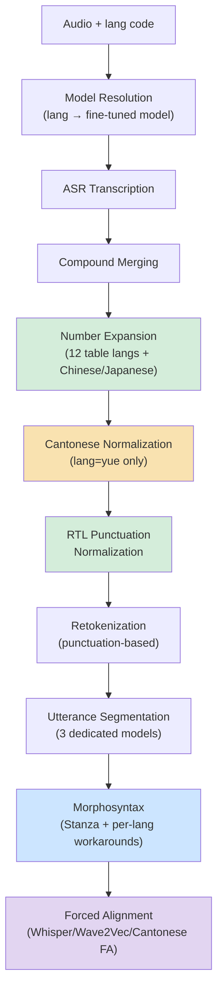
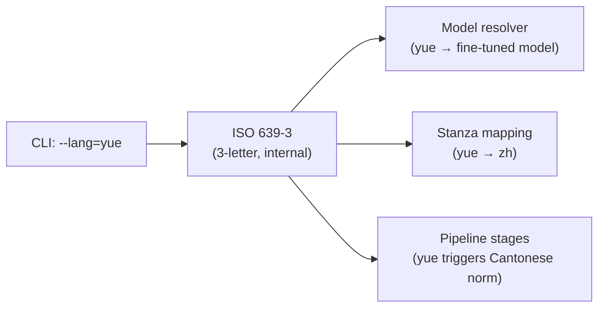

# Language-Specific Processing Overview

**Status:** Current
**Last updated:** 2026-05-20 20:22 EDT

This page is the single entry point for understanding how batchalign3 handles
non-English languages. It maps every stage of the processing pipeline to the
language-specific behavior at that stage.

## Pipeline Stages and Language Divergence

Every audio file flows through the same pipeline. At each stage, the pipeline
checks the language code and may take a different path:

## Where Each Language Diverges

### Stage 1: Model Resolution

The default `--asr-engine whisper` loads `openai/whisper-large-v3`
across every language (`batchalign/inference/asr.py:120`). UTR is
engine-based: `--utr-engine whisper` loads `openai/whisper-large-v2`,
`--utr-engine rev` uses Rev.AI's cloud API, and
`--utr-engine-custom tencent_utr` routes to Tencent. There is no
per-language fine-tune resolver wired into `--asr-engine whisper` or
the UTR engines; per-language fine-tunes are opt-in through the
separate `--asr-engine whisper_hub` engine (see
[Whisper Hub ASR](whisper-hub-asr.md) for the seeded entries — today
only `mal → thennal/whisper-medium-ml`).

| Engine | Model |
|--------|-------|
| `--asr-engine whisper` (default) | `openai/whisper-large-v3` for all languages |
| `--asr-engine whisper-oai` | always `whisper-turbo` |
| `--asr-engine whisperx` | always `whisper-large-v2` |
| `--asr-engine whisper_hub` | per-language HuggingFace fine-tune via `_RESOLVER` or explicit `--engine-overrides model_id` |
| `--utr-engine whisper` | `openai/whisper-large-v2` for every language |

See [Language Code Resolution](language-code-resolution.md) and
[Whisper ASR](whisper-asr.md) for the full picture.

### Stage 2: Number Expansion

Digit strings in ASR output are converted to language-appropriate word forms.

| Language group | Method | Example |
|----------------|--------|---------|
| Mandarin (zho, cmn) | `num2chinese` (simplified) | 10000 → 一万 |
| Cantonese (yue), Japanese (jpn) | `num2chinese` (traditional) | 10000 → 一萬 |
| Table languages | NUM2LANG JSON lookup | 5 → "five" (eng), "cinco" (spa), "cinq" (fra) |
| All others | Pass-through (no expansion) | 42 → "42" |

The table-driven languages are enumerated in
`crates/talkbank-transform/data/num2lang.json` (46 entries today;
re-derive via `python3 -c "import json; print(sorted(json.load(open('crates/talkbank-transform/data/num2lang.json'))))"`
rather than maintaining a parallel list here).

See [Number Expansion](number-expansion.md) for details on the Chinese
character conversion algorithm and the table-based approach.

### Stage 3: Cantonese Text Normalization (yue only)

This stage **only activates when lang=yue**. It applies two transformations:

1. **Simplified → Traditional Chinese** via `ferrous-opencc` (embedded OpenCC
   `s2hk` conversion tables)
2. **31-entry domain replacement table** for Cantonese-specific character
   corrections (e.g., 系→係, 呀→啊, 中意→鍾意)

This runs in the core Rust pipeline (`batchalign`), **not** in a
separate plugin package. Every ASR engine's output benefits from it
automatically.

See [Cantonese Processing](languages/cantonese.md) for the full replacement
table and architecture.

### Stage 4: RTL Punctuation Normalization

Arabic/Persian/Urdu punctuation is normalized to ASCII equivalents:

| RTL | ASCII |
|-----|-------|
| ؟ | ? |
| ۔ | . |
| ، | , |
| ؛ | ; |

Additionally, Japanese full-width period (。) is normalized to `.`, and
Spanish inverted punctuation (¿, ¡) is removed.

### Stage 5: Utterance Segmentation

Three languages have dedicated BERT-based utterance segmentation models:

| Language | Model | Source |
|----------|-------|--------|
| English | `talkbank/CHATUtterance-en` | TalkBank fine-tuned |
| Mandarin | `talkbank/CHATUtterance-zh_CN` | TalkBank fine-tuned |
| Cantonese | `PolyU-AngelChanLab/Cantonese-Utterance-Segmentation` | PolyU |

All other languages fall back to **punctuation-based splitting** (`.`, `?`,
`!`, and CHAT-specific terminators like `+...`, `+/.`).

See [Utterance Segmentation](utterance-segmentation.md).

### Stage 6: Morphosyntax (Stanza + Workarounds)

Stanza is the backbone for POS tagging, lemmatization, and dependency parsing.
Language-specific workarounds correct systematic errors:

| Language | Workarounds | Reference |
|----------|-------------|-----------|
| English | 201-entry irregular-form table, contraction MWT hints, GUM package | [Non-English Workarounds](../developer/non-english-workarounds.md) §E1-E3 |
| French | 20-entry pronoun-case lookup, 158 APM noun forms, MWT overrides | §F1-F3 |
| Japanese | Order-dependent verb-form override chain, combined package, comma normalization | [Japanese Morphosyntax](japanese-morphosyntax.md), §J1-J3 |
| Hebrew | HebBinyan/HebExistential feature extraction | [Hebrew Morphosyntax](hebrew-morphosyntax.md) |
| Italian | "l'" MWT suppression, "lei" merge | §I1-I2 |
| Portuguese | "d'água" MWT forcing | §P1 |
| Dutch | Possessive "'s" MWT suppression | §D1 |

Cross-language infrastructure:

| Feature | What | Reference |
|---------|------|-----------|
| MWT dispatch | Capability-driven via `should_request_mwt()` against the cached Stanza catalog | §X1 + [Stanza Limitations Defect 5](stanza-limitations.md) |
| ISO 639-3 → 639-1 mapping | `iso3_to_alpha2()` + `_ISO3_OVERRIDES` (Stanza-specific overrides) for codes like yue/cmn/zho → `zh-hans`, nor → `nb` | [Language Code Resolution](language-code-resolution.md) |
| Number expansion | Table-driven via `num2lang.json` + `num2chinese.rs` for CJK | [Number Expansion](number-expansion.md) |

### Stage 7: Forced Alignment

| Engine | Languages | Method |
|--------|-----------|--------|
| `whisper_fa` | All (default) | Whisper large-v2 cross-attention DTW |
| `wav2vec_fa` | All | MMS FA CTC alignment |
| `wav2vec_canto` | Cantonese only | Hanzi→jyutping romanization + Wave2Vec MMS |

The Cantonese FA engine converts Chinese characters to tone-stripped jyutping
romanization before alignment, because Wave2Vec MMS was trained on romanized
text. See [Cantonese Processing](languages/cantonese.md).

## Language Code Flow

batchalign3 uses **ISO 639-3** (3-letter codes) internally everywhere.
Conversion to 2-letter codes only happens at the Stanza boundary. See
[Language Code Resolution](language-code-resolution.md).

## Cantonese Normalization Is Now Core

Older Python-only code paths did not apply Cantonese normalization uniformly
across every ASR path. Current `batchalign3` implements simplified-to-traditional
conversion plus the Cantonese replacement table once in Rust core and applies
it as a shared ASR post-processing stage, so every ASR engine benefits from
the same normalization contract.

## Related Pages

- [Language Code Resolution](language-code-resolution.md) — ISO mapping, model resolution
- [Cantonese Processing](languages/cantonese.md) — normalization, char tokenization, FA
- [Hebrew Morphosyntax](hebrew-morphosyntax.md) — HebBinyan, HebExistential
- [Japanese Morphosyntax](japanese-morphosyntax.md) — verb forms, combined package
- [Number Expansion](number-expansion.md) — num2chinese, NUM2LANG tables
- [Utterance Segmentation](utterance-segmentation.md) — per-language models
- [Non-English Workarounds](../developer/non-english-workarounds.md) — workaround and convention catalog
- [Whisper ASR](whisper-asr.md) — engine selection, model IDs
- [Cantonese Language Support](languages/cantonese.md) — engines, normalization, word segmentation, FA
- [Cantonese and CJK — Architecture](../../architecture/language-and-multilingual/cantonese-and-cjk.md) — engine dispatch, normalization pipeline, segmenter selection
