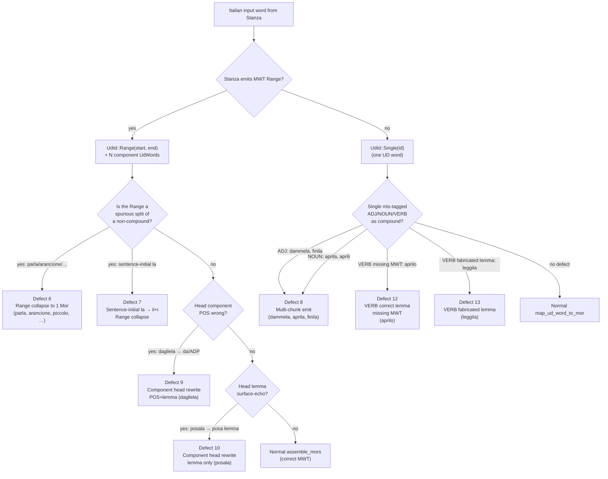
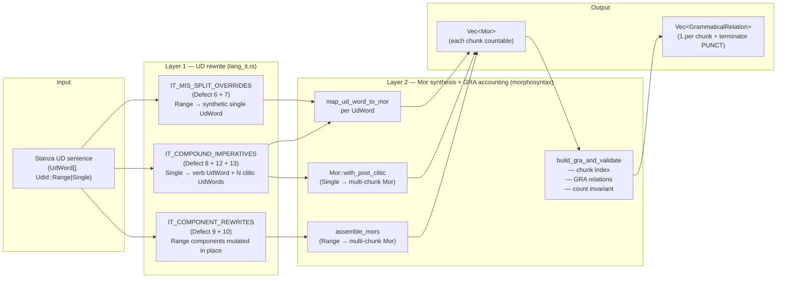
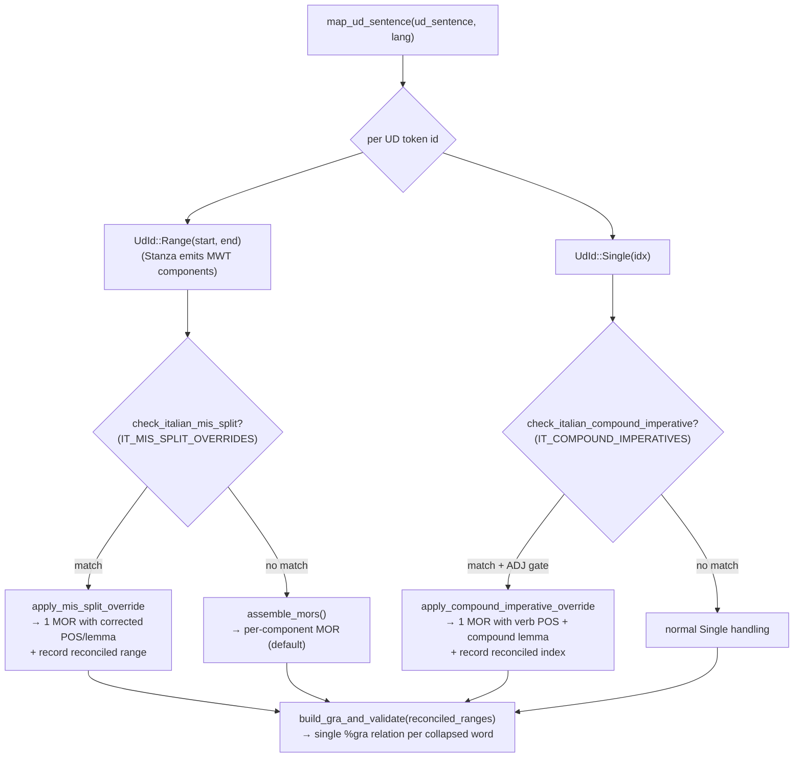

# Italian

**Status:** Current
**Last updated:** 2026-05-19 14:18 EDT

## Scope

Italian is a Romance language with productive MWT (multi-word token)
phenomena that Stanza's neural tokenizer and MWT processor expand
natively:

* Preposition+article contractions: `al → a + il`, `del → di + il`,
  `nel → in + il`, `sul → su + il`, `della → di + la`
* Clitic-article elisions: `l'amico → l' + amico`, `dell'opera → di +
  l'opera`, `all'amore → a + l'amore`

Italian carries no per-language BA3 MWT-override rules. All earlier
overrides ported from BA2 (`ud.py:662-695`) were audited and removed
— see [History](#history).

## What Stanza handles natively

Paired probes (free-tokenize vs our postprocessor) were run on 60+
Italian constructions on Stanza 1.11.1. All of the following produce
identical output on both paths and satisfy the morphotag 1-to-1
invariant:

| Pattern | Example | Stanza output |
|---------|---------|---------------|
| al / del / nel / sul / dal | `al cinema` | `a + il + cinema` (MWT expansion, 1 CHAT word → 2 UD words, Range preserved) |
| della / dello / degli | `parla della casa` | `di + la + casa` (MWT) |
| l'X (common nouns) | `l'amico`, `l'opera`, `l'uomo`, `l'anno`, `l'oggetto` | 1 UD word with accented apostrophe preserved; character-DP in `align_tokens` merges any Stanza over-split back to 1 |
| preposition+clitic | `all'amore`, `nell'anno`, `sull'ora` | 1 MWT expansion; 1 CHAT word stays 1 |
| `lei` (3sg.f pronoun) | `dice lei`, `lei mangia` | 1 UD word — no spurious split into `le + i` |

Probes in
`batchalign/tests/investigations/_cases/italian.py` (typed
`ProbeCase` fixtures consumed by the matrix harness at
`test_stanza_mwt_probe_matrix.py`).

## Known Stanza limitations

All three issues below are **content-quality** defects. The `%mor`
count invariant holds — Stage 3's `assemble_mors` in
`crates/talkbank-transform/src/morphosyntax/mapping_helpers.rs` collapses
Stanza's MWT Range tokens into a single compound `%mor` entry per
CHAT word — but the emitted entry carries linguistically wrong
content: fake lemmas, spurious features, or the wrong POS.

Each row below shows the `%mor` that actually ships downstream from
a minimal `ita` probe CHAT run through `batchalign3 morphotag`.

### Defect 6 — words with clitic-shaped endings split into fake verb+clitic compounds

Italian words whose last one-to-two characters look like a clitic
(`-la`, `-lo`, `-le`, `-li`, `-ne`, `-no`, `-ni`, `-mi`, `-ti`,
`-ci`, `-vi`, `-si`) get wrapped by Stanza in an MWT Token and
analyzed as `verb stem + enclitic pronoun` with a bogus stem lemma
— regardless of actual part of speech. The defect fires on:

- **Verbs in imperative position**: `parla forte`
  → `verb|par~pron|la` (should be `verb|parlare-Imp-S2`).
- **Common nouns**: `arancione` (orange) → `verb|arancio~pron|ne`
  with `Part Past`; `seggiola` (chair) → `verb|seggio~pron|la`;
  `gomitolo` (ball of yarn) → `verb|gomito~pron|lo`; `divano`
  (sofa) → `verb|diva~pron|no`; `bottone` (button) →
  `verb|botto~pron|ne`; `cavallone` (big horse) →
  `verb|cavallo~pron|ne`; `cielo` (sky) → `verb|cie~pron|lo`
  (`cie` is not a word).
- **Adjectives**: `piccolo`/`piccola` (small, m/f) →
  `verb|picco~pron|lo` / `verb|picco~pron|la` with `Part Past`.
- **Baby-talk diminutives**: `coccole`, `babbolo`, `pettole`.

Most non-verb hits carry `Part Past` features — Stanza confidently
treats the whole surface as a past participle plus clitic.

Every row ships one `%mor` item per CHAT word (Stage 3's
`assemble_mors` collapses the MWT Range correctly), so the count
invariant holds. Every row's linguistic content is wrong.

A corpus-wide audit of committed `%mor` content (pre-parsed JSON
snapshot of the TalkBank CHAT corpora) found **65 Defect-6 hits
across 417 Italian files and 15 distinct surface forms**. Mid-sentence
position does protect verbs in context — `la storia parla di ...`
gets correct `verb|parlare-Fin-Ind-Pres-S3` — but the noun/adjective
pseudo-analyses fire independent of position.

Pinned as `stanza-it-verb-clitic-pos-split` in
[Stanza Limitations — Defect 6](../stanza-limitations.md#defect-6-italian-pos-layer-splits-words-with-clitic-shaped-endings-into-fake-verbclitic-compounds).
Documented, not mitigated. A fix would require either a
content-quality gate at the `%mor` emission stage (candidate signal:
`lemma + concat(clitic_lemmas) == surface` AND `lemma != surface`),
a Stanza retrain, or swapping Stanza for CLAN's Italian MOR.

### Defect 7 — sentence-initial article `la` gets junk `il + i` MWT expansion

**Input:**
```text
*CHI:	la storia parla di un bambino .
```

**Current `%mor`:**
```text
%mor:	det|il-Masc-Def-Art-Sing~det|il-Masc-Def-Art-Plur noun|storia-Fem
        verb|parlare-Fin-Ind-Pres-S3 adp|di det|uno-Masc-Ind-Art-Sing
        noun|bambino-Masc .
```

One `%mor` item per CHAT word — count is right. But the first item
has lemma=`il` with masc-singular + masc-plural compound features,
for a feminine-singular article `la`. Correct would be
`det|la-Fem-Def-Art-Sing`.

`parla` mid-sentence gets its proper analysis
(`verb|parlare-Fin-Ind-Pres-S3`) — confirms Defect 6 is
position-sensitive and unrelated to Defect 7. Position sensitivity
of Defect 7 itself (whether mid-sentence `la` also gets the junk
expansion) has not yet been characterized.

Pinned as `stanza-it-la-sentence-initial-split` in
[Stanza Limitations — Defect 7](../stanza-limitations.md#defect-7-italian-sentence-initial-article-la-gets-junk-mwt-expansion-il--i).
Documented, not mitigated. Same content-quality gate shape as Defect
6 but a different signal: `concat(inner_word_texts) != token_text`.

### Defect 8 (candidate) — mid-sentence `dammela` tagged as ADJ, lemma normalized to `dammelo`

**Input:**
```text
*CHI:	per favore dammela .
```

**Current `%mor`:**
```text
%mor:	adp|per noun|favore-Masc adj|dammelo-S1 .
```

One `%mor` item per CHAT word, correct count. But `dammela` in
mid-sentence position gets tagged ADJ with lemma `dammelo` (wrong
gender) and no clitic decomposition at all. The bare-compound case
(`dammela` alone as a single utterance) is handled correctly —
`verb|dare-Inf-Ind-Imp-S2~pron|me-Prs-S1~pron|la-Prs-S3` — so this is
a context-dependent Stanza misclassification, distinct from Defect 6.

Not yet pinned as a named Defect in the registry (proposed slug
`stanza-it-dammela-mid-sentence-adj`); a corpus scan for
`-(la|lo|le|li|mi|ti|ci|vi|si|ne)$` verb+clitic compounds in
mid-sentence position would quantify prevalence and inform whether
it warrants its own entry.

### Defect 9 — Range-expansion with wrong head POS (dative `-glie-` stack)

**Input:**
```text
*CHI:	per favore dagliela .
```

**Before Defect 9 reconciler:**
```text
%mor:	adp|per noun|favore-Masc adp|da~pron|gli-Prs-S3~pron|la-Prs-S3 .
```

Stanza expands `dagliela` (2sg imperative of `dare` + 3sg.dat +
3sg.f.acc) as a structurally-correct 3-piece MWT — but tags the head
component `da` with `ADP/da` instead of `VERB/dare`. The preposition
`da` ("from, by") is homographic with the imperative verb form, and
Stanza's POS layer prefers the preposition reading even though the
clitic stack only makes sense under the verb reading.

This is distinct from Defect 6 (where Stanza spuriously *creates* an
MWT split for a non-compound word) and Defect 8 (where Stanza omits
MWT expansion entirely mid-sentence). The expansion shape is right;
only component 0's POS/lemma/feats are wrong.

Sibling forms in the same dative stack (`digliela` →
`di/VERB/dire`, `portagliela` → `porta/VERB/portare`,
`prendigliela` → `prendi/VERB/prendere`) are Stanza-correct —
verified by direct probe. The defect is specific to
surfaces where the head clitic-stripped form is homographic with a
non-verb word.

Pinned observation-only case in the probe matrix:
`dagliela_mid_sentence` in `_cases/italian.py`.

### Defect 10 — head-lemma-only rewrite for genuine imperative+clitic MWTs

**Input:**
```text
*CHI:	posala .
```

**Before Defect 10 reconciler:**
```text
%mor:	verb|posa~pron|la-Prs-S3 .
```

Stanza expands `posala` as a 2-piece MWT (`posa/VERB + la/PRON`)
— structurally correct: this IS a genuine imperative (2sg of
`posare`, "put down") + accusative clitic. However the head
component's **lemma** is `posa` (surface-echo) rather than the
canonical infinitive `posare`.

Unlike Defect 9 (`dagliela`), the head **POS** is correct
(`VERB`); only the lemma is wrong. The component-rewrite
mechanism in `IT_COMPONENT_REWRITES` handles both shapes
because rewriting a field that Stanza already got right is
idempotent — no new allowlist or new reconciler path was
needed.

Defect 10 is **verb-specific to `posare`**: the
cross-verb probe confirmed `guardare`, `toccare`, `aspettare`,
`mangiare`, `chiamare`, `lasciare`, `cambiare`, `provare`,
`giocare`, `portare`, `suonare`, `chiudere` all lemmatize
correctly in this position. Stanza's Italian model has a
specific weakness on the `posare` paradigm. Allowlist entries:
`posala`, `posalo` (IT_COMPONENT_REWRITES).

### Singleton audit hits deliberately NOT added to the allowlist

A fleet JSON audit surfaced 5 singleton Defect 6
surfaces that were **deliberately skipped** despite confirming
as mis-splits under current Stanza:

- `soffioni` (plural of `soffione`, dandelion) — obscure
- `coccolo` — dialectal / obscure
- `pettole` — dialectal / obscure
- `babbolo` — likely a typo or child-speech approximation
- `tecala` — non-standard; likely corrupted

If any of these recur in new corpus processing, promote to the
allowlist at that point. The probe matrix records each as
observation-only (`<surface>_alone` in `_cases/italian.py`), so
a Stanza upgrade that fixes them would flip those probes from
silent-pass-with-`stanza_words=2` to `stanza_words=1`.

### Correctly-handled constructions (preserve, do not rewrite)

Bare single-utterance imperative+clitic compounds are produced
correctly and must not be touched by any future content-quality
rule. Pinned as counterexamples in the probe matrix:

| Input | `%mor` | Correct? |
|-------|--------|----------|
| `dammela` | `verb|dare-Inf-Ind-Imp-S2~pron|me-Prs-S1~pron|la-Prs-S3 .` | **Yes** |
| `dammelo` | (same shape with `la → lo`) | **Yes** |
| `portalo` | `verb|portare-Inf-Ind-Imp-S2~pron|lo-Prs-S3 .` (confirm) | **Yes** |

Any future content-quality rule for Italian must leave these
analyses untouched — they're the correctness control group.

## Reconciler architecture

This section is the overview. The per-defect subsections below
are the detail. A successor who has never seen this subsystem
should be able to read this section alone and understand what
the Italian reconciler does and where the code lives.

### Why the reconciler exists

Stanza 1.11.1's Italian model has several distinct defect
shapes in its output for imperative+clitic compounds and
clitic-shaped-ending nouns. Each defect type produces malformed
`%mor` content even when the structural (1-to-1) invariant
between CHAT words and `%mor` items holds. The reconciler is a
closed curated set of per-surface overrides that post-processes
Stanza's output to produce correct `%mor` content without
retraining Stanza or writing a full Italian morphological
analyzer.

It is explicitly a **hack layer**: every entry is expected to
be retired eventually as Stanza improves upstream. The retirement
workflow is to empty the allowlists in `lang_it.rs`, rerun the
Italian integration tests
(`crates/batchalign/src/chat_ops/nlp/mapping/tests/italian_defects.rs`),
and remove any entry whose dependent test now passes without it.

### Defect taxonomy

Eight numbered defect shapes have been observed in Stanza's
Italian output. Five are actively reconciled; three are
deliberately not (documented below).



*Verified against: `crates/talkbank-transform/src/morphosyntax/lang_it.rs`
(allowlist definitions), `crates/talkbank-transform/src/morphosyntax/sentence_mapping.rs::map_ud_sentence`
(dispatch), `_cases/italian.py` probe observations (defect
signatures).*

Defects 11 (unused number in current taxonomy), and other
per-verb anomalies surfaced during probing but deemed too rare
to reconcile individually, live in the "Singleton audit hits"
and "Open work" sections below.

### Levels of processing

The reconciler operates in two logical layers over Stanza's
output. The first layer rewrites UD content (mutating
UdWord-equivalent state before `%mor` synthesis); the second
layer fixes up the chunk-index and GRA accounting so the
reconciled output aligns with CHAT's per-chunk %gra convention.



*Verified against: `crates/talkbank-transform/src/morphosyntax/lang_it.rs`
(three allowlists + helpers), `crates/talkbank-transform/src/morphosyntax/sentence_mapping.rs::map_ud_sentence`
(orchestration), `crates/talkbank-transform/src/morphosyntax/mapping_helpers.rs::assemble_mors`
(Range reassembly), `talkbank-model::model::dependent_tier::mor::Mor::with_post_clitic`
(clitic stacking).*

### Chunk accounting via provenance (a later refactor)

The most subtle part of the reconciler is how a single
`UdId::Single` can produce multiple `%mor` chunks (e.g.
`dammela → verb|dare~pron|me~pron|la` is 3 chunks from 1 UD
word). The original approach used two language-
specific side-tables (`reconciled_ranges`, `reconciled_singles`)
threaded through `build_gra_and_validate`. That coupling leaked
per-language reconciliation detail into a language-neutral
helper.

The current design uses a `ChunkProvenance` data structure
produced by every Mor synthesis site. `map_ud_sentence` now
returns two parallel vectors internally: `Vec<Mor>` and
`Vec<MorProvenance>`. Each `MorProvenance` carries one
`ChunkProvenance` per chunk of its Mor (main first, post-clitics
after). Each `ChunkProvenance` records:

1. `source_ud_ids` — which UD word ids map to this chunk (one
   for a normal Single, N for a collapsed Range, zero for a
   synthesized post-clitic).
2. `head` — how to resolve the GRA relation's head index
   (`Root`, `FromUd(ud_id)`, or `OwningMorMain`).
3. `deprel` — pre-normalized relation string.

`build_gra_and_validate` is now language-neutral: it takes
`(mors, provenance)` plus a `TerminatorPolicy` enum and emits
GRA relations by walking provenance. No side-tables, no
language awareness.

```mermaid
sequenceDiagram
    participant MUS as map_ud_sentence
    participant CI as check_italian_compound_imperative
    participant ACIO as apply_compound_imperative_override
    participant Mor as Mor::with_post_clitic
    participant Prov as ChunkProvenance
    participant BGV as build_gra_and_validate (language-neutral)
    participant P1 as Pass 1 — build ud_to_chunk_idx
    participant P2 as Pass 2 — emit GRA relations

    MUS->>CI: ud.text + ud.upos (for dammela)
    CI-->>MUS: Some(&override) with 2 clitics
    MUS->>ACIO: override + ud.head + ud.deprel
    ACIO->>Mor: main verb Mor
    ACIO->>Mor: with_post_clitic(me)
    ACIO->>Mor: with_post_clitic(la)
    Mor-->>ACIO: Mor{main, post_clitics: [me, la]}
    ACIO-->>MUS: multi-chunk Mor
    MUS->>Prov: 1 main chunk (source_ud_ids=[ud.id], head=FromUd, deprel=ud.deprel)
    MUS->>Prov: 1 clitic (source_ud_ids=[], head=OwningMorMain, deprel=me.deprel)
    MUS->>Prov: 1 clitic (source_ud_ids=[], head=OwningMorMain, deprel=la.deprel)
    MUS->>BGV: mors, provenance, TerminatorPolicy
    BGV->>P1: walk provenance; ci += chunks per Mor; map source_ud_ids → ci
    BGV->>P2: walk provenance; emit one relation per chunk; resolve head by ChunkHead variant
    P2-->>BGV: Vec&lt;GrammaticalRelation&gt;
    BGV->>BGV: validate: gras.len() == sum(count_chunks) + terminator offset
```

*Verified against: `map_ud_sentence` (synthesis sites at each
reconciler branch), `map_ud_sentence_expanded` (uniform
`push_ud` helper), `build_gra_and_validate`
(language-neutral in
`crates/talkbank-transform/src/morphosyntax/sentence_mapping.rs`,
re-exported through `crates/batchalign/src/chat_ops/nlp/mapping/mod.rs`),
`provenance.rs` (data types), `helpers.rs` (normalize_deprel +
assemble_mors + provenance_for_ud_word), `apply_compound_imperative_override`
in `lang_it.rs`, and the test `test_italian_defect8_dammela_emits_multi_chunk_mor`.*

Invariants checked at the end of `build_gra_and_validate`:

- `mors.len() == provenance.len()`
- For every `i`, `mors[i].count_chunks() == provenance[i].len()`
- A chunk with `ChunkHead::Root` was encountered
- `gras.len() == sum(mor.count_chunks()) + terminator_offset`

Violations surface as `MappingError::ChunkCountMismatch` /
`InvalidRoot` / `InvalidHeadReference`. Because provenance is
produced alongside the Mor at a single site, the two can't drift
— the chunk count check is a tripwire if a new synthesis site
ever produces mismatched counts.

### Allowlist design invariants

Three allowlists, each corresponding to a distinct reconciler
mechanism:

| Allowlist | Hook point | Action | Backing type |
|-----------|------------|--------|--------------|
| `IT_MIS_SPLIT_OVERRIDES` | Range branch, before `assemble_mors` | Collapse Range to 1 Mor | `MisSplitOverride` |
| `IT_COMPONENT_REWRITES` | Range branch, before `assemble_mors` (after mis-split check) | Mutate component 0 in place, fall through to `assemble_mors` | `ComponentRewriteOverride` |
| `IT_COMPOUND_IMPERATIVES` | Single branch | Synthesize main verb + post-clitic Mors | `CompoundImperativeOverride` + `CliticSpec[]` |

Shared invariants across all three:

1. **Closed set.** Each allowlist is a hand-curated `&'static []`.
   No runtime extension, no auto-detection. Every entry
   corresponds to a specific Stanza output shape observed via
   direct probe (`_cases/italian.py`).
2. **Gate + lookup.** Each reconciler has both a POS/context
   gate AND a surface-text lookup. Both must match for the
   override to fire. Controls tests pin that legitimate
   (non-mis-classified) surfaces pass through unchanged.
3. **Idempotent rewrite.** If Stanza already got a field right
   (e.g., POS=VERB for Defect 10), the allowlist's override
   still specifies the "correct" value — the rewrite is
   harmless. This lets shape-9 and shape-10 entries share
   `IT_COMPONENT_REWRITES` even though their Stanza-error
   signatures differ.
4. **Retirement workflow.** Empty all three allowlists in
   `lang_it.rs` and rerun the reconciler-dependent integration
   tests. Entries whose tests still fail are load-bearing;
   entries whose tests now pass without the reconciler are
   retirement candidates (Stanza fixed the defect upstream).

## Reconciler for Defect 6 / 7 / 8 / 9 / 10 / 12 / 13

**Implementation at**
`crates/talkbank-transform/src/morphosyntax/lang_it.rs`; plumbed into
`crates/talkbank-transform/src/morphosyntax/sentence_mapping.rs::map_ud_sentence`.

### Integration inside `map_ud_sentence`

The reconciler is not a standalone pass — it is two targeted
branches inside the UD → CHAT mapping function, each guarded by an
allowlist lookup. The diagram below shows the two hook points
relative to the normal Range / Single handling:



`reconciled_ranges: Option<HashSet<(usize, usize)>>` is allocated
lazily — it stays `None` for utterances where neither allowlist
fires, so the common path pays no allocation cost. When set, it
is threaded into `build_gra_and_validate` so the GRA builder
collapses per-component relations into a single relation on the
rebuilt parent word.

BA3 carries a **per-language reconciler hack** that collapses
Stanza's known-bad Italian MWT mis-splits back to a single `%mor`
entry with corrected POS / lemma / features. This is explicitly a
hack — an allowlist of specific Stanza mis-splits we know about,
not a principled morphological analyzer.

**Where the hack lives.** `crates/talkbank-transform/src/morphosyntax/lang_it.rs`
(mirrors the pattern of `lang_en.rs` / `lang_fr.rs` /
`lang_ja.rs`). The reconciler is called from
`crates/talkbank-transform/src/morphosyntax/sentence_mapping.rs` inside
`map_ud_sentence`'s `UdId::Range` branch — before the normal
`assemble_mors` join. When it fires, the affected Range is also
recorded so `build_gra_and_validate` emits a single `%gra`
relation for the collapsed word rather than one per component.

**The allowlist.** Maintained in
`IT_MIS_SPLIT_OVERRIDES` in `lang_it.rs`. Each entry:

| Mis-split (Stanza emits) | Reassembled text | Override POS | Override lemma | Source |
|--------------------------|------------------|--------------|----------------|--------|
| `par + la` | `parla` | VERB | `parlare` | sentence-initial 2sg/3sg indicative |
| `arancio + ne` | `arancione` | NOUN | `arancione` | Burgato/23 |
| `picco + lo` | `piccolo` | ADJ | `piccolo` | Calambrone/Martina/020322 |
| `gomito + lo` | `gomitolo` | NOUN | `gomitolo` | Tonelli/Marco/011026 |
| `diva + no` | `divano` | NOUN | `divano` | Tonelli/Marco/010803 |
| `pallo + ne` | `pallone` | NOUN | `pallone` | corpus scan (94× in CHILDES-ita) |
| `basto + ne` | `bastone` | NOUN | `bastone` | corpus scan (48×) |
| `cappe + lo` | `cappello` | NOUN | `cappello` | corpus scan (56×) |
| `diffici + le` | `difficile` | ADJ | `difficile` | corpus scan (46×) |
| `seggio + la` | `seggiola` | NOUN | `seggiola` | audit (4× in committed JSON) |
| `picco + la` | `piccola` | ADJ | `piccolo` | audit (4×); fem of already-handled `piccolo` |
| `trotto + la` | `trottola` | NOUN | `trottola` | audit (3×) |
| `botto + ne` | `bottone` | NOUN | `bottone` | audit (2×) |
| `cie + lo` | `cielo` | NOUN | `cielo` | audit singleton (common word) |
| `norma + le` | `normale` | ADJ | `normale` | audit singleton (common word) |
| `cavallo + ne` | `cavallone` | NOUN | `cavallone` | audit singleton (augmentative of `cavallo`) |
| `cocco + le` | `coccole` | NOUN | `coccole` | audit singleton (child-speech) |
| `il + i` (as expansion of `la` sentence-initial) | `la` | DET | `il` | Defect 7 |

**How to extend.** When a new Italian Defect 6 case surfaces in
corpus data, add one row to `IT_MIS_SPLIT_OVERRIDES` plus a
regression test in `morphosyntax/tests.rs`. The reconciler will
fire on the new allowlist entry without further plumbing.

### Defect 8 allowlist (separate hook)

Defect 8 — mid-sentence compound imperatives mis-classified
without MWT expansion — fires on `UdId::Single`, not `UdId::Range`,
so it uses a **separate allowlist** `IT_COMPOUND_IMPERATIVES`:

| Surface (as Stanza sees it) | Stanza POS | Verb lemma override | Source |
|-----------------------------|------------|----------------------|--------|
| `dammela` | ADJ | `dare` | direct probe |
| `dammelo` | ADJ | `dare` | direct probe |
| `prendilo` | ADJ | `prendere` | corpus scan (52× in CHILDES-ita) |
| `prendila` | ADJ | `prendere` | family (sibling of prendilo) |
| `prendili` | ADJ | `prendere` | family |
| `prendile` | ADJ | `prendere` | family |
| `aprila` | NOUN | `aprire` | direct probe (`-ire` family) |
| `aprili` | NOUN (homograph `aprile`) | `aprire` | direct probe |
| `finila` | ADJ | `finire` | direct probe |

All entries carry `Mood=Imp|Number=Sing|Person=2|VerbForm=Fin`.

**Gate accepts both ADJ and NOUN** : the
original Defect 8 signature was ADJ-only, but `-ire` family
probes surfaced NOUN mis-classifications (`aprila` tagged
`aprila/NOUN/aprila`; `aprili` tagged `aprili/NOUN/aprile`
— the latter is Stanza homographing the form onto the month
name April). The allowlist is still a closed curated set;
legitimate nouns pass through unchanged — pinned by
`test_italian_defect8_genuine_noun_stays_noun`.

The `prendere` family was surfaced by a one-off corpus scan for
CHAT main-tier words with verb+enclitic shapes; the same scan
identified `diglielo` (already correctly handled by Stanza) and
`mettilo`/`mettila`/`mettili`/`mettiti` (tagged VERB but not
decomposed — a lemma-quality issue rather than a pure Defect 8
signature; deferred to a future investigation).

**Scope : multi-chunk output is now emitted.**
Each allowlist entry specifies the post-clitic stack via
`CliticSpec` entries, so `dammela` emits the full
`verb|dare-Imp-S2~pron|me-Prs-S1~pron|la-Prs-S3` — matching
Stanza's own analysis for the bare-compound case. Previously
(earlier) the reconciler emitted only the single-chunk
main verb; that scope limit came from `map_ud_sentence`'s
`UdId::Single` branch assuming 1 chunk per UD word. The
a later refactor added a `reconciled_singles` side-table
threaded through `build_gra_and_validate` so multi-chunk
emission and its corresponding GRA relations stay consistent
with the chunk-count invariant. See "Reconciler architecture"
above for the full story.

**How to extend Defect 8**: same pattern — add a row to
`IT_COMPOUND_IMPERATIVES` plus a regression test. The ADJ-POS
gate limits false positives to words Stanza actively
mis-classifies.

### Defect 9 allowlist (Range component rewrite)

Defect 9 — Range-expansion with wrong head POS — fires on
`UdId::Range`, like Defect 6, but takes a different action: instead
of collapsing the Range into a single Mor, it **rewrites
component 0's POS/lemma/feats in-place** and falls through to the
normal `assemble_mors` path. The 3-chunk `~`-joined Mor shape is
preserved; only the head's lexical analysis changes. Hook point
lives right after the Defect 6 check in
`map_ud_sentence`'s `UdId::Range` branch. Because the Range still
produces multiple chunks, the entry is NOT recorded in
`reconciled_ranges` — GRA reindexing proceeds as for a normal
multi-chunk MWT.

Separate allowlist `IT_COMPONENT_REWRITES`:

| Range parent | Defect | Stanza head (POS/lemma) | Rewritten head | Source |
|--------------|--------|-------------------------|----------------|--------|
| `dagliela` | 9 | ADP / `da` | VERB / `dare` | direct probe |
| `posala` | 10 | VERB / `posa` | VERB / `posare` | audit (1×) |
| `posalo` | 10 | VERB / `posa` | VERB / `posare` | family (sibling of posala) |

All entries carry `Mood=Imp|Number=Sing|Person=2|VerbForm=Fin` as
head feats. The rewrite is idempotent — if Stanza already had a
field right (e.g. the POS for Defect-10 entries), re-setting it
is harmless.

**Scope.** The allowlist is minimal and closed. Forms Stanza
analyses correctly must stay off it, and control tests pin
those:
- `digliela`, `portagliela`, `prendigliela` (Defect 9 controls)
  — Stanza analyses correctly; `test_italian_digliela_stays_correctly_merged`
  guards against regression.
- `guardala`, `toccala`, `aspettala`, `mangiala`, `chiamala`,
  `lasciala`, `cambiala`, `provala`, `giocala`, `portala`,
  `suonala`, `chiudila` (Defect 10 controls) — all probed
  Stanza-correct. Only the `posare` paradigm
  mis-lemmatizes, hence the narrow allowlist.

**How to extend Defect 9**: add a row to `IT_COMPONENT_REWRITES`
plus a regression test. A sibling control test should pin at
least one neighboring form that Stanza handles correctly, to
catch overzealous entries.

**What the reconciler does NOT do.**

- It does NOT touch genuine verb+clitic compounds like `dammela`,
  `dammelo`, `portalo` when they arrive via Stanza's MWT Range
  (i.e., standalone, where Stanza gets them right). Those are
  correctly merged by Stanza; the allowlists are closed sets
  gated on Stanza's mis-classification signatures.
- It does NOT change raw Stanza output — the xfail probes in
  `_cases/italian.py` continue to document what Stanza emits
  directly.
- It does NOT auto-detect new Defect 6 cases. Each must be
  observed in corpus data and explicitly added.
- It does NOT fix Italian's Stanza model upstream — a future
  Stanza release that repairs the defect will render the
  corresponding allowlist entries redundant. Periodic re-audits
  (e.g., once per Stanza major version) should retire entries
  whose Stanza-raw output no longer mis-splits.

**Constraints validated by tests** at three layers:

- **Unit tests** in `crates/talkbank-transform/src/morphosyntax/lang_it.rs`
  — lookup semantics (case-insensitivity, positive and negative
  matches, exclusion of genuine compounds like `dammela`).
- **Synthetic UD integration tests** in
  `crates/batchalign/src/chat_ops/nlp/mapping/tests/italian_defects.rs`
  (search for `test_italian_defect6_`) — confirm the reconciler
  collapses known mis-split `UdSentence` shapes into the correct
  single `Mor`.
- **End-to-end golden** in
  `batchalign/tests/pipelines/morphosyntax/test_italian_defect6_end_to_end.py`
  — runs `batchalign3 morphotag` on a CHAT fixture whose
  `@Languages:` header declares `ita`; the fixture contains all
  six allowlist words in context. Asserts no junk
  `verb|STEM~pron|CLITIC` pattern appears in the output `%mor`
  tier. (Morphotag has no `--lang` flag; language is per-file.) This closes the loop: real Stanza output flowing
  through the full production pipeline.

The specific contracts:

- Each allowlist entry produces the overridden single `%mor`
  with no `~` clitic: `parla → verb|parlare`,
  `arancione → noun|arancione`, `piccolo → adj|piccolo`,
  `gomitolo → noun|gomitolo`, `divano → noun|divano`.
- `dammela` continues to produce its correct Stanza-native merged
  `%mor` (`verb|dare…~pron|me…~pron|la…`) — the correctness
  control group.
- Allowlist lookup is case-insensitive.
- Non-Italian `MappingContext` sees no behavior change (explicit
  `lang2(&ctx.lang) == "it"` gate).
- Unit tests in `lang_it.rs` cover the allowlist semantics
  directly (`check_italian_mis_split` for positive and negative
  inputs).

## Open work

The Italian reconciler covers the concretely-evidenced Defect 6,
7, 8, and 9 cases. A more recent session extended the probe
harness to emit lemma alongside POS, resolved items 1 and 3 from
an earlier pause, and landed the Defect 9 component-rewrite
reconciler. The remaining items below are **not yet implemented**;
pick them up when Italian is next on deck.

1. **`mettere` family lemma-quality investigation** —
   **RESOLVED (null result).** The earlier pause
   notes hypothesized that Stanza emits surface-echo lemma
   (`mettilo` instead of `mettere`) for this family. The
   A more recent probe — with `_token_summary` extended to emit
   `(text, upos, lemma)` — falsified the hypothesis: Stanza
   correctly emits `lemma='mettere'` with `upos='VERB'` for all
   four surfaces (`mettilo`/`mettila`/`mettili`/`mettiti`).
   No `IT_VERB_LEMMA_OVERRIDES` gate is needed. The corpus
   %mor output for these forms is already well-formed. The
   probe cases stay in `_cases/italian.py` as Stanza-drift
   sentinels in case a future Stanza release regresses.

2. **Multi-chunk Defect 8 decomposition.** Current Defect 8
   reconciler emits a single-chunk `%mor` (`verb|dare-Imp-S2`)
   because `map_ud_sentence`'s `UdId::Single` branch assumes one
   chunk per UD word. The target would be the full decomposition
   `verb|dare-Imp-S2~pron|me~pron|la` matching the standalone
   `dammela` output. Requires extending
   `build_gra_and_validate` to walk `mors` alongside `sentence.words`
   and use `Mor::count_chunks()` per UD word instead of assuming
   1-per-Single. Non-trivial architectural change; the
   single-chunk fix already captures the correct POS and verb
   lemma, which is the most important signal downstream.

3. **Dative clitic stack `-glie-` compounds** —
   **RESOLVED via Defect 9 reconciler.** Probed
   `digliela`, `dagliela`, `portagliela`, `prendigliela` on
   Stanza handles three of four correctly (head
   tagged VERB with correct lemma). `dagliela` alone mis-POSs
   its head as ADP (homographic preposition `da`); this was
   characterized as a new defect family (Defect 9) and landed
   as a single-entry component-rewrite allowlist in
   `IT_COMPONENT_REWRITES`. See "Defect 9 allowlist" subsection
   above. Adding new entries to Defect 9 follows the same
   scan-probe-allowlist loop as Defects 6 and 8.

4. **Imperative 2pl forms.** `prendetelo`, `mettetela`,
   `dategliela`, etc. Different ending pattern (`-tel[oaie]`
   prefix on a 2pl stem). The current scan's tail list doesn't
   explicitly cover these; add `telo/tela/teli/tele` stacked-tail
   entries plus probe observations. If Stanza mis-classifies 2pl
   forms similarly to 2sg, extend the allowlist.

5. **Broader verb paradigm coverage.** The Defect 8 allowlist
   has entries from exactly two verb paradigms: `dare` and
   `prendere`. Italian's full imperative+clitic surface space
   spans dozens of verbs (`guardare`/`guardala`,
   `scusare`/`scusalo`, `sentire`/`sentilo`,
   `aspettare`/`aspettala`, `ascoltare`/`ascoltami`, etc.). A
   broader corpus scan + probe pass would identify the
   next-frequency tranche. Priority is low until a user reports
   junk `%mor` content on a new surface.

6. **Long-tail Defect 6 verbs / non-verbs.** The Defect 6
   allowlist now covers `parla` + 8 non-verb mis-splits
   (`arancione`, `piccolo`, `gomitolo`, `divano`, `pallone`,
   `bastone`, `cappello`, `difficile`) — the last four added
   via CHILDES-ita corpus scan + direct Stanza probe
   (244 combined occurrences). Other Italian verbs with
   clitic-shaped stem endings (e.g. `canta` → `cant + a`?,
   `balla` → `ball + a`?) may also mis-split in specific
   sentence-initial contexts. A future corpus sweep over the
   pre-parsed JSON mirror (built via `tb parse`) can surface
   the remaining long tail by querying for committed
   `verb|STEM~pron|CLITIC` patterns where `STEM + CLITIC ==
   surface` and `STEM` isn't a real Italian lemma.

7. **Stanza-upgrade re-audit.** Each reconciler entry should be
   re-evaluated when Stanza is upgraded. Manual workflow: empty
   the three allowlists in `lang_it.rs`, run the reconciler-
   dependent integration tests, classify each failure as
   **STILL NEEDED** (test fails without the reconciler — keep
   the entry) or **RETIRE CANDIDATE** (test passes without it —
   Stanza fixed the defect upstream; remove the entry).
   Restore `lang_it.rs` from `HEAD` before committing the
   selective retirements. Run this after every Stanza
   major-version bump.

None of these are blockers for user-facing Italian work. They
are concrete, scoped extensions with clear next steps documented
in the commit history of `crates/talkbank-transform/src/morphosyntax/lang_it.rs`.

## History

### Rules that existed and were removed

BA2 carried two per-language hacks for Italian in
`ud.py:662-695`, ported into BA3's
`crates/talkbank-transform/src/tokenizer_realign.rs` (the
historical `mwt_overrides.rs` sub-module has since been
consolidated into the single `tokenizer_realign.rs` file)
and then emptied after a paired empirical audit:

| Rule | What it did | Audit finding |
|------|-------------|---------------|
| `MwtTaggedExact("l'") → SuppressMwt` | Flip any Stanza-tagged MWT `l'` token to non-MWT | **Dormant.** Modern Stanza Italian never emits a standalone `l'` with an MWT hint — the 15-case probe showed identical output with and without the rule. |
| `le + i → lei` adjacent-token merge | When the aligned buffer had `le` followed by `i`, collapse them into a single `lei` token | **Harmful.** The rule corrupted legitimate adjacent CHAT words `le` (f.pl. article) and `i` (m.pl. article) — Stanza cannot reassemble a raw-text `le i` back into `lei`. Modern Stanza Italian emits `lei` as one token natively, so the merge was also redundant on its intended input. |

Both rules were dead weight or actively wrong. Both were removed in
favor of Stanza's native MWT behavior plus the always-on
character-DP realigner in `align_tokens`.

### Why the DP alignment is the load-bearing piece

When Stanza's Italian tokenizer occasionally mis-splits a CHAT word
(e.g., emits `[il, i, ami]` for `l'ami`), the character-level
Hirschberg alignment in `align_tokens` merges the N Stanza tokens
back to 1 token per CHAT word based on surface-character identity.
That rescue is unconditional (not per-language) and does not depend
on any MWT-override table, so Italian benefits from it with zero
configuration.

## Tests

* **Probe matrix cases:**
  `batchalign/tests/investigations/_cases/italian.py` — typed
  `ProbeCase` fixtures covering `l'X`, preposition+clitic,
  `lei` variants, adjacent `le i`, and the Defect 6/7 xfails.
  **Important:** the xfails are UD-word-count observations that pin
  Stanza's POS/MWT misbehavior. They do NOT indicate `%mor`
  injection failures — injection succeeds with junk content. See
  each case's `XfailMark.reason` for the distinction.
* **Matrix harness:**
  `batchalign/tests/investigations/test_stanza_mwt_probe_matrix.py`
  runs every case through paired (free-tokenize vs postprocessor)
  pipelines. Invoke with `uv run pytest
  batchalign/tests/investigations/ -m golden`.
## References

* [Stanza Limitations — Defect 6](../stanza-limitations.md#defect-6-italian-pos-layer-splits-words-with-clitic-shaped-endings-into-fake-verbclitic-compounds)
* [Stanza Limitations — Defect 7](../stanza-limitations.md#defect-7-italian-sentence-initial-article-la-expanded-as-mwt-il--i)
* [Morphotag Invariants](../../architecture/morphotag-invariants.md)
