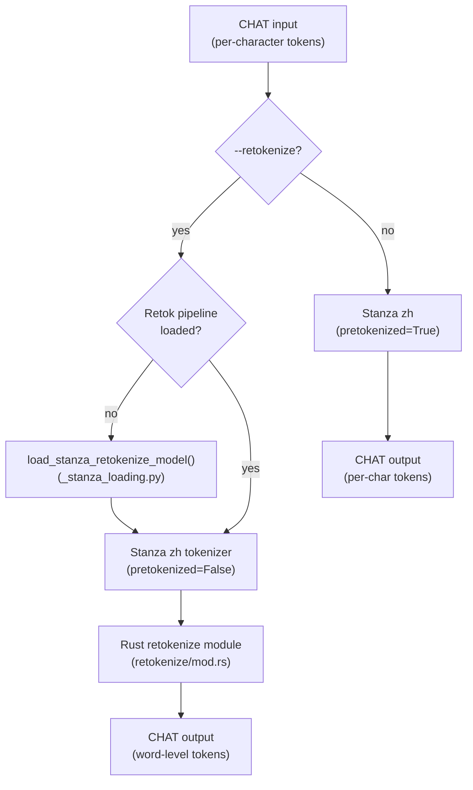

# Mandarin Language Support

**Status:** Current
**Last updated:** 2026-05-06 16:30 EDT

Mandarin (`cmn`/`zho`) shares the Stanza `zh` model and Chinese number
expansion system with Cantonese, but has distinct word segmentation behavior
and no alternative ASR engines.

## Quick Reference

| Pipeline Stage | Mandarin-Specific Behavior |
|---------------|---------------------------|
| ASR | Whisper (default), no Mandarin-specific alternatives |
| Text normalization | None (Cantonese normalization is `yue`-only) |
| Number expansion | Chinese number system (`num2chinese` with simplified script for `zho`, traditional for `cmn`) |
| Utterance segmentation | `talkbank/CHATUtterance-zh_CN` for `cmn` / `zho` in standalone `utseg` and transcribe pre-CHAT segmentation |
| Word segmentation | Stanza neural tokenizer via `--retokenize` |
| Morphosyntax | Stanza Chinese (`zh`) model; `@s` Mandarin words in mixed-language files use the same Chinese morphosyntax path |
| Forced alignment | Wave2Vec MMS (standard) |

## Language Codes

| ISO 639-3 | Stanza | Notes |
|-----------|--------|-------|
| `cmn` (Mandarin) | `zh` | Standard Mandarin |
| `zho` (Chinese, generic) | `zh` | Maps to same Stanza model |

Both `cmn` and `zho` map to Stanza `zh` (which is `zh-hans` internally).

## Word Segmentation

Mandarin ASR output (from Whisper or Paraformer) may contain per-character
tokens without word boundaries — the same problem that affects Cantonese.

### The `--retokenize` Solution

```bash
# Morphotag has no --lang flag — Mandarin files are detected from each
# file's @Languages: cmn (or zho) header.
batchalign3 morphotag --retokenize corpus/ -o output/
```

This uses Stanza's neural Chinese tokenizer (`tokenize_pretokenized=False`)
to segment text into words before POS tagging. The tokenizer model is loaded
lazily on first `--retokenize` request and cached in worker state under key
`"{lang}:retok"`.



### Segmentation Quality

Verified with real Stanza `zh` model (package `gsdsimp`):

| Input | Stanza Output | Correct? |
|-------|--------------|----------|
| 我去商店买东西 | 我 去 商店 买 东 西 | Mostly — groups 商店 but splits 东西 |

Stanza handles common compounds (商店 "store") correctly but may split
ambiguous compounds where individual characters have independent meanings
(东西 "things" → 东 "east" + 西 "west").

**For word count and MLU analysis, this is substantially better than
per-character tokenization but should not be treated as ground truth.**

## Utterance Segmentation

Both `cmn` and `zho` resolve to the same Mandarin utterance-segmentation model:

| Code | Model |
|------|-------|
| `cmn` | `talkbank/CHATUtterance-zh_CN` |
| `zho` | `talkbank/CHATUtterance-zh_CN` |

This model is used in two places:

1. `transcribe` pre-CHAT segmentation for `eng` / `cmn` / `zho` / `yue`
2. standalone `utseg` when the utterance-model path is selected

This is separate from `--retokenize`, which is the morphotag word-segmentation
path for already-built CHAT text.

## Number Expansion

Mandarin uses the Chinese number expansion system:

| Code | Script | Example |
|------|--------|---------|
| `zho` | Simplified | 5 → 五, 10000 → 一万 |
| `cmn` | Traditional | 5 → 五, 10000 → 一萬 |

## Morphosyntax

Mandarin morphotag uses Stanza's Chinese `zh` path. MWT is excluded — Chinese
has no contractions. In mixed-language files, `@s:cmn`, `@s:zho`, and bare
`@s` resolved to Mandarin all route through the same secondary-language L2
morphotag path rather than staying `L2|xxx`, unless the target is unresolved or
the user passes `--no-l2-morphotag`.

Default mode: `tokenize_pretokenized=True` (Stanza annotates existing word
boundaries without re-tokenizing).

## Known Limitations

### Stanza tokenizer is imperfect
The `zh` tokenizer is trained on the Chinese Treebank (Mandarin, formal text).
Performance may degrade on:
- Spoken/colloquial Mandarin
- Child speech
- Technical or domain-specific vocabulary
- Ambiguous compounds (东西, 大小, 多少)

### No Mandarin-specific ASR engine
Unlike Cantonese (which has Tencent, Aliyun, FunASR), Mandarin uses only
Whisper. A Mandarin-specific ASR engine could improve CER.

### No Cantonese normalization
Text normalization (simplified → traditional + domain replacements) only
runs for `yue`. Mandarin text passes through without character normalization.

## Verified Behavior

| What | Test | Result |
|------|------|--------|
| Stanza `zh` tokenizer segments words | `test_stanza_chinese_tokenizer_segments_multichar_words` | Groups 商店 correctly |
| `pretokenized=True` preserves chars | `test_stanza_pretokenized_true_preserves_chars` | 7 chars stay as 7 tokens |
| Language code mapping | `test_language_code_mapping` | cmn → zh, zho → zh |

## Open Questions

1. **Paraformer output format** — does Paraformer actually produce per-character
   tokens for Mandarin, or does it attempt some word segmentation? (Conflicting
   reports from users.)
2. **Child Mandarin speech** — how does Stanza's tokenizer perform on child
   language data?
3. **Would jieba be better than Stanza for Mandarin?** jieba is a widely-used
   Chinese word segmenter; comparison with Stanza's neural tokenizer would be
   informative.

## Source Files

| File | Role |
|------|------|
| `worker/_stanza_loading.py` | `load_stanza_retokenize_model()` for lazy `zh` retok pipeline |
| `inference/morphosyntax.py` | Mandarin retokenize path in `batch_infer_morphosyntax()` |
| `crates/batchalign/src/asr_postprocess/num2chinese.rs` | Chinese number expansion |
| `crates/batchalign/src/retokenize/` | AST rewrite (language-agnostic) |
