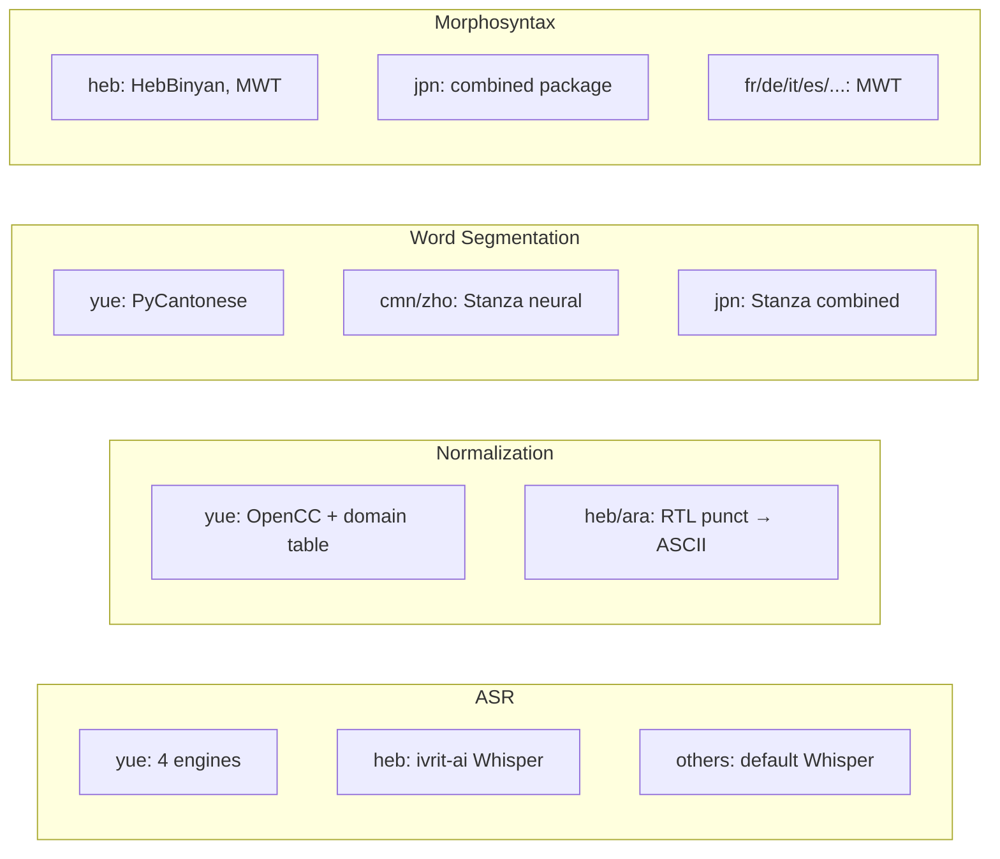

# Language-Specific Support Overview

**Status:** Current
**Last updated:** 2026-05-02 11:20 EDT

batchalign3 processes 50+ languages through Stanza, but several languages have
significant special treatment. This page indexes all language-specific behavior.

> **Adding a new language?** Run through the checklist in
> [Adding Language Support](../../developer/adding-language-support.md)
> first. Skipping it produces silent quality bugs (validator rejections,
> missing number expansion, hallucinating ASR) that surface later as
> user complaints.

## Languages with Dedicated Pages

| Language | Code | Dedicated Page | Key Special Treatment |
|----------|------|---------------|----------------------|
| **Cantonese** | `yue` | [Cantonese](cantonese.md) | 4 ASR engines, text normalization, PyCantonese word segmentation, jyutping FA |
| **Mandarin** | `cmn`/`zho` | [Mandarin](mandarin.md) | Stanza neural word segmentation, Chinese number expansion |
| **Japanese** | `jpn` | [Japanese](japanese.md) | Stanza `combined` package, retokenize merge/split |
| **Hebrew** | `heb` | [Hebrew](hebrew.md) | Fine-tuned Whisper, RTL punctuation, HebBinyan/HebExistential features |
| **French** | `fra` | [French](french.md) | Native Stanza MWT + char-DP realign (BA2 elision/multi-clitic hacks removed) |
| **Italian** | `ita` | [Italian](italian.md) | Native Stanza MWT + char-DP realign; `%mor` injection count invariant holds; Defect 6 (clitic-shaped words mis-analyzed as verb+clitic: `parla`, `arancione`, `piccolo`, `gomitolo`, `divano`) and Defect 7 (`la → il + i`) **mitigated** by the per-language allowlist reconciler in `crates/batchalign-transform/src/morphosyntax/lang_it.rs`: see Italian page §"Reconciler for Defect 6 / 7" |
| **Portuguese** | `por` | [Portuguese](portuguese.md) | Native Stanza MWT + char-DP realign (`d'água` ForceMwt hack removed) |
| **Dutch** | `nld` | [Dutch](dutch.md) | Native Stanza tokenization (`'s`-suffix SuppressMwt hack removed as dormant) |
| **Malayalam** | `mal` | [Malayalam](malayalam.md) | No Stanza pipeline; transcribe-only via HuggingFace Whisper fine-tunes (`whisper_hub` engine). Same pattern applies to other Stanza-stub languages. |

## Special Treatment by Pipeline Stage

## Languages with MWT (Multi-Word Token) Processing

These languages load Stanza's MWT processor for contraction expansion:

`fr`, `de`, `it`, `es`, `pt`, `ca`, `cs`, `pl`, `nl`, `ar`, `tr`, `fi`,
`lv`, `lt`, `sk`, `uk`, `sv`, `nb`, `nn`, `is`, `gl`, `cy`, `gd`, `mt`,
`ka`, `hy`, `fa`, `hi`, `ur`, `bn`, `ta`, `te`, `kn`, `ml`, `th`, `vi`,
`id`, `ms`, `tl`

## Languages Excluded from MWT

These use `tokenize_pretokenized=True` (no MWT processor):

`zh` (Chinese/Cantonese/Mandarin), `ja` (Japanese), `ko` (Korean),
`hr`, `sl`, `sr`, `bg`, `ru`, `et`, `hu`, `eu`, `el`, `he`, `af`,
`ga`, `da`

## Number Expansion Coverage

47 languages have dedicated number-expansion tables in `num2lang.json`,
plus dedicated converters for CJK and English-specific modes. Full
matrix at [Number Expansion](../number-expansion.md).

| Family | Coverage |
|--------|----------|
| 43 codegenned via `num2words` | English, Spanish, French, German, Italian, Portuguese, Dutch, Scandinavian languages, Russian, Polish, Czech, Turkish, Thai, Telugu, Bengali, Kannada, Indonesian, … |
| 4 hand-curated | Malayalam, Greek, Basque, Croatian |
| Chinese (Simplified) | `num2chinese` (一万), Mandarin |
| Chinese (Traditional) | `num2chinese` (一萬), Cantonese, Japanese |
| English-only | Ordinals (`13th` → "thirteenth"), decades (`1950s` → "nineteen fifties"), years |
| Validator-permits-digits | Welsh, Vietnamese, Min Nan, Hakka, no expansion needed |

All other languages pass digits through and trip E220 at validation.

## See Also

- [Language-Specific Processing](../language-specific-processing.md), pipeline-stage-level overview
- [Language Code Resolution](../language-code-resolution.md), ISO 639-3 to Stanza mapping
- [Language Data Model](../language-handling.md), `@Languages` header and per-file language routing
